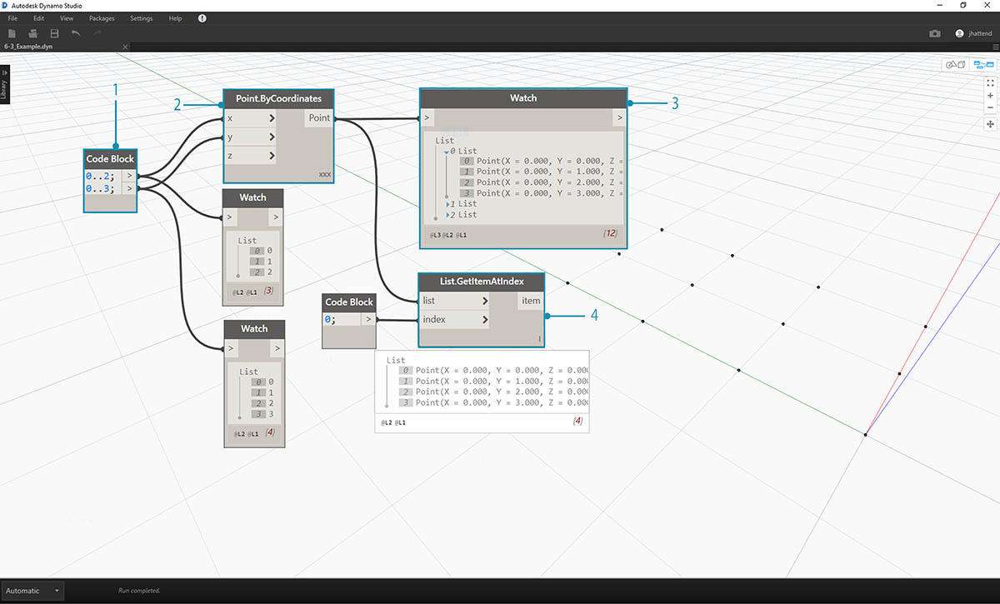
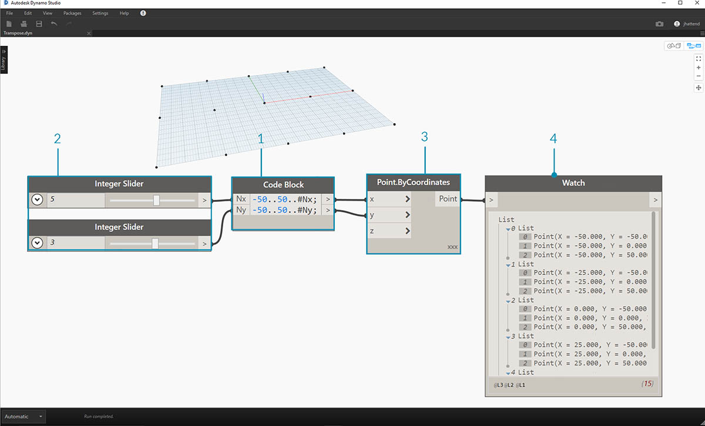
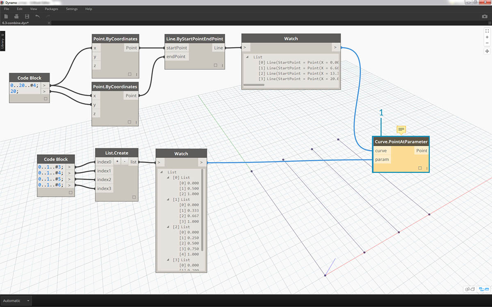
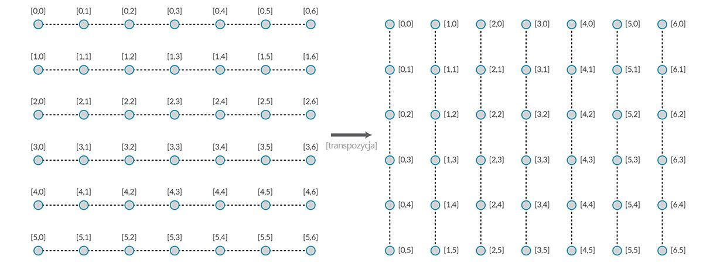
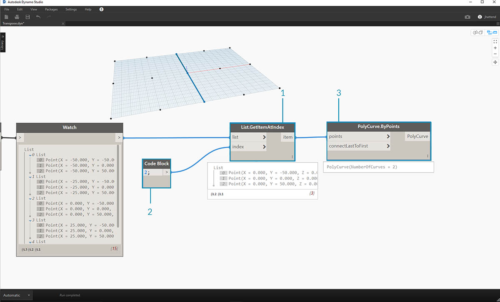
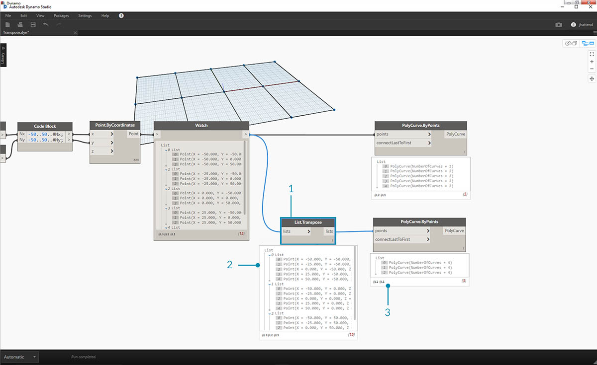
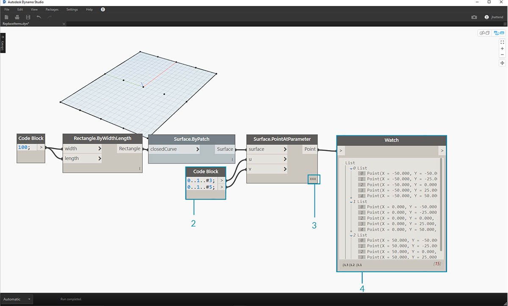

## Listy list

Dodajmy jeszcze jeden poziom do hierarchii. Jeśli weźmiemy talię kart z pierwszego przykładu i utworzymy pudełko z wieloma taliami, to pudełko reprezentuje listę talii, a każda talia reprezentuje listę kart. Tak działa lista list. Na potrzeby porównania w tej sekcji zakładamy, że czerwone pudełko poniżej zawiera listę rolek monet, a każda rolka zawiera listę monet pensów.


> Zdjęcie autorstwa [Dori](https://commons.wikimedia.org/wiki/File:Stack_of_coins_0214.jpg).

Jakie **zapytania** możemy utworzyć względem listy list? Mamy dostęp do istniejących właściwości.

* Ile jest typów monet? 2.
* Jakie są wartości typów monet? 0,01 USD i 0,25 USD.
* Z czego składają się monety 0,25 USD? 75% miedzi i 25% niklu.
* Z czego składają się monety 0,01 USD? 97,5% cynku i 2,5% miedzi.

Jakie **działania** możemy wykonać na liście list? Lista list ulegnie zmianie zależnie od zadanej operacji.

* Wybranie określonego stosu monet 0,25 lub 0,01 USD.
* Wybranie określonej monety.
* Zmiana kolejności stosów monet 0,25 i 0,01 USD.
* Wymieszanie stosów.

Dodatek Dynamo zawiera węzeł odpowiadający każdej z powyższych operacji. Pracujemy na danych abstrakcyjnych, a nie obiektach fizycznych, dlatego jest potrzebny zestaw reguł dotyczących poruszania się w hierarchii danych.

W przypadku list list dane są złożone i znajdują się na wielu warstwach. Taka reprezentacja pozwala wykonywać wiele przydatnych operacji parametrycznych. W poniższych lekcjach omówimy podstawy tego systemu i jeszcze kilka operacji.

## Hierarchia obiektów

Najważniejsze założenie wynikające z tej sekcji jest takie, że dodatek **Dynamo** traktuje każdą listę jako obiekt. Taka hierarchia jest przydatna w przypadku programowania obiektowego. Zamiast wybierać elementy podrzędne przy użyciu poleceń takich jak List.GetItemAtIndex, dodatek Dynamo wybierz ten indeks na głównej liście struktury danych. Pod tym indeksem znajduje się kolejna lista. Przeanalizujemy ten mechanizm na przykładowej ilustracji:

#### Ćwiczenie — hierarchia obiektów

> Pobierz plik przykładowy do tego ćwiczenia (kliknij prawym przyciskiem myszy i wybierz opcję Zapisz element docelowy jako): [Top-Down-Hierarchy.dyn](datasets/6-3/Top-Down-Hierarchy.dyn). Pełna lista plików przykładowych znajduje się w załączniku.



> 1. W *bloku kodu* zdefiniowaliśmy dwa zakresy przy użyciu kodu: `0..2, 0..3.`
2. Te zakresy są połączone z węzłem *Point.ByCoordinates*, gdzie skratowanie ustawiono na *Iloczyn wektorowy*. Powstaje w ten sposób siatka punktów, a na wyjściu jest generowana lista list.
3. Węzeł *Watch* wskazuje, że na każdej liście znajdują się 3 listy po 4 elementy.
4. W przypadku użycia węzła *List.GetItemAtIndex* z indeksem 0 dodatek Dynamo wybierze pierwszą listę z całą jej zawartością. Inne programy mogą wybrać pierwszy element każdej z list w strukturze danych, ale w dodatku Dynamo jest stosowana hierarchiczna obsługa danych.

### Węzły Flatten i List.Flatten

Węzeł Flatten usuwa wszystkie poziomy ze struktury danych. Jest to przydatne, gdy hierarchia danych nie jest potrzebna w danej operacji, ale też ryzykowne, gdyż powoduje usunięcie informacji. Poniższy przykład ilustruje skutek spłaszczenia listy danych.

#### Ćwiczenie — węzeł Flatten

> Pobierz plik przykładowy do tego ćwiczenia (kliknij prawym przyciskiem myszy i wybierz opcję Zapisz element docelowy jako): [Flatten.dyn](datasets/6-3/Flatten.dyn). Pełna lista plików przykładowych znajduje się w załączniku.


> 1. Wstaw wiersz kodu, aby zdefiniować zakres w *bloku kodu*: `-250..-150..#4;`
2. Połączymy *blok kodu* z danymi wejściowymi *x* i *y* węzła *Point.ByCoordinates* i ustawimy skratowanie na *Iloczyn wektorowy*, aby usunąć siatkę punktów.
3. Węzeł *Watch* wskazuje, że powstała lista list.
4. Węzeł *PolyCurve.ByPoints* będzie odnosił się do każdej z listy i utworzy odpowiadające im krzywe złożone. W podglądzie dodatku Dynamo widać, że istnieją cztery krzywe złożone reprezentujące każdy wiersz siatki.


> 1. Wstawiając funkcję *Flatten* (spłaszczenia) przed węzłem krzywej złożonej, utworzyliśmy pojedynczą listę zawierającą wszystkie punkty. Węzeł krzywej złożonej odnosi się do listy, aby utworzyć jedną krzywą. Ponieważ wszystkie punkty są na liście, uzyskujemy jedną, skomplikowaną krzywą złożoną zawierającą te punkty.

Można również spłaszczyć wybrane poziomy danych. Węzeł List.Flatten pozwala zdefiniować zestaw tych poziomów danych w hierarchii, które mają zostać spłaszczone. Jest to bardzo przydatne narzędzie podczas przetwarzania złożonych struktur danych, które nie są bezpośrednio powiązane z bieżącym procesem roboczym. Oprócz tego można użyć węzła spłaszczania jako funkcji węzła List.Map. Węzeł [List.Map](#listmap-and-listcombine) omówimy dokładniej w dalszej części artykułu.

### Podział

Gdy model jest oparty na parametrach, czasami trzeba dodać struktury danych do istniejącej listy. Można to zrobić przy użyciu różnych węzłów, a węzeł podziału oferuje najprostszy mechanizm. Pozwala on podzielić listę na listy podrzędne o określonej liczbie elementów.

#### Ćwiczenie — węzeł List.Chop

> Pobierz plik przykładowy do tego ćwiczenia (kliknij prawym przyciskiem myszy i wybierz opcję Zapisz element docelowy jako): [Chop.dyn](datasets/6-3/Chop.dyn). Pełna lista plików przykładowych znajduje się w załączniku.


> Węzeł *List.Chop z parametrem subLength* (długość podrzędnej) równym 2 tworzy 4 listy zawierające po 2 elementy.

Polecenie Chop dzieli listy zależnie od długości listy wejściowej. W pewnym sensie dzielenie jest operacją odwrotną do spłaszczania: zamiast redukować strukturę danych, generuje nowe poziomy. Jest to przydatne narzędzie podczas pracy nad geometrią, tak jak na poniższym przykładzie.


### Węzły List.Map i List.Combine

Węzeł List.Map lub List.Combine stosuje zadaną funkcję do listy wejściowej, ale o jeden poziom niżej w hierarchii. Kombinacje działają analogicznie do map, ale mają wiele wejść odpowiadających wejściu zadanej funkcji.

#### Ćwiczenie — węzeł List.Map

*Uwaga: To ćwiczenie utworzono we wcześniejszej wersji dodatku Dynamo. Wiele funkcji węzła List.Map przestało być potrzebnych po wprowadzeniu funkcji List@Level. Więcej informacji można znaleźć w sekcji [List@Level](#listlevel) poniżej.*

> Pobierz plik przykładowy do tego ćwiczenia (kliknij prawym przyciskiem myszy i wybierz opcję Zapisz element docelowy jako): [Map.dyn](datasets/6-3/Map.dyn). Pełna lista plików przykładowych znajduje się w załączniku.

Na wstępie przyjrzymy się węzłowi List.Count z poprzedniej sekcji.


> Węzeł *List.Count* liczy wszystkie elementy na liście. Użyjemy go, aby zademonstrować działanie węzła *List.Map*.



> 1. Wstaw dwa wiersze kodu do *bloku kodu*:

```
-50..50..#Nx;
-50..50..#Ny;
```

Po wpisaniu tego kodu blok będzie tworzył dwie dane wejściowe: Nx i Ny.

2. Korzystając z dwóch *suwaków wartości całkowitych*, zdefiniuj wartości *Nx* i *Ny* przez połączenie ich z *blokiem kodu*.
3. Połącz poszczególne wiersze bloku kodu odpowiednio z danymi wejściowymi *X* i *Y* węzła *Point.ByCoordinates*. Kliknij węzeł prawym przyciskiem myszy, wybierz opcję Skratowanie i wybierz pozycję *Iloczyn wektorowy*. Zostanie utworzona siatka punktów. Ustawiliśmy zakres od –50 do 50, dlatego odpowiada to domyślnej siatce dodatku Dynamo.
4. Węzeł *Watch* potwierdza utworzone punkty. Przyjrzyjmy się strukturze danych. Powstała lista list. Każda lista odpowiada wierszowi punktów siatki.


> 1. Połącz węzeł *List.Count* z wyjściem węzła obserwacyjnego z poprzedniego kroku.
2. Połącz węzeł *Watch* z wyjściem węzła List.Count.

Węzeł List.Count generuje wartość 5. Jest to równe zmiennej Nx zdefiniowanej w bloku kodu. Dlaczego tak jest?

* Najpierw węzeł Point.ByCoordinates używa wejścia x jako głównej wartości wejściowej podczas tworzenia list. Gdy wartość Nx wynosi 5, a Ny wynosi 3, powstaje lista 5 list po 3 elementy.
* Dodatek Dynamo traktuje listy jako obiekty, dlatego węzeł List.Count jest stosowany do listy głównej w hierarchii. Daje to wynik 5, czyli liczbę list na liście głównej.


> 1. Przy użyciu węzła *List.Map* przejdziemy niżej w hierarchii i wykonamy pewną *funkcję* na tym poziomie.
2. Węzeł *List.Count* nie ma żadnych wejść. Jest używany jako funkcja. Oznacza to, że węzeł *List.Count* jest stosowany do każdej z listy na niższym poziomie w hierarchii. Puste wejście węzła *List.Count* odpowiada liście wyjściowej węzła *List.Map*.
3. Jako wynik węzła *List.Count* otrzymujemy teraz listę 5 elementów, każdy o wartości 3. Odpowiada to długości poszczególnych podlist.

#### Ćwiczenie — węzeł List.Combine

*Uwaga: To ćwiczenie utworzono we wcześniejszej wersji dodatku Dynamo. Wiele funkcji węzła List.Combine przestało być potrzebnych po wprowadzeniu funkcji List@Level. Więcej informacji można znaleźć w sekcji *[*List@Level*](#listlevel)* poniżej.*

> Pobierz plik przykładowy do tego ćwiczenia (kliknij prawym przyciskiem myszy i wybierz opcję Zapisz element docelowy jako): [Combine.dyn](datasets/6-3/Combine.dyn). Pełna lista plików przykładowych znajduje się w załączniku.

W tym ćwiczeniu użyjemy podobnej logiki jak w przypadku węzła List.Map, ale do wielu elementów. Chcemy podzielić listę krzywych według unikalnej liczby punktów.


> 1. W *bloku kodu* zdefiniuj zakres przy użyciu składni: ..20..#4; ```oraz wartości``` 20; poniżej tego wiersza.
2. Połącz *blok kodu* z dwoma węzłami *Point.ByCoordinates*.
3. Utwórz węzeł *Line.ByStartPointEndPoint* z dwóch węzłów *Point.ByCoordinates*.
4. Węzeł *Watch* zawiera cztery linie.


> 1. Poniżej wykresu tworzącego linię chcemy przy użyciu bloku kodu utworzyć cztery oddzielne zakresy, aby podzielić linie na unikalne. Użyjemy do tego następujących wierszy kodu:
```
0..1..#3;
0..1..#4;
0..1..#5;
0..1..#6;
```

2. Przy użyciu węzła *List.Create* scalimy cztery linie uzyskane z *bloku kodu* w jedną listę.
3. Węzeł *Watch* zawiera listę list.



> 1. Węzeł *Curve.PointAtParameter* nie zadziała w przypadku połączenia linii bezpośrednio z wartościami *parametrów*. Musimy przejść o poziom niżej w hierarchii. Użyjemy węzła *List.Combine*.


> Dzięki węzłowi *List.Combine* pomyślnie podzieliliśmy wszystkie linie zgodnie z podanymi zakresami. Ta operacja jest dość złożona, dlatego przyjrzymy się jej dokładniej.

> 1. Najpierw dodaj do obszaru projektowania węzeł *Curve.PointAtParameter*. Będzie to *funkcja *(kombinator)*, którą zastosujemy do węzła List.Combine*. Opiszemy to niżej.
2. Do obszaru projektowego dodaj węzeł *List.Combine*. Naciskając klawisze *+* i *–*, można odpowiednio dodawać lub usuwać wejścia. W tym przypadku użyjemy w węźle dwóch wejść domyślnych.
3. Chcemy połączyć węzeł *Curve.PointAtParameter* z wejściem *comb* (połącz) węzła *List.Combine*. Jeszcze jedno: Pamiętaj, aby kliknąć *wejście „param” (parametr) węzła Curve.PointAtParameter* prawym przyciskiem myszy i usunąć zaznaczenie opcji *Użyj domyślnej wartości*. Wartości domyślne wejść w dodatku Dynamo zostały usunięte, gdy uruchomiliśmy węzeł jako funkcję. Oznacza to, że musimy traktować wartości domyślne tak, jakby były z nimi połączone dodatkowe węzły. Z tego powodu trzeba teraz usunąć wartości domyślne.
4. Mamy dwa wejścia: linie i parametry tworzenia punktów. Ale jak (i w jakiej kolejności) połączyć je z wejściami węzła *List.Combine*?
5. Puste wejścia węzła *Curve.PointAtParameter* należy wprowadzić w kombinatorze w tej samej kolejności (od góry do dołu). W ten sposób linie zostaną połączone z wejściem *list1* (lista 1) węzła *List.Combine*.
6. Następnie wartości parametrów połączymy z wejściem *list2* (lista 2) węzła *List.Combine*.
7. Węzeł *Watch* i podgląd dodatku Dynamo wskazują, że mamy 4 linie i każda została podzielona zgodnie z zakresami podanymi w *bloku kodu*.

### List@Level

Funkcja List@Level jest preferowana względem węzła List.Map. Umożliwia ona bezpośrednie wybranie poziomu listy, który ma być przetwarzany — wprost na porcie wejściowym węzła. Tę funkcję można zastosować do dowolnego wejścia przychodzącego węzła, aby uzyskać dostęp do poziomów list szybciej i łatwiej niż w przypadku innych metod. Wystarczy wskazać węzłowi, który poziom listy ma być używany jako wejście, a węzeł zrobi resztę.

#### Ćwiczenie — węzeł List@Level

W tym ćwiczeniu użyjemy funkcji List@Level, aby odizolować określony poziom danych.

> Pobierz plik przykładowy do tego ćwiczenia (kliknij prawym przyciskiem myszy i wybierz opcję Zapisz element docelowy jako): [List@Level](datasets/6-3/Listatlevel.dyn). Pełna lista plików przykładowych znajduje się w załączniku.


> 1. Zaczniemy od prostej trójwymiarowej siatki punktów.
2. Siatka jest tworzona przy użyciu zakresów X, Y i Z, dlatego wiemy, że struktura danych ma trzy poziomy: listy X, Y i Z.
3. Dane istnieją na różnych **poziomach**. Poziomy są wskazywane u dołu podglądu. Kolumny poziomów list odpowiadają danym na powyższych listach, co ułatwia identyfikację poziomu, który ma być przetwarzany.
4. Lista poziomów jest uporządkowana w odwrotnej kolejności — najniższy poziom danych na niej to zawsze poziom L1. Gwarantuje to odpowiednie działanie wykresów, nawet jeśli zostaną zmienione w przyszłości.


> 1. Aby użyć funkcji List@Level, kliknij przycisk >. W tym menu znajdują się dwa pola wyboru.
2. **Użyj poziomów** — powoduje włączenie funkcji List@Level. Po kliknięciu tej opcji można klikać, aby wybierać poziomy list wejściowych, których ma używać węzeł. To menu pozwala szybko wypróbować różne opcje dotyczące poziomów, klikając strzałki w górę lub w dół.
3. **Zachowaj strukturę listy** — gdy ta opcja jest włączona, można zachować strukturę poziomów danych wejściowych. Czasami dane są celowo uporządkowane w podlistach. Zaznaczenie tej opcji pozwala zachować porządek list i uniknąć utraty informacji.

Dzięki prostej siatce 3D można otwierać i wizualizować strukturę list, przełączając różne poziomy list. Każda kombinacja poziomu list i indeksu zwraca inny zestaw punktów z oryginalnego zestawu 3D.


> 1. Filtr „@L2” w kodzie DesignScript umożliwia wybranie samej listy na poziomie 2.
2. Lista na poziomie 2 z indeksem 0 zawiera tylko pierwszy zestaw punktów Y — zwracana jest siatka na płaszczyźnie XZ.
3. Jeśli zmienimy filtr poziomów na „L1”, uzyskamy dostęp do wszystkich danych na pierwszym poziomie list. Lista na poziomie 1 z indeksem 0 jest płaską listą z wszystkimi punktami 3D.
4. Filtr „L3” udostępnia tylko punkty z trzeciego poziomu list. Lista na poziomie 3 z indeksem 0 zawiera tylko pierwszy zestaw punktów Z — zwracana jest siatka na płaszczyźnie XY.
5. Filtr „L4” udostępnia tylko punkty z trzeciego poziomu list. Lista na poziomie 4 z indeksem 0 zawiera tylko pierwszy zestaw punktów X — zwracana jest siatka na płaszczyźnie YZ.

Choć dane z tego przykładu można uzyskać przy użyciu węzła List.Map, funkcja List@Level zdecydowanie upraszcza te interakcje, przez co ułatwia dostęp do danych węzła. Poniżej przedstawiono porównanie metod List.Map i List@Level:


> 1. Choć obie metody pozwalają uzyskać dostęp do tych samych punktów, funkcja List@Level ułatwia wybranie odpowiednich warstw danych w jednym węźle.
2. Aby użyć siatki punktów za pomocą węzła List.Map, trzeba użyć węzła List.GetItemAtIndex w połączeniu z węzłem List.Map. Każde przejście na niższy poziom listy wymaga użycia dodatkowego węzła List.Map. Zależnie od złożoności używanych list uzyskanie dostępu do odpowiednich informacji może wymagać dodania wielu węzłów List.Map do wykresu.
3. W tym przykładzie węzeł List.GetItemAtIndex połączony z węzłem List.Map zwraca ten sam zestaw punktów z tą samą strukturą list co węzeł List.GetItemAtIndex z wybraną opcją „@L3”.

### Transpozycja

Transpozycja jest podstawową funkcją obsługi list zawierających listy. Podobnie jak w arkuszach kalkulacyjnych, transpozycja polega na zamianie węzłów z kolumnami w strukturze danych. Zademonstrujemy to na prostej macierzy poniżej. W kolejnej sekcji przedstawimy sposób tworzenia relacji geometrycznych przy użyciu transpozycji.



#### Ćwiczenie — węzeł List.Transpose

> Pobierz plik przykładowy do tego ćwiczenia (kliknij prawym przyciskiem myszy i wybierz opcję Zapisz element docelowy jako): [Transpose.dyn](datasets/6-3/Transpose.dyn). Pełna lista plików przykładowych znajduje się w załączniku.


> Usuniemy węzły *List.Count* z poprzednich ćwiczeń i przeniesiemy je do geometrii, aby sprawdzić strukturę danych.

> 1. Połącz węzeł *PolyCurve.ByPoints* z wyjściem węzła obserwacyjnego węzła *Point.ByCoordinates*.
2. Wyjście wskazuje 5 krzywych złożonych i widzimy te krzywe w podglądzie dodatku Dynamo. Węzeł Dynamo wyszukuje listę punktów (w tym przypadku jest to lista list punktów) i tworzy z nich pojedynczą krzywą złożoną. Każda z tych list jest konwertowana na krzywą w strukturze danych.



> 1. Jeśli chcemy odizolować jeden wiersz krzywych, użyjemy węzła *List.GetItemAtIndex*.
2. Przy użyciu wartości *bloku kodu* 2 utwórz zapytanie pobierające trzeci element na liście głównej.
3. Węzeł *PolyCurve.ByPoints* pozwala uzyskać jedną krzywą, ponieważ tylko jedna lista jest połączona z węzłem.



> 1. Węzeł *List.Transpose* zamieni wszystkie elementy z wszystkimi listami na liście list. Choć brzmi to jak złożona operacja, działa tak samo jak transpozycja w programie Microsoft Excel: zamienia kolumny z wierszami w strukturze danych.
2. Wynik abstrakcyjny: Transpozycja zmieniła strukturę listy. Zamiast 5 list po 3 elementy otrzymujemy 3 listy po 5 elementów.
3. Wynik geometryczny: przy użyciu węzła *PolyCurve.ByPoints* otrzymujemy 3 krzywe złożone biegnące prostopadle do oryginalnych krzywych.

### Tworzenie bloku kodu

W kodzie bloku można użyć zapisu „[]”, aby utworzyć listę. Jest to szybsze i wygodniejsze niż użycie węzła List.Create. Bloki kodu omówiono dokładniej w rozdziale 7. Na poniższej ilustracji przedstawiono, jak zdefiniować w bloku kodu listę zawierającą wiele wyrażeń.


### Zapytanie w bloku kodu

W bloku kodu można użyć zapisu „[]”, aby szybko wybrać określone elementy ze złożonej struktury danych. Bloki kodu omówiono dokładniej w rozdziale 7. Na poniższej ilustracji przedstawiono, jak w bloku kodu uzyskać dostęp do listy zawierającej wiele typów danych.


### Ćwiczenie — pobieranie i wstawianie danych

> Pobierz plik przykładowy do tego ćwiczenia (kliknij prawym przyciskiem myszy i wybierz opcję Zapisz element docelowy jako): [ReplaceItems.dyn](datasets/6-3/ReplaceItems.dyn). Pełna lista plików przykładowych znajduje się w załączniku.

W tym ćwiczeniu zmienimy powierzchnię przy użyciu logiki zdefiniowanej w poprzednim ćwiczeniu. Tutaj nasz cel jest intuicyjny, ale nawigacja w strukturze danych wymaga więcej uwagi. Chcemy poruszyć powierzchnią, przesuwając punkt kontrolny.



> 1. Zacznij od powyższego ciągu węzłów. Tworzymy prostą powierzchnię obejmującą domyślą siatkę dodatku Dynamo.
2. Przy użyciu *bloku kodu* wstaw te dwa wiersze kodu i połącz blok z wejściami *u* i *v* węzła *Surface.PointAtParameter*:
```
-50..50..#3;
-50..50..#5;
```

3. Pamiętaj, aby ustawić skratowanie węzła *Surface.PointAtParameter* na *Iloczyn wektorowy*.
4. Węzeł *Watch* wskazuje, że powstały 3 listy po 5 elementów.


> W tym kroku chcemy pobrać punkt środkowy utworzonej siatki. Aby to zrobić, wybierzemy środkowy punkt środkowej listy. To naprawdę proste.

> 1. Aby upewnić się, że to właściwy punkt, można też klikać w węźle Watch, aby sprawdzić, czy używamy odpowiedniego elementu.
2. Przy użyciu *bloku kodu* napiszemy prosty kod pobierający listę list:<br xmlns="http://www.w3.org/1999/xhtml"/>```points[1][2];```
3. Przy użyciu węzła *Geometry.Translate* przesuniemy wybrany punkt w kierunku *Z* o *20* jednostek.


> 1. Wybierzmy też środkowy wiersz punktów, używając węzła *List.GetItemAtIndex*. Uwaga: podobnie jak w poprzednim kroku, możemy pobrać elementy listy przy użyciu *bloku kodu* zawierającego wiersz ```points[1];```.


> Pobraliśmy punkt środkowy i przesunęliśmy go w górę. Teraz chcemy wstawić przesunięty punkt z powrotem do struktury danych.

> 1. Najpierw chcemy zastąpić odizolowany w poprzednim kroku element listy.
2. Zastąpimy środkowy element przy użyciu węzła *List.ReplaceItemAtIndex*. Użyjemy indeksu *2*, a zastępujący go element będzie połączony z przesuniętym punktem (*Geometry.Translate*).
3. W danych wyjściowych widzimy, że wprowadziliśmy przesunięty punkt jako środkowy element listy.


> Mając zmodyfikowaną listę, musimy wstawić ją z powrotem do oryginalnej struktury danych: listy list.

> 1. W analogiczny sposób użyjemy węzła *List.ReplaceItemAtIndex*, aby wstawić naszą listę w miejsce środkowej listy.
2. *Bloki kodu* definiujące indeks tych dwóch węzłów mają numery 1 i 2, co odpowiada oryginalnemu zapytaniu w *bloku kodu* (*points[1][2]*).
3. Po wybraniu listy o *indeksie 1* zobaczymy tę strukturę danych podświetloną w podglądzie dodatku Dynamo. Pomyślnie scaliliśmy przesunięty punkt z oryginalną strukturą danych.


> Istnieją różne sposoby uzyskania powierzchni z tego zestawu punktów. W tym przypadku utworzymy ją przez wyciągnięcie połączonych krzywych.

> 1. Utwórz węzeł *NurbsCurve.ByPoints* i połącz z nim nową strukturę danych, aby utworzyć trzy krzywe NURBS.


> 1. Połącz węzeł *Surface.ByLoft* z wyjściem węzła *NurbsCurve.ByPoints*. Otrzymaliśmy zmodyfikowaną powierzchnię. Możemy zmienić oryginalną wartość *Z* geometrii. Użyj translacji i zobacz, jak zostanie zaktualizowana geometria.

