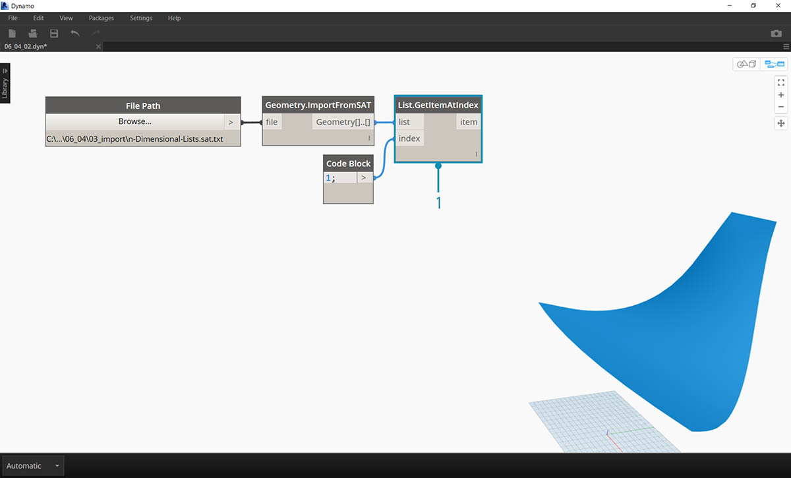
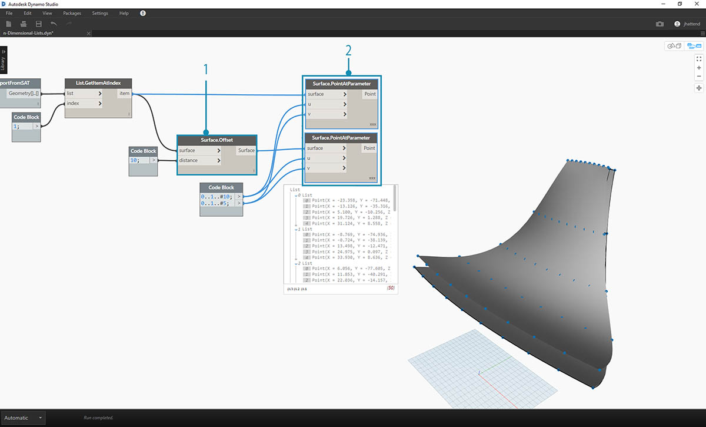
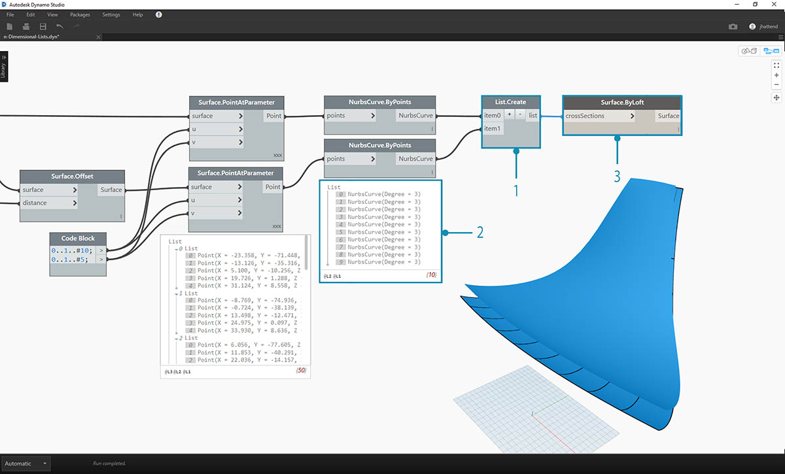
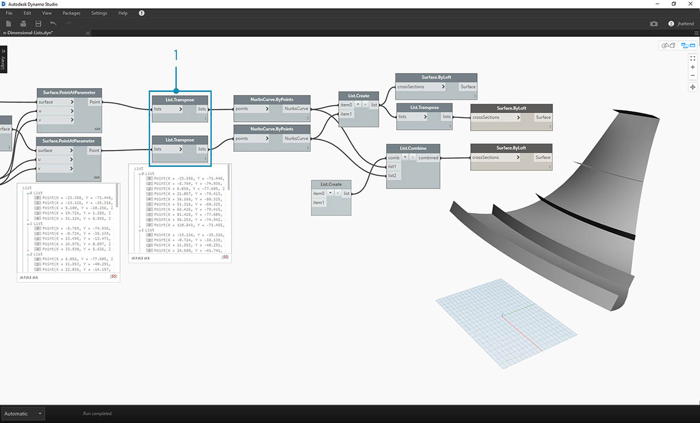
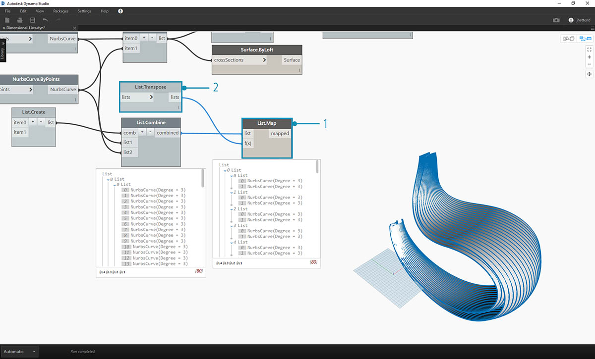
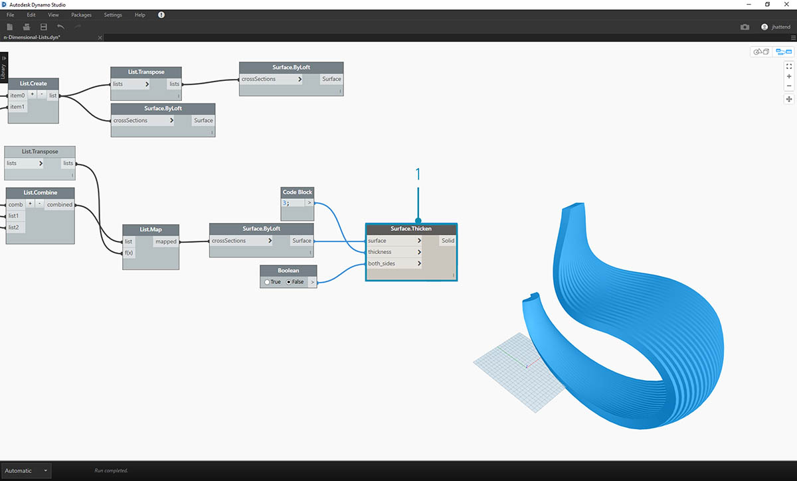
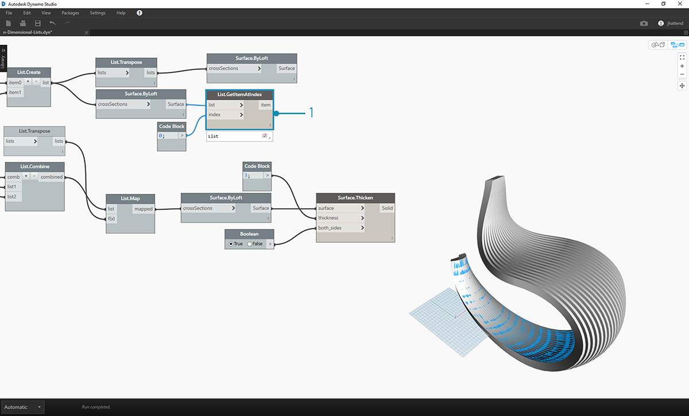
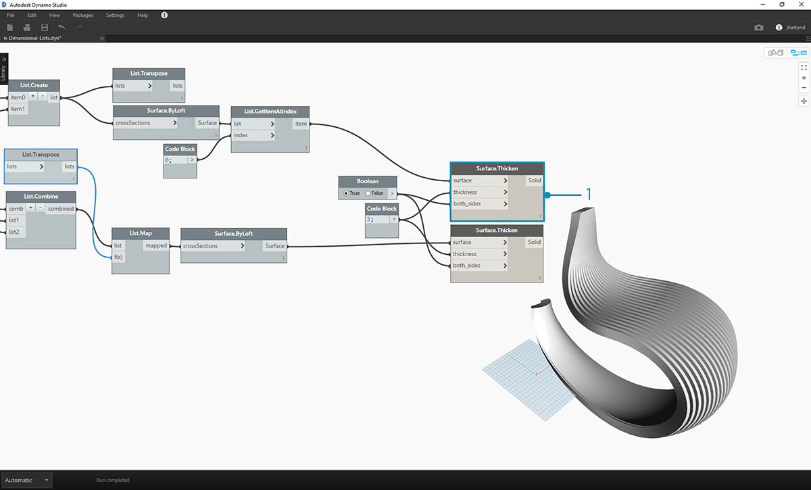
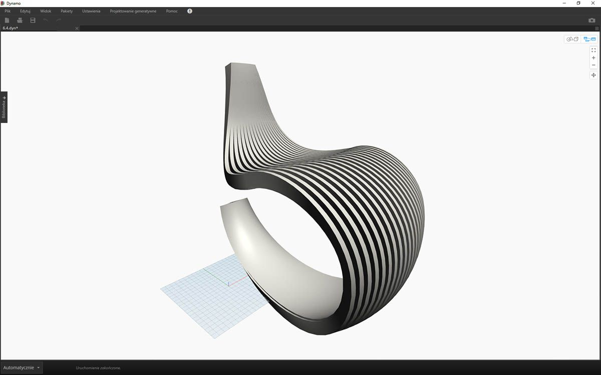
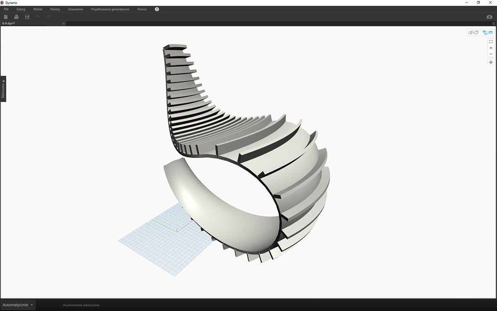

## Listy n-wymiarowe

Idąc dalej, możemy dodać jeszcze więcej poziomów do hierarchii. Struktura danych może znacznie wykraczać poza dwuwymiarową listę list. Ponieważ same listy również są elementami w dodatku Dynamo, możemy tworzyć dane z dowolnie dużą liczbą wymiarów.

Można to porównać do rosyjskich matrioszek. Każdą listę można traktować jako jeden pojemnik zawierający wiele elementów. Każda lista ma określone właściwości i sama w sobie jest traktowana jako obiekt.


> Zestaw matrioszek (autor zdjęcia: [Zeta](https://www.flickr.com/photos/beppezizzi/145493363)) to dobra analogia dla list n-wymiarowych. Każda warstwa oznacza listę, a każda lista zawiera elementy. W dodatku Dynamo każdy pojemnik może zawierać wiele pojemników (elementów listy).

Listy n-wymiarowe trudno przedstawić wizualnie, ale w tym rozdziale przygotowaliśmy kilka ćwiczeń dotyczących pracy z listami wykraczającymi poza dwa wymiary.

## Odwzorowywanie i kombinacje

Odwzorowywanie to zdecydowanie najbardziej złożona część zarządzania danymi w programie Dynamo, szczególnie istotna podczas pracy ze złożonymi hierarchiami list. W poniższych ćwiczeniach pokazano, kiedy używać odwzorowywania i kombinacji podczas pracy z wielowymiarowymi danymi.

Wstępne informacje o węzłach List.Map i List.Combine można znaleźć w poprzedniej sekcji. W ostatnim ćwiczeniu użyjemy tych węzłów w złożonej strukturze danych.

### Ćwiczenie — listy dwuwymiarowe — podstawowe

> Pobierz pliki przykładowe do tego ćwiczenia (kliknij prawym przyciskiem myszy i wybierz polecenie Zapisz element docelowy jako). Pełna lista plików przykładowych znajduje się w Załączniku. 
1.[n-Dimensional-Lists.dyn](datasets/6-4/n-Dimensional-Lists.dyn) 
2.[n-Dimensional-Lists.sat](datasets/6-4/n-Dimensional-Lists.sat)

To pierwsze z serii trzech ćwiczeń, które skupia się na artykulacji zaimportowanej geometrii. W każdej części tej serii ćwiczeń zwiększy się złożoność struktury danych.


> 1. Zacznijmy od pliku .sat w folderze plików ćwiczeniowych. Można przechwycić ten plik za pomocą węzła *File Path*.
2. Za pomocą węzła *Geometry.ImportFromSAT* geometria jest importowana do podglądu dodatku Dynamo jako dwie powierzchnie.


> Aby uprościć to ćwiczenie, będziemy pracować z jedną z tych powierzchni.

> 1. Wybierzmy indeks *1 *, aby przechwycić górną powierzchnię. Służy do tego węzeł *List.GetItemAtIndex*.


> Kolejnym etapem jest podzielenie powierzchni na siatkę punktów.

> 1. Za pomocą węzła *Code Block* wstaw następujące dwa wiersze kodu:
```
0..1..#10;
0..1..#5;
```

2. W węźle *Surface.PointAtParameter* połącz te dwie wartości z bloku kodu z elementami *u * i *v*. Zmień opcję *skratowania* tego węzła na *„Iloczyn wektorowy”*.
3. Wynik pokazuje strukturę danych, która jest również widoczna w podglądzie dodatku Dynamo.


> 1. Aby zobaczyć, jak zorganizowana jest struktura danych, połączmy węzeł *NurbsCurve.ByPoints* z elementem wyjściowym węzła *Surface.PointAtParameter*.
2. Można zauważyć, że powstało dziesięć krzywych biegnących pionowo wzdłuż powierzchni.


> 1. Podstawowa funkcja *List.Transpose* spowoduje zamianę kolumn i wierszy listy list.
2. Po połączeniu elementu wyjściowego węzła *List.Transpose* z węzłem *NurbsCurve.ByPoints* powstanie pięć krzywych biegnących poziomo na powierzchni.

### Ćwiczenie — listy dwuwymiarowe — zaawansowane

Teraz zwiększmy złożoność. Załóżmy, że chcemy wykonać operację na krzywych utworzonych w poprzednim ćwiczeniu. Możemy na przykład powiązać te krzywe z inną powierzchnią i wykonać pomiędzy nimi wyciągnięcie. To wymaga zwrócenia większej uwagi na strukturę danych, ale podstawowa logika jest taka sama.



> 1. Rozpocznij od kroku z poprzedniego ćwiczenia, w którym wyizolowaliśmy górną powierzchnię zaimportowanej geometrii za pomocą węzła *List.GetItemAtIndex*.


> 1. Używając węzła *Surface.Offset*, odsuń tę powierzchnię o wartość *10*.



> 1. Tak samo jak w poprzednim ćwiczeniu, zdefiniuj węzeł *Code Block* zawierający te dwa wiersze kodu:
```
0..1..#10;
0..1..#5;
```

2. Połącz te dane wyjściowe z dwoma węzłami *Surface.PointAtParameter*, każdy z opcją *skratowania* ustawioną na *„Iloczyn wektorowy”*. Jeden z tych węzłów jest połączony z pierwotną powierzchnią, a drugi z powierzchnią odsuniętą.


> 1. Tak samo jak w poprzednim ćwiczeniu, połącz elementy wyjściowe z dwoma węzłami *NurbsCurve.ByPoints*.
2. W podglądzie dodatku Dynamo wyświetlane są dwie krzywe odpowiadające dwóm powierzchniom.



> 1. Używając węzła *List.Create*, można połączyć oba zestawy krzywych w jedną listę list.
2. Jak widać w wyniku, otrzymaliśmy dwie listy zawierające po dziesięć elementów, odpowiadające obu połączonym zestawom krzywych NURBS.
3. Wykonując operację *Surface.ByLoft*, możemy wizualnie zinterpretować tę strukturę danych. Ten węzeł wyciąga wszystkie krzywe na każdej podliście.


> 1. Jak pamiętamy, używając węzła *List.Transpose*, zamieniamy wszystkie kolumny i wiersze. Ten węzeł umożliwia przekształcenie dwóch list po dziesięć krzywych w dziesięć list po dwie krzywe. Teraz każda krzywa NURBS jest powiązana z sąsiednią krzywą na drugiej powierzchni.
2. Po użyciu węzła *Surface.ByLoft* otrzymujemy żebrowaną strukturę.


> 1. Alternatywą dla węzła *List.Transpose* jest użycie węzła *List.Combine*. Spowoduje to zastosowanie *„kombinatora”* do każdej podlisty.
2. W tym przypadku używamy węzła *List.Create *jako *„kombinatora”* w celu utworzenia listy dla każdego elementu na podlistach.
3. Po użyciu węzła *Surface.ByLoft* otrzymujemy takie same powierzchnie, jak w poprzednim kroku. W tym przypadku łatwiej jest użyć węzła Transpose, ale jeśli struktura danych jest jeszcze bardziej złożona, węzeł *List.Combine* będzie bardziej niezawodny.



> 1. Cofając się o kilka kroków, aby zmienić orientację krzywych w żebrowanej strukturze, należy użyć węzła List.Transpose przed połączeniem z węzłem *NurbsCurve.ByPoints*. Spowoduje to zamianę kolumn i wierszy, dając 5 poziomych żeber.

### Ćwiczenie — listy trójwymiarowe

Teraz pójdziemy o krok dalej. W tym ćwiczeniu będziemy pracować z obiema zaimportowanymi powierzchniami, tworząc złożoną hierarchię danych. Będziemy jednak wykonywać tę samą operację z tą samą logiką.


> 1. Rozpocznij od zaimportowanego pliku z poprzedniego ćwiczenia.


> 1. Tak samo jak w poprzednim ćwiczeniu, użyj węzła *Surface.Offset*, aby wykonać odsunięcie o wartość *10*.
2. Jak pokazuje wynik, przy użyciu węzła Offset utworzyliśmy dwie powierzchnie.


> 1. Tak samo jak w poprzednim ćwiczeniu, zdefiniuj węzeł Code Block zawierający te dwa wiersze kodu:
```
0..1..#20;
0..1..#10;
```

2. Połącz te dane wyjściowe z dwoma węzłami *Surface.PointAtParameter*, każdy z opcją skratowania ustawioną na *„Iloczyn wektorowy”*. Jeden z tych węzłów jest połączony z pierwotnymi powierzchniami, a drugi z powierzchniami odsuniętymi.


> 1. Tak samo jak w poprzednim ćwiczeniu, połącz elementy wyjściowe z dwoma węzłami *NurbsCurve.ByPoints*.
2. W wyniku węzła *NurbsCurve.ByPoints* widzimy, że jest to lista dwóch list, czyli bardziej złożona struktura niż w poprzednim ćwiczeniu. Dane są kategoryzowane według bazowej powierzchni, a więc dodaliśmy do struktury danych kolejny poziom.
3. Należy zauważyć, że sytuacja w węźle *Surface.PointAtParameter* się skomplikowała. Mamy już listę list list.


> 1. Za pomocą węzła *List.Create* scalamy krzywe NURBS w jedną strukturę danych, tworząc listę list list.
2. Połączenie z węzłem *Surface.ByLoft* powoduje utworzenie nowej wersji pierwotnych powierzchni, z których każda pozostaje na osobnej liście utworzonej na podstawie początkowej struktury danych.


> 1. W poprzednim ćwiczeniu można było użyć węzła *List.Transpose*, aby utworzyć żebrowaną strukturę. W tym przypadku to nie zadziała. Transpozycję można stosować do listy dwuwymiarowej, a ponieważ mamy listę trójwymiarową, nie można tak łatwo „zamienić kolumn i wierszy”. Należy pamiętać, że listy to obiekty, a więc węzeł *List.Transpose* spowodowałby zamianę list z podlistami, ale nie zamianę krzywych NURBS na kolejnym poziomie hierarchii list.


> 1. W tym przypadku lepiej będzie działać węzeł *List.Combine*. Przechodząc do bardziej złożonych struktur danych, używamy węzłów *List.Map* i *List.Combine*.
2. Używając węzła *List.Create *jako *„kombinatora”*, tworzymy strukturę danych, która będzie lepiej przystosowana do naszego celu.



> 1. Struktura danych wymaga jeszcze transpozycji na niższym poziomie hierarchii. W tym celu użyjemy węzła *List.Map*. Działa on podobnie jak węzeł *List.Combine*, ale wymaga jednej listy wejściowej, a nie dwóch lub więcej.
2. Do węzła *List.Map* zastosujemy funkcję *List.Transpose*, która spowoduje zamianę kolumn i wierszy podlist na głównej liście.


> 1. Na koniec możemy wyciągnąć krzywe NURBS wraz z odpowiednią hierarchią danych, co daje żebrowaną strukturę.



> 1. Teraz dodamy głębię do tej geometrii za pomocą węzła *Surface.Thicken*.



> 1. Dobrze byłoby dodać powierzchnię jako podparcie tej struktury, dlatego użyjemy węzła *List.GetItemAtIndex*, aby wybrać tylną powierzchnię z powierzchni wyciągniętych w poprzednich krokach.



> 1. Po pogrubieniu wybranych powierzchni artykulacja jest gotowa.



> Nie jest to może najwygodniejszy fotel bujany, ale zawiera dużo danych.


> Na ostatnim etapie odwrócimy kierunek prążków. W poprzednim ćwiczeniu stosowaliśmy transpozycję. Tu zrobimy coś podobnego.

> 1. Ponieważ hierarchia ma jeszcze jeden poziom, należy użyć węzła *List.Map* z funkcją *List.Tranpose*, aby zmienić kierunek krzywych NURBS.


> 1. Jeśli chcemy zwiększyć liczbę stopni, możemy zmienić blok kodu następująco:
```
0..1..#20;
0..1..#10;
```



> Pierwsza wersja fotela bujanego była bardziej elegancka, a nasz drugi model to wersja dla miłośników sportów ekstremalnych.

