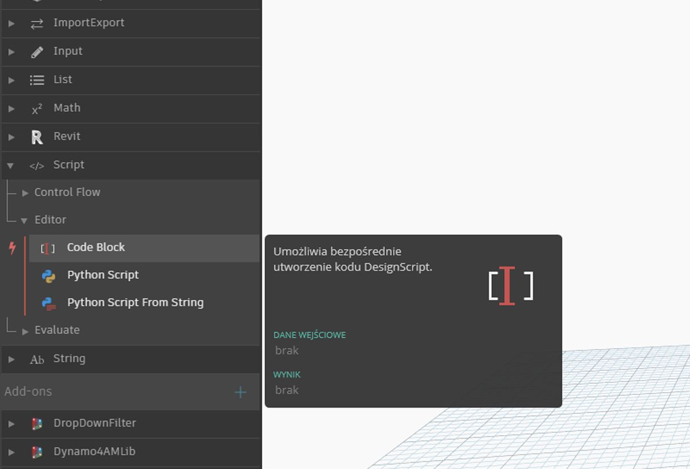
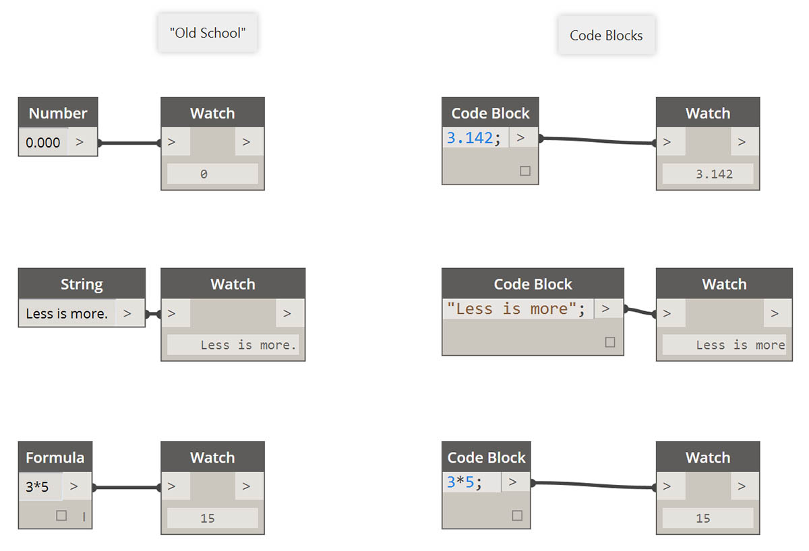

## Co to jest blok kodu?

Bloki kodu zapewniają głęboki wgląd w język DesignScript, czyli język programowania stanowiący rdzeń dodatku Dynamo. Język DesignScript, stworzony od podstaw do obsługi badawczych przepływów roboczych procesów projektowych, jest czytelny i zwięzły oraz zapewnia natychmiastową informację zwrotną dla małych fragmentów kodu, ale umożliwia też skalowanie do dużych i złożonych interakcji. Język DesignScript stanowi też fundament mechanizmu sterującego większością zaplecza dodatku Dynamo. Fakt, że prawie wszystkie funkcje dostępne w węzłach i interakcjach dodatku Dynamo mają relację „jeden do jednego” z językiem skryptów, zapewnia niepowtarzalne możliwości płynnego przechodzenia między interakcjami opartymi na węzłach a stosowaniem skryptów.  W przypadku użytkowników początkujących węzły mogą być automatycznie przekształcane w składnię tekstową, co pomaga w nauce języka DesignScript, a także po prostu zmniejsza
rozmiar większych części wykresów. Do tego celu służy proces o nazwie „Konwersja węzłów na kod”, który jest szczegółowo opisany w sekcji [Składnia języka DesignScript](7-2_Design-Script-syntax.md). Bardziej doświadczeni użytkownicy mogą używać bloków kodu do tworzenia własnych połączeń istniejących funkcji oraz samodzielnie utworzonych relacji za pomocą wielu standardowych paradygmatów kodowania. Zarówno początkujący, jak i zaawansowani użytkownicy znajdą wiele przydatnych skrótów i fragmentów kodu, które przyspieszają pracę nad projektami. Chociaż termin „blok kodu” może wywoływać nieco niepokoju u użytkowników, którzy nie są programistami, jest to łatwe w obsłudze i niezawodne narzędzie. Początkujący użytkownik może efektywnie używać bloku kodu przy minimalnym kodowaniu, a zaawansowany użytkownik może tworzyć definicje skryptowe, które będą przywoływane w innych miejscach definicji dodatku Dynamo.

### Blok kodu: krótkie omówienie

W skrócie: bloki kodu są interfejsem skryptów tekstowych w środowisku skryptów wizualnych. Mogą one być używane jako liczby, ciągi, formuły i inne typy danych. Funkcję bloku kodu zaprojektowano dla dodatku Dynamo, więc można definiować w bloku kodu dowolne zmienne, które będą automatycznie dodawane do wejść węzła:

Bloki kodu pozwalają użytkownikowi elastycznie decydować, w jaki sposób będą określane dane wejściowe. Oto kilka różnych sposobów na ustawienie podstawowego punktu o współrzędnych *(10, 5, 0)*: 

Po poznaniu większej liczby dostępnych funkcji w bibliotece użytkownik może nawet stwierdzić, że wpisanie „Point.ByCoordinates” jest szybsze niż wyszukanie odpowiedniego węzła w bibliotece. Na przykład po wpisaniu *„Point.”* dodatek Dynamo wyświetli listę funkcji, które można zastosować do punktu. Dzięki temu tworzenie skryptów jest bardziej intuicyjne. Pomaga to też w nauce stosowania funkcji w dodatku Dynamo.

### Tworzenie węzłów bloku kodu — Code Block

Blok kodu można znaleźć w sekcji *Podstawowe > Dane wejściowe > Operacje > Blok kodu*. Jeszcze szybciej: wystarczy kliknąć dwukrotnie obszar rysunku, a zostanie wyświetlony blok kodu. Ten węzeł jest używany tak często, że przypisano do niego funkcję dwukrotnego kliknięcia.

### Liczby, ciągi i formuły

Bloki kodu są również elastyczne pod względem typów danych. Użytkownik może szybko definiować liczby, ciągi i formuły, a blok kodu zapewni żądane wyniki.

Na poniższej ilustracji pokazano „stary” i nieco pracochłonny sposób realizacji zadania: użytkownik wyszukuje węzeł w interfejsie, dodaje go do obszaru rysunku, a następnie wprowadza dane. Za pomocą bloku kodu użytkownik może kliknąć dwukrotnie obszar rysunku, aby pojawił się węzeł, i wpisać właściwy typ danych za pomocą podstawowej składni. 

> *Number*, *String* i *Formula* to trzy przykłady węzłów Dynamo, które są najprawdopodobniej przestarzałe w porównaniu z węzłem *Code Block*.

