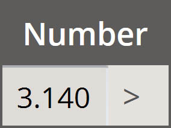
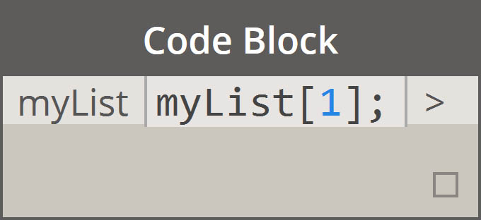
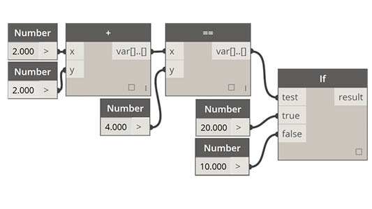
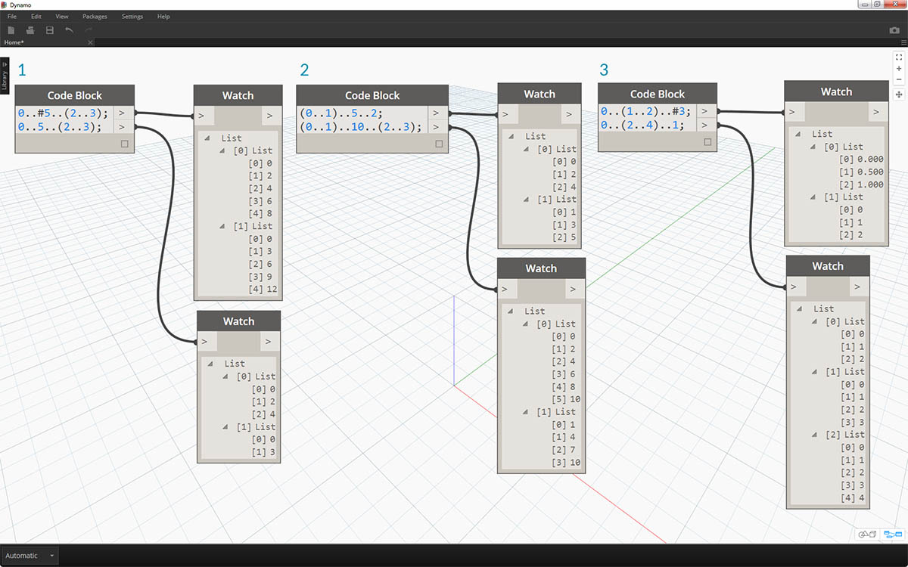
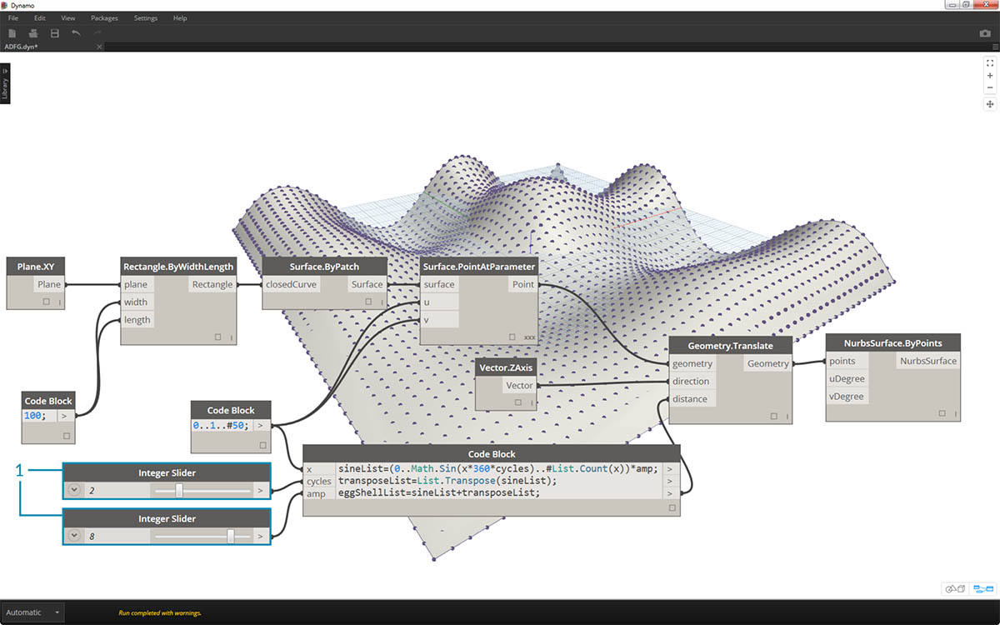
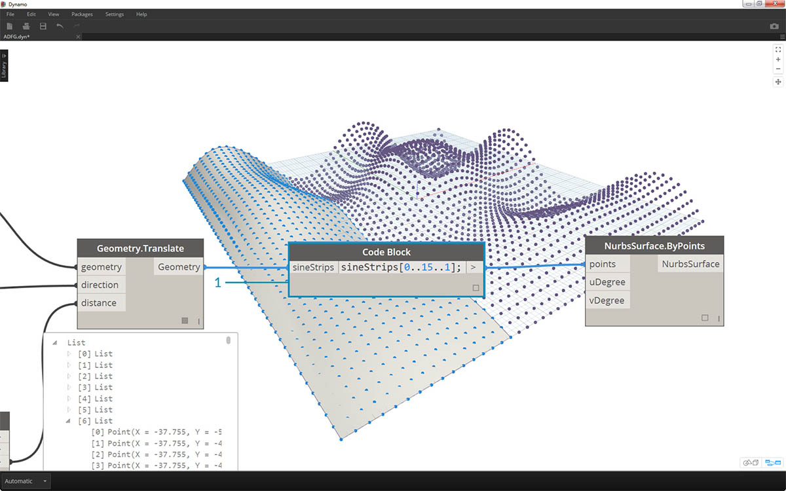

<style>
table{box-shadow: 2px 2px 2px #BBBBBB;max-width:75%;display:block;margin-left: auto;   margin-right: auto }
img{display:block;margin-left: auto;   margin-right: auto }
</style>

## Krótka składnia

W bloku kodu dostępnych jest kilka podstawowych metod o krótkiej składni, które *znacznie* ułatwiają zarządzanie danymi. Podstawy zostały szczegółowo omówione poniżej. Wyjaśniamy też, jak za pomocą tej krótkiej składni można tworzyć dane i stosować do nich zapytania.

<table>
    <tr>
    <td width="50%"><b>Typ danych</b></td>
    <td width="25%"><b>Standard Dynamo</b> </td>
    <td width="25%"><b>Odpowiednik w bloku kodu</b></td>
  </tr>
  <tr>
    <td> Liczby</td>
    <td></img> </td>
    <td></img></td>
  </tr>
  <tr>
    <td>Ciągi</td>
    <td></img> </td>
    <td></img></td>
  </tr>
  <tr>
    <td>Sekwencje</td>
    <td></img> </td>
    <td></img></td>
  </tr>
  <tr>
    <td>Przedziały</td>
    <td></img> </td>
    <td></img></td>
  </tr>
  <tr>
    <td>Pobierz element o indeksie</td>
    <td></img> </td>
    <td></img></td>
  </tr>
  <tr>
    <td>Utwórz listę</td>
    <td></img> </td>
    <td></img></td>
  </tr>
  <tr>
    <td>Scal ciągi</td>
    <td></img> </td>
    <td></img></td>
  </tr>
  <tr>
    <td>Instrukcje warunkowe</td>
    <td></img> </td>
    <td></img></td>
  </tr>
</table>

### Dodatkowa składnia

|Węzły|Odpowiednik w bloku kodu|Uwaga|
| -- | -- | -- |
|Dowolny operator (+, &&, >=, Not itd.)|+, &&, >=, ! itd.|Uwaga: „Not” staje się „!”, ale węzeł nazywa się „Not”, aby odróżnić go od „Factorial”|
|Wartość logiczna True|true;|Uwaga: małe litera|
|Wartość logiczna False|false;|Uwaga: małe litera|

### Przedziały

Metoda definiowania zakresów i sekwencji może zostać zredukowana do krótkiej składni. Poniższa ilustracja przedstawia składnię „..”, która umożliwia definiowanie listy danych liczbowych za pomocą bloku kodu. Po zaznajomieniu się z tą notacją tworzenie danych liczbowych jest bardzo wydajnym procesem: 

> 1. W tym przykładzie zakres liczb zostaje zastąpiony podstawową składnią bloku kodu definiującą ```początek..koniec..rozmiar-kroku;```. Liczbowo będzie to: ```0..10..1;```
2. Uwaga: składnia ```0...10..1;``` jest równoważna składni ```0..10;```. Wielkość kroku równa 1 jest domyślną wartością w krótkiej składni. Dlatego ```0..10;``` daje sekwencję od 0 do 10 o kroku 1.
3. Przykład *sekwencji liczb* (Number Sequence) jest podobny, ale do ustawienia 15 wartości na liście używamy znaku *„#”* zamiast listy do 15. W tym przypadku definiujemy: ```początek...#liczba-kroków..rozmiar-kroku:```. Rzeczywista składnia sekwencji to ```0...#15..2```
4. Używając znaku *„#”* z poprzedniego kroku, umieścimy go teraz w części *„rozmiar-kroku”* składni. Teraz mamy *zakres liczb* (Number Range) od *„początku”* do *„końca”* z ustalonym *„rozmiarem-kroku”*, co powoduje równomierne rozmieszczenie wartości między dwoma punktami: ```początek..koniec..#liczba-kroków```

### Zakresy zaawansowane

Tworzenie zakresów zaawansowanych pozwala na łatwe korzystanie z listy list. W poniższych przykładach wyodrębniamy zmienną z notacji zakresu głównego i tworzymy inny zakres tej listy. 

> 1. Tworząc zakresy zagnieżdżone, porównaj notację z *„#”* z notacją bez tego znaku. Zastosowanie ma ta sama logika co w zakresach podstawowych, choć rozwiązanie jest nieco bardziej złożone.
2. Możemy zdefiniować zakres podrzędny w dowolnym miejscu w zakresie głównym i możemy też używać dwóch zakresów podrzędnych.
3. Sterując wartością *„końca”* w zakresie, tworzymy więcej zakresów o różnych długościach.


> W ramach ćwiczenia logicznego porównaj dwie wersje krótkiej składni i spróbuj przeanalizować, w jaki sposób *zakresy podrzędne* i notacja *„#”* wpływają na wynik na wyjściu.

### Tworzenie list i pobieranie elementów z listy

Poza tworzeniem list za pomocą krótkiej składni możemy również tworzyć listy na bieżąco. Te listy mogą zawierać szeroki zakres typów elementów i można stosować do nich zapytania (należy pamiętać, że listy to także obiekty). Podsumowując: blok kodu pozwala tworzyć listy za pomocą nawiasów klamrowych i stosować zapytania o elementy z listy za pomocą nawiasów kwadratowych:


> 1. Szybko twórz listy za pomocą ciągów i stosuj do nich zapytania, korzystając z indeksu elementu.
2. Twórz listy ze zmiennymi i stosuj do nich zapytania za pomocą notacji krótkiej składni zakresu.

Zarządzanie z listami zagnieżdżonymi jest podobnym procesem. Pamiętaj o kolejności listy i o korzystaniu z wielu zestawów nawiasów kwadratowych:


> 1. Zdefiniuj listę list.
2. Zastosuj zapytanie do listy za pomocą notacji z jedną parą nawiasów kwadratowych.
3. Zastosuj zapytanie do elementu za pomocą notacji z dwiema parami nawiasów kwadratowych.

### Ćwiczenie

> Pobierz plik przykładowy do tego ćwiczenia (kliknij prawym przyciskiem myszy i wybierz polecenie Zapisz element docelowy jako). Pełna lista plików przykładowych znajduje się w załączniku. [Obsolete-Nodes_Sine-Surface.dyn](datasets/7-3/Obsolete-Nodes_Sine-Surface.dyn)

W tym ćwiczeniu przećwiczymy nowe umiejętności dotyczące krótkiej składni, aby utworzyć „jajowatą” powierzchnię zdefiniowaną przez zakresy i formuły. W trakcie ćwiczenia zwróć uwagę na to, w jaki sposób używane są blok kodu i istniejące węzły Dynamo: blok kodu jest używany do złożonej obsługi danych, natomiast węzły Dynamo są rozmieszczone wizualnie w celu zapewnienia czytelności definicji.


> Rozpocznij od utworzenia powierzchni przez połączenie powyższych węzłów. Zamiast używać węzła number do zdefiniowania szerokości i długości, kliknij dwukrotnie obszar rysunku i wpisz ```100;``` w bloku kodu.


> 1. Zdefiniuj zakres od 0 do 1 z 50 podziałami, wpisując ```0..1..#50``` w bloku kodu.
2. Połącz ten zakres z węzłem *Surface.PointAtParameter*, który pobiera wartości *u* i *v* z zakresu od 0 do 1 na powierzchni. Pamiętaj, aby zmienić *Skratowanie* na *Iloczyn kartezjański*, klikając prawym przyciskiem myszy węzeł *Surface.PointAtParameter*.


> W tym kroku użyjemy pierwszej funkcji do przesunięcia siatki punktów w górę na osi Z. Ta siatka będzie sterować generowaną powierzchnią na podstawie funkcji źródłowej.

> 1. Dodaj węzły wizualne do obszaru rysunku, jak pokazano na ilustracji powyżej.
2. Zamiast używać węzła formuły, użyjemy bloku kodu z wierszem: ```(0..Math.Sin(x*360)..#50)*5;```. Krótkie objaśnienie: definiujemy zakres z formułą w jego wnętrzu. Ta formuła jest funkcją sinus. Funkcja sinus przyjmuje w dodatku Dynamo dane wejściowe w stopniach, więc aby uzyskać pełny kształt funkcji sinus, należy przemnożyć wartości *x* (jest to wejście zakresu od 0 do 1) przez *360*. Następnie chcemy uzyskać taką samą liczbę podziałów, ile jest punktów siatki sterującej dla każdego wiersza, dlatego zdefiniujemy pięćdziesiąt podziałów podrzędnych za pomocą instrukcji *#50*. Na koniec: mnożnik 5 po prostu zwiększa amplitudę przekształcenia, dzięki czemu możemy zobaczyć efekt w podglądzie Dynamo.


> 1. Mimo że poprzedni blok kodu działał dobrze, nie był całkowicie parametryczny. Chcemy dynamicznie sterować jego parametrami, dlatego zastąpimy wiersz z poprzedniego kroku wierszem ```(0..Math.Sin(x*360*cycles)..#List.Count(x))*amp;```. Daje to możliwość zdefiniowania tych wartości na podstawie wejść.


> 1. Zmieniając suwaki (w zakresie od 0 do 10), otrzymujemy interesujące wyniki.


> 1. Transponując zakres liczb, odwrócimy kierunek fali kurtynowej: ```transposeList = List.Transpose(sineList);```


> 1. Po dodaniu wartości sineList i transposeList uzyskujemy zniekształconą „jajowatą” powierzchnię: ```eggShellList = sineList+transposeList;```



> 1. Ponownie zmieniając suwaki, zmniejszymy zniekształcenia tworzone przez ten algorytm.



> 1. Na koniec zastosujmy zapytania do wyodrębnionych części danych za pomocą bloku kodu. Aby ponownie wygenerować powierzchnię za pomocą określonego zakresu punktów, dodaj blok kodu powyżej między węzłami *Geometry.Translate* i *NurbsSurface.ByPoints*. Będzie on zawierać wiersz tekstu: ```sineStrips[0..15..1];```. Spowoduje to wybranie pierwszych 16 wierszy punktów (spośród 50). Po ponownym utworzeniu powierzchni widać, że wygenerowaliśmy wyodrębnioną część siatki punktów.


> 1. W ostatnim kroku, aby uczynić ten blok kodu bardziej parametrycznym, będziemy sterować zapytaniem za pomocą suwaka o zakresie od 0 do 1. W tym celu dodamy ten wiersz kodu: ```sineStrips[0..((List.Count(sineStrips)-1)*u)];```. Może to wydawać się skomplikowane, ale ten wiersz kodu pozwala szybko przeskalować długość listy do mnożnika z zakresu od 0 do 1.


> 1. Wartość *0,53* na suwaku powoduje utworzenie powierzchni tuż za punktem środkowym siatki.


> 1. Zgodnie z oczekiwaniami wartość *1* na suwaku tworzy powierzchnię z pełnej siatki punktów.


> Przyglądając się wynikowemu wykresowi wizualnemu, możemy wyróżnić bloki kodu i przejrzeć ich poszczególne funkcje.

> 1. Pierwszy blok kodu zastępuje węzeł *Numer*.
2. Drugi blok kodu zastępuje węzeł *Number Range*.
3. Trzeci blok kodu zastępuje węzeł *Formula* (jak również węzły *List.Transpose*, *List.Count* i *Number Range*).
4. Czwarty blok kodu stosuje zapytania do listy list, zastępując węzeł *List.GetItemAtIndex*.

