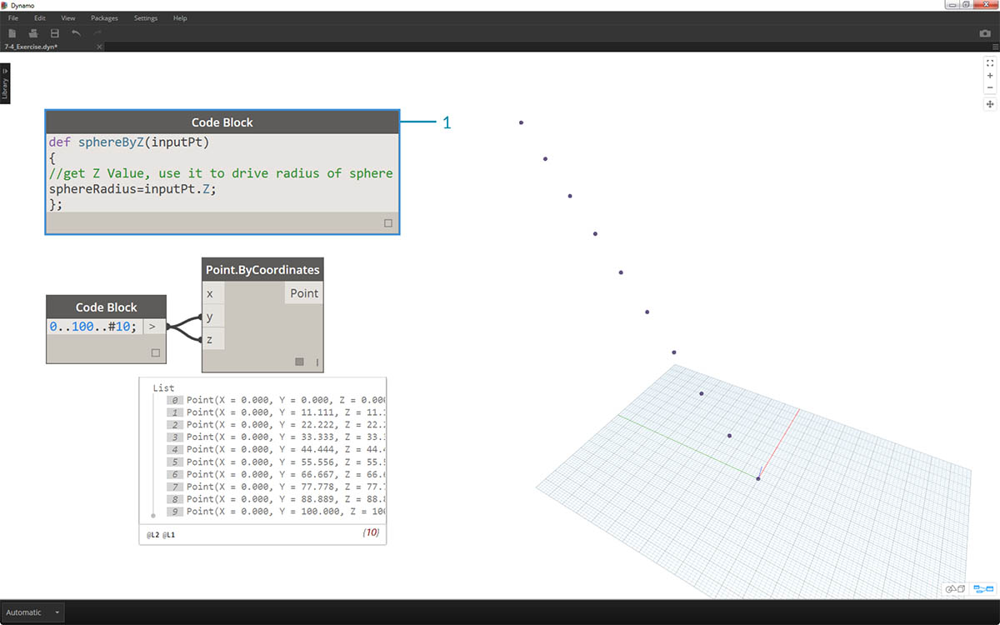

## Funkcje bloku kodu

W bloku kodu można tworzyć funkcje, a następnie można je ponownie wywoływać w innym miejscu w definicji dodatku Dynamo. Powoduje to utworzenie innej warstwy sterującej w pliku parametrycznym. Można to postrzegać jako wersję tekstową węzła niestandardowego. W tym przypadku „nadrzędny” blok kodu jest łatwo dostępny i może być umieszczony w dowolnym miejscu na wykresie. Nie są potrzebne żadne przewody.

### Parent

Pierwszy wiersz zawiera słowo kluczowe „def”, następnie nazwę funkcji, a następnie nazwy danych wejściowych w nawiasach. Klamry definiują treść funkcji. Wartość jest zwracana za pomocą instrukcji „return =”. Bloki kodu, które definiują funkcję, nie mają portów wejściowych ani wyjściowych, ponieważ są wywoływane z innych bloków kodu. 

```
/*This is a multi-line comment,
which continues for
multiple lines*/
def FunctionName(in1,in2)
{
//This is a comment
sum = in1+in2;
return sum;
};
```

### Podrzędne

Wywołaj funkcję w innym bloku kodu w tym samym pliku przez podanie nazwy i takiej samej liczby argumentów. Działa to tak jak w przypadku gotowych węzłów w bibliotece.


```
FunctionName(in1,in2);
```

### Ćwiczenie

> Pobierz plik przykładowy do tego ćwiczenia (kliknij prawym przyciskiem myszy i wybierz polecenie Zapisz element docelowy jako). Pełna lista plików przykładowych znajduje się w załączniku. [Functions_SphereByZ.dyn](datasets/7-4/Functions_SphereByZ.dyn)

W tym ćwiczeniu zostanie utworzona ogólna definicja, która utworzy sfery z wejściowej listy punktów. Promień tych sfer zależy od właściwości Z każdego punktu.


> Zacznijmy od przedziału liczbowego dziesięciu wartości z zakresu od 0 do 100. Podłącz je do węzłów *Point.ByCoordinates*, aby utworzyć linię przekątną.


> 1. Utwórz *blok kodu* i wprowadź definicję za pomocą wiersza kodu:
```
def sphereByZ(inputPt){
};
```

*inputPt* to nazwa, którą nadaliśmy reprezentacji punktów sterujących funkcją. Na razie funkcja niczego nie robi, ale w kolejnych krokach ją skonstruujemy.



> 1. Dodając elementy do funkcji *bloku kodu*, umieścimy komentarz i zmienną *sphereRadius*, która wysyła zapytanie o położenie *Z* każdego punktu. Pamiętaj, że *inputPt.Z* nie wymaga nawiasów jak metoda. Jest to *zapytanie* o właściwości istniejącego elementu, dlatego żadne dane wejściowe nie są konieczne:
```
def sphereByZ(inputPt,radiusRatio)
{
//get Z Value, use it to drive radius of sphere
sphereRadius=inputPt.Z;
};
```


> 1. Teraz przypomnijmy sobie funkcję, którą utworzyliśmy w innym *bloku kodu*. Jeśli dwukrotnie klikniemy obszar roboczy, aby utworzyć nowy *blok kodu*, i wpiszemy *sphereB*, dodatek Dynamo zasugeruje zdefiniowaną przez nas wcześniej funkcję *sphereByZ*. Funkcja została dodana do biblioteki intellisense. To przydatne.


> 1. Teraz wywołamy tę funkcję i utworzymy zmienną o nazwie *Pt*, aby podłączyć punkty utworzone w poprzednich krokach:
```
sphereByZ(Pt)
```

2. Wszystkie wyjścia mają wartości null. Dlaczego tak jest? W definicji funkcji obliczamy zmienną *sphereRadius*, ale nie zdefiniowaliśmy, co funkcja powinna *zwracać* na *wyjściu*. Możemy to naprawić w następnym kroku.


> 1. Ważnym krokiem jest zdefiniowanie wyjścia funkcji przez dodanie wiersza ```return = sphereRadius;``` do funkcji *sphereByZ*.
2. Teraz na wyjściu *bloku kodu* pojawiają się współrzędne Z każdego punktu.


> Teraz utworzymy właściwe sfery, edytując funkcję *nadrzędną*.

> 1. Najpierw zdefiniujemy sferę za pomocą wiersza kodu: ```sphere=Sphere.ByCenterPointRadius(inputPt,sphereRadius);```
2. Następnie zmienimy zwracaną wartość na *sphere* zamiast *sphereRadius*: ```return = sphere;```. To pozwoli nam uzyskać kilka gigantycznych sfer w podglądzie Dynamo.


> 1. Aby zwiększyć rozmiar tych sfer, zaktualizuj wartość *sphereRadius*, dodając dzielnik: ```sphereRadius = inputPt.Z/20;```. Teraz możemy dostrzec osobne sfery i zrozumieć związek między wartością promienia a wartością Z.


> 1. W węźle *Point.ByCoordinates* tworzymy siatkę punktów, zmieniając skratowanie z *Shortest List* (Najkrótsza lista) na *Cross Product* (Iloczyn kartezjański). Funkcja *sphereByZ* nadal w pełni działa, dlatego wszystkie punkty tworzą sfery z promieniami na podstawie wartości Z.


> 1. Aby przetestować rozwiązanie, podłączymy oryginalną listę liczb do wejść X węzła *Point.ByCoordinates*. Mamy teraz sześcian sfer.
2. Uwaga: jeśli obliczenia na komputerze trwają długo, spróbuj zmienić *#10* na wartość typu *#5*.


> 1. Pamiętaj, że utworzona przez nas funkcja *sphereByZ* to funkcja ogólna, więc możemy przywołać helisę z wcześniejszej lekcji i zastosować do niej tę funkcję.


> Ostatni krok: sterowanie współczynnikiem promienia za pomocą parametru zdefiniowanego przez użytkownika. Aby to zrobić, należy utworzyć nowe wejście dla tej funkcji, a także zastąpić dzielnik *20* parametrem.

> 1. Zaktualizuj definicję funkcji *sphereByZ* do postaci:
```
def sphereByZ(inputPt,radiusRatio)
{
//get Z Value, use it to drive radius of sphere
sphereRadius=inputPt.Z/radiusRatio;
//Define Sphere Geometry
sphere=Sphere.ByCenterPointRadius(inputPt,sphereRadius);
//Define output for function
return sphere;
};
```

2. Zaktualizuj podrzędne bloki kodu, dodając do wejścia zmienną *ratio*: ```sphereByZ(Pt,ratio);```. Podłącz suwak do nowo utworzonego wejścia bloku kodu i zmieniaj rozmiar promieni na podstawie współczynnika promienia.

