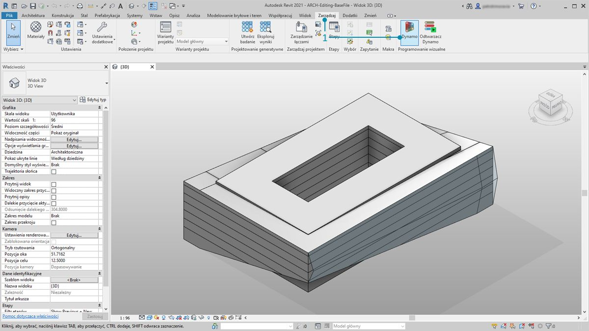
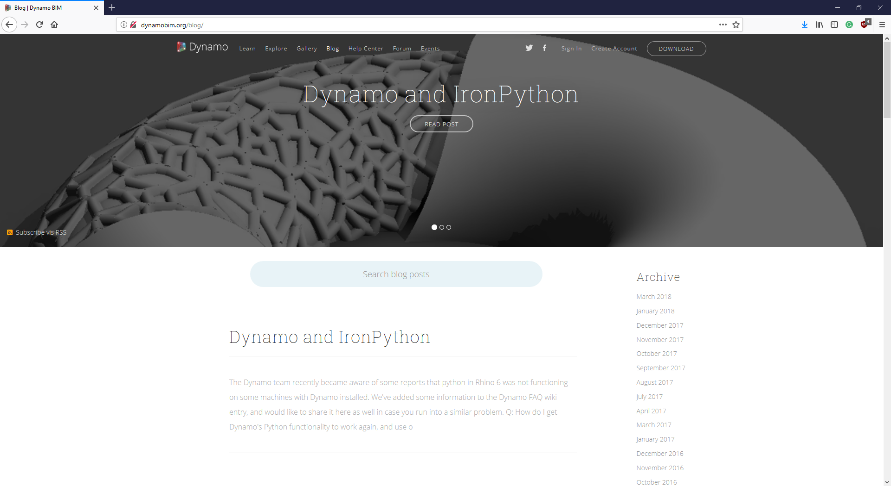

## Połączenie programu Revit

Dodatek Dynamo dla programu Revit rozszerza możliwości modelowania informacji o budynku (BIM) za pomocą środowiska danych i logiki graficznego edytora algorytmów. Jego elastyczność w połączeniu z solidną bazą danych programu Revit zapewnia nową perspektywę dla modelowania BIM.

W tym rozdziale omówiono procesy robocze dodatku Dynamo dla modelowania BIM. Poszczególne sekcje są oparte głównie na ćwiczeniach, ponieważ przejście bezpośrednio do projektu jest najlepszym sposobem zapoznania się z graficznym edytorem algorytmów do modelowania informacji o budynku. Najpierw jednak omówimy początki tego programu.

####

#### Zgodność z wersjami programu Revit

Ponieważ zarówno program Revit, jak i dodatek Dynamo wciąż ewoluują, może się okazać, że używana wersja programu Revit nie jest zgodna z zainstalowaną na komputerze wersją dodatku Dynamo dla programu Revit. Poniżej opisano, które wersje dodatku Dynamo dla programu Revit są zgodne z programem Revit.

|Wersja programu Revit|Pierwsza stabilna wersja dodatku Dynamo|Ostatnia obsługiwana wersja dodatku Dynamo dla programu Revit|
| -- | -- | -- |
|2013|[0.6.1](http://dyn-builds-data.s3-us-west-2.amazonaws.com/DynamoInstall0.6.1.exe)|[0.6.3](http://dyn-builds-data.s3-us-west-2.amazonaws.com/DynamoInstall0.6.3.exe)|
|2014|[0.6.1](http://dyn-builds-data.s3-us-west-2.amazonaws.com/DynamoInstall0.6.1.exe)|[0.8.2](http://dyn-builds-data.s3-us-west-2.amazonaws.com/DynamoInstall0.8.2.exe)|
|2015|[0.7.1](http://dyn-builds-data.s3-us-west-2.amazonaws.com/DynamoInstall0.7.1.exe)|[1.2.1](http://dyn-builds-data.s3-us-west-2.amazonaws.com/DynamoInstall1.2.1.exe)|
|2016|[0.7.2](http://dyn-builds-data.s3-us-west-2.amazonaws.com/DynamoInstall0.7.2.exe)|[1.3.2](http://dyn-builds-data.s3-us-west-2.amazonaws.com/DynamoInstall1.3.2.exe)|
|2017|[0.9.0](http://dyn-builds-data.s3-us-west-2.amazonaws.com/DynamoInstall0.9.0.exe)|[1.3.4](http://dyn-builds-data.s3-us-west-2.amazonaws.com/DynamoInstall1.3.4.exe) / [2.0.3](https://dyn-builds-data.s3-us-west-2.amazonaws.com/DynamoInstall2.0.3.exe)|
|2018|[1.3.0](http://dyn-builds-data.s3-us-west-2.amazonaws.com/DynamoInstall1.3.0.exe)|[1.3.4](http://dyn-builds-data.s3-us-west-2.amazonaws.com/DynamoInstall1.3.4.exe) / [2.0.3](https://dyn-builds-data.s3-us-west-2.amazonaws.com/DynamoInstall2.0.3.exe)|
|2019|[1.3.3](http://dyn-builds-data.s3-us-west-2.amazonaws.com/DynamoInstall1.3.3.exe)|[1.3.4](http://dyn-builds-data.s3-us-west-2.amazonaws.com/DynamoInstall1.3.4.exe) / [2.0.3](https://dyn-builds-data.s3-us-west-2.amazonaws.com/DynamoInstall2.0.3.exe)|
|2020|2.1.0 — program Revit 2020 zawiera teraz dodatek Dynamo, który jest aktualizowany razem z programem Revit.|Nie dotyczy|

####

#### Historia dodatku Dynamo

> Dzięki dedykowanemu zespołowi programistów i pełnej zaangażowania społeczności ten projekt przebył długą drogę od skromnych początków.

Dodatek Dynamo został pierwotnie utworzony w celu usprawnienia procesów roboczych AEC w programie Revit. Mimo że program Revit tworzy obszerną bazę danych dla każdego projektu, uzyskanie dostępu do tych informacji przez przeciętnego użytkownika poza ograniczeniami interfejsu może być trudne. Program Revit udostępnia wszechstronny interfejs API (Application Program Interface) umożliwiający programistom zewnętrznym tworzenie narzędzi niestandardowych. Programiści używają tego interfejsu API od lat, ale tworzenie skryptów tekstowych nie jest technologią dostępną dla wszystkich. Dodatek Dynamo ma zdemokratyzować dane programu Revit za pomocą łatwego w obsłudze graficznego edytora algorytmów.

Używając podstawowych węzłów Dynamo wraz z węzłami niestandardowymi programu Revit, użytkownik może znacznie rozszerzyć parametryczne procesy robocze na potrzeby współdziałania, dokumentacji, analizy i generowania. Dzięki dodatkowi Dynamo można zautomatyzować żmudne procesy robocze i skutecznie analizować rozwiązania projektowe.

### Uruchamianie dodatku Dynamo w programie Revit

> 1. W edytorze rodziny lub projekcie programu Revit przejdź do pozycji Dodatki i kliknij opcję *Dynamo*. Uwaga: dodatek Dynamo zostanie uruchomiony tylko w pliku, w którym został otwarty.

> 1. W przypadku otwarcia dodatku Dynamo w programie Revit dostępna jest nowa kategoria o nazwie *„Revit”*. Jest to kompleksowy dodatek do interfejsu użytkownika, który zawiera węzły opracowane konkretnie do procesów roboczych programu Revit*.

**Uwaga — w razie użycia rodziny węzłów charakterystycznej dla programu Revit wykres dodatku Dynamo będzie działać tylko po otwarciu w dodatku Dynamo dla programu Revit. Jeśli na przykład wykres dodatku Dynamo dla programu Revit zostanie otwarty w dodatku Dynamo w trybie „piaskownicy” (Sandbox), będzie brakować węzłów programu Revit.*

### Blokowanie węzłów

Ponieważ program Revit jest platformą zapewniającą zaawansowane zarządzanie projektem, operacje parametryczne w dodatku Dynamo mogą być skomplikowane, a ich obliczanie — powolne. Jeśli w dodatku Dynamo obliczanie węzłów trwa zbyt długo, można użyć funkcji zablokowania węzła, aby wstrzymać wykonywanie operacji programu Revit podczas tworzenia wykresu. Aby uzyskać więcej informacji na temat blokowania węzłów, zobacz sekcję „Blokowanie” w [rozdziale poświęconym bryłom](../05_Geometry-for-Computational-Design/5-6_solids.md#freezing).

### Społeczność

Ponieważ dodatek Dynamo został pierwotnie utworzony dla dziedzin architektury, inżynierii i budownictwa (AEC), jego duża i stale rosnąca społeczność stanowi doskonałe źródło do nauki i zapewnia możliwości kontaktu z ekspertami w branży. Społeczność dodatku Dynamo składa się z architektów, inżynierów, programistów i projektantów pełnych pasji tworzenia i dzielenia się wynikami pracy.

Dynamo to projekt typu open source, który ciągle ewoluuje, a znaczna część jego rozwoju jest związana z programem Revit. Jeśli jesteś nowym użytkownikiem, odwiedź forum dyskusyjne i zacznij [publikować pytania](http://dynamobim.org/forums/forum/dyn/). Jeśli jesteś programistą i chcesz się zaangażować w rozwój dodatku Dynamo, odwiedź [stronę w serwisie Github](https://github.com/DynamoDS/Dynamo). Przydatnym zasobem dotyczącym bibliotek innych dostawców jest [menedżer pakietów Dynamo](http://dynamopackages.com/). Wiele z tych pakietów utworzono z myślą o architekturze, inżynierii i budownictwie. W tym rozdziale przyjrzymy się pakietom innych dostawców do panelowania.

> Z dodatkiem Dynamo związany jest też aktywny [blog](http://dynamobim.com/blog/). Przeczytaj najnowsze wpisy, aby zapoznać się z nowościami i wiadomościami.

