## Wybieranie

Program Revit to środowisko bogate w dane. Daje to wiele możliwości wybierania, znacznie wykraczających poza metodę „wskaż i kliknij”. Można wykonać zapytanie do bazy danych programu Revit i dynamicznie połączyć elementy programu Revit z geometrią dodatku Dynamo podczas wykonywania operacji parametrycznych.


> Biblioteka programu Revit w interfejsie użytkownika zawiera kategorię „Selection”, która umożliwia wybieranie geometrii na wiele sposobów.

Aby prawidłowo wybrać elementy programu Revit, należy w pełni rozumieć hierarchię elementów programu Revit. Chcesz wybrać wszystkie ściany w projekcie? Wybierz według kategorii. Chcesz wybrać wszystkie fotele Eamesa w holu urządzonym w stylu z połowy XX wieku? Wybierz według rodziny. Przed rozpoczęciem ćwiczenia omówimy pokrótce hierarchię programu Revit.

#### Hierarchia programu Revit

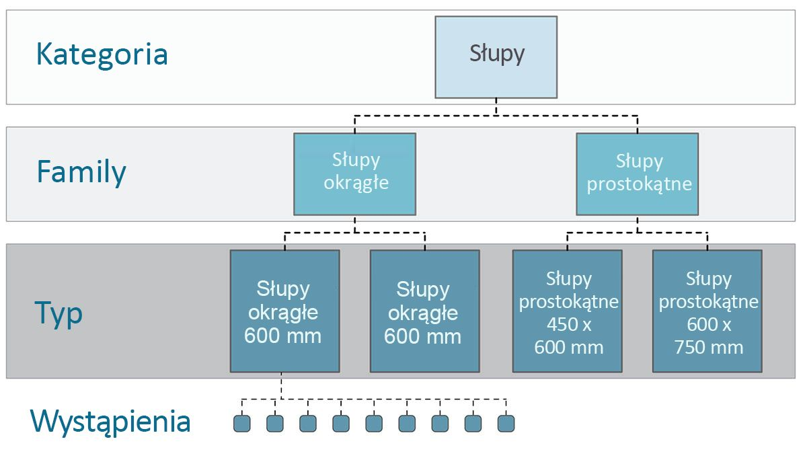

Pamiętasz systematykę organizmów z biologii? Królestwo, typ, gromada, rząd, rodzina, rodzaj, gatunek? Elementy programu Revit są skategoryzowane podobnie. Na poziomie podstawowym hierarchię programu Revit można podzielić na kategorie, rodziny, typy* i wystąpienia. Wystąpienie to pojedynczy element modelu (z unikatowym identyfikatorem), a kategoria definiuje ogólną grupę (na przykład „ściany” czy „stropy”). Dzięki uporządkowaniu bazy danych programu Revit w ten sposób można wybrać jeden element, a następnie wybrać wszystkie podobne elementy na podstawie określonego poziomu w hierarchii.

**Uwaga — typy w programie Revit definiuje się inaczej niż typy w programowaniu. Typ w programie Revit oznacza gałąź hierarchii, a nie „typ danych”.*

#### Nawigacja w bazach danych za pomocą węzłów Dynamo

Trzy poniższe ilustracje przedstawiają główne kategorie wyboru elementów programu Revit w dodatku Dynamo. To narzędzia, które można doskonale łączyć, a w kolejnych ćwiczeniach omówimy niektóre z nich.


> Najprostszym sposobem bezpośredniego wybrania elementu programu Revit jest *wskazanie i kliknięcie* go. Można wybrać cały element modelu lub części jego topologii (na przykład ścianę lub krawędź). Pozostają one dynamicznie połączone z tym obiektem programu Revit, więc gdy w pliku programu Revit zmieni się jego położenie lub parametry, odpowiedni element dodatku Dynamo zostanie zaktualizowany na wykresie.


> *Menu rozwijane* zawierają listę wszystkich dostępnych elementów w projekcie programu Revit. Można ich użyć, aby tworzyć odniesienia do elementów programu Revit, które niekoniecznie są widoczne w widoku. Jest to doskonałe narzędzie do wykonywania zapytań dotyczących istniejących elementów oraz tworzenia nowych w projekcie programu Revit lub edytorze rodzin.


> Można również wybrać element programu Revit na podstawie określonych poziomów w *hierarchii programu Revit*. Jest to zaawansowana opcja umożliwiająca dostosowywanie dużych zestawów danych w przygotowaniu do tworzenia dokumentacji lub generacyjnego tworzenia i dostosowywania wystąpień.

Pamiętając o trzech powyższych ilustracjach, przejdźmy do ćwiczenia polegającego na wybieraniu elementów z podstawowego projektu programu Revit w przygotowaniu do zastosowań parametrycznych, które będziemy tworzyć w pozostałych sekcjach tego rozdziału.

### Ćwiczenie

> Pobierz pliki przykładowe do tego ćwiczenia (kliknij prawym przyciskiem myszy i wybierz polecenie Zapisz element docelowy jako). Pełna lista plików przykładowych znajduje się w Załączniku.

> 1. [Selecting.dyn](datasets/8-2/Selecting.dyn)
2. [ARCH-Selecing-BaseFile.rvt](datasets/8-2/ARCH-Selecting-BaseFile.rvt)

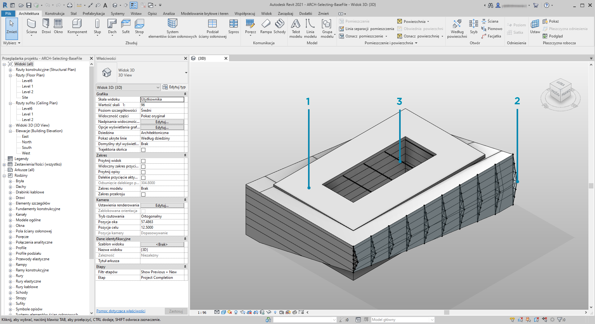

> Ten plik przykładowy programu Revit zawiera trzy typy elementów prostego budynku. Użyjemy tego przykładu do wybierania elementów programu Revit w kontekście hierarchii programu Revit:

> 1. Bryła budynku
2. Kratownice (komponenty adaptacyjne)
3. Belki (ramy konstrukcyjne)

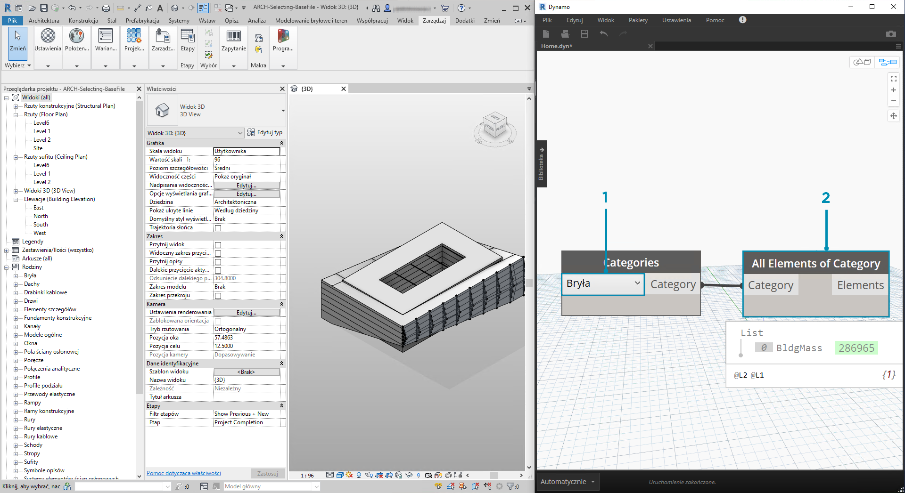

> Jakie wnioski można wyciągnąć z elementów aktualnie widocznych w widoku projektu programu Revit? Do jakiego poziomu hierarchii musimy dojść, aby wybrać odpowiednie elementy? To zadanie będzie oczywiście bardziej złożone podczas pracy nad dużym projektem. Dostępnych jest wiele opcji: można wybierać elementy według kategorii, poziomów, rodzin, wystąpień i tak dalej.

> 1. Ponieważ pracujemy z podstawową konfiguracją, wybierzmy bryłę budynku, wybierając opcję *„Mass”* z menu rozwijanego w węźle Categories. Można go znaleźć na karcie Revit>Selection.
2. Wynikiem kategorii Mass jest sama ta kategoria. Musimy wybrać elementy. W tym celu użyjemy węzła *„All Elements of Category”*.

Na tym etapie można zauważyć, że w dodatku Dynamo nie widać żadnej geometrii. Wybraliśmy element programu Revit, ale nie przekonwertowaliśmy go na geometrię dodatku Dynamo. To ważne rozróżnienie. Wybierając dużą liczbę elementów, nie chcesz wyświetlać ich wszystkich w dodatku Dynamo, ponieważ spowolniłoby to działanie programu. Dodatek Dynamo jest narzędziem umożliwiającym zarządzanie projektem programu Revit bez konieczności wykonywania operacji na geometrii. Przyjrzymy się temu w następnej sekcji tego rozdziału.

W tym przypadku pracujemy z prostą geometrią, dlatego włączymy jej podgląd w dodatku Dynamo. Obok elementu „BldgMass” w powyższym węźle Watch znajduje się zielony numer*. Oznacza on identyfikator elementu i informuje, że jest to element programu Revit, a nie geometria dodatku Dynamo. Następnym krokiem jest przekształcenie tego elementu programu Revit w geometrię dodatku Dynamo.

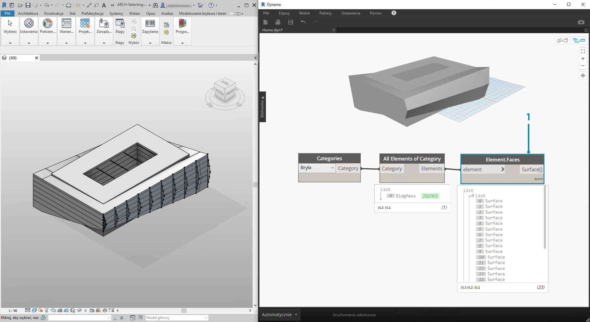

> 1. Po użyciu węzła *Element. Faces* otrzymujemy listę powierzchni reprezentujących poszczególne ściany bryły programu Revit. Teraz można wyświetlić geometrię w rzutni Dynamo i odwoływać się do tych ścian w celu wykonania operacji parametrycznych.

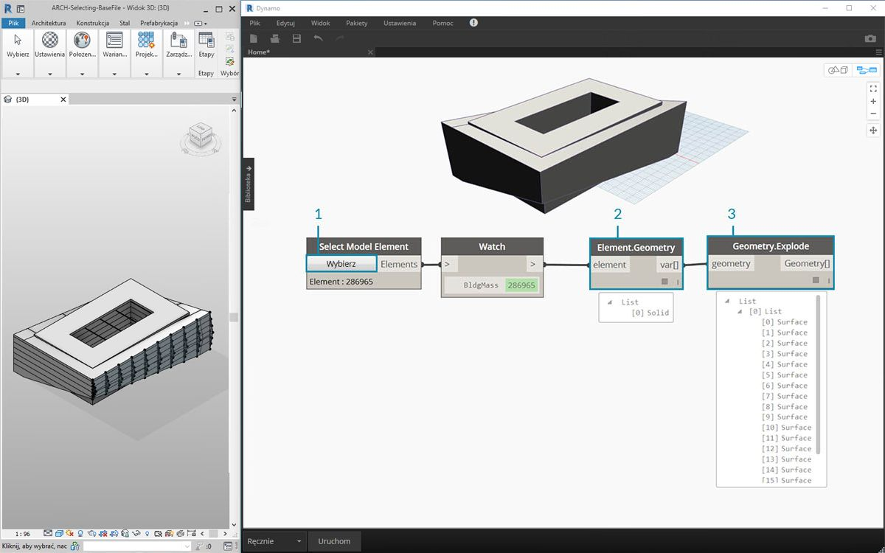

> Oto alternatywna metoda. W tym przypadku zamiast wybierać za pomocą hierarchii programu Revit *(„All Elements of Category”)*, będziemy jawnie wybierać geometrię w programie Revit.

> 1. W węźle *„Select Model Element”* kliknij przycisk *„select”*(lub *„change”*). W rzutni programu Revit wybierz żądany element. W tym przypadku wybieramy bryłę budynku.
2. Zamiast węzła *Element.Faces* można użyć węzła *Element.Geometry*, aby wybrać całą bryłę jako jedną geometrię. Spowoduje to wybranie całej geometrii zawartej w tej bryle.
3. Używając węzła *Geometry.Explode*, można ponownie otrzymać listę powierzchni. Te dwa węzły działają tak samo jak węzeł *Element.Faces*, ale oferują alternatywne opcje wybierania geometrii elementu programu Revit.

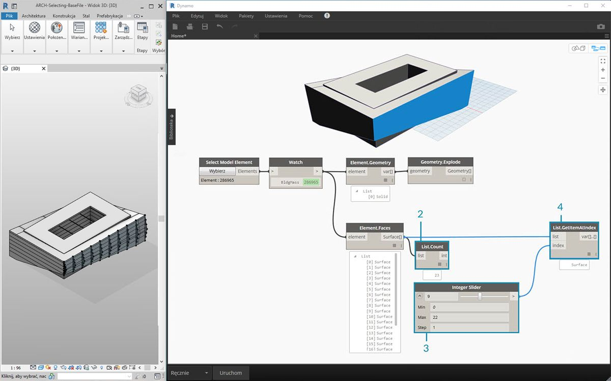

> 1. Za pomocą podstawowych operacji listy można utworzyć zapytanie o interesującą nas ścianę.
2. Po pierwsze w węźle *List.Count* widzimy, że pracujemy z 23 powierzchniami w ramach bryły.
3. Zgodnie z tą liczbą zmieniamy maksymalną wartość w węźle *Integer Slider *na *22*.
4. W węźle *List.GetItemAtIndex* wprowadzamy listy oraz łączymy węzeł *Integer Slider *z elementem *index*. Na suwaku zmieniamy wybrany element, zatrzymując się po przejściu do *indeksu 9* i wyizolowaniu głównej fasady z kratownicami.

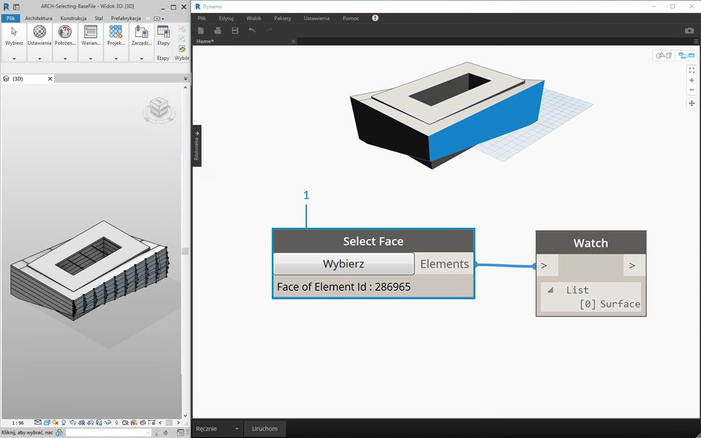

> 1. Poprzedni krok był mało wydajny. Możemy to zrobić znacznie szybciej, korzystając z węzła *„Select face”*. Dzięki temu można wyizolować ścianę, która sama nie jest elementem w projekcie programu Revit. Wykonujemy takie samo działanie jak w przypadku węzła *„Select Model Element”*, z tym że wybieramy powierzchnię, a nie cały element.


> Załóżmy, że chcemy wyizolować główne ściany fasadowe budynku. W tym celu można użyć węzła *„Select Faces”*. Kliknij przycisk „Select”, a następnie wybierz cztery główne fasady w programie Revit.

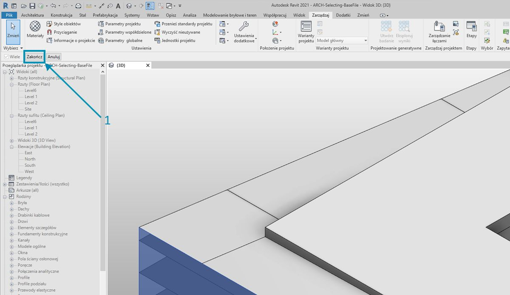

> 1. Po wybraniu czterech ścian pamiętaj, aby kliknąć przycisk *„Finish”* w programie Revit.

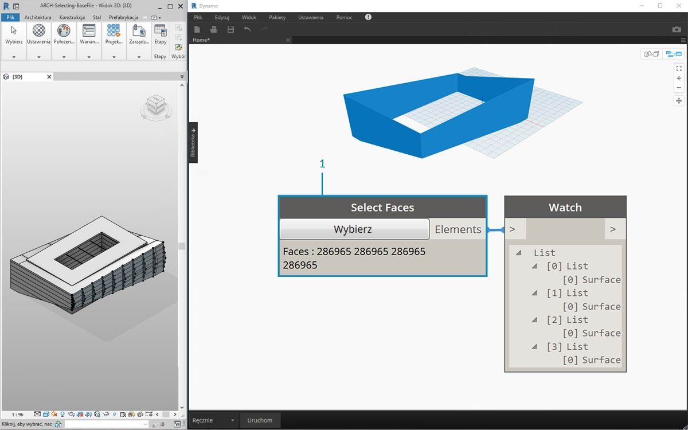

> 1. Ściany zostały teraz zaimportowane do dodatku Dynamo jako powierzchnie.

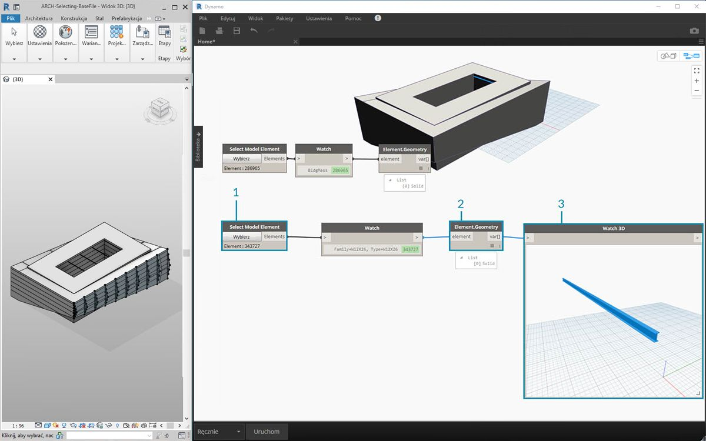

> 1. Spójrzmy teraz na belki nad atrium. Za pomocą węzła *„Select Model Element”* wybierz jedną z belek.
2. Połącz element belki z węzłem *Element.Geometry*, aby wyświetlić belkę w rzutni dodatku Dynamo.
3. Można powiększyć geometrię za pomocą węzła *Watch 3D* (jeśli belka nie jest widoczna w widoku 3D, kliknij prawym przyciskiem myszy i wybierz polecenie „Dopasuj do okna”).

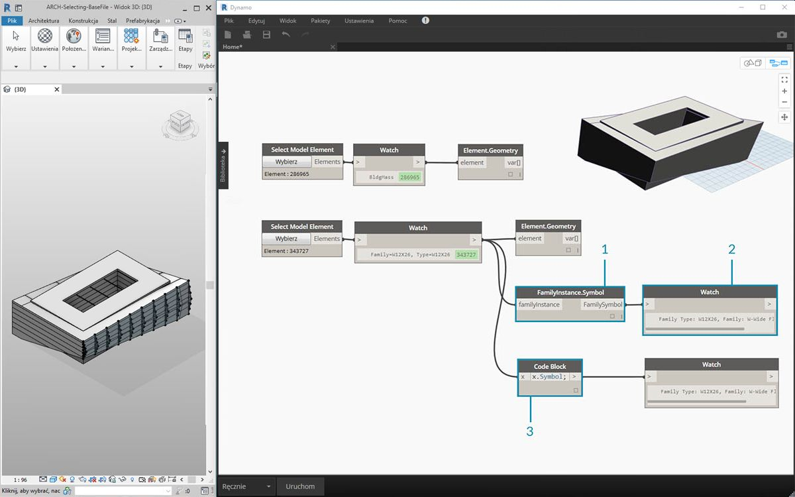

> Częste pytanie w procesach roboczych Revit/Dynamo brzmi: jak wybrać jeden element i otrzymać wszystkie podobne elementy? Ponieważ wybrany element programu Revit zawiera wszystkie informacje o hierarchii, można użyć zapytania o typ rodziny i wybrać wszystkie elementy tego typu.

> 1. Połącz element belki z węzłem *FamilyInstance.Symbol**.
2. W węźle *Watch* widać, że wynik to teraz symbol rodziny, a nie element programu Revit.
3. *FamilyInstance.Symbol* to proste zapytanie, więc możemy równie łatwo użyć bloku kodu z poleceniem ```x.Symbol;```, aby uzyskać takie same wyniki.

**Uwaga — symbol rodziny w terminologii interfejsu API programu Revit oznacza typ rodziny. Ze względu na możliwość nieporozumienia zostanie to zaktualizowane w kolejnych wersjach.*

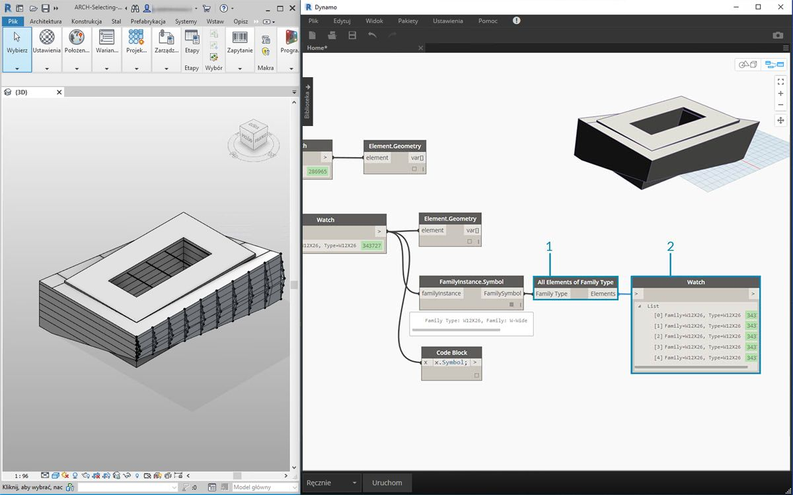

> 1. Aby wybrać pozostałe belki, należy użyć węzła *„All Elements of Family Type”*.
2. W węźle Watch widać, że wybraliśmy pięć elementów programu Revit.

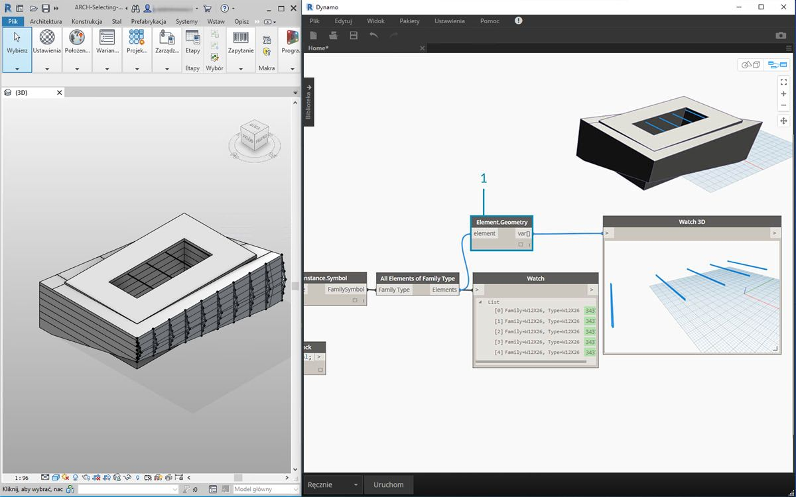

> 1. Można również przekonwertować wszystkie pięć elementów na geometrię dodatku Dynamo.

A co jeśli mamy 500 belek? Konwertowanie wszystkich tych elementów na geometrię dodatku Dynamo trwałoby bardzo długo. Jeśli w dodatku Dynamo obliczanie węzłów trwa zbyt długo, można użyć funkcji zablokowania węzła, aby wstrzymać wykonywanie operacji programu Revit podczas tworzenia wykresu. Aby uzyskać więcej informacji na temat blokowania węzłów, zobacz sekcję „Blokowanie” w [rozdziale poświęconym bryłom](../05_Geometry-for-Computational-Design/5-6_solids.md#freezing).

Czy importując 500 belek, potrzebujemy wszystkich powierzchni do wykonania zamierzonej operacji parametrycznej? Czy możemy wyodrębnić podstawowe informacje z belek i wykonać zadania generacyjne z użyciem podstawowej geometrii? To pytanie, które będziemy mieć na uwadze w dalszej części tego rozdziału. Przyjrzyjmy się na przykład układowi kratownic:

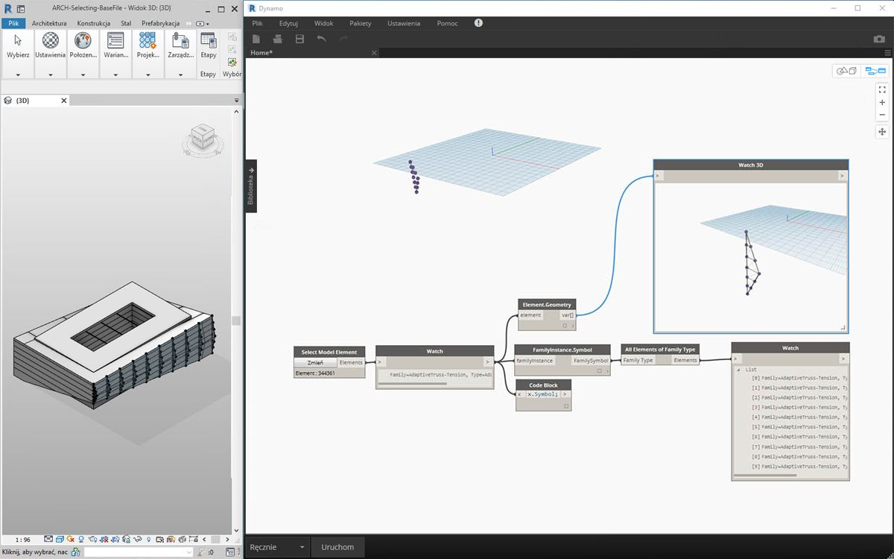

> Używając tego samego wykresu węzłów, wybierz element kratownicy zamiast elementu belki. Przed wykonaniem tej czynności usuń węzeł Element.Geometry z poprzedniego kroku.

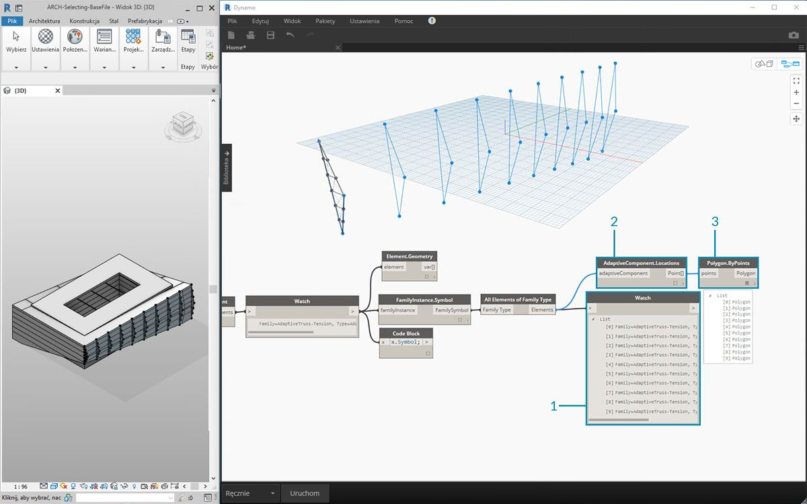

> 1. W węźle *Watch* widać, że otrzymaliśmy listę komponentów adaptacyjnych wybranych z programu Revit. Chcemy wyodrębnić podstawowe informacje, dlatego zaczniemy od punktów adaptacyjnych.
2. Połącz węzeł *„All Elements of Family Type”* z węzłem *„AdaptiveComponent.Location”*. Otrzymamy listę list, z których każda zawiera trzy punkty reprezentujące położenie punktów adaptacyjnych.
3. Po połączeniu z węzłem *„Polygon.ByPoints”* otrzymamy krzywą PolyCurve. Widać to w rzutni dodatku Dynamo. Za pomocą tej metody zwizualizowaliśmy geometrię jednego elementu i wyabstrahowaliśmy geometrię pozostałych elementów (których może być więcej niż w tym przykładzie).

**Wskazówka: po kliknięciu zielonego numeru elementu programu Revit w dodatku Dynamo ten element zostanie powiększony w rzutni programu Revit.*

