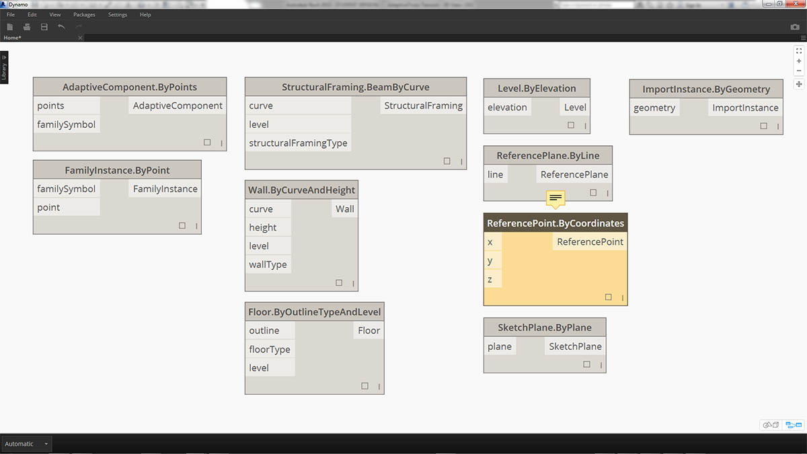
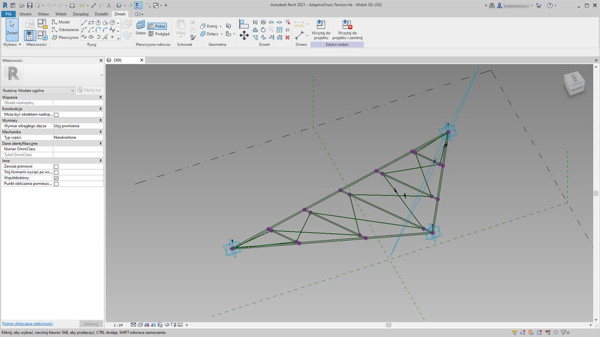
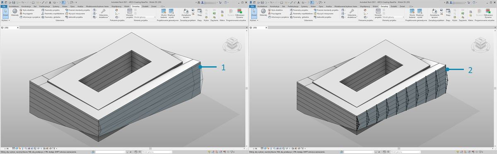
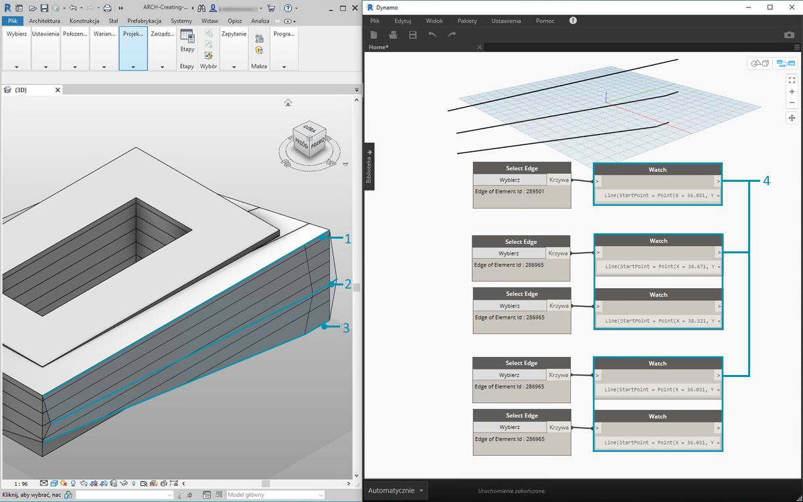
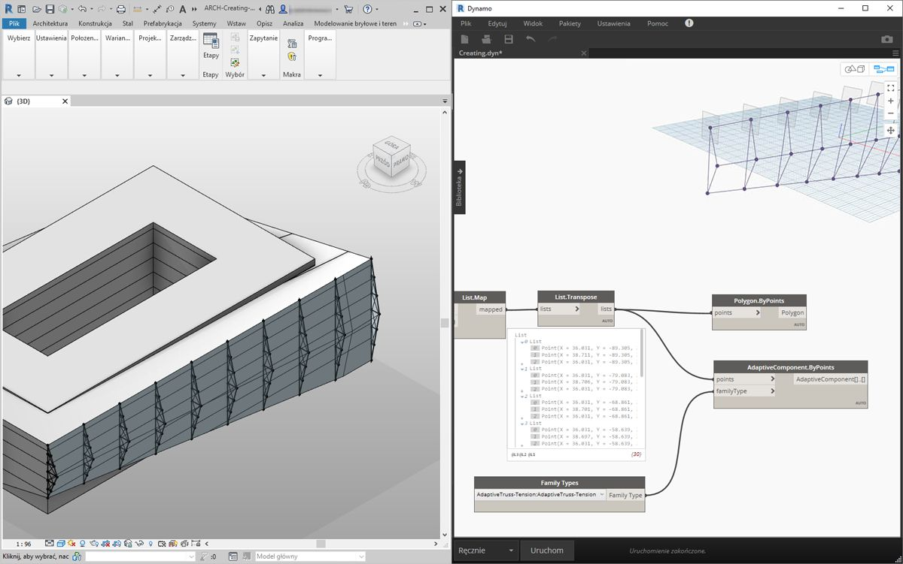
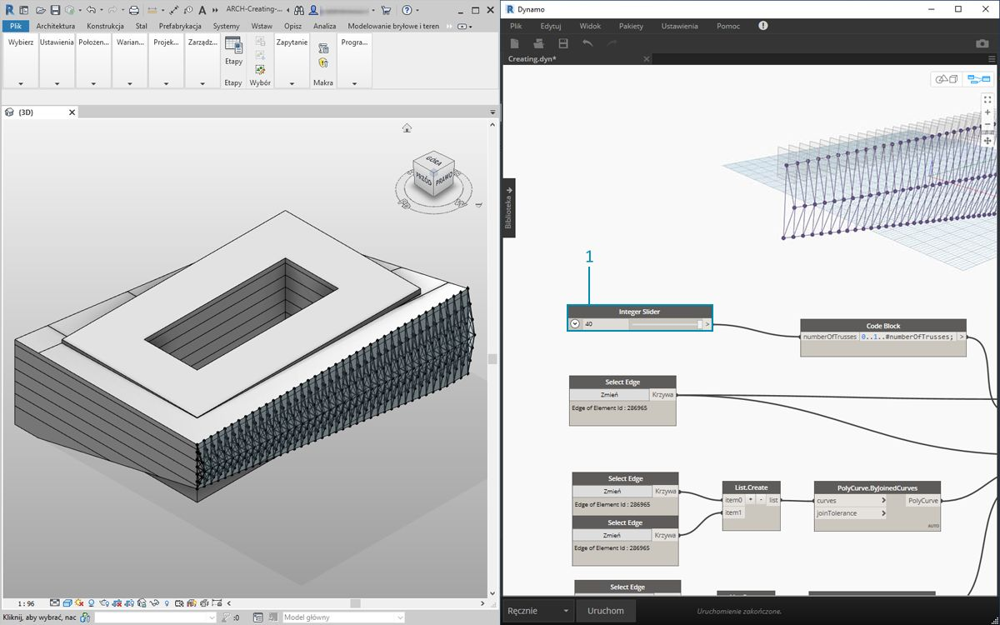
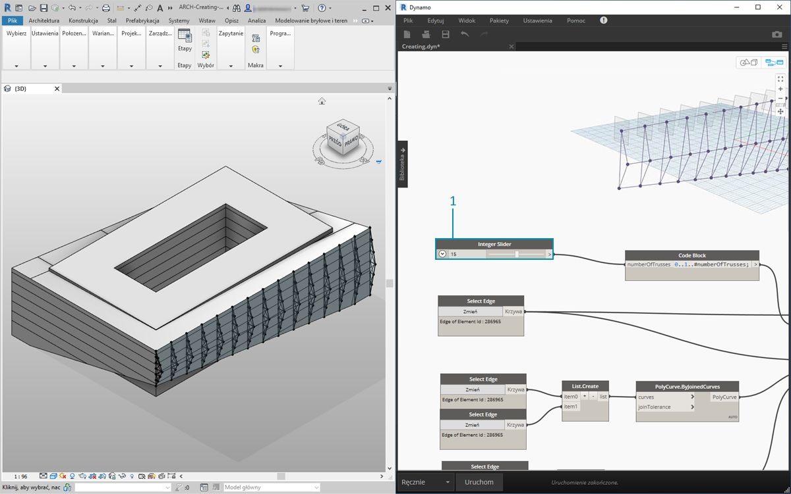
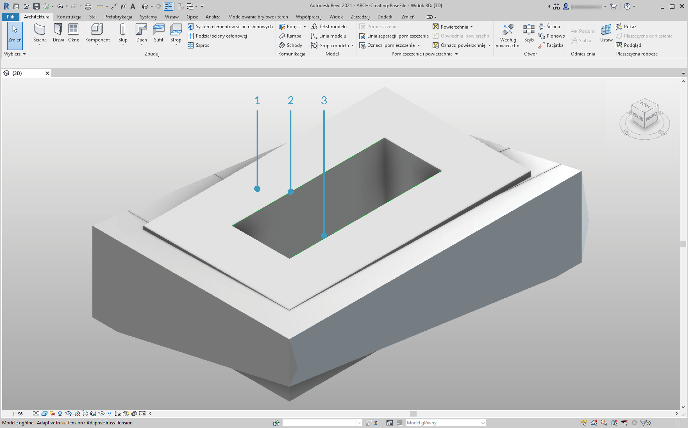
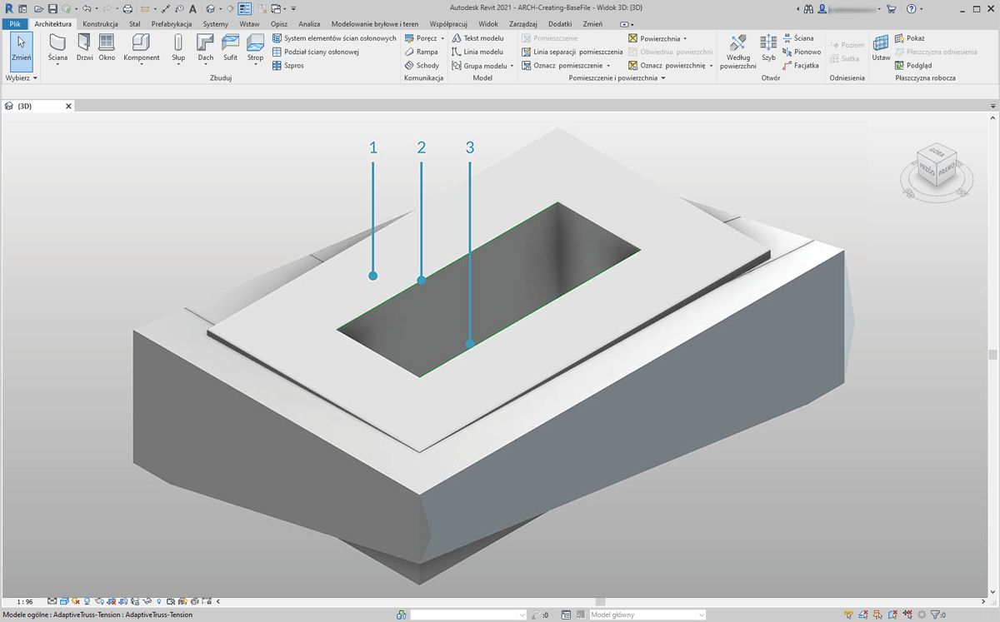
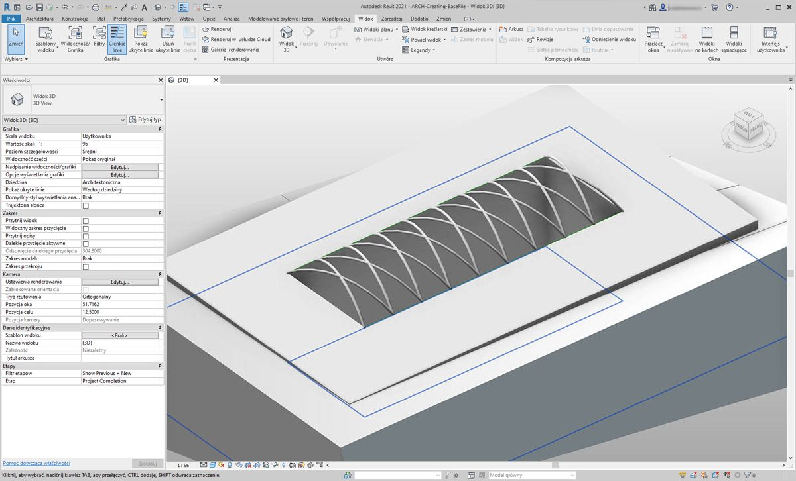

## Tworzenie

W dodatku Dynamo można utworzyć tablicę elementów programu Revit z zachowaniem pełnej kontroli parametrycznej. Węzły programu Revit w dodatku Dynamo umożliwiają importowanie elementów z geometrii ogólnych do kategorii określonych typów (takich jak ściany czy stropy). W tej sekcji skoncentrujemy się na importowaniu elementów o elastycznych parametrach przy użyciu komponentów adaptacyjnych.



### Komponenty adaptacyjne

Komponent adaptacyjny to elastyczna kategoria rodzin, która jest przydatna do generowania elementów. Podczas utworzeniu wystąpienia można utworzyć element złożony geometrycznie, który zależy od podstawowej lokalizacji punktów adaptacyjnych.



> Przykład komponentu adaptacyjnego o trzech punktach w edytorze rodzin. Zostanie wygenerowana kratownica zależąca od położenia poszczególnych punktów adaptacyjnych. W poniższym ćwiczeniu użyjemy tego komponentu, aby wygenerować serię kratownic wzdłuż fasady.

#### Zasady zgodności operacyjnej

Komponent adaptacyjny stanowi dobry przykład wzorców postępowania w zakresie zgodności operacyjnej. Możemy utworzyć tablicę komponentów adaptacyjnych, definiując podstawowe punkty adaptacyjne. Następnie wystarczy przesłać te proste dane do innych programów, aby zawrzeć w nich całą geometrię. Na podobnych zasadach działa importowanie i eksportowanie w przypadku programów takich jak Excel.

Załóżmy, że doradca zajmujący się fasadą pyta o lokalizację kratownic, ale nie musi przetwarzać ich całej geometrii. Podczas przygotowań do produkcji doradca może sprawdzić lokalizację punktów adaptacyjnych, aby wygenerować geometrię w programie takim jak Inventor.

W poniższym przykładzie przygotujemy proces roboczy, który umożliwi uzyskanie dostępu do wszystkich tych danych podczas opracowywania definicji na potrzeby tworzenia elementów w programie Revit. Taki proces roboczy płynnie łączy etapy koncepcyjne, dokumentacji i produkcji. Proces jest inteligentny i efektywny, co gwarantuje spójność operacyjną.

#### Wiele elementów i list


W poniższym ćwiczeniu omówimy sposób, w jaki dodatek Dynamo odnosi się do danych na potrzeby tworzenia elementów Revit. Aby wygenerować wiele komponentów adaptacyjnych, zdefiniujemy listę list, na której każda lista ma trzy punkty reprezentujące komponent adaptacyjny. Będziemy z tego korzystać podczas zarządzania strukturami danych w dodatku Dynamo.

### Ćwiczenie

> Pobierz pliki przykładowe do tego ćwiczenia (kliknij prawym przyciskiem myszy i wybierz polecenie Zapisz element docelowy jako). Pełna lista plików przykładowych znajduje się w załączniku.

> 1. [Creating.dyn](datasets/8-4/Creating.dyn)
2. [ARCH-Creating-BaseFile.rvt](datasets/8-4/ARCH-Creating-BaseFile.rvt)



> Jeśli zaczniemy tę sekcję przy użyciu przykładowego pliku lub będziemy kontynuować pracę z plikiem programu Revit z poprzedniej sekcji, otrzymamy tę samą bryłę w programie Revit.

> 1. Tak wygląda plik po otwarciu.
2. To jest system kratownic utworzony w dodatku Dynamo i połączony inteligentnie z bryłą programu Revit.



> Użyliśmy węzłów *Select Model Element* i *Select Face*, a teraz wykonamy kolejny krok w hierarchii geometrii: użyjemy węzła *Select Edge*. Gdy moduł obliczeń dodatku Dynamo jest ustawiony do pracy *automatycznej*, wykres jest w sposób ciągły aktualizowany o zmiany wprowadzone w pliku programu Revit. Wybrana krawędź jest dynamicznie powiązana z topologią elementu programu Revit. O ile topologia* nie ulegnie zmianie, połączenie między programem Revit a dodatkiem Dynamo pozostanie aktywne.

> 1. Wybierz skrajną górną krzywą przeszklonej fasady. Biegnie ona przez całą długość budynku. W przypadku problemów z wybraniem krawędzi pamiętaj, aby ustalić zaznaczenie w programie Revit przez ustawienie wskaźnika na krawędzi i naciskanie klawisza *Tab* do momentu podświetlenia właściwej krawędzi.
2. Przy użyciu dwóch węzłów *Select Edge* wybierz każdą z krawędzi odpowiadających ścięciu na środku fasady.
3. Zrób to samo w przypadku dolnych krawędzi fasady w programie Revit.
4. Węzły *Watch* wskazują, że powstały linie w dodatku Dynamo. Są one automatycznie konwertowane na geometrię dodatku Dynamo, gdyż same krawędzie nie są elementami programu Revit. Te krzywe stanowią odniesienia, przy użyciu których utworzymy wystąpienia kratownic adaptacyjnych wzdłuż fasady.

** Aby zachować spójność topologii, odnosimy się do modelu, do którego nie dodano dodatkowych powierzchni ani krawędzi. Choć parametry mogą zmienić jego kształt, jego podstawowa konstrukcja nie ulega zmianie.*


> Najpierw musimy połączyć krzywe i scalić je w jedną listę. W ten sposób *zgrupujemy* krzywe, aby wykonywać operacje na geometrii.

> 1. Utwórz listę dwóch krzywych na środku fasady.
2. Połącz te krzywe w krzywą złożoną, łącząc komponent *List.Create* z węzłem *Polycurve.ByJoinedCurves*.
3. Utwórz listę dwóch krzywych na dole fasady.
4. Połącz te krzywe w krzywą złożoną, łącząc komponent *List.Create* z węzłem *Polycurve.ByJoinedCurves*.
5. Na koniec połącz trzy krzywe główne (linię i dwie krzywe złożone) w jedną listę.


> Chcemy wykorzystać krzywą górną, która jest linią i reprezentuje całą długość fasady. Utworzymy wzdłuż tej linii płaszczyzny przecinające się z zestawem krzywych zgrupowanych na liście.

> 1. W *bloku kodu* zdefiniuj zakres, używając składni: ```0..1..liczbaKratownic;```.
2. Połącz węzeł *Integer Slider* z wejściem bloku kodu. Oczywiście odpowiada on liczbie kratownic. Od suwaka zależy liczba elementów w zakresie od *0* do *1*.
3. Połącz *blok kodu* z wejściem *param* (parametr) węzła *Curve.PlaneAtParameter* i połącz górną krawędź z wejściem *curve*. Uzyskamy w ten sposób dziesięć płaszczyzn równomiernie rozłożonych wzdłuż całej fasady.


> Płaszczyzna jest abstrakcyjną częścią geometrii, która reprezentuje nieskończoną przestrzeń dwuwymiarową. Płaszczyzny ułatwią nam tworzenie warstwic i przecięć potrzebnych w tym kroku.

> 1. Przy użyciu węzła *Geometry.Intersect* (zauważ skratowanie oparte na iloczynie kartezjańskim) połącz węzeł *Curve.PlaneAtParameter* z wejściem *entity* (element) węzła *Geometry.Intersect*. Połącz główny węzeł *List.Create* z wejściem *geometry* (geometria). W rzutni dodatku Dynamo widać teraz punkty reprezentujące przecięcia poszczególnych krzywych ze zdefiniowanymi płaszczyznami.


> Dane wyjściowe stanowią listę list list. To zbyt wiele list na nasze potrzeby. Chcemy częściowo spłaszczyć tę strukturę. Musimy przejść o krok w dół na liście i spłaszczyć wynik. Aby to zrobić, użyjemy operacji *List.Map*, którą omówiono w rozdziale tego elementarza dotyczącym list.

> 1. Połącz węzeł *Geometry.Intersect* z wejściem listy węzła *List.Map*.
2. Połącz węzeł *Flatten* z wejściem f(x) węzła *List.Map*. W wyniku otrzymamy trzy listy, z których każda zawiera tyle elementów, ile jest kratownic.
3. Musimy zmienić te dane. Aby utworzyć wystąpienie kratownicy, potrzebna jest taka sama liczba punktów adaptacyjnych, jaką zdefiniowano w rodzinie. To jest komponent adaptacyjny o trzech punktach, dlatego zamiast trzech list po 10 elementów (liczba kratownic), potrzebujemy 10 list po trzy elementy. W ten sposób możemy utworzyć 10 komponentów adaptacyjnych.
4. Połącz węzeł *List.Map* z węzłem *List.Transpose*. Teraz otrzymaliśmy oczekiwane dane wyjściowe.
5. Aby sprawdzić, czy dane są prawidłowe, dodaj węzeł *Polygon.ByPoints* do obszaru projektowania i porównaj wartości z podglądem dodatku Dynamo.


> Komponenty adaptacyjne umieścimy w tablicy w taki sam sposób jak podczas tworzenia wielokątów.

> 1. Dodaj do obszaru projektowania węzeł *AdaptiveComponent.ByPoints* i połącz węzeł *List.Transpose* z jego wejściem *points* (punkty).
2. Przy użyciu węzła *Family Types* wybierz rodzinę *AdaptiveTruss* i połącz ją z wejściem *familySymbol* (symbol rodziny) węzła *AdaptiveComponent.ByPoints*.



> W programie Revit widać, że powstało dziesięć kratownic równomiernie rozłożonych wzdłuż fasady.



> 1. Aby wypróbować możliwości wykresu, zwiększymy *liczbę kratownic* do *40* przy użyciu *suwaka*. Powstaje wiele kratownic. Nie jest to realistyczne, ale wiemy, że działa połączenie parametryczne.



> 1. Aby nie przeciążać układu kratownic, użyjemy wartości kompromisowej *15* jako *liczby kratownic*.


> Jako ostatni test wybierzemy bryłę w programie Revit i zmienimy parametry wystąpienia, aby zmodyfikować kształt budynku i sprawdzić, czy kratownice za nim podążają. Aby aktualizacja była widoczna, ten wykres dodatku Dynamo musi być widoczny. Jego zamknięcie powoduje zerwanie połączenia.

### Elementy kształtów bezpośrednich

Inną metodą importowania geometrii parametrycznej z dodatku Dynamo do programu Revit jest zastosowanie kształtów bezpośrednich. Element kształtu bezpośredniego i powiązane z nim klasy umożliwiają przechowywanie w dokumencie programu Revit kształtów geometrycznych, które utworzono w innym oprogramowaniu. Taka geometria może obejmować bryły zamknięte i siatki. Kształty bezpośrednie są przede wszystkim przeznaczone do importowania kształtów z innych formatów danych, takich jak IFC lub STEP, które nie zawierają informacji wystarczających do utworzenia kompletnego elementu programu Revit. Podobnie jak w przypadku procesu roboczego związanego z plikami IFC i STEP, kształty bezpośrednie dobrze działają w przypadku importowania geometrii utworzonych w dodatku Dynamo jako rzeczywistych elementów projektów do programu Revit.

Omówimy i przećwiczymy importowanie geometrii z dodatku Dynamo jako kształtu bezpośredniego do projektu programu Revit. Przy użyciu tej metody możemy przypisać kategorię, materiał i nazwę do importowanej geometrii — zachowując przy tym połączenie parametryczne z wykresem w programie Dynamo.

### Ćwiczenie

> Pobierz pliki przykładowe do tego ćwiczenia (kliknij prawym przyciskiem myszy i wybierz polecenie Zapisz element docelowy jako). Pełna lista plików przykładowych znajduje się w załączniku.

> 1. [DirectShape.dyn](datasets/8-4/DirectShape.dyn)
2. [ARCH-DirectShape-BaseFile.rvt](datasets/8-4/ARCH-DirectShape-BaseFile.rvt)



> Zacznij od otwarcia pliku przykładowego do tej lekcji: ARCH-DirectShape-BaseFile.rvt.

> 1. W widoku 3D widać bryłę budynku z poprzedniej lekcji.
2. Wzdłuż krawędzi atrium istnieje jedna krzywa odniesienia. Użyjemy jej jako odniesienia w dodatku Dynamo.
3. Wzdłuż przeciwnej krawędzi atrium znajduje się kolejna krzywa odniesienia. Również jej użyjemy w dodatku Dynamo.


> 1. Aby uzyskać odniesienie do tej geometrii w dodatku Dynamo, dla każdego elementu z programu Revit użyjemy węzła *Select Model Element*. Wybierz bryłę w programie Revit i zaimportuj geometrię do dodatku Dynamo przy użyciu węzła *Element.Faces*. Bryła powinna teraz być widoczna w podglądzie dodatku Dynamo.
2. Zaimportuj krzywą odniesienia do dodatku Dynamo, używając węzłów *Select Model Element* i *CurveElement.Curve*.
3. Zaimportuj drugą krzywą odniesienia do dodatku Dynamo, używając węzłów *Select Model Element* i *CurveElement.Curve*.


> 1. Oddalenie widoku wykresu przykładowego i przesunięcie w prawo pozwoli zobaczyć grupę węzłów. Są to operacje geometryczne, które generują konstrukcję kratownic dachu widoczną w podglądzie programu Dynamo. Te węzły działają w oparciu o funkcję *konwersji węzłów na kod* omówioną w [sekcji dotyczącej bloków kodu](../07_Code-Block/7-2_Design-Script-syntax.md#Node) w tym elementarzu.
2. Struktura zależy od trzech głównych parametrów: przesunięcia po przekątnej, ugięcia i promienia.


> Powiększ wykres i przyjrzyj się jego parametrom. Możemy je dostosować, aby uzyskać różnorodną geometrię.



> 1. Po upuszczeniu na obszar projektowania węzła *DirectShape.ByGeometry* widzimy, że ma on cztery wejścia: **geometry, category, material** i **name** (geometria, kategoria, materiał i nazwa).
2. Geometria to bryła utworzona w części wykresu dotyczącej generowania geometrii.
3. Wejście kategorii można wybrać przy użyciu węzła rozwijanego *Categories*. W tym przypadku będzie to „Ramy konstrukcyjne”.
4. Wejście materiału można wybrać przy użyciu tablicy węzłów powyżej. W tym przypadku wystarczy ustawić opcję Domyślne.



> Po uruchomieniu dodatku Dynamo wróciliśmy do programu Revit i zaimportowaliśmy geometrię do stropu naszego projektu. To jest element ramy konstrukcyjnej, a nie model ogólny. Połączenie parametryczne z dodatkiem Dynamo pozostaje zachowane.

