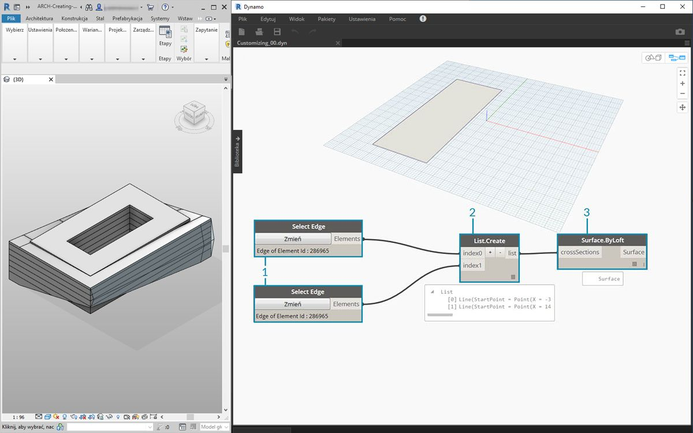
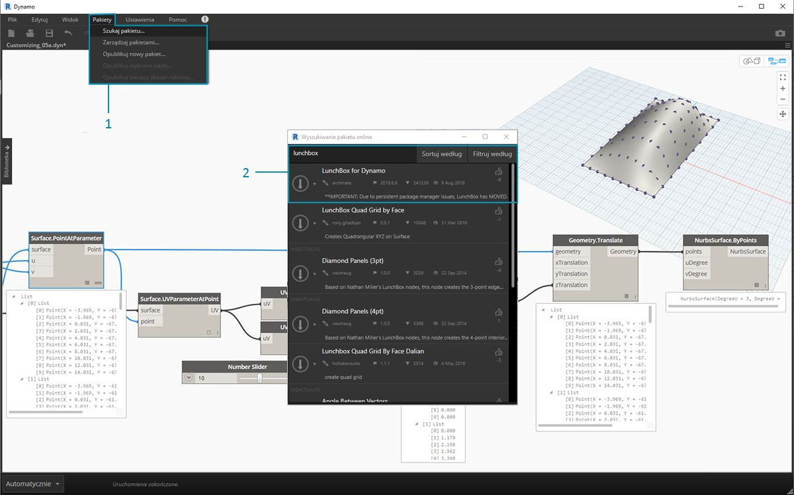
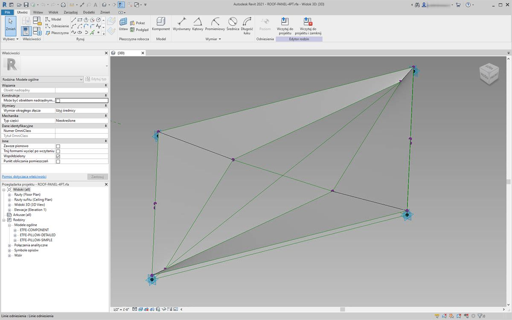
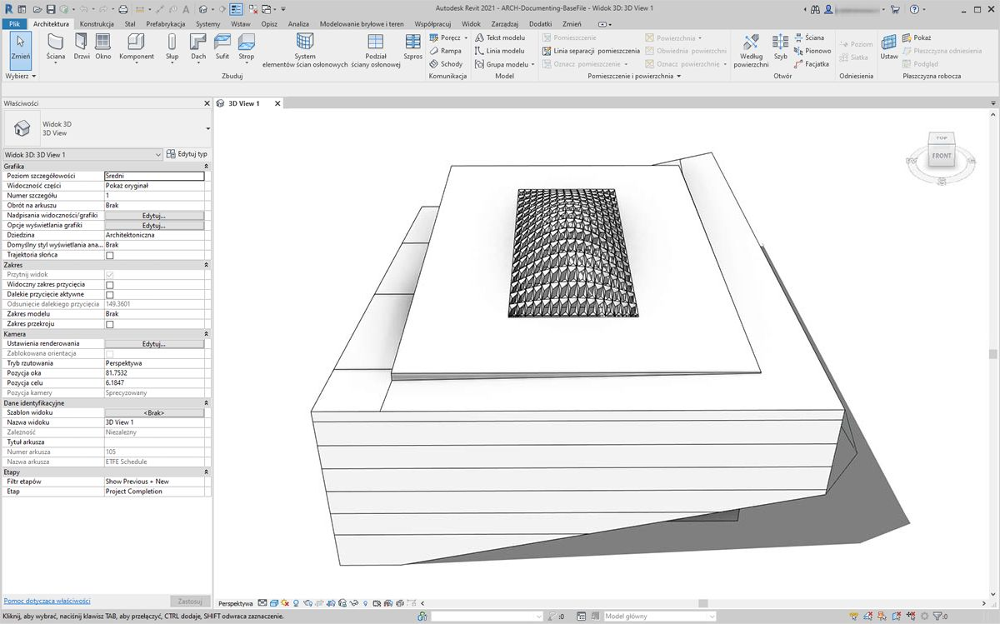
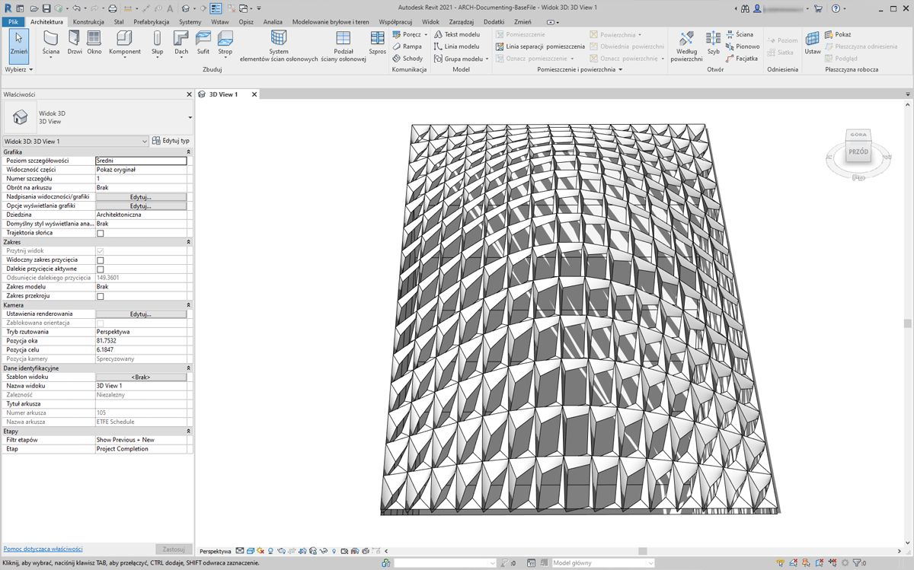
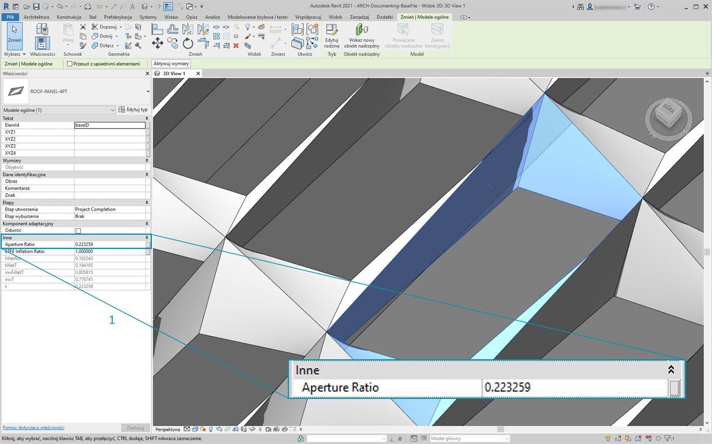
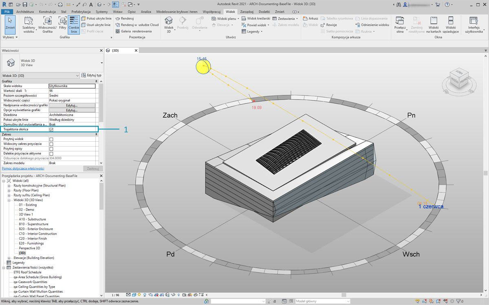
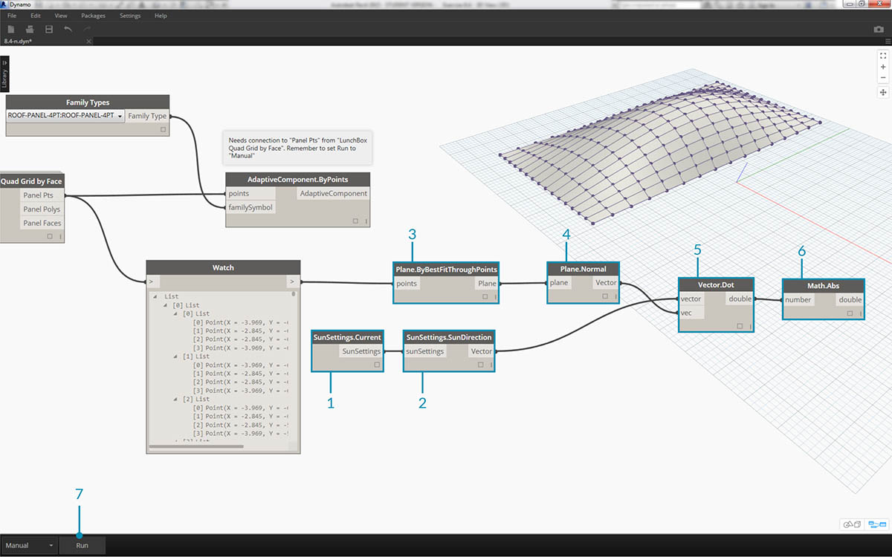
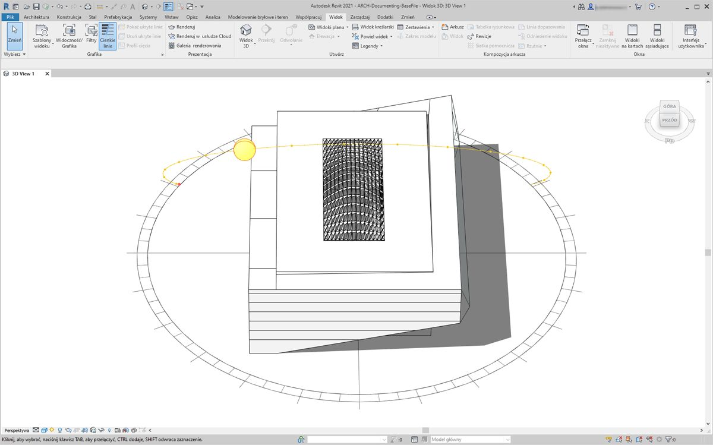
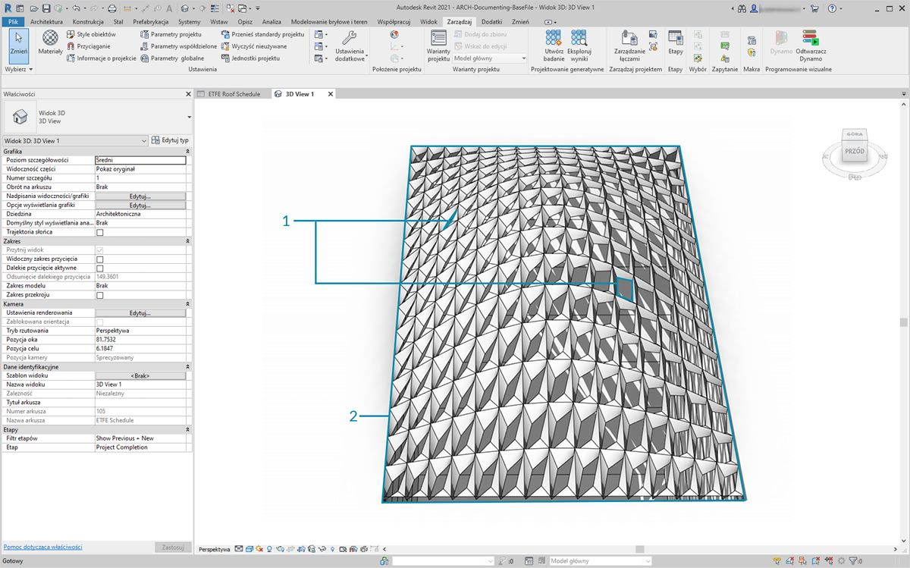

## Dostosowywanie

Poprzednio omówiliśmy edycję podstawowej bryły budynku, a teraz dokładniej poznamy współdziałanie rozwiązań Dynamo/Revit, edytując dużą liczbę elementów jednocześnie. Dostosowywanie na dużą skalę jest bardziej złożone, ponieważ struktury danych wymagają bardziej zaawansowanych operacji na listach. Podstawowe zasady dotyczące ich wykonania są jednak zasadniczo takie same. Poznajmy kilka możliwości analizy na podstawie zestawu komponentów adaptacyjnych.

#### Położenie punktu

Załóżmy, że utworzyliśmy zakres komponentów adaptacyjnych, a teraz chcemy edytować parametry w oparciu o położenia punktów. Te punkty mogą na przykład sterować parametrem grubości, powiązanym z powierzchnią elementu. Mogą też sterować parametrem nieprzezroczystości, powiązanym z ekspozycją na słońce w ciągu roku. Dodatek Dynamo umożliwia połączenie analiz z parametrami w kilku prostych krokach. W poniższym ćwiczeniu poznamy podstawowy wariant.


> Wykonaj zapytanie o punkty adaptacyjne wybranego komponentu adaptacyjnego za pomocą węzła *AdaptiveComponent.Locations*. Dzięki temu możemy użyć abstrakcyjnej wersji elementu programu Revit do analizy.

Wyodrębniając położenie punktów komponentów adaptacyjnych, można wykonać wiele analiz dotyczących elementu. Komponent adaptacyjny z czterema punktami umożliwia na przykład zbadanie odchylenia danego panelu od płaszczyzny.

#### Analiza kierunku oświetlenia naturalnego


> Użyj ponownego odwzorowania, aby odwzorować zbiór danych w zakresie parametrów. Jest to podstawowe narzędzie używane w modelu parametrycznym, a jego działanie pokazano w poniższym ćwiczeniu.

W dodatku Dynamo można użyć położenia punktów komponentów adaptacyjnych do utworzenia najlepiej dopasowanej płaszczyzny dla każdego elementu. Można również wykonać zapytanie o położenie słońca w pliku programu Revit i zbadać orientację tej płaszczyzny względem słońca w porównaniu z innymi komponentami adaptacyjnymi. Ustawimy to w poniższym ćwiczeniu, tworząc algorytmiczny dach.

### Ćwiczenie

> Pobierz pliki przykładowe do tego ćwiczenia (kliknij prawym przyciskiem myszy i wybierz polecenie Zapisz element docelowy jako). Pełna lista plików przykładowych znajduje się w Załączniku.

> 1. [Customizing.dyn](datasets/8-5/Customizing.dyn)
2. [ARCH-Customizing-BaseFile.rvt](datasets/8-5/ARCH-Customizing-BaseFile.rvt)

To ćwiczenie przedstawia rozszerzenie technik omówionych w poprzedniej sekcji. W tym przypadku definiujemy powierzchnię parametryczną na podstawie elementów programu Revit, tworząc wystąpienia czteropunktowych komponentów adaptacyjnych, a następnie edytując je na podstawie orientacji względem słońca.



> 1. Najpierw wybierzemy dwie krawędzie, używając węzła *„Select Edge”*. Te dwie krawędzie to długie boki atrium.
2. Połącz te dwie krawędzie w jedną listę, używając węzła *List.Create*.
3. Utwórz powierzchnię między dwiema krawędziami za pomocą węzła *Surface.ByLoft*.


> 1. Używając węzła *Code Block*, zdefiniuj zakres od 0 do 1 z 10 wartościami w równych odstępach: ```0..1..#10;```
2. Połącz węzeł *Code Block* z elementami wejściowymi *u* i *v* węzła *Surface.PointAtParameter*, a węzeł *Surface.ByLoft* z elementem wejściowym *surface*. Kliknij węzeł prawym przyciskiem myszy i zmień opcję *skratowania* na *Iloczyn wektorowy*. W ten sposób na powierzchni zostanie umieszczona siatka punktów.

Ta siatka punktów posłuży jako punkty sterujące dla powierzchni zdefiniowanej parametrycznie. Chcemy wyodrębnić położenia u i v każdego z tych punktów, aby można je było wstawić do wzoru parametrycznego i zachować tę samą strukturę danych. Można to zrobić za pomocą zapytania o położenia parametrów punktów, które właśnie utworzyliśmy.


> 1. Dodaj węzeł *Surface.ParameterAtPoint* do obszaru rysunku i połącz elementy wejściowe tak, jak pokazano powyżej.
2. Wykonaj zapytanie o wartości *u* tych parametrów, używając węzła *UV.U*.
3. Wykonaj zapytanie o wartości *v* tych parametrów, używając węzła *UV.V*.
4. Wyniki zawierają odpowiednie wartości *u* i *v* dla każdego punktu powierzchni. Teraz w odpowiedniej strukturze danych istnieje zakres od *0* do *1* dla każdej wartości, więc możemy zastosować algorytm parametryczny.


> 1. Dodaj węzeł *Code Block* do obszaru rysunku i wprowadź kod: ```Math.Sin(u*180)*Math.Sin(v*180)*w;``` Jest to funkcja parametryczna umożliwiająca utworzenie sinusoidalnego wzniesienia na podstawie płaskiej powierzchni.
2. Element wejściowy *u* łączy się z węzłem *UV.U*.
3. Element wejściowy *v* łączy się z węzłem *UV.V*.
4. Element wejściowy *w* oznacza *amplitudę* kształtu, dlatego należy dołączyć do niego węzeł *Number Slider*.


> 1. Otrzymaliśmy listę wartości zdefiniowaną przez algorytm. Użyjemy tej listy wartości, aby przesunąć punkty w górę w kierunku *+Z*. Używając węzła *Geometry.Translate*, połącz węzeł *Code Block *z elementem wejściowym *zTranslation*, a węzeł*Surface.PointAtParameter* z elementem wejściowym *geometry*. Nowe punkty powinny być widoczne w podglądzie dodatku Dynamo.
2. Na koniec utworzymy powierzchnię za pomocą węzła *NurbsSurface.ByPoints*, łącząc węzeł z poprzedniego kroku z elementem wejściowym „points”. Otrzymaliśmy powierzchnię parametryczną. Możesz przeciągnąć suwak, aby zobaczyć, jak wzniesienie zmniejsza się i rośnie.

Używając tej powierzchni parametrycznej, chcemy zdefiniować podział na panele w celu utworzenia szyku czteropunktowych komponentów adaptacyjnych. Dodatek Dynamo nie zawiera gotowej funkcji podziału powierzchni na panele, poszukamy więc przydatnych pakietów dodatku Dynamo w społeczności.



> 1. Przejdź do obszaru *Pakiety>Wyszukaj pakiet*
2. Wyszukaj *„LunchBox”* i pobierz pakiet *„LunchBox for Dynamo”*. To bardzo pomocny zestaw narzędzi do operacji geometrycznych takich jak ta.


> 1. Po pobraniu pakietu LunchBox masz do niego pełny dostęp. Wyszukaj *„Quad Grid”* i wybierz węzeł *„LunchBox Quad Grid By Face”*. Połącz powierzchnię parametryczną z elementem wejściowym *surface* i ustaw podziały *U* oraz *V* na *15*. W podglądzie dodatku Dynamo powinna być widoczna powierzchnia podzielona na czworokątne panele.


> Jeśli chcesz sprawdzić, jak powstała, możesz kliknąć dwukrotnie węzeł *Lunch Box*, aby to zobaczyć.



> Wróćmy do programu Revit i pokrótce omówmy komponent adaptacyjny, którego używamy. Nie wchodząc w szczegóły, jest to panel dachowy, którego wystąpienia utworzymy. Jest to czteropunktowy komponent adaptacyjny, z grubsza odzwierciedlający panel z ETFE. Wielkość otworu pośrodku określa parametr o nazwie *„ApertureRatio”*.


> 1. Za chwilę zostanie otworzonych wiele wystąpień geometrii w programie Revit, dlatego należy wybrać *„Ręczne”* rozwiązywanie w dodatku Dynamo.
2. Dodaj węzeł *Family Types* do obszaru rysunku i wybierz opcję *„ROOF-PANEL-4PT”*.
3. Dodaj węzeł *AdaptiveComponent.ByPoints* do obszaru rysunku i połącz element wyjściowy *Panel Pts* węzła *„LunchBox Quad Grid by Face”* z elementem wejściowym *points*. Połącz węzeł *Family Types* z elementem wejściowym *familySymbol*.
4. Kliknij przycisk *Uruchom*. Program Revit zacznie *przetwarzać* geometrię. Jeśli trwa to zbyt długo, zmniejsz liczbę *„15” w bloku kodu* na niższą. Spowoduje to zmniejszenie liczby paneli na dachu.

*Uwaga: jeśli w dodatku Dynamo obliczanie węzłów trwa zbyt długo, można użyć funkcji zablokowania węzła, aby wstrzymać wykonywanie operacji programu Revit podczas tworzenia wykresu. Aby uzyskać więcej informacji na temat blokowania węzłów, zobacz sekcję „Blokowanie” w [rozdziale poświęconym bryłom](../05_Geometry-for-Computational-Design/5-6_solids.md#freezing).*



> W programie Revit otrzymaliśmy szyk paneli na dachu.



> Po powiększeniu można dokładniej przyjrzeć się właściwościom powierzchni.

### Analiza



> 1. W dalszej części określimy wielkość otworu każdego panelu na podstawie jego ekspozycji na słońce. W programie Revit po powiększeniu i wybraniu jednego panelu na pasku właściwości widać parametr o nazwie *„Aperture Ratio”*. Rodzina jest ustawiona tak, aby zakres wielkości otworu wynosił w przybliżeniu od *0,05* do *0,45*.



> 1. Po włączeniu ustawienia Solar Path widzimy bieżące położenie słońca w programie Revit.



> 1. Można odnieść się do tego położenia słońca za pomocą węzła *SunSettings.Current*.
2. Aby uzyskać wektor oświetlenia naturalnego, należy połączyć element SunSettings z węzłem *Sunsetting.SunDirection*.
3. Połącz element *Panel Pts* używany do utworzenia komponentów adaptacyjnych z węzłem *Plane.ByBestFitThroughPoints*, aby utworzyć przybliżoną płaszczyznę dla komponentu.
4. Wykonaj zapytanie o *normalną* tej płaszczyzny.
5. Użyj *iloczynu skalarnego*, aby obliczyć kierunek oświetlenia naturalnego. Iloczyn skalarny to formuła określająca, na ile równoległe lub przeciwrównoległe są dwa wektory. Czyli porównujemy normalną płaszczyzny każdego elementu adaptacyjnego z wektorem oświetlenia naturalnego w celu wykonania przybliżonej symulacji kierunku oświetlenia naturalnego.
6. Oblicz *wartość bezwzględną* wyniku. Dzięki temu iloczyn skalarny będzie prawidłowy także wtedy, gdy normalna płaszczyzna będzie skierowana w przeciwnym kierunku.
7. Kliknij przycisk *Uruchom*.


> 1. *Iloczyn skalarny* zawiera szeroki zakres liczb. Chcemy użyć ich względnego rozkładu, ale musimy umieścić te liczby w zakresie odpowiednim dla parametru *„Aperture Ratio”*, który chcemy edytować.
2. Węzeł *Math.RemapRange* to doskonałe narzędzie do tego celu. Umożliwia on ponowne odwzorowanie wejściowej listy w granicach dwóch wartości docelowych.
3. Zdefiniuj wartości docelowe *0,15* i *0,45* w węźle *Code Block*.
4. Kliknij przycisk *Uruchom*.


> 1. Połącz ponownie odwzorowane wartości z węzłem *Element.SetParameterByName*.
2. Połącz ciąg *„Aperture Ratio”* z elementem wejściowym *parameterName*.
3. Połącz *komponenty adaptacyjne* z elementem wejściowym *element*.
4. Kliknij przycisk *Uruchom*.



> W programie Revit z odległości widać wpływ kierunku oświetlenia naturalnego na wielkość otworu paneli z ETFE.



> Po powiększeniu widać, że panele z ETFE wystawione na słońce są bardziej zamknięte. Naszym celem jest ograniczenie przegrzewania się pod wpływem energii słonecznej. Jeśli chcemy uzyskać więcej światła poprzez wystawienie na słońce, wystarczy przełączyć dziedzinę w węźle *Math.RemapRange*.

