## Dokumentowanie

Edytowanie parametrów na potrzeby dokumentacji odbywa się zgodnie z informacjami przedstawionymi w poprzednich sekcjach. W tej części omówione zostanie edytowanie parametrów, które nie mają wpływu na właściwości geometryczne elementu, lecz pozwalają przygotować plik programu Revit do dokumentacji.

#### Odchyłka

W poniższym ćwiczeniu użyjemy podstawowego odchylenia od węzła płaszczyzny, aby utworzyć arkusz programu Revit do dokumentacji. Każdy panel w konstrukcji dachu zdefiniowanej parametrycznie ma inną wartość odchylenia. Chcemy odwoływać się do zakresu wartości za pomocą koloru i zestawiając punkty adaptacyjne w celu przekazania ich konsultantowi, inżynierowi lub wykonawcy fasady.

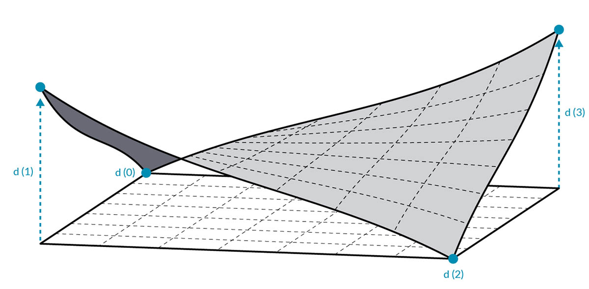

> Odchylenie od węzła płaszczyzny spowoduje obliczenie odległości, o jaką zestaw czterech punktów odbiega od najlepiej dopasowanej płaszczyzny między nimi. Jest to szybki i łatwy sposób na zbadanie możliwości realizacji projektu.

### Ćwiczenie

> Pobierz pliki przykładowe do tego ćwiczenia (kliknij prawym przyciskiem myszy i wybierz polecenie Zapisz element docelowy jako). Pełna lista plików przykładowych znajduje się w załączniku.

> 1. [Documenting.dyn](datasets/8-6/Documenting.dyn)
2. [ARCH-Documenting-BaseFile.rvt](datasets/8-6/ARCH-Documenting-BaseFile.rvt)

Rozpocznij od pliku programu Revit dla tej sekcji (lub kontynuuj pracę z plikiem z poprzedniej sekcji). Ten plik zawiera szyk paneli ETFE na dachu. W ramach tego ćwiczenia będziemy odwoływać się do tych paneli.


> 1. Dodaj węzeł *Family Types* do obszaru rysunku i wybierz opcję *„ROOF-PANEL-4PT”*.
2. Podłącz ten węzeł do węzła *All Elements of Family Type*, aby pobrać wszystkie elementy z programu Revit do dodatku Dynamo.


> 1. Za pomocą węzła *AdaptiveComponent.Locations* sprawdź położenie poszczególnych punktów adaptacyjnych dla każdego elementu.
2. Utwórz wielobok z tych czterech punktów za pomocą węzła *Polygon.ByPoints*. Zwróć uwagę, że obecnie w dodatku Dynamo jest dostępna abstrakcyjna wersja systemu panelowanego bez konieczności importowania pełnej geometrii elementu programu Revit.
3. Oblicz odchylenie od płaszczyzny za pomocą węzła *Polygon.PlaneDeviation*.

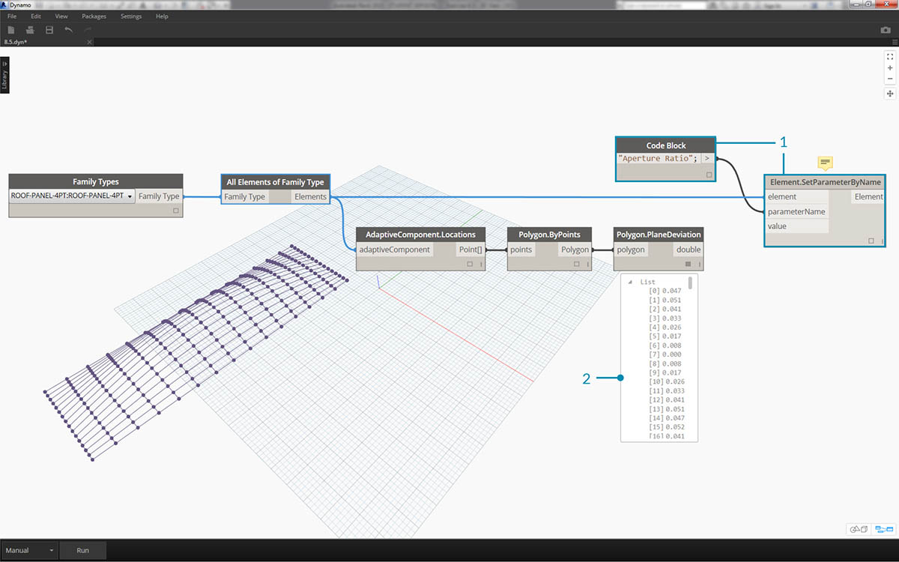

> Podobnie jak w poprzednim ćwiczeniu, w celu przeprowadzenia testu ustawmy *współczynnik apertury* każdego panelu na podstawie jego odchylenia od płaszczyzny.

> 1. Dodaj węzeł *Element.SetParameterByName* do obszaru rysunku i połącz komponenty adaptacyjne z wejściem *element*. Węzeł *Code Block* z ciągiem *„Aperture Ratio”* połącz z wejściem *parameterName*.
2. Nie można bezpośrednio połączyć wyników odchylenia z wejściem wartości, ponieważ należy ponownie odwzorować te wartości na zakres parametrów.


> 1. Używając węzła *Math.RemapRange*, ponownie odwzoruj wartości odchylenia na domenę o zakresie od *0,15* do *0,45*.
2. Podłącz te wyniki do wejścia value węzła *Element.SetParameterByName*.

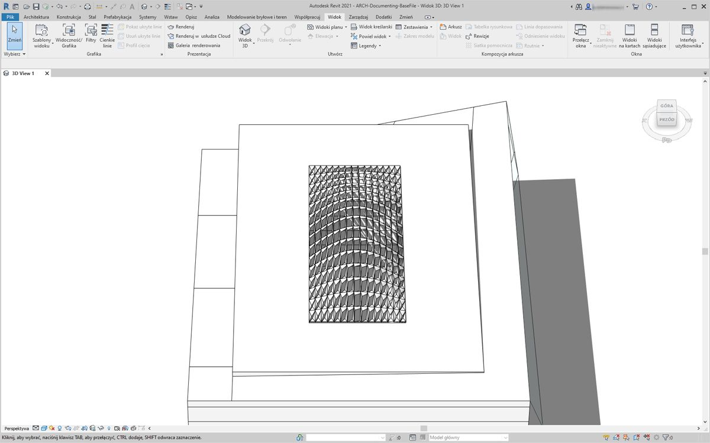

> W programie Revit można *w pewnym sensie* zinterpretować zmianę apertury na całej powierzchni.

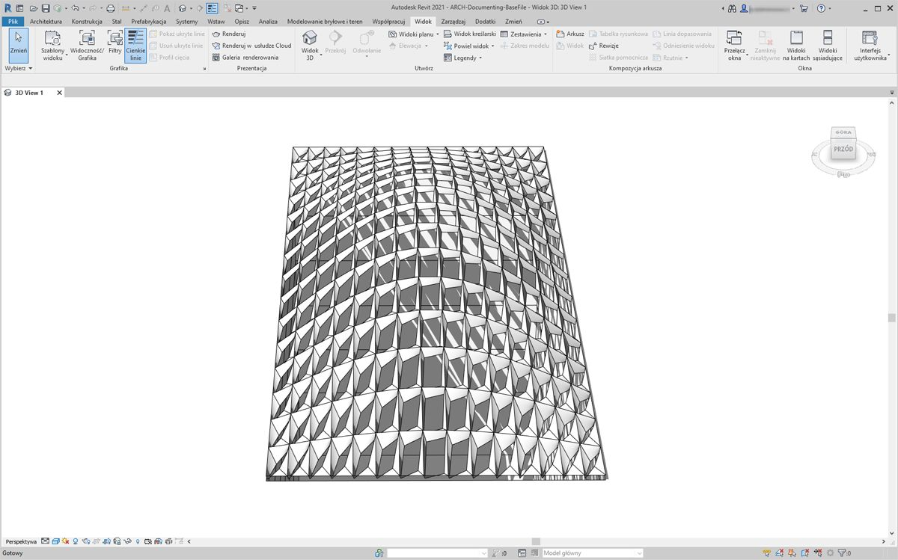

> Po powiększeniu staje się jasne, że panele zamknięte przeważają bliżej narożników powierzchni. Otwarte narożniki przeważają u góry. Narożniki reprezentują obszary o większym odchyleniu, podczas gdy wypukłość ma minimalną krzywiznę, więc ma to sens.

### Kolor i dokumentacja

Ustawienie współczynnika apertury nie wykazuje wyraźnie odchylenia paneli na dachu, a zmieniamy również geometrię rzeczywistego elementu. Załóżmy, że chcemy tylko zbadać odchylenie z punktu widzenia wykonalności elementów produkcyjnych. Pomocne byłoby nadanie kolorów panelom na podstawie zakresu odchylenia dla dokumentacji. Możemy to zrobić za pomocą serii kroków poniżej i w bardzo podobnym procesie do przedstawionego w krokach powyżej.


> 1. Usuń węzły *Element.SetParameterByName* i dodaj węzeł *Element.OverrideColorInView*.
2. Dodaj węzeł *Color Range* do obszaru rysunku. Następnie podłącz go do wejścia color węzła *Element.OverrideColorInView*. Nadal musimy połączyć wartości odchyleń z zakresem kolorów, aby utworzyć gradient.
3. Po ustawieniu kursora na wejściu *value* można zauważyć, że wartości dla tego wejścia muszą zawierać się między *0* a *1*, aby można było odwzorować kolor na każdą z wartości. Musimy ponownie odwzorować wartości odchylenia na ten zakres.


> 1. Używając węzła *Math.RemapRange*, ponownie odwzoruj wartości odchylenia od płaszczyzny na zakres od *0* do *1* (uwaga: można również użyć węzła *„MapTo”*, aby zdefiniować domenę źródłową).
2. Podłącz wyniki do węzła *Color Range*.
3. Zauważ, że wyjście stanowi zakres kolorów, a nie zakres liczb.
4. Jeśli ustawiono opcję uruchamiania ręcznego, kliknij przycisk *Uruchom*. Od tego momentu powinno być możliwe bezproblemowe korzystanie z opcji uruchamiania automatycznego.

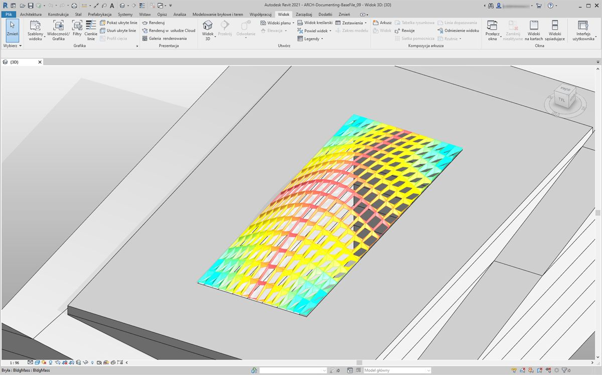

> W programie Revit widzimy znacznie czytelniejszy gradient, który reprezentuje odchylenie od płaszczyzny za pomocą zakresu kolorów. Jak jednak można dostosować te kolory? Minimalne wartości odchylenia są reprezentowane kolorem czerwonym, a więc odwrotnie do oczekiwań. Chcemy, aby maksymalne odchylenie miało kolor czerwony, a minimalne — kolor spokojniejszy. Wróćmy do dodatku Dynamo i poprawmy to.


> 1. Używając węzła *Code Block*, dodaj dwie liczby w dwóch różnych wierszach: 
```0;``` i ```255;```.
2. Utwórz kolor czerwony i niebieski, podłączając odpowiednie wartości do dwóch węzłów *Color.ByARGB*.
3. Utwórz z tych dwóch kolorów listę.
4. Podłącz tę listę do wejścia *colors* węzła *Color Range* i obserwuj aktualizację niestandardowego zakresu kolorów.

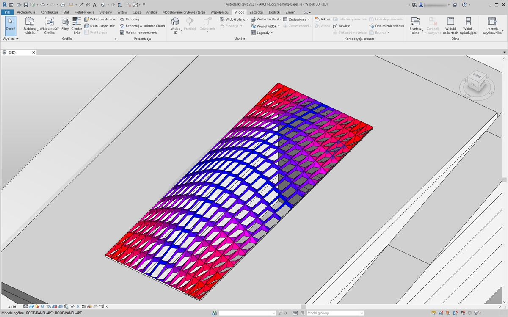

> W programie Revit łatwiej jest teraz zrozumieć obszary maksymalnego odchylenia w narożnikach. Ten węzeł służy do nadpisywania koloru w widoku, więc dobrym rozwiązaniem jest używanie w zestawie rysunków określonych arkuszy poświęconych konkretnym typom analiz.

### Tworzenie zestawień

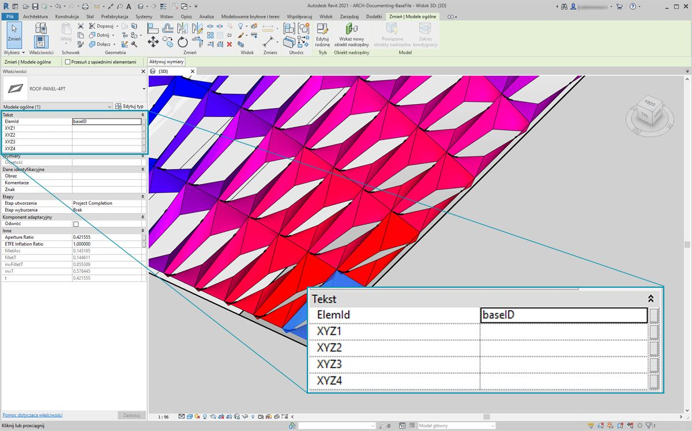

> 1. Po wybraniu jednego panelu ETFE w programie Revit widoczne są cztery parametry wystąpienia: *XYZ1, XYZ2, XYZ3* i *XYZ4*. Po utworzeniu wszystkie są puste. Są to parametry tekstowe i wymagają wartości. Użyjemy dodatku Dynamo do zapisania położeń punktów adaptacyjnych dla każdego parametru. Ułatwia to współdziałanie, jeśli geometrię trzeba wysłać do inżyniera na potrzeby doradztwa w sprawie fasady.

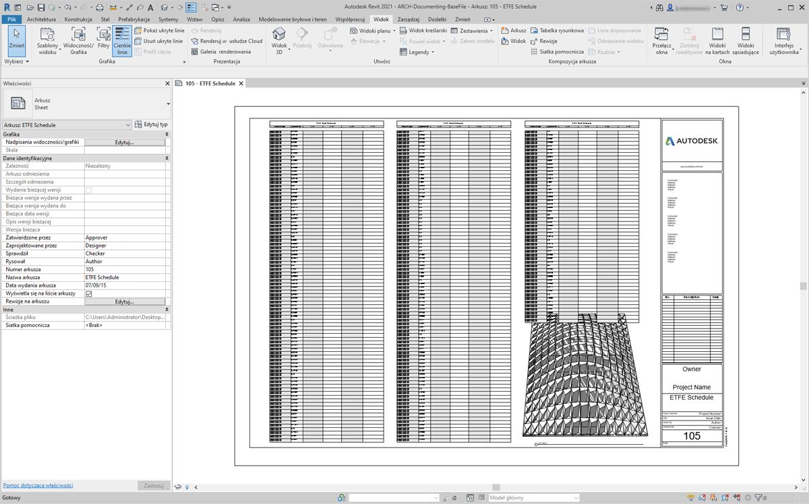

> W przykładowym arkuszu mamy duże, puste zestawienie. Parametry XYZ są współdzielone w pliku programu Revit, co pozwala dodać je do zestawienia.

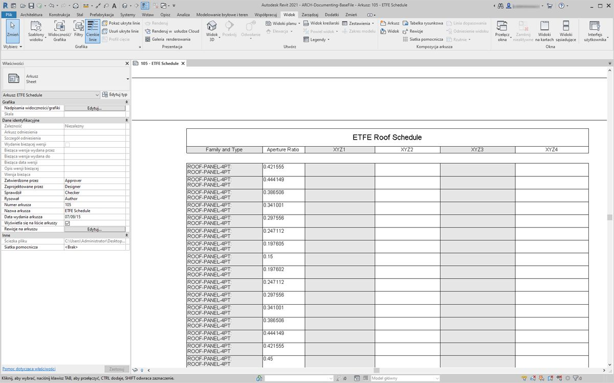

> Po powiększeniu widzimy, że parametry XYZ nie są jeszcze wypełnione. Pierwsze dwa parametry są obsługiwane przez program Revit.

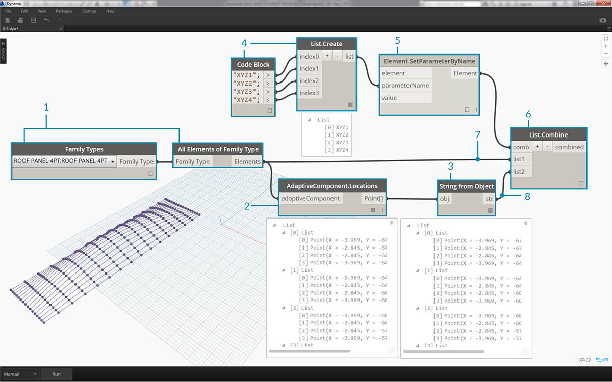

> Aby zapisać te wartości, wykonamy złożoną operację na liście. Sam wykres jest prosty, ale używane koncepcje opierają się w znacznym stopniu na odwzorowaniu listy omówionym w rozdziale poświęconym listom.

> 1. Wybierz wszystkie komponenty adaptacyjne z dwoma węzłami.
2. Wyodrębnij położenie każdego punktu za pomocą węzła *AdaptiveComponent.Locations*.
3. Przekształć te punkty w ciągi. Pamiętaj, że parametr jest oparty na tekście, dlatego trzeba wprowadzić poprawny typ danych.
4. Utwórz listę czterech ciągów definiujących parametry do zmiany: *XYZ1, XYZ2, XYZ3* i *XYZ4*.
5. Podłącz tę listę do wejścia *parameterName* węzła *Element.SetParameterByName*.
6. Połącz węzeł *Element.SetParameterByName* z wejściem *combinator* węzła *List.Combine.*
7. Połącz *komponenty adaptacyjne* z wejściem *list1*.
8. Połącz węzeł *String from Object* z wejściem *list2*.
9. Tworzymy w tym miejscu odwzorowanie listy, ponieważ zapisujemy cztery wartości dla każdego elementu, co powoduje utworzenie złożonej struktury danych. Węzeł *List.Combine* definiuje operację o jeden krok w dół w hierarchii danych. Dlatego właśnie wejścia element i value są pozostawione puste. Węzeł *List.Combine* łączy listy podrzędne na swoich wejściach z pustymi wejściami węzła *List.SetParameterByName* na podstawie kolejności, w jakiej są one połączone.

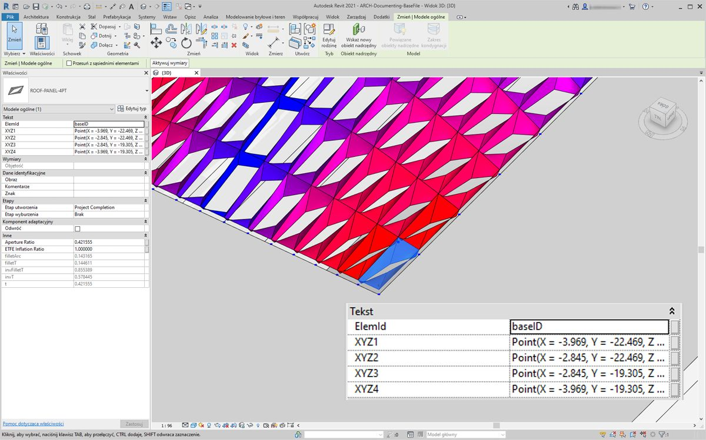

> Po wybraniu panelu w programie Revit widać teraz, że dla każdego parametru istnieją wartości ciągów. W rzeczywistości utworzylibyśmy prostszy format do zapisania punktu (X, Y, Z). Można to zrobić za pomocą operacji na ciągach w dodatku Dynamo, ale pominiemy to tutaj, aby nie wykraczać poza zakres niniejszego rozdziału.

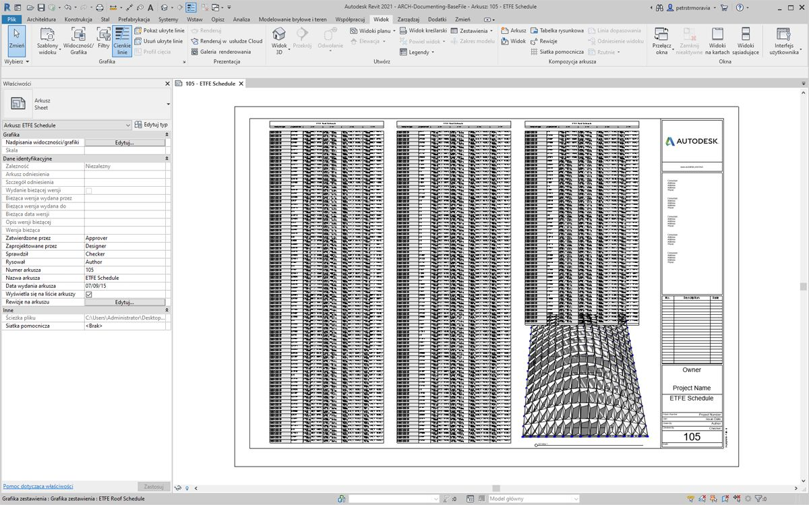

> Widok przykładowego zestawienia z wypełnionymi parametrami.

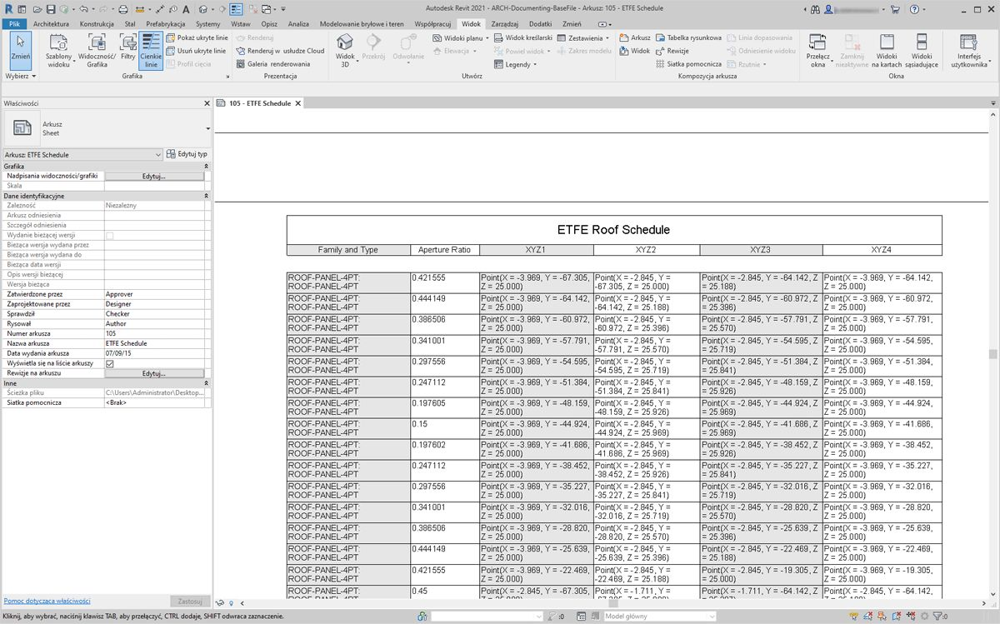

> Każdy panel ETFE ma teraz współrzędne XYZ zapisane dla każdego punktu adaptacyjnego, co reprezentuje narożniki każdego panelu na potrzeby produkcji.

