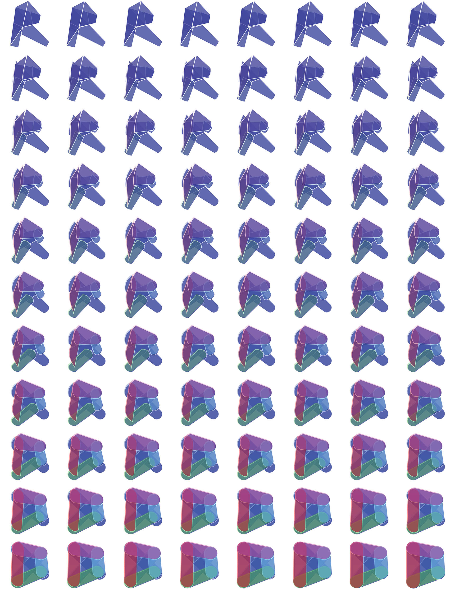

# Dodatek Dynamo dla programu Revit

Dodatek Dynamo jest elastycznym środowiskiem, zaprojektowanym do współdziałania z szeroką gamą programów, ale został pierwotnie utworzony do używania w programie Revit. Program wizualny zapewnia rozbudowane opcje modelu informacji o budynku (BIM). Dodatek Dynamo oferuje cały pakiet węzłów zaprojektowany specjalnie dla programu Revit, jak również biblioteki innych dostawców pochodzące z dobrze prosperującej społeczności AEC. W tym rozdziale omówiono podstawy korzystania z dodatku Dynamo w programie Revit.

