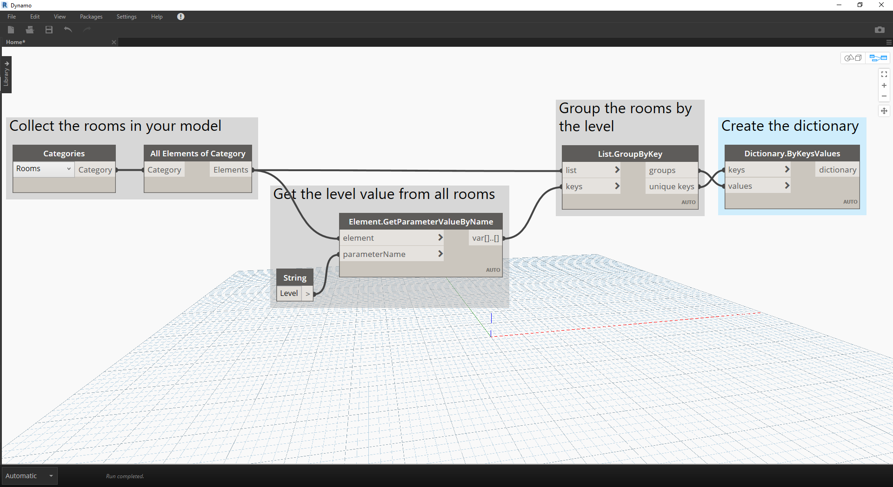

# Słowniki — przypadki zastosowań związane z programem Revit

Czy kiedykolwiek zdarzyło Ci się wyszukiwać coś w programie Revit za pomocą zawartych w nim danych?

#### W takim przypadku zwykle robiło się to w ten sposób:


> Na powyższej ilustracji zbieramy wszystkie pomieszczenia w modelu programu Revit, uzyskujemy indeks żądanego pomieszczenia (według numeru pomieszczenia), a następnie pobieramy pomieszczenie o danym indeksie.

### Teraz odtwórzmy ten pomysł, używając słowników.

> Pobierz plik przykładowy do tego ćwiczenia (kliknij prawym przyciskiem myszy i wybierz opcję Zapisz element docelowy jako): [RoomDictionary.dyn](datasets/9-4_roomDictionary.dyn). Pełna lista plików przykładowych znajduje się w załączniku.

 Najpierw musimy zebrać wszystkie pomieszczenia w modelu programu Revit.

> * Wybieramy kategorię programu Revit, z którą chcemy pracować (w tym przypadku pracujemy z pomieszczeniami).
* Zlecamy dodatkowi Dynamo zebranie wszystkich tych elementów.

 Następnie musimy zdecydować, jakich kluczy użyjemy do wyszukiwania tych danych. (Informacje na temat kluczy można znaleźć w sekcji [9-1 Co to jest słownik?](9-1_What-is-a-dictionary,md)).

> * Dane, których użyjemy, to numer pomieszczenia.

 Teraz utworzymy słownik z danymi kluczami i elementami.

> * Węzeł ```Dictionary.ByKeysValues``` utworzy słownik na podstawie odpowiednich danych wejściowych.
* Klucze (```keys```) muszą być ciągami, a wartości (```values```) mogą być różnymi typami obiektów.

 Na koniec możemy pobrać pomieszczenie ze słownika za pomocą jego numeru.

> * ```String``` będzie kluczem, który jest używany do wyszukania obiektu w słowniku.
* Teraz węzeł ```Dictionary.ValueAtKey``` pobierze obiekt ze słownika.

---

### Używając tej samej logiki słowników, można także tworzyć słowniki ze zgrupowanymi obiektami. Jeśli chcemy wyszukać wszystkie pomieszczenia na danym poziomie, możemy zmienić powyższy wykres w następujący sposób.


> * Zamiast używać jako klucza numeru pomieszczenia, możemy teraz użyć wartości parametru (w tym przypadku użyjemy poziomu).


> * Teraz możemy pogrupować pomieszczenia według poziomu, na którym się znajdują.



> * Po pogrupowaniu elementów według poziomów możemy używać wspólnych (niepowtarzalnych) kluczy jako kluczy w słowniku, a list pomieszczeń jako elementów.


> * Na koniec, korzystając z poziomów w modelu programu Revit, możemy sprawdzić w słowniku, które pomieszczenia znajdują się na danym poziomie. Węzeł ```Dictionary.ValueAtKey``` pobierze nazwę poziomu i zwróci obiekty pomieszczeń na tym poziomie.

Możliwości zastosowań słowników są naprawdę nieograniczone. Już sama możliwość powiązywania danych BIM w programie Revit z elementem zapewnia wiele różnych przypadków zastosowań.

