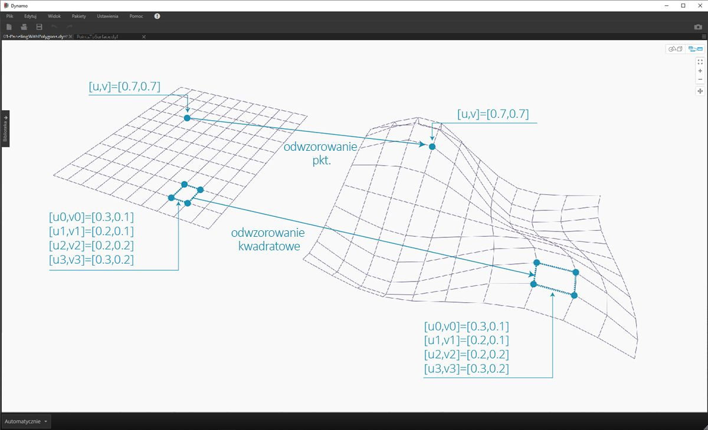
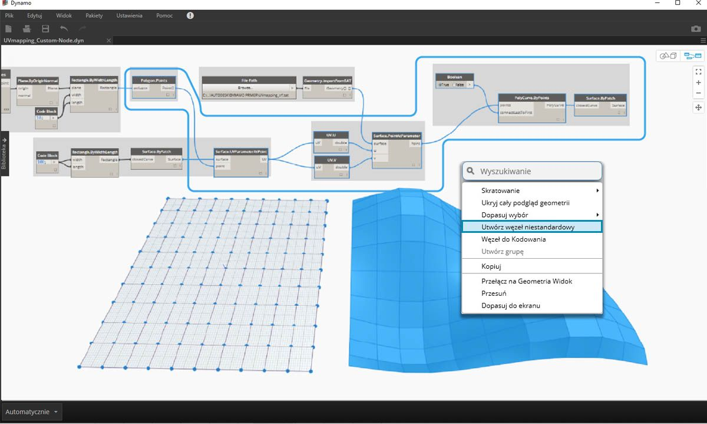
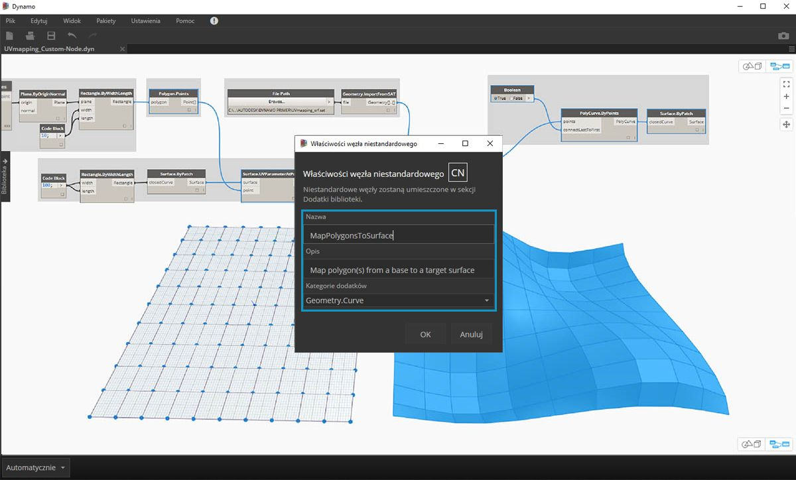
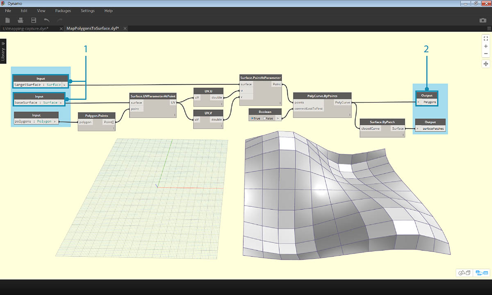
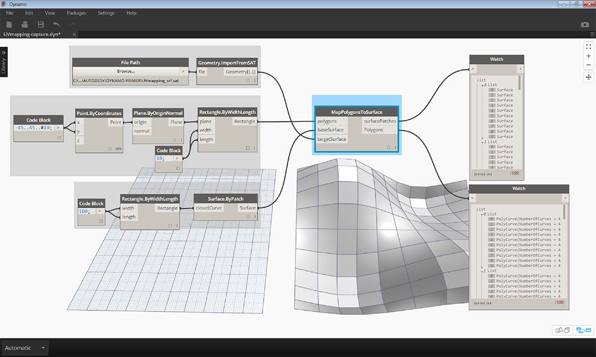
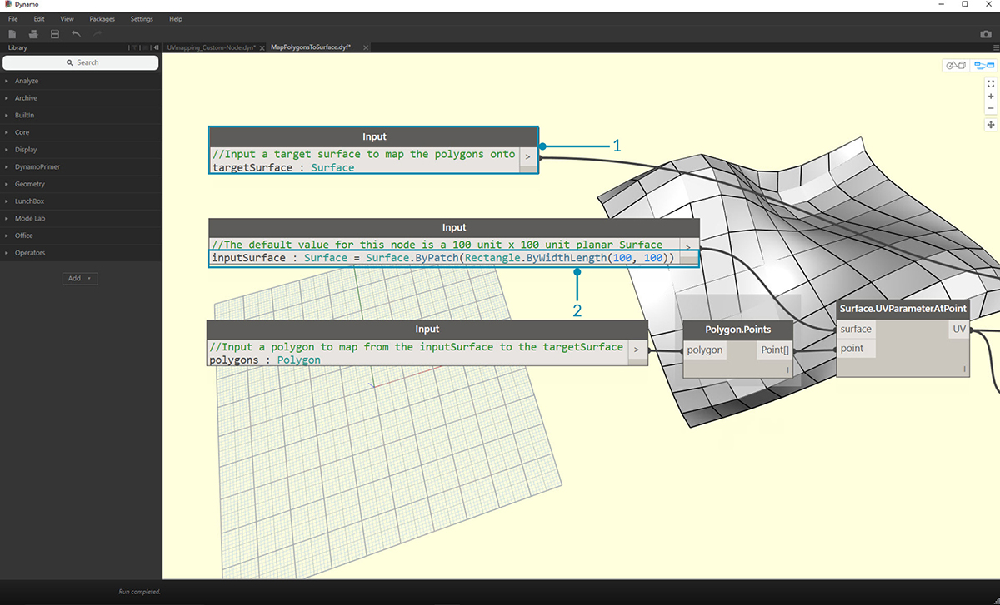

## Tworzenie węzła niestandardowego

Dodatek Dynamo oferuje kilka różnych metod tworzenia węzłów niestandardowych. Węzły niestandardowe można tworzyć od podstaw, z istniejącego wykresu lub bezpośrednio w języku C#. W tej części omówimy tworzenie węzła niestandardowego w interfejsie użytkownika dodatku Dynamo z istniejącego wykresu. Ta metoda jest idealna do czyszczenia obszaru roboczego, jak również do pakowania sekwencji węzłów do ponownego użycia w innym miejscu.

### Węzły niestandardowe dla odwzorowania UV

Na poniższej ilustracji odwzorowujemy punkt z jednej powierzchni na drugą za pomocą współrzędnych UV. Użyjemy tej koncepcji do utworzenia panelowanej powierzchni, która odwołuje się do krzywych na płaszczyźnie XY. Utworzymy tu panele czworokątne dla naszego panelowania, ale stosując tę samą logikę, możemy utworzyć szeroką gamę paneli z odwzorowaniem UV. Jest to świetna okazja do tworzenia węzłów niestandardowych, ponieważ w ten sposób łatwiej będzie powtórzyć podobny proces na tym wykresie lub w innych procesach roboczych Dynamo.

### Tworzenie węzła niestandardowego z istniejącego wykresu

> Pobierz i rozpakuj pliki przykładowe do tego ćwiczenia (kliknij prawym przyciskiem myszy i wybierz polecenie Zapisz łącze jako). Pełna lista plików przykładowych znajduje się w załączniku. [UV-CustomNode.zip](datasets/10-2/UV-CustomNode.zip)

Zacznijmy od utworzenia wykresu, który zagnieździmy w węźle niestandardowym. W tym przykładzie utworzymy wykres, który będzie odwzorowywać wieloboki z powierzchni bazowej na powierzchnię docelową, za pomocą współrzędnych UV. Ten proces odwzorowywania UV jest często używany, przez co jest to dobra opcja dla węzła niestandardowego. Aby uzyskać więcej informacji na temat powierzchni i przestrzeni UV, zobacz sekcję 5.5. Pełny wykres: *UVmapping_Custom-Node.dyn* z pliku .zip pobranego powyżej.

> 1. **Code Block:** utwórz zakres 10 liczb od 45 do -45 za pomocą bloku kodu.
2. **Point.ByCoordinates:** połącz wyjście węzła Code Block z wejściami „x” i „y” oraz ustaw skratowanie na odniesienie krzyżowe. Powinna teraz istnieć siatka punktów.
3. **Plane.ByOriginNormal:** połącz wyjście *„Point”* z wejściem *„origin”*, aby utworzyć płaszczyznę w każdym z punktów. Zostanie użyty domyślny wektor normalny (0,0,1).
4. **Rectangle.ByWidthLength:** połącz płaszczyzny z poprzedniego kroku z wejściem *„plane”* i użyj węzła Code Block z wartością *10* w celu określenia szerokości i długości.

Powinna teraz istnieć siatka prostokątów. Odwzorujmy te prostokąty na powierzchnię docelową za pomocą współrzędnych UV.

> 1. **Polygon.Points:** połącz wyjście Rectangle z poprzedniego kroku z wejściem *„polygon”*, aby wyodrębnić punkty narożne każdego prostokąta. Są to punkty, które odwzorujemy na powierzchnię docelową.
2. **Rectangle.ByWidthLength:** użyj węzła Code Block z wartością *100*, aby określić szerokość i długość prostokąta. Będzie to obwiednia powierzchni bazowej.
3. **Surface.ByPatch:** połącz prostokąt z poprzedniego kroku z wejściem *„closedCurve”*, aby utworzyć powierzchnię bazową.
4. **Surface.UVParameterAtPoint:** połącz wyjście *„Point”* węzła *Polygon.Points* i wyjście *„Surface”* węzła *Surface.ByPatch*, aby zwrócić parametr UV w każdym punkcie.

Teraz gdy mamy powierzchnię bazową i zbiór współrzędnych UV, możemy zaimportować powierzchnię docelową i odwzorować punkty między powierzchniami.

> 1. **Ścieżka pliku:** wybierz ścieżkę pliku dla powierzchni, którą chcesz zaimportować. Powinien to być plik typu .SAT. Kliknij przycisk *„Przeglądaj”* i przejdź do pliku *UVmapping_srf.sat* z pliku .zip pobranego powyżej.
2. **Geometry.ImportFromSAT:** połącz ścieżkę pliku, aby zaimportować powierzchnię. W podglądzie geometrii powinna być widoczna zaimportowana powierzchnia.
3. **UV:** połącz wyjście parametru UV z węzłami *UV.U* i *UV.V*.
4. **Surface.PointAtParameter:** połącz zaimportowaną powierzchnię oraz współrzędne u i v. Na powierzchni docelowej powinna być teraz widoczna siatka punktów 3D.

Ostatnią czynnością jest użycie punktów 3D do utworzenia prostokątnych płatów powierzchni.

> 1. **PolyCurve.ByPoints:** połącz punkty na powierzchni, aby skonstruować krzywą PolyCurve przez punkty.
2. **Boolean:** dodaj wartość logiczną do obszaru roboczego i połącz ją z wejściem *„connectLastToFirst”* oraz przełącz na wartość True, aby zamknąć krzywe PolyCurve. Powinny być teraz widoczne prostokąty odwzorowane na powierzchnię.
3. **Surface.ByPatch:** połącz krzywe PolyCurve z wejściem *„closedCurve”*, aby skonstruować płaty powierzchni.

Teraz wybierzmy węzły do zagnieżdżenia w węźle niestandardowym, uwzględniając to, jakie powinny być wejścia i wyjścia węzła. Chcemy, aby węzeł niestandardowy był możliwie najbardziej elastyczny, by umożliwiał odwzorowanie dowolnych wieloboków, a nie tylko prostokątów.

> Wybierz powyższe węzły (począwszy od *Polygon.Points*), kliknij prawym przyciskiem myszy obszar roboczy i wybierz opcję *„node from selection”*.

> W oknie dialogowym Właściwości węzła niestandardowego przypisz nazwę, opis i kategorię do węzła niestandardowego.

> Węzeł niestandardowy znacznie wyczyścił obszar roboczy. Warto zauważyć, że wejścia i wyjścia zostały nazwane na podstawie oryginalnych węzłów. Zmodyfikujmy węzeł niestandardowy, zmieniając te nazwy na bardziej opisowe.

> Kliknij dwukrotnie węzeł niestandardowy, aby go edytować. Spowoduje to otwarcie obszaru roboczego z żółtym tłem reprezentującym wnętrze węzła.

> 1. **Węzły Input:** zmień nazwy wejść na *baseSurface* i *targetSurface*.
2. **Węzły Output:** dodaj kolejne wyjście dla odwzorowanych wieloboków.
> Zapisz węzeł niestandardowy i wróć do głównego obszaru roboczego.

> Węzeł **MapPolygonsToSurface** odzwierciedla wprowadzone zmiany.

Można również zwiększyć niezawodność węzła niestandardowego przez dodanie treści w sekcji **Komentarze niestandardowe**. Komentarze mogą pomóc w ustaleniu typów wejść i wyjść lub objaśnieniu funkcjonalności węzła. Komentarze pojawią się, gdy użytkownik ustawi kursor na wejściu lub wyjściu węzła niestandardowego.

> Kliknij dwukrotnie węzeł niestandardowy, aby go edytować. Spowoduje to ponowne otwarcie żółtego obszaru roboczego.

> 1. Rozpocznij edycję bloku kodu wejściowego. Aby rozpocząć komentarz, wpisz „//”, a następnie wpisz tekst komentarza. Wpisz wszelkie informacje, które mogą pomóc w objaśnieniu węzła — w tym miejscu opiszemy węzeł *targetSurface*.
2. Ustawmy również domyślną wartość dla węzła *inputSurface* przez ustawienie typu wejścia równego wartości. W tym miejscu ustawimy wartość domyślną na oryginalny zestaw Surface.ByPatch.

> Komentarze można również stosować do wyjścia. Rozpocznij edycję tekstu w bloku kodu wyjściowego. Aby rozpocząć komentarz, wpisz „//”, a następnie wpisz tekst komentarza. W tym miejscu objaśnimy wyjścia *Polygons* i *surfacePatches* poprzez dodanie bardziej szczegółowego opisu.

 >

1. Ustaw kursor na wejściach węzła niestandardowego, aby wyświetlić komentarze.
2. Po ustawieniu wartości domyślnej na *inputSurface* można również uruchomić definicję bez wejścia powierzchni.

