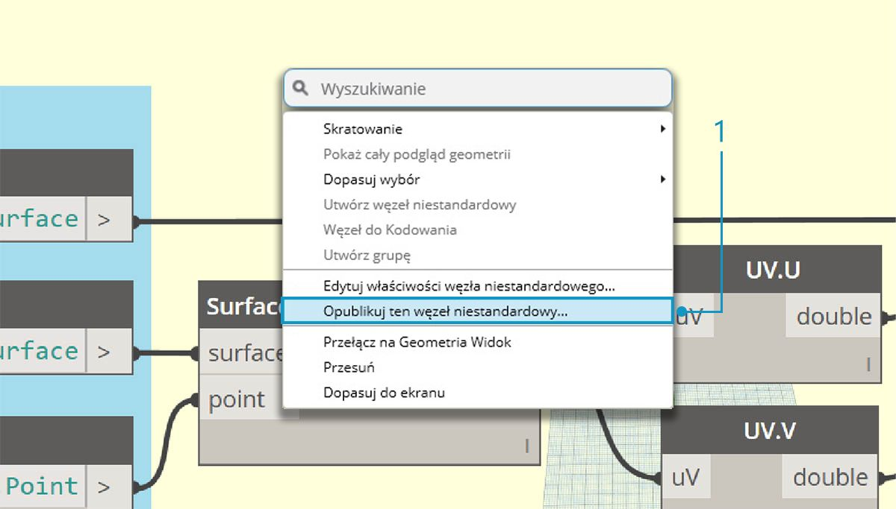
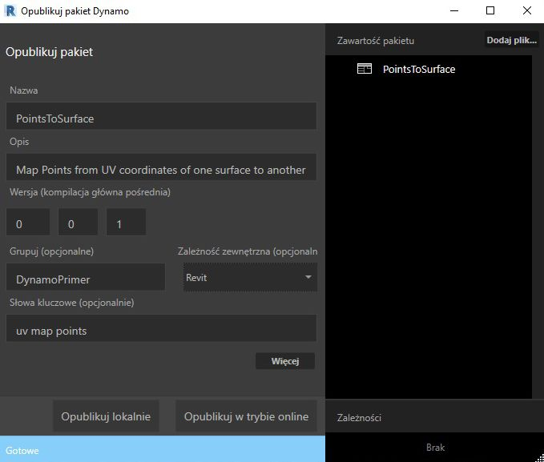
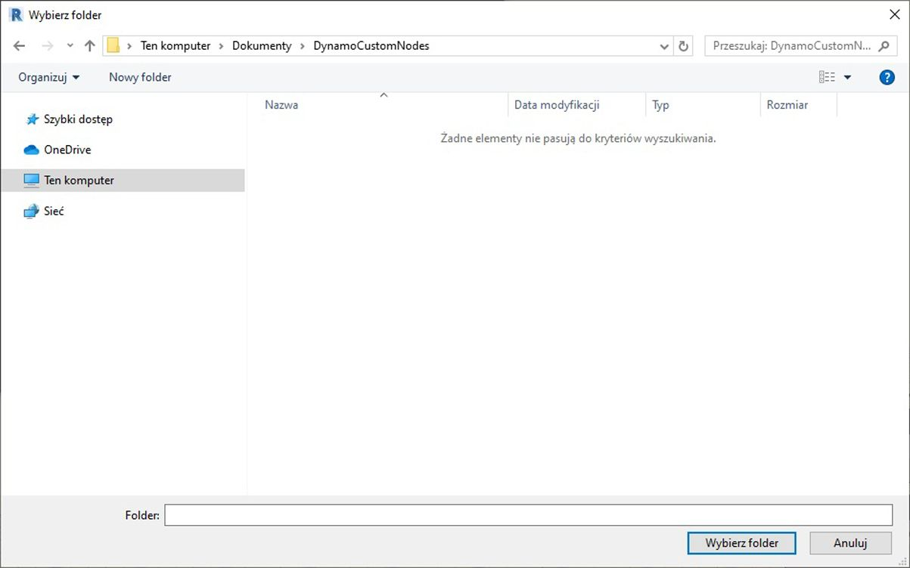
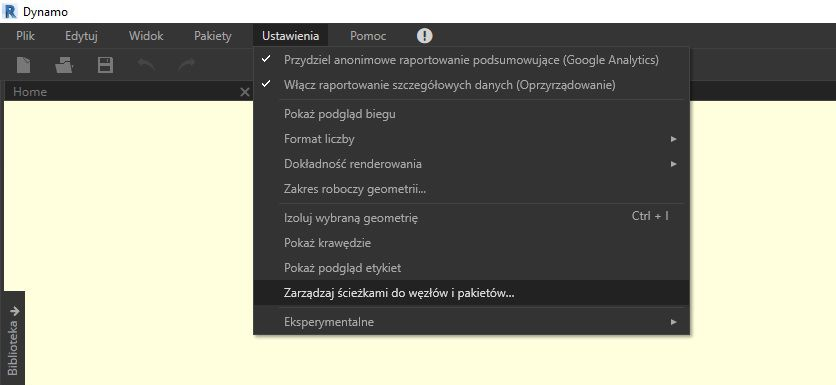
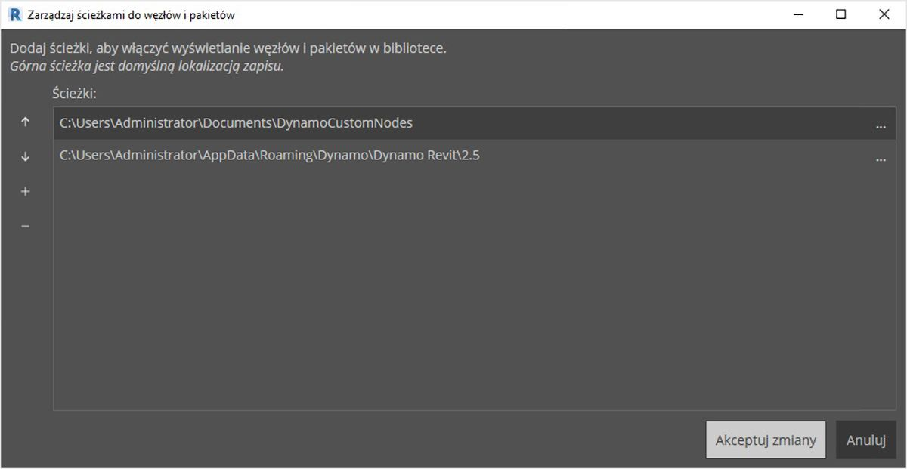
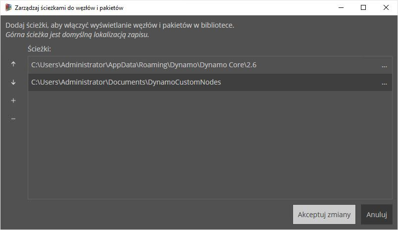
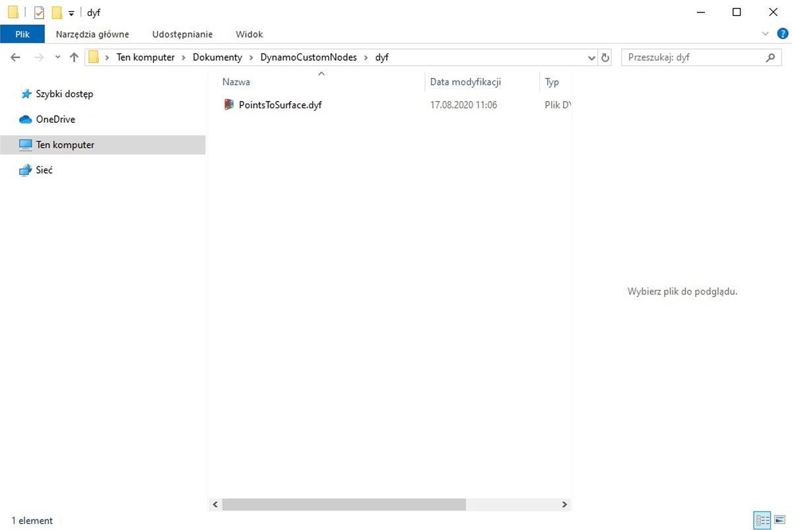

## Dodawanie do biblioteki użytkownika

Właśnie utworzyliśmy węzeł niestandardowy i zastosowaliśmy go do określonego procesu na wykresie Dynamo. Ten węzeł podoba nam się tak bardzo, że chcemy pozostawić go w naszej bibliotece dodatku Dynamo, aby odwoływać się do niego na innych wykresach. Aby to zrobić, opublikujemy ten węzeł lokalnie. Jest to proces podobny do publikowania pakietu, który bardziej szczegółowo omówimy w następnym rozdziale.

### Publikowanie węzła niestandardowego lokalnie

Kontynuujmy pracę z węzłem niestandardowym, który utworzyliśmy w poprzedniej sekcji. Węzeł opublikowany lokalnie będzie dostępny w bibliotece dodatku Dynamo po otwarciu nowej sesji. Jeśli nie opublikujemy węzła, w folderze wykresu Dynamo, który odwołuje się do węzła niestandardowego, musi również znajdować się ten węzeł niestandardowy (lub węzeł niestandardowy musi być zaimportowany do dodatku Dynamo za pomocą polecenia *Plik > Importuj bibliotekę*).

> Pobierz plik przykładowy do tego ćwiczenia (kliknij prawym przyciskiem myszy i wybierz polecenie Zapisz element docelowy jako). Pełna lista plików przykładowych znajduje się w załączniku. [PointsToSurface.dyf](datasets/10-3/PointsToSurface.dyf)

> Po otwarciu węzła niestandardowego PointsToSurface widać powyższy wykres w Edytorze węzłów niestandardowych dodatku Dynamo. Węzeł niestandardowy można również otworzyć, klikając go dwukrotnie w Edytorze wykresu Dynamo.

> 1. Aby opublikować węzeł niestandardowy lokalnie, wystarczy kliknąć prawym przyciskiem myszy obszar rysunku i wybrać opcję *„Opublikuj ten węzeł niestandardowy...”*

> Podaj odpowiednie informacje (podobnie, jak to zrobiono na ilustracji powyżej) i wybierz opcję *„Opublikuj lokalnie”.*. Należy zwrócić uwagę, że pole Grupa definiuje element główny dostępny w menu dodatku Dynamo.

> Wybierz folder, w którym będą przechowywane wszystkie węzły niestandardowe publikowane lokalnie. Ten folder będzie sprawdzany przy każdym wczytywaniu dodatku Dynamo, dlatego upewnij się, że jest to folder trwały. Przejdź do tego folderu i wybierz opcję *„Wybierz folder”.* Węzeł Dynamo jest teraz publikowany lokalnie i będzie dostępny na pasku narzędzi dodatku Dynamo po każdym wczytaniu programu.

> 1. Aby sprawdzić położenie folderu węzłów niestandardowych, przejdź do obszaru *Ustawienia > Zarządzaj ścieżkami do węzłów i pakietów...*

> W tym oknie są widoczne dwie ścieżki: *AppData\Roaming\Dynamo...* odnosi się do domyślnego położenia pakietów dodatku Dynamo instalowanych online. Ścieżka *Documents\DynamoCustomNodes...* odnosi się do położenia węzłów niestandardowych, które zostały opublikowane lokalnie*.

> 1. Możesz przenieść ścieżkę folderu lokalnego w dół powyższej listy (wybierając ścieżkę folderu i klikając strzałkę skierowaną w dół po lewej stronie nazwy ścieżki). Folder na początku listy stanowi domyślną ścieżkę do instalacji pakietów. Dlatego jeśli domyślna ścieżka instalacji pakietów Dynamo zostanie zachowana jako folder domyślny, pakiety online będą oddzielone od węzłów opublikowanych lokalnie.*

> Zmieniliśmy kolejność nazw ścieżek, aby lokalizacją instalacji pakietu była domyślna ścieżka dodatku Dynamo.

> Po przejściu do tego folderu lokalnego oryginalny węzeł niestandardowy znajdziemy w folderze *„.dyf”* — ta nazwa stanowi rozszerzenie pliku węzła niestandardowego dodatku Dynamo (Dynamo Custom Node). Możemy edytować plik w tym folderze, a węzeł zostanie zaktualizowany w interfejsie użytkownika. Możemy także dodać więcej węzłów do głównego folderu *DynamoCustomNode*, a dodatek Dynamo doda je do biblioteki po ponownym uruchomieniu.

> Dodatek Dynamo będzie teraz za każdym razem wczytywany z elementem *„PointsToSurface”* w grupie *„DynamoPrimer”* w bibliotece dodatku Dynamo.

