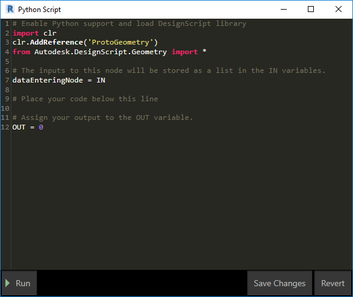
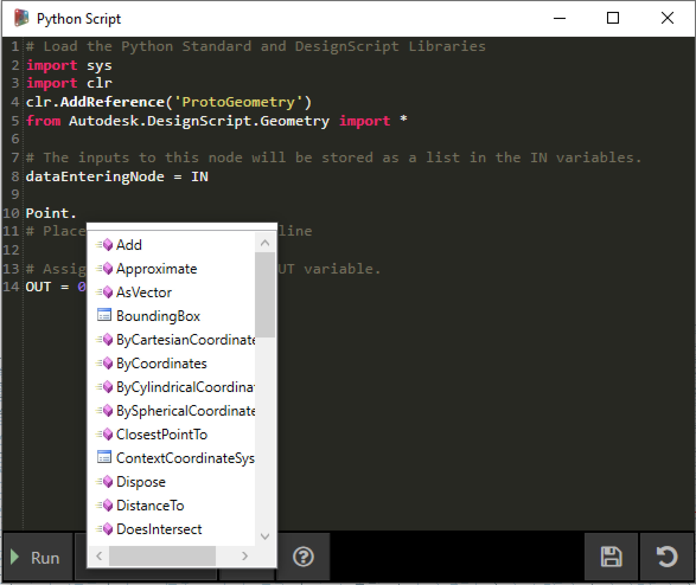
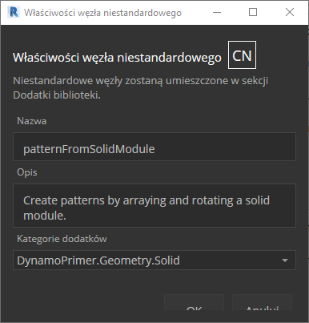
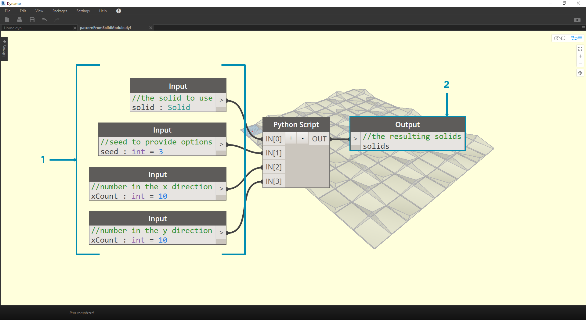

## Python

 Język Python to powszechnie używany język programowania, którego popularność ma wiele wspólnego z jego stylem składni. Jest wysoce czytelny, co sprawia, że łatwiej jest się go nauczyć niż wielu innych języków. Język Python obsługuje moduły i pakiety. Można go osadzać w istniejących aplikacjach. W przykładach w tej sekcji zakłada się podstawową znajomość języka Python. Aby uzyskać informacje na temat rozpoczynania korzystania z języka Python, skorzystaj z zasobu [„Getting Started”](https://www.python.org/about/gettingstarted/) (Pierwsze kroki) na stronie [Python.org](https://www.python.org/).

### Programowanie wizualne a tekstowe

Dlaczego w środowisku programowania wizualnego Dynamo warto używać programowania tekstowego? Jak już omówiliśmy w rozdziale 1.1, programowanie wizualne ma wiele zalet. Umożliwia tworzenie programów bez konieczności poznawania specjalnej składni w intuicyjnym interfejsie wizualnym. Jednak program wizualny może z czasem zawierać zbyt wiele elementów i nie działać zgodnie z założeniami. Na przykład język Python oferuje znacznie więcej dostępnych metod pisania instrukcji warunkowych (jeśli/to) i zapętlania. Język Python jest zaawansowanym narzędziem, które umożliwia rozszerzenie możliwości dodatku Dynamo i zastąpienie wielu węzłów kilkoma zwięzłymi liniami kodu.

**Program wizualny:** 

**Program tekstowy:**

```
import clr
clr.AddReference('ProtoGeometry')
from Autodesk.DesignScript.Geometry import *

solid = IN[0]
seed = IN[1]
xCount = IN[2]
yCount = IN[3]

solids = []

yDist = solid.BoundingBox.MaxPoint.Y-solid.BoundingBox.MinPoint.Y
xDist = solid.BoundingBox.MaxPoint.X-solid.BoundingBox.MinPoint.X

for i in xRange:
for j in yRange:
fromCoord = solid.ContextCoordinateSystem
toCoord = fromCoord.Rotate(solid.ContextCoordinateSystem.Origin,Vector.ByCoordinates(0,0,1),(90*(i+j%val)))
vec = Vector.ByCoordinates((xDist*i),(yDist*j),0)
toCoord = toCoord.Translate(vec)
solids.append(solid.Transform(fromCoord,toCoord))

OUT = solids
```

### Węzeł w języku Python

Podobnie jak bloki kodu węzły języka Python są interfejsem skryptowym w środowisku programowania wizualnego. Węzeł w języku Python znajduje się w obszarze *Podstawowe > Obsługa skryptów* w bibliotece. Dwukrotne kliknięcie węzła powoduje otwarcie edytora skryptów języka Python (można również kliknąć prawym przyciskiem myszy węzeł i wybrać polecenie *Edytuj*).



> Na górze jest wyświetlany tekst wstępny, który ma ułatwić odnoszenie się do potrzebnych bibliotek. Dane wejściowe są przechowywane w szyku IN. Wartości są zwracane do dodatku Dynamo przez przypisanie ich do zmiennej OUT.

Biblioteka Autodesk.DesignScript.Geometry umożliwia używanie zapisu kropkowego podobnego do bloków kodu (Code Block). Aby uzyskać więcej informacji na temat składni dodatku Dynamo, zapoznaj się z rozdziałem 7.2 oraz [Przewodnikiem DesignScript](http://dynamobim.org/wp-content/links/DesignScriptGuide.pdf). Wpisanie typu geometrii, takiego jak „Point.”, spowoduje pojawienie się listy metod tworzenia punktów i stosowania do nich zapytań.



> Metody obejmują konstruktory, takie jak *ByCoordinates*, akcje, takie jak *Add*, oraz zapytania, takie jak współrzędne *X*, *Y* i *Z*.

### Ćwiczenie

> Pobierz plik przykładowy do tego ćwiczenia (kliknij prawym przyciskiem myszy i wybierz polecenie Zapisz element docelowy jako). Pełna lista plików przykładowych znajduje się w załączniku. [Python_Custom-Node.dyn](datasets/10-4/Python-CustomNode.dyn)

W tym przykładzie napiszemy skrypt w języku Python, który tworzy wzorce z modułu bryłowego, i zmienimy go w węzeł niestandardowy. Najpierw utworzymy moduł bryłowy za pomocą węzłów Dynamo.


> 1. **Rectangle.ByWidthLength:** utwórz prostokąt, który będzie podstawą bryły.
2. **Surface.ByPatch:** połącz prostokąt z wejściem „*closedCurve*”, aby utworzyć dolną powierzchnię.


> 1. **Geometry.Translate:** połącz prostokąt z wejściem „*geometry*”, aby przesunąć go w górę, używając bloku kodu do określenia grubości bazowej bryły.
2. **Polygon.Points:** zastosuj zapytanie do przekształconego prostokąta w celu wyodrębnienia punktów narożnych.
3. **Geometry.Translate:** użyj bloku kodu, aby utworzyć listę czterech wartości odpowiadających czterem punktom, przekształcając jeden narożnik bryły w górę.
4. **Polygon.ByPoints:** użyj przekształconych punktów, aby odtworzyć górny wielobok.
5. **Surface.ByPatch:** połącz wielobok, aby utworzyć górną powierzchnię.

Teraz gdy mamy górną i dolną powierzchnię, wyciągnijmy między dwoma profilami, aby utworzyć boki bryły.


> 1. **List.Create:** połącz dolny prostokąt i górny wielobok z wejściami indeksu.
2. **Surface.ByLoft:** wyciągnij dwa profile w celu utworzenia boków bryły.
3. **List.Create:** połącz górną, boczną i dolną powierzchnię z wejściami indeksu, aby utworzyć listę powierzchni.
4. **Solid.ByJoinedSurfaces:** połącz powierzchnie, aby utworzyć moduł bryły.

Po uzyskaniu bryły upuść węzeł skryptu w języku Python w obszarze roboczym.


> Aby dodać kolejne wejścia do węzła, zamknij edytor i kliknij ikonę „+” na węźle. Nazwy wejść to IN[0], IN[1] itd., aby wskazać, że reprezentują one elementy na liście.

Zacznijmy od zdefiniowania wejść i wyjść. Kliknij dwukrotnie węzeł, aby otworzyć edytor języka Python.


```
# Enable Python support and load DesignScript library
import clr
clr.AddReference('ProtoGeometry')
from Autodesk.DesignScript.Geometry import *

# The inputs to this node will be stored as a list in the IN variables.
#The solid module to be arrayed
solid = IN[0]
#A number that determines which rotation pattern to use
seed = IN[1]
#The number of solids to array in the X and Y axes
xCount = IN[2]
yCount = IN[3]

#Create an empty list for the arrayed solids
solids = []

# Place your code below this line

# Assign your output to the OUT variable.
OUT = solids
```

Ten kod będzie bardziej przejrzysty w trakcie dalszej analizy tego ćwiczenia. Następnie należy zastanowić się, jakie informacje są wymagane, aby ułożyć moduł bryłowy w szyku. Najpierw musimy znać wymiary bryły, aby określić odległość przekształcenia. Z powodu błędu ramki ograniczającej należy użyć geometrii krzywej krawędzi, aby utworzyć ramkę ograniczającą.


> Spojrzenie na węzeł w języku Python w dodatku Dynamo. Zauważ, że używamy tej samej składni, która jest używana w węzłach w dodatku Dynamo. Poniżej znajduje się skomentowany kod.

```
# Enable Python support and load DesignScript library
import clr
clr.AddReference('ProtoGeometry')
from Autodesk.DesignScript.Geometry import *

# The inputs to this node will be stored as a list in the IN variables.
#The solid module to be arrayed
solid = IN[0]
#A number that determines which rotation pattern to use
seed = IN[1]
#The number of solids to array in the X and Y axes
xCount = IN[2]
yCount = IN[3]

#Create an empty list for the arrayed solids
solids = []
# Create an empty list for the edge curves
crvs = []

# Place your code below this line
#Loop through edges and append corresponding curve geometry to the list
for edge in solid.Edges:
crvs.append(edge.CurveGeometry)
#Get the bounding box of the curves
bbox = BoundingBox.ByGeometry(crvs)

#Get the X and Y translation distance based on the bounding box
yDist = bbox.MaxPoint.Y-bbox.MinPoint.Y
xDist = bbox.MaxPoint.X-bbox.MinPoint.X

# Assign your output to the OUT variable.
OUT = solids
```

Ponieważ będziemy zarówno przekształcać, jak i obracać moduły brył, użyjmy operacji Geometry.Transform. Z węzła Geometry.Transform wynika, że będziemy potrzebować źródłowego układu współrzędnych i docelowego układu współrzędnych do przekształcenia bryły. Źródłem jest kontekstowy układ współrzędnych bryły, natomiast elementem docelowym będzie inny układ współrzędnych dla każdego modułu ustawionego w szyku. Oznacza to, że należy utworzyć pętlę przez wartości x i y, aby przekształcić układ współrzędnych za każdym razem w inny sposób.


> Spojrzenie na węzeł w języku Python w dodatku Dynamo. Poniżej znajduje się skomentowany kod.

```
# Enable Python support and load DesignScript library
import clr
clr.AddReference('ProtoGeometry')
from Autodesk.DesignScript.Geometry import *

# The inputs to this node will be stored as a list in the IN variables.
#The solid module to be arrayed
solid = IN[0]
#A number that determines which rotation pattern to use
seed = IN[1]
#The number of solids to array in the X and Y axes
xCount = IN[2]
yCount = IN[3]

#Create an empty list for the arrayed solids
solids = []
# Create an empty list for the edge curves
crvs = []

# Place your code below this line
#Loop through edges and append corresponding curve geometry to the list
for edge in solid.Edges:
crvs.append(edge.CurveGeometry)
#Get the bounding box of the curves
bbox = BoundingBox.ByGeometry(crvs)

#Get the X and Y translation distance based on the bounding box
yDist = bbox.MaxPoint.Y-bbox.MinPoint.Y
xDist = bbox.MaxPoint.X-bbox.MinPoint.X
#get the source coordinate system
fromCoord = solid.ContextCoordinateSystem

#Loop through X and Y
for i in range(xCount):
for j in range(yCount):
#Rotate and translate the coordinate system
toCoord = fromCoord.Rotate(solid.ContextCoordinateSystem.Origin,Vector.ByCoordinates(0,0,1),(90*(i+j%seed)))
vec = Vector.ByCoordinates((xDist*i),(yDist*j),0)
toCoord = toCoord.Translate(vec)
#Transform the solid from the source coord system to the target coord system and append to the list
solids.append(solid.Transform(fromCoord,toCoord))

# Assign your output to the OUT variable.
OUT = solids
```


> Kliknięcie polecenia uruchomienia dla węzła w języku Python umożliwia uruchomienie kodu.


> Spróbuj zmienić wartość źródłową, aby utworzyć różne wzorce. Można również zmienić parametry samego modułu bryły w celu uzyskania różnych efektów. W dodatku Dynamo 2.0 można po prostu zmienić materiał źródłowy i kliknąć polecenie uruchomienia bez zamykania okna w języku Python.

Teraz po utworzeniu przydatnego skryptu w języku Python zapiszemy go jako węzeł niestandardowy. Wybierz węzeł skryptu w języku Python, kliknij prawym przyciskiem myszy i wybierz polecenie „Nowy węzeł z zaznaczenia”.



> Przypisz nazwę, opis i kategorię.

Spowoduje to otwarcie nowego obszaru roboczego, w którym będzie edytowany węzeł niestandardowy.



> 1. **Wejścia Input:** zmień nazwy wejść na bardziej opisowe i dodaj typy danych oraz wartości domyślne.
2. **Output:** zmień nazwę wyjścia i zapisz węzeł jako plik .dyf.


> Węzeł niestandardowy odzwierciedla wprowadzone zmiany.

