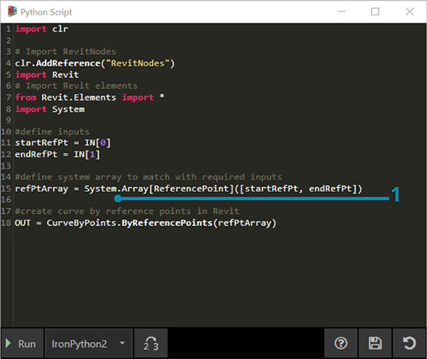
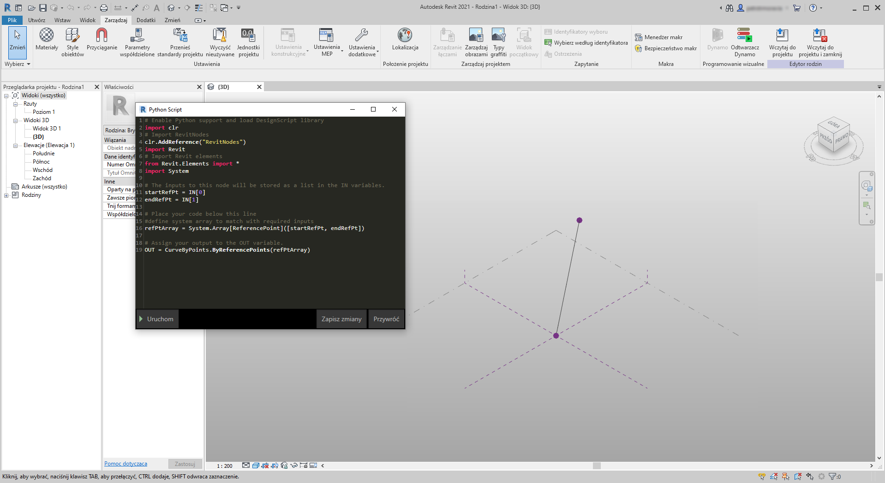
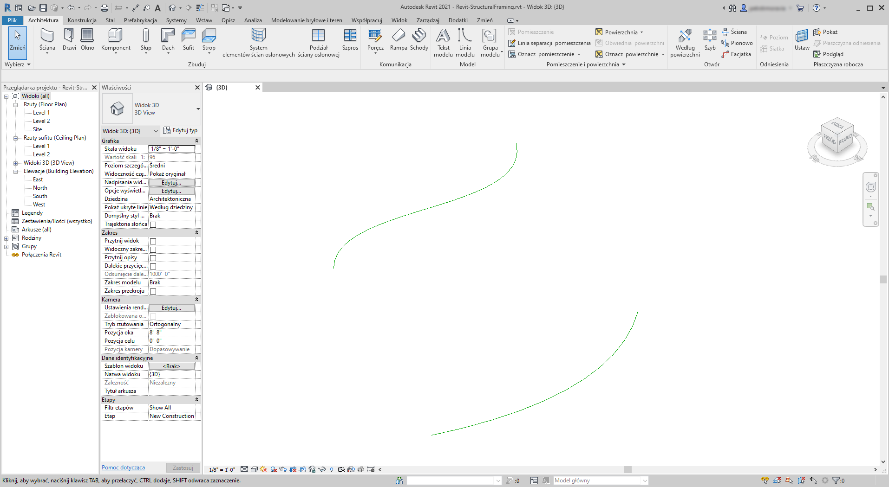
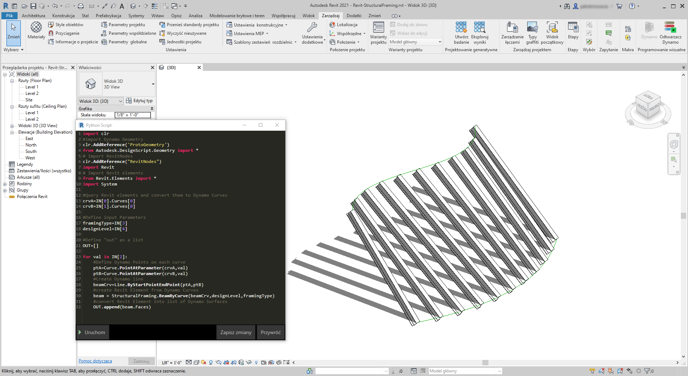

## Python i Revit

Zaprezentowaliśmy, jak używać skryptów w języku Python w dodatku Dynamo. Przyjrzyjmy się teraz połączeniu bibliotek programu Revit w środowisku skryptowym. Za pomocą trzech pierwszych wierszy bloku kodu poniżej zaimportowaliśmy węzły podstawowe dodatku Dynamo. Aby zaimportować węzły programu Revit, elementy programu Revit oraz menedżera dokumentów programu Revit, wystarczy tylko dodać kilka innych wierszy:

```
import clr
clr.AddReference('ProtoGeometry')
from Autodesk.DesignScript.Geometry import *

# Import RevitNodes
clr.AddReference("RevitNodes")
import Revit

# Import Revit elements
from Revit.Elements import *

# Import DocumentManager
clr.AddReference("RevitServices")
import RevitServices
from RevitServices.Persistence import DocumentManager

import System
```

Zapewnia to dostęp do interfejsu API programu Revit i obsługę skryptów niestandardowych dla dowolnego zadania programu Revit. Połączenie programowania wizualnego z obsługą skryptów z użyciem interfejsu API programu Revit znacznie usprawnia współpracę i opracowywanie narzędzi. Na przykład menedżer BIM i projektant schematów mogą współpracować na tym samym wykresem. W ramach tej współpracy mogą poprawić projekt i realizację modelu.


### Interfejsy API dla konkretnych platform

Zadaniem projektu Dynamo jest poszerzenie zakresu wdrożeń na platformach. W miarę dodawania do wykazu dodatku Dynamo kolejnych programów użytkownicy uzyskują dostęp do interfejsów API dla konkretnych platform ze środowiska obsługi skryptów w języku Python. Mimo że w tej sekcji analizujemy program Revit, przewidujemy przygotowanie w przyszłości kolejnych rozdziałów, które będą zawierać kompleksowe samouczki dotyczące tworzenia skryptów na innych platformach. Ponadto dostępnych jest teraz wiele bibliotek [IronPython](http://ironpython.net/), które można importować do dodatku Dynamo.

Poniższe przykłady ilustrują sposoby implementowania operacji specyficznych dla programu Revit z dodatku Dynamo za pomocą języka Python. Aby zapoznać się z bardziej szczegółowym omówieniem powiązania języka Python z dodatkiem Dynamo i programem Revit, zobacz [stronę wiki dodatku Dynamo](https://github.com/DynamoDS/Dynamo/wiki/Python-0.6.3-to-0.7.x-Migration). Innym przydatnym zasobem dla języka Python i programu Revit jest projekt [Revit Python Shell](https://github.com/architecture-building-systems/revitpythonshell).

### Ćwiczenie 01

> Utwórz nowy projekt programu Revit. Pobierz plik przykładowy do tego ćwiczenia (kliknij prawym przyciskiem myszy i wybierz opcję Zapisz element docelowy jako). Pełna lista plików przykładowych znajduje się w załączniku. [Revit-Doc.dyn](datasets/10-5/Revit-Doc.dyn)

W tych ćwiczeniach omówimy podstawowe skrypty w języku Python w dodatku Dynamo dla programu Revit. W tym ćwiczeniu zostanie omówione postępowanie z plikami i elementami programu Revit oraz komunikacja między programem Revit i dodatkiem Dynamo.


> Jest to oczywista metoda pobierania pozycji *doc*, *uiapp* i *app* pliku programu Revit połączonego z sesją dodatku Dynamo. Programiści, którzy już wcześniej pracowali w interfejsie API programu Revit, mogą zauważyć te elementy na liście obserwowanych. Jeśli te elementy nie wyglądają znajomo, nie ma problemu. W ćwiczeniach poniżej będziemy korzystać z innych przykładów.

W ten sposób importujemy usługi programu Revit i pobieramy dane dokumentów w dodatku Dynamo: 

> Spojrzenie na węzeł w języku Python w dodatku Dynamo. Poniżej znajduje się skomentowany kod.

```
# Enable Python support and load DesignScript library
import clr
# Import DocumentManager
clr.AddReference("RevitServices")
import RevitServices
from RevitServices.Persistence import DocumentManager

# Place your code below this line
doc = DocumentManager.Instance.CurrentDBDocument
uiapp = DocumentManager.Instance.CurrentUIApplication
app = uiapp.Application

# Assign your output to the OUT variable.
OUT = [doc,uiapp,app]
```

### Ćwiczenie 02

> Pobierz pliki przykładowe do tego ćwiczenia (kliknij prawym przyciskiem myszy i wybierz polecenie Zapisz element docelowy jako). Pełna lista plików przykładowych znajduje się w załączniku. [Revit-ReferenceCurve.dyn](datasets/10-5/Revit-ReferenceCurve.dyn)

W tym ćwiczeniu utworzymy prostą krzywą modelu w programie Revit za pomocą węzła Dynamo w języku Python.


> Rozpocznij od zestawu węzłów na ilustracji powyżej. Najpierw utworzymy dwa punkty odniesienia w programie Revit z węzłów Dynamo.

> Rozpocznij od utworzenia nowej rodziny brył koncepcyjnych w programie Revit. Uruchom dodatek Dynamo i utwórz zestaw węzłów na ilustracji powyżej. Najpierw utworzymy dwa punkty odniesienia w programie Revit z węzłów Dynamo.

> 1. Utwórz blok kodu i nadaj mu wartość „0;”.
2. Podłącz tę wartość do węzła ReferencePoint.ByCoordinates dla wejść X, Y i Z.
3. Utwórz trzy suwaki o zakresach od -100 do 100 i kroku o wartości 1.
4. Połącz każdy suwak z węzłem ReferencePoint.ByCoordinates.
5. Dodaj węzeł w języku Python do obszaru roboczego, kliknij przycisk „+” na węźle, aby dodać kolejne wejście, i podłącz dwa punkty odniesienia do każdego wejścia. Otwórz węzeł w języku Python.



> Spojrzenie na węzeł w języku Python w dodatku Dynamo. Poniżej znajduje się skomentowany kod.

> 1. **System.Array:** program Revit wymaga jako wejścia szyku systemowego (a nie listy języka Python). To jeden więcej wiersz kodu, ale zwracanie uwagi na typy argumentów ułatwia programowanie w języku Python w programie Revit.

```
import clr

# Import RevitNodes
clr.AddReference("RevitNodes")
import Revit
# Import Revit elements
from Revit.Elements import *
import System

#define inputs
startRefPt = IN[0]
endRefPt = IN[1]

#define system array to match with required inputs
refPtArray = System.Array[ReferencePoint]([startRefPt, endRefPt])
#create curve by reference points in Revit
OUT = CurveByPoints.ByReferencePoints(refPtArray)
```



> W dodatku Dynamo utworzyliśmy za pomocą języka Python dwa punkty odniesienia z łączącą je linią. W następnym ćwiczeniu rozwiniemy to.

### Ćwiczenie 03

> Pobierz i rozpakuj pliki przykładowe do tego ćwiczenia (kliknij prawym przyciskiem myszy i wybierz polecenie Zapisz element docelowy jako). Pełna lista plików przykładowych znajduje się w załączniku. [Revit-StructuralFraming.zip](datasets/10-5/Revit-StructuralFraming.zip)

> To ćwiczenie jest proste, ale pozwala wyjaśnić tematy łączenia danych i geometrii z programu Revit do dodatku Dynamo i odwrotnie. Zacznijmy od otwarcia pliku Revit-StructuralFraming.rvt. Po jego otwarciu wczytaj dodatek Dynamo i otwórz plik Revit-StructuralFraming.dyn.



> Ten plik programu Revit jest tak prosty, jak to tylko możliwe. Dwie krzywe odniesienia: jedna narysowana na poziomie 1, a druga na poziomie 2. Chcemy umieścić te krzywe w dodatku Dynamo i utrzymać aktywne połączenie.


> W tym pliku znajduje się zestaw węzłów podłączonych do pięciu wejść węzła w języku Python.

> 1. **Wybierz węzły elementów modelu:** naciśnij przycisk wyboru dla każdego z nich i wybierz odpowiednią krzywą w programie Revit.
2. **Code Block:** za pomocą składni *„0..1..#x;”* połącz suwak liczby całkowitej o zakresie od 0 do 20 z wejściem *x*. Ta opcja określa liczbę belek do narysowania między dwiema krzywymi.
3. **Typy ram konstrukcyjnych:** z menu rozwijanego wybierzemy domyślną belkę W12x26.
4. **Poziomy:** wybierz „Poziom 1”.


> Ten kod w języku Python jest nieco gęściejszy, ale komentarze znajdujące się w kodzie opisują to, co się dzieje w tym procesie:

```
import clr
#import Dynamo Geometry
clr.AddReference('ProtoGeometry')
from Autodesk.DesignScript.Geometry import *
# Import RevitNodes
clr.AddReference("RevitNodes")
import Revit
# Import Revit elements
from Revit.Elements import *
import System

#Query Revit elements and convert them to Dynamo Curves
crvA=IN[0].Curves[0]
crvB=IN[1].Curves[0]

#Define input Parameters
framingType=IN[3]
designLevel=IN[4]

#Define "out" as a list
OUT=[]

for val in IN[2]:
#Define Dynamo Points on each curve
ptA=Curve.PointAtParameter(crvA,val)
ptB=Curve.PointAtParameter(crvB,val)
#Create Dynamo line
beamCrv=Line.ByStartPointEndPoint(ptA,ptB)
#create Revit Element from Dynamo Curves
beam = StructuralFraming.BeamByCurve(beamCrv,designLevel,framingType)
#convert Revit Element into list of Dynamo Surfaces
OUT.append(beam.Faces)
```



> W programie Revit mamy szyk belek obejmujący dwie krzywe jako elementy konstrukcyjne. Uwaga: nie jest to realistyczny przykład — elementy konstrukcyjne są używane jako przykład dla natywnych wystąpień programu Revit utworzonych z dodatku Dynamo.  Również w dodatku Dynamo można wyświetlić wyniki. Belki w węźle Watch3D odnoszą się do geometrii przywołanej z elementów programu Revit.

Warto zauważyć, że mamy ciągły proces przekształcania danych ze środowiska programu Revit do środowiska dodatku Dynamo. Podsumowując: oto przebieg tego procesu:

1. Wybierz element programu Revit
2. Przekształć element programu Revit w krzywą Dynamo
3. Podziel krzywą Dynamo na serię punktów Dynamo
4. Użyj punktów Dynamo między dwiema krzywymi, aby utworzyć linie Dynamo
5. Utwórz belki programu Revit przez odniesienie do linii Dynamo
6. Wygeneruj wyjściowe powierzchnie Dynamo przez zastosowanie zapytania do geometrii belek programu Revit

Może to wydawać się nieco skomplikowane, ale skrypt sprawia, że wystarczy edytować krzywą w programie Revit i ponownie uruchomić solwer (chociaż może być konieczne usunięcie poprzednich belek). *Jest to spowodowane faktem, że umieszczamy belki za pomocą języka Python, przez co przerywamy powiązanie węzłów OOTB.*


> Po zaktualizowaniu krzywych odniesienia w programie Revit uzyskuje się nowy szyk belek.

