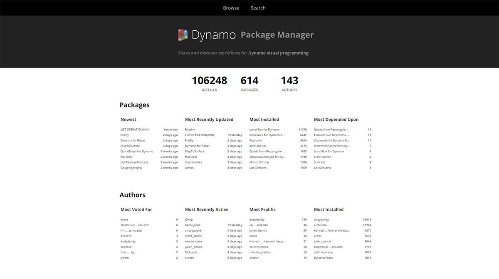
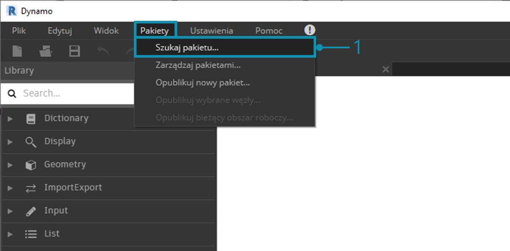
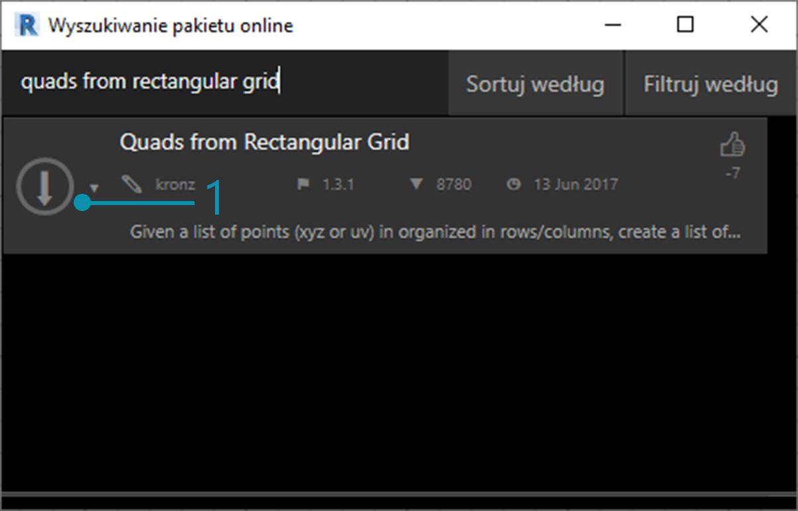
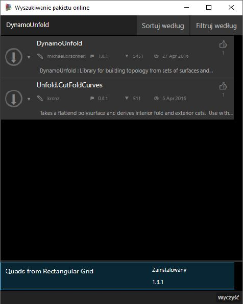
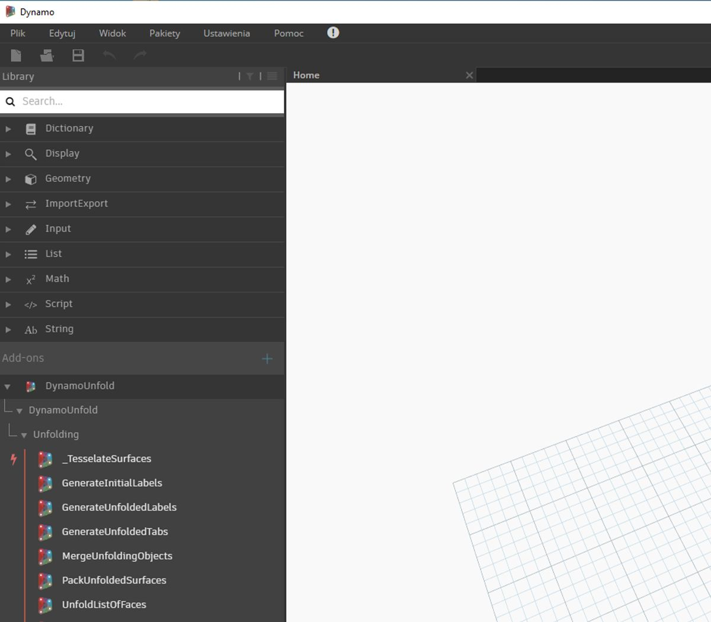
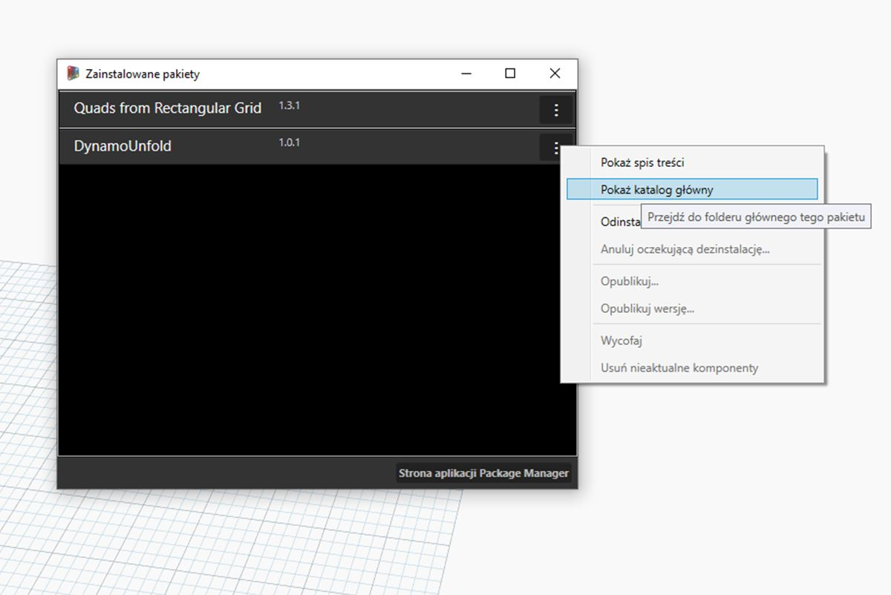
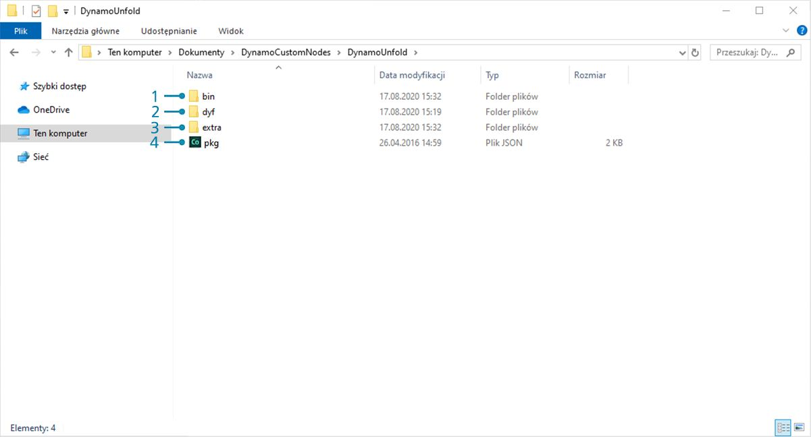
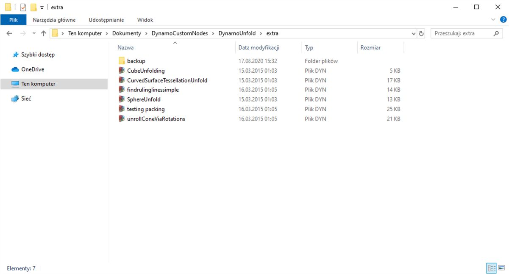
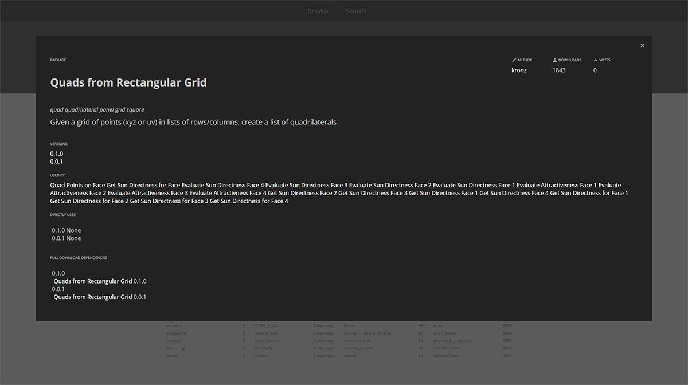

## Pakiety

W skrócie: pakiet jest zbiorem węzłów niestandardowych. Dynamo Package Manager to portal dla społeczności umożliwiający pobranie dowolnego pakietu, który został opublikowany online. Te zestawy narzędzi zostały opracowane przez strony trzecie w celu rozszerzenia podstawowej funkcjonalności dodatku Dynamo i są dostępne dla wszystkich. Są gotowe do pobrania po kliknięciu przycisku.

Projekt open-source, taki jak dodatek Dynamo, rozwija się dzięki takiemu zaangażowaniu społeczności. Dzięki zaangażowanym programistom zewnętrznym dodatek Dynamo może rozszerzyć zasięg na procesy robocze w różnych branżach. Z tego powodu zespół dodatku Dynamo podjął skoncentrowane wysiłki w celu usprawnienia opracowywania i publikowania pakietów (zostanie to omówione bardziej szczegółowo w kolejnych sekcjach).

### Instalowanie pakietu

Najprostszym sposobem instalacji pakietu jest użycie paska narzędzi Pakiety w interfejsie dodatku Dynamo. Przejdźmy od razu do rzeczy i zainstalujmy pakiet teraz. W tym szybkim przykładzie zainstalujemy popularny pakiet umożliwiający tworzenie paneli czworokątnych na siatce. 

> 1. W dodatku Dynamo przejdź do obszaru *Pakiety > Wyszukaj pakiet*.

> Na pasku wyszukiwania wyszukaj frazę „quads from rectangular grid”. Po kilku chwilach powinny pojawić się wszystkie pakiety zgodne z tym zapytaniem. Wybierzmy pierwszy pakiet z pasującą nazwą.

> 1. Kliknij strzałkę pobierania po lewej stronie nazwy pakietu, a pakiet zostanie zainstalowany. Gotowe.

> 1. Zwróć uwagę, że w bibliotece Dynamo pojawiła się kolejna grupa o nazwie *„buildz”*. Ta nazwa odnosi się do [programisty](http://buildz.blogspot.com/) pakietu, a węzeł niestandardowy zostaje umieszczony w tej grupie. Możemy od razu zacząć z niego korzystać.

> Za pomocą szybkiej operacji bloku kodu definiującej siatki prostokątnej utworzyliśmy listę paneli prostokątnych.

### Foldery pakietu

W powyższym przykładzie skupiono się na pakiecie z jednym węzłem niestandardowym, ale ten sam proces jest używany do pobierania pakietów z kilkoma węzłami niestandardowymi i plikami danych pomocniczych. Zademonstrujmy to teraz z wszechstronniejszym pakietem: Dynamo Unfold.

> Tak jak w przykładzie powyżej, rozpocznij od wybrania opcji *Pakiety > Wyszukaj pakiet*. Tym razem poszukamy jednego słowa, *„DynamoUnfold”*, zwracając uwagę na wielkość liter. Po wyświetleniu pakietów pobierz pakiet, klikając strzałkę po lewej stronie nazwy pakietu. Pakiet Dynamo Unfold zostanie teraz zainstalowany w bibliotece Dynamo.

> W bibliotece Dynamo dostępna jest grupa *DynamoUnfold* z wieloma kategoriami i węzłami niestandardowymi.

> Spójrzmy teraz na strukturę plików pakietu. Wybierz opcję *Pakiety > Zarządzaj pakietami* w dodatku Dynamo. Powyżej pojawi się okno z dwiema zainstalowanymi bibliotekami. Kliknij przycisk po prawej stronie pozycji *DynamoUnfold* i wybierz opcję *„Pokaż katalog główny”*.

> Spowoduje to przejście do katalogu głównego pakietu. Zwróć uwagę, że mamy 3 foldery i plik.

> 1. Folder *bin* zawiera pliki .dll. Ten pakiet Dynamo został opracowany przy użyciu narzędzia Zero-Touch, więc węzły niestandardowe są przechowywane w tym folderze.
2. Folder *dyf* zawiera węzły niestandardowe. Ten pakiet nie został opracowany przy użyciu węzłów niestandardowych Dynamo, dlatego ten folder jest w przypadku tego pakietu pusty.
3. Ten dodatkowy folder zawiera wszystkie dodatkowe pliki, w tym pliki przykładowe.
4. Plik pkg jest podstawowym plikiem tekstowym definiującym ustawienia pakietu. Na razie możemy to zignorować.

> Po otwarciu folderu *„extra”* zostaje wyświetlona seria plików przykładowych, które zostały pobrane wraz z instalacją. Nie wszystkie pakiety zawierają pliki przykładowe, ale jeśli są one częścią pakietu, można je znaleźć tutaj. Otwórzmy plik *„SphereUnfold”*.

> Po otwarciu pliku i naciśnięciu przycisku *„Uruchom”* w solwerze dostępna jest rozwinięta sfera. Pliki przykładowe są przydatne do nauki pracy z nowym pakietem Dynamo.

### Menedżer pakietów Dynamo

Innym sposobem odkrywania pakietów Dynamo jest zapoznanie się z [menedżerem pakietów Dynamo](http://dynamopackages.com/) online. Jest to dobry sposób przeglądania w poszukiwaniu pakietów, ponieważ repozytorium sortuje pakiety w kolejności ich pobierania i popularności. Jest również łatwym sposobem na gromadzenie informacji o najnowszych aktualizacjach pakietów, ponieważ w przypadku niektórych pakietów Dynamo ma zastosowanie obsługa wersji i zależności kompilacji dodatku Dynamo.

> Klikając opcję *„Quads from Rectangular Grid”* w Menedżerze pakietów Dynamo, można wyświetlić odpowiednie opisy, wersje, informacje o programiście i możliwe zależności.

Pliki pakietu można również pobrać z Menedżera pakietów Dynamo, ale robienie tego bezpośrednio z poziomu dodatku Dynamo stanowi płynniejszy proces.

### Gdzie lokalnie są przechowywane pliki?

Jeśli pobierasz pliki z Menedżera pakietów Dynamo lub chcesz zobaczyć, gdzie są przechowywane wszystkie pliki pakietu, kliknij kolejno opcje *Ustawienia > Zarządzaj ścieżkami do węzłów i pakietów*. Klikając wielokropek znajdujący się obok katalogu folderów, można skopiować folder główny i przejść do pakietu w oknie eksploratora. Domyślnie pakiety są instalowane w położeniu podobnym do tej ścieżki folderu: *C:/Users/[nazwa_użytkownika]/AppData/Roaming/Dynamo/[wersja dodatku Dynamo]*.

### Dalsze kroki z pakietami

Społeczność dodatku Dynamo stale rośnie i ewoluuje. Przeglądając Menedżera pakietów Dynamo od czasu do czasu, znajdziesz nowe interesujące rozwiązania. W poniższych sekcjach przyjrzymy się dokładniej pakietom: od perspektywy użytkownika końcowego po perspektywę twórcy własnego pakietu Dynamo.

