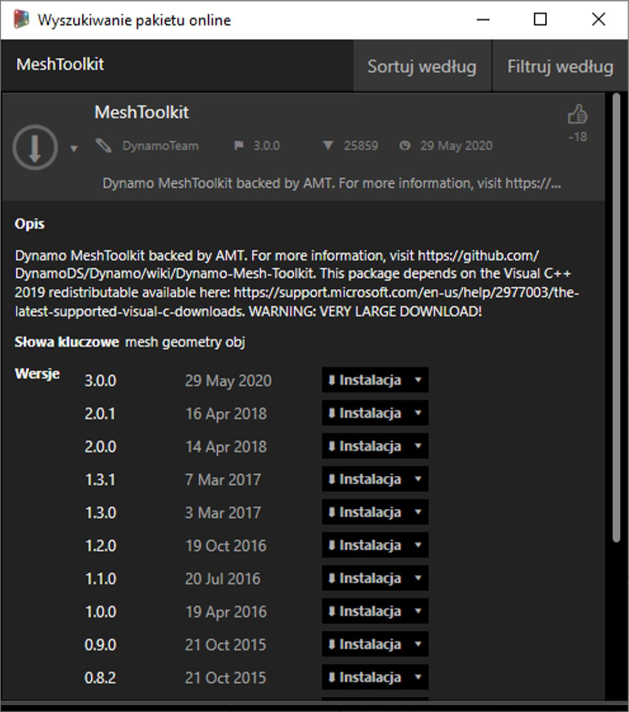

## Analiza przypadku pakietu — zestaw Mesh Toolkit

Zestaw Dynamo Mesh Toolkit zawiera narzędzia do importowania siatek z zewnętrznych formatów plików, tworzenia siatki z obiektów geometrii Dynamo oraz ręcznego tworzenia siatek na podstawie wierzchołków i indeksów. Ta biblioteka zawiera również narzędzia do modyfikowania siatek, naprawiania siatek i wyodrębniania warstw poziomych do użycia w produkcji.

Zestaw narzędzi Dynamo Mesh Toolkit jest częścią nieustających badań firmy Autodesk nad siatką, więc w nadchodzących latach będzie się rozwijać. Należy spodziewać się częstego dodawania do zestawu nowych metod. Zachęcamy też do kierowania do zespołu Dynamo komentarzy, informacji o błędach i sugestii dotyczących nowych funkcji.

### Siatki a bryły

W poniższym ćwiczeniu przedstawiono niektóre podstawowe operacje na siatce przeprowadzane za pomocą zestawu Mesh Toolkit. W tym ćwiczeniu przetniemy siatkę serią płaszczyzn, co w przypadku używania brył może być kosztowne z punktu widzenia obliczeń. W przeciwieństwie do bryły siatka ma stałą „rozdzielczość” i nie jest zdefiniowana matematycznie, lecz topologicznie. Tę rozdzielczość można zdefiniować na podstawie bieżącego zadania. Aby uzyskać więcej informacji na temat relacji między siatką a bryłami, zapoznaj się z rozdziałem [Geometria w projektowaniu obliczeniowym](../05_Geometry-for-Computational-Design/5_geometry-for-computational-design.md) tego przewodnika. Bardziej dogłębną analizę zestawu Mesh Toolkit można znaleźć na [stronie wiki dodatku Dynamo.](https://github.com/DynamoDS/Dynamo/wiki/Dynamo-Mesh-Toolkit) Przejdźmy do pakietu w ćwiczeniu poniżej.

### Instalowanie zestawu Mesh Toolkit

> W dodatku Dynamo przejdź do obszaru *Pakiety > Wyszukaj pakiety...* na górnym pasku menu. W polu wyszukiwania wpisz *„MeshToolkit”* (jedno słowo), pamiętając o wielkich literach. Kliknij strzałkę pobierania odpowiedniego pakietu dla używanej wersji dodatku Dynamo. To wystarczy.

### Ćwiczenie

> Pobierz i rozpakuj pliki przykładowe do tego ćwiczenia (kliknij prawym przyciskiem myszy i wybierz polecenie Zapisz łącze jako). Pełna lista plików przykładowych znajduje się w załączniku. [MeshToolkit.zip](datasets/11-2/MeshToolkit.zip)

Rozpocznij od otwarcia pliku *Mesh-Toolkit_Intersect-Mesh.dyn w dodatku Dynamo.* W tym przykładzie przyjrzymy się węzłowi Intersect w zestawie Mesh Toolkit. Zaimportujemy siatkę i przetniemy ją szeregiem płaszczyzn wejściowych, aby utworzyć warstwy. Jest to punkt wyjścia do przygotowania modelu do produkcji na przecinarce laserowej, wodnej lub frezarce CNC.

> 1. **File Path:** odszukaj plik siatki do zaimportowania (*stanford_bunny_tri.obj*). Obsługiwane typy plików to .mix i .obj
2. **Mesh.ImportFile:** połącz ścieżkę pliku w celu zaimportowania siatki.

> 1. **Point.ByCoordinates:** utwórz punkt — będzie to środek łuku.
2. **Arc.ByCenterPointRadiusAngle:** utwórz łuk wokół punktu. Ta krzywa zostanie użyta do rozmieszczenia szeregu płaszczyzn.

> 1. Code Block: utwórz zakres liczb od 0 do 1.
2. **Curve.PointAtParameter:** połącz łuk z wejściem *„curve”* i wyjście bloku kodu z wejściem *„param”*, aby wyodrębnić szereg punktów wzdłuż krzywej.
3. **Curve.TangentAtParameter:** połącz te same wejścia co w poprzednim węźle.
4. **Plane.ByOriginNormal:** połącz punkty z wejściem *„origin”* i wektory z wejściem *„normal”*, aby utworzyć szereg płaszczyzn w każdym punkcie.

Powinien być teraz widoczny szereg płaszczyzn zorientowanych wzdłuż łuku. Następnie użyjemy tych płaszczyzn do przecięcia siatki.

> 1. **Mesh.Intersect:** utwórz przecięcie płaszczyzn z zaimportowaną siatką, tworząc szereg konturów polikrzywej.
2. **PolyCurve.Curves:** rozbij polikrzywe na zakrzywione fragmenty.
3. **Curve.EndPoint:** wyodrębnij punkty końcowe każdej krzywej.
4. **NurbsCurve.ByPoints:** użyj punktów do utworzenia krzywej NURBS. Użyj węzła Boolean ustawionego na *True*, aby zamknąć krzywe.

> 1. **Surface.ByPatch:** utwórz ścieżki powierzchni dla każdego konturu, aby utworzyć „warstwy” siatki.

> Dodaj drugi zestaw warstw, aby uzyskać efekt wafla.

Można zauważyć, że operacje przecięcia są dla siatki wykonywane szybciej niż dla porównywalnej bryły. Procesy robocze, takie jak ten przedstawiony w tym ćwiczeniu, dobrze nadają się do stosowania siatek.

