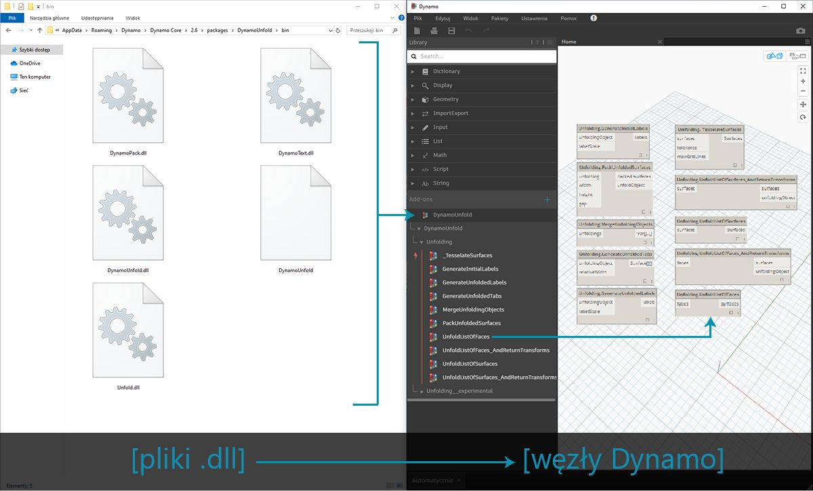
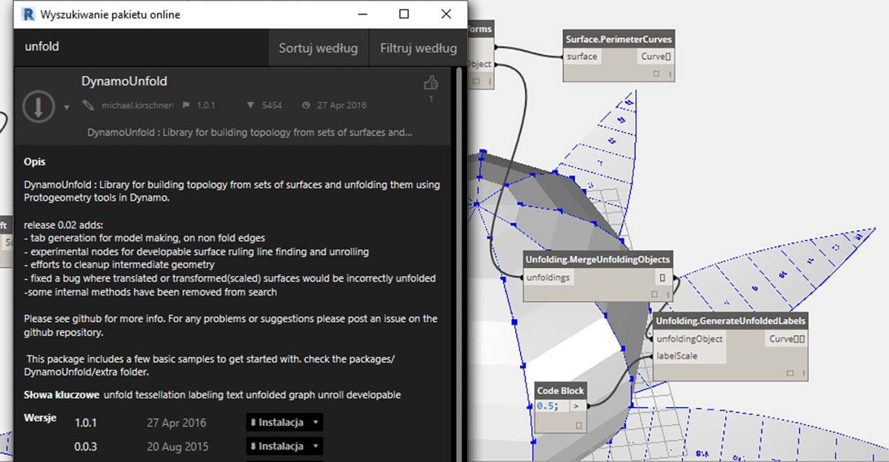
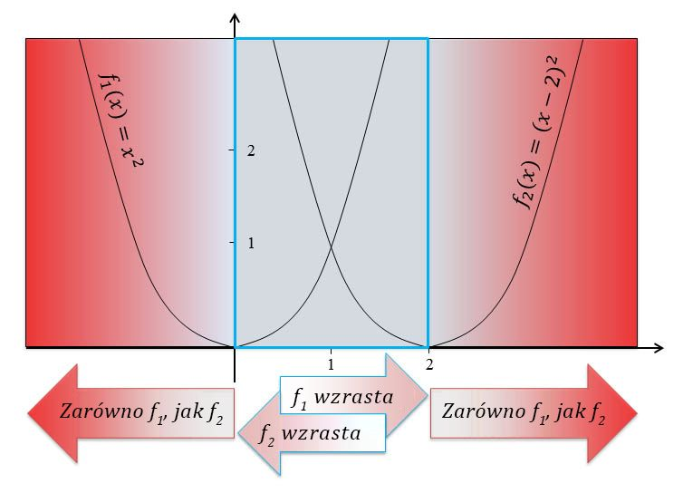
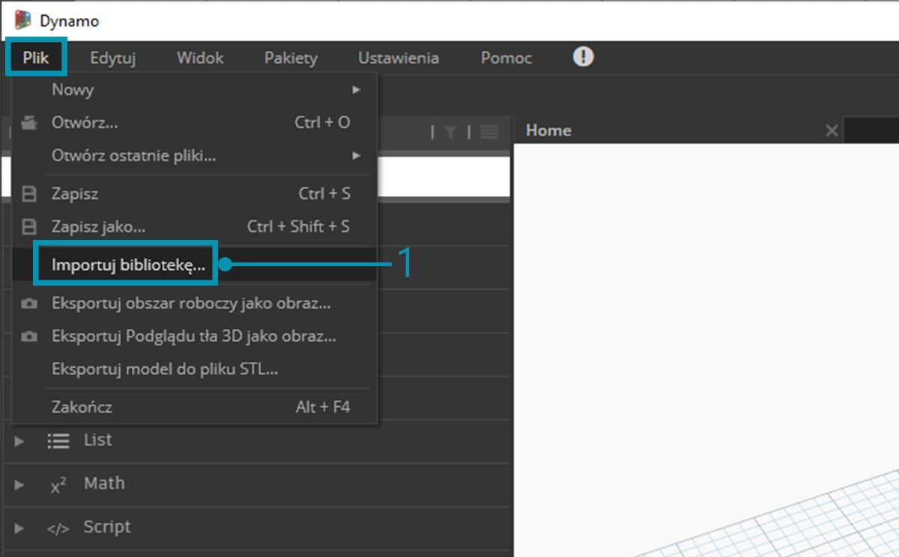
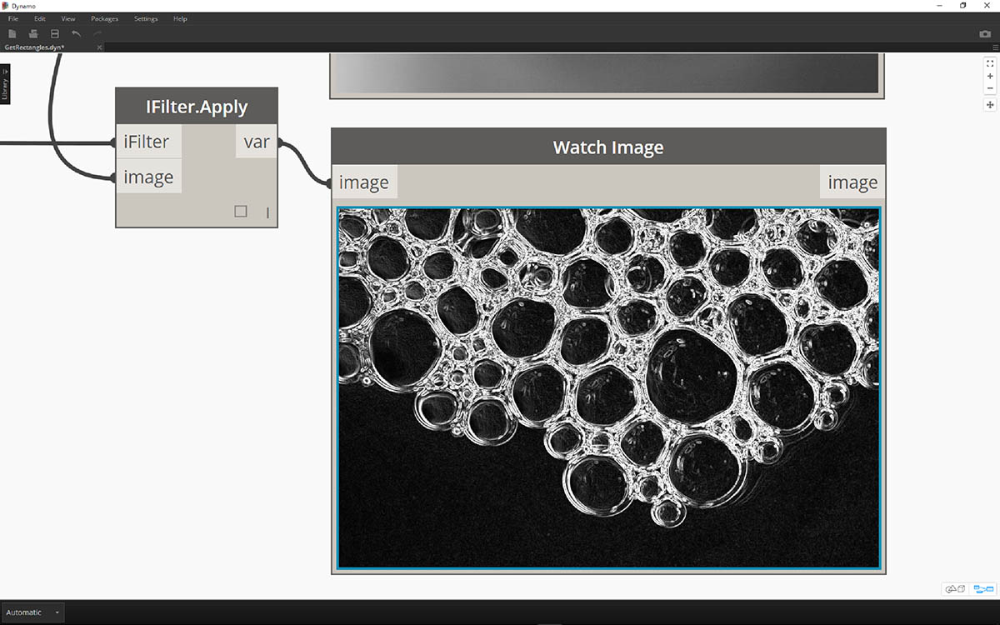
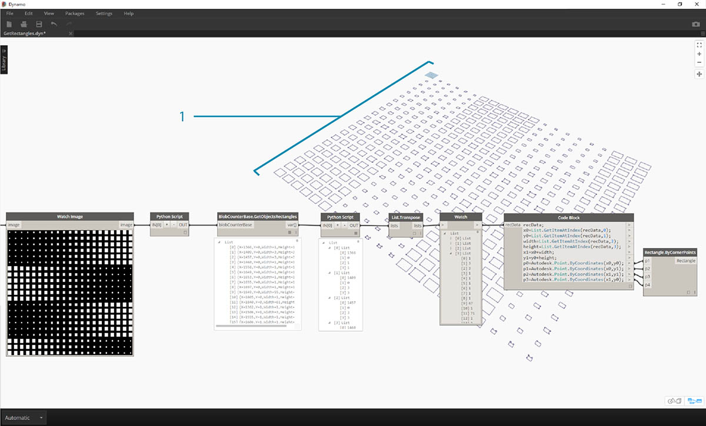
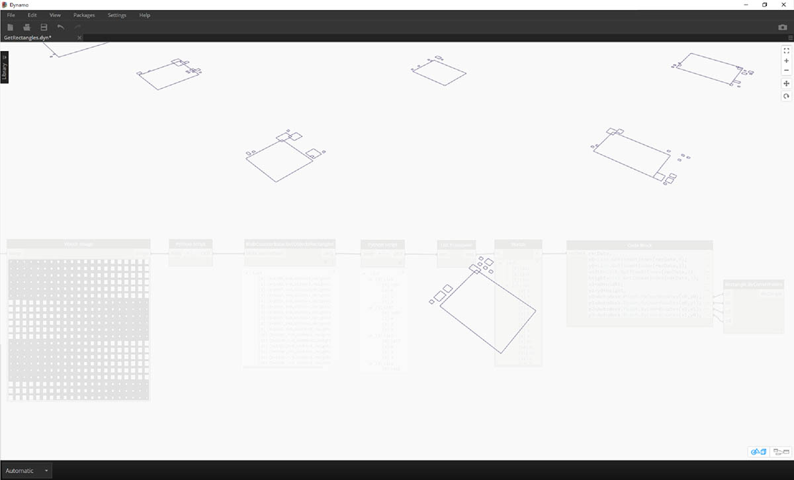
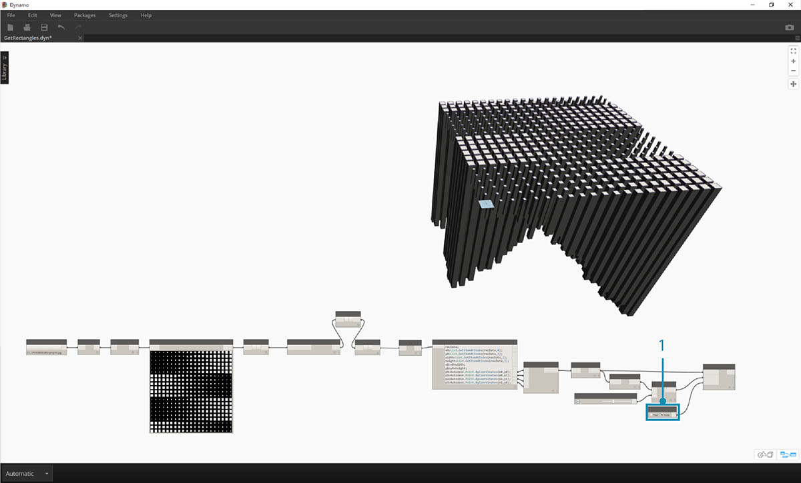

<style>
table{box-shadow: 2px 2px 2px #BBBBBB;max-width:75%;display:block;margin-left: auto;   margin-right: auto }
thead {display: none}
img{display:block;margin-left: auto;   margin-right: auto }
</style>

## Co to jest Zero-Touch?

Importowanie Zero-Touch to prosta metoda importowania bibliotek C# przez wskazanie i kliknięcie. Dodatek Dynamo odczyta publiczne metody z pliku *.dll* i przekonwertuje je na węzły Dynamo. Można użyć funkcji Zero-Touch, aby tworzyć własne węzły i pakiety niestandardowe, a także importować biblioteki zewnętrzne do środowiska Dynamo.



Za pomocą funkcji Zero-Touch można nawet zaimportować bibliotekę, która nie została opracowana dla dodatku Dynamo, i utworzyć pakiet nowych węzłów. Obecne działanie funkcji Zero-Touch pokazuje międzyplatformowy charakter projektu Dynamo.

W tej sekcji przedstawiono sposób użycia funkcji Zero-Touch w celu zaimportowania biblioteki innej firmy. Aby uzyskać informacje na temat tworzenia własnej biblioteki Zero-Touch, zobacz [stronę wiki dodatku Dynamo](https://github.com/DynamoDS/Dynamo/wiki/Zero-Touch-Plugin-Development).

### Pakiety Zero-Touch

Pakiety Zero-Touch stanowią dobre uzupełnienie węzłów niestandardowych zdefiniowanych przez użytkownika. W poniższej tabeli wymieniono kilka pakietów używających bibliotek C#. Aby uzyskać więcej informacji na temat pakietów, zobacz [sekcję Pakiety](../Appendix/A-3_packages.md) w Załączniku.


<table width="100%">
    <tr>
    <td width="20%"><b>Logo/obraz</b></td>
    <td><b>Nazwa</b></td>
</tr>
  <tr>
    <td></img></td>
    <td><a href="https://github.com/DynamoDS/Dynamo/wiki/Dynamo-Mesh-Toolkit">Mesh Toolkit</td></a>
  </tr>
  <tr>
    <td></img></td>
    <td><a href="http://dynamobim.com/dynamounfold/">Dynamo Unfold</td></a>
  </tr>
  <tr>
    <td></img></td>
    <td><a href="http://www.case-inc.com/blog/what-is-rhynamo">Rhynamo</td></a>
  </tr>
  <tr>
    <td></img></td>
    <td><a href="https://github.com/BPOpt/Optimo">Optimo</td></a>
  </tr>
</table>

### Analiza przypadku — importowanie biblioteki AForge

W tej analizie przypadku pokazano, jak zaimportować zewnętrzną bibliotekę *.dll* [AForge](http://www.aforgenet.com/). AForge to rozbudowana biblioteka, która zapewnia szeroką gamę funkcji, od przetwarzania obrazu po sztuczną inteligencję. Na potrzeby poniższych ćwiczeń dotyczących przetwarzania obrazu skorzystamy z klasy Imaging w bibliotece AForge.

> Pobierz i rozpakuj pliki przykładowe do tej analizy przypadku (kliknij prawym przyciskiem myszy i wybierz polecenie Zapisz element docelowy jako). Pełna lista plików przykładowych znajduje się w Załączniku. [Zero-Touch-Examples.zip](datasets/11-5/Zero-Touch-Examples.zip).

> 1. Najpierw należy pobrać bibliotekę AForge. Na [stronie pobierania biblioteki AForge](http://www.aforgenet.com/framework/downloads.html) wybierz opcję *[Download Installer]* (Pobierz instalator) i zainstaluj bibliotekę po zakończeniu pobierania.



> 1. W dodatku Dynamo utwórz nowy plik i wybierz kolejno opcje *Plik > Importuj bibliotekę*


> 1. W wyskakującym okienku przejdź do folderu Release w instalacji biblioteki AForge. Prawdopodobnie będzie on się znajdował w folderze podobnym do tego: *C:\Program Files (x86)\AForge.NET\Framework\Release*.
2. **AForge.Imaging.dll:** W tej analizie przypadku użyjemy tylko tego pliku z biblioteki AForge. Wybierz ten plik *.dll* i kliknij przycisk *„Otwórz”.*


> 1. W dodatku Dynamo grupa węzłów *„AForge”* powinna zostać dodana do paska narzędzi Biblioteka. Teraz mamy dostęp do biblioteki przetwarzania obrazów AForge z poziomu programu wizualnego.

### Ćwiczenie 1 — wykrywanie krawędzi

Po zaimportowaniu biblioteki można wykonać proste pierwsze ćwiczenie. Wykonamy kilka podstawowych operacji na obrazie przykładowym, aby pokazać, w jaki sposób działają filtry obrazu biblioteki AForge. Użyjemy węzła *„Watch Image”*, aby wyświetlić wyniki i zastosować filtry w dodatku Dynamo, podobne do tych w programie Photoshop.

> Pobierz i rozpakuj pliki przykładowe do tej analizy przypadku (kliknij prawym przyciskiem myszy i wybierz polecenie Zapisz element docelowy jako). Pełna lista plików przykładowych znajduje się w Załączniku. [ZeroTouchImages.zip](datasets/11-5/ZeroTouchImages.zip)

Po zaimportowaniu biblioteki można wykonać proste pierwsze ćwiczenie (*01-EdgeDetection.dyn*). Wykonamy kilka podstawowych operacji na obrazie przykładowym, aby pokazać, w jaki sposób działają filtry obrazu biblioteki AForge. Użyjemy węzła *„Watch Image”*, aby wyświetlić wyniki i zastosować filtry w dodatku Dynamo, podobne do tych w programie Photoshop


> Najpierw należy zaimportować obraz, nad którym będziemy pracować. Dodaj węzeł *File Path* do obszaru rysunku i wybierz plik „soapbubbles.jpg” z pobranego folderu ćwiczenia (źródło zdjęcia: [flickr](https://www.flickr.com/photos/wwworks/667298782)).


> 1. Węzeł File Path zawiera po prostu ciąg ścieżki do wybranego obrazu. Należy przekształcić tę ścieżkę pliku na obraz w środowisku Dynamo.
2. Połącz węzeł File Path z węzłem File.FromPath.
3. Aby przekształcić ten plik na obraz, należy użyć węzła Image.ReadFromFile.
4. Teraz zobaczmy wynik. Upuść węzeł Watch Image na obszarze rysunku i połącz go z węzłem Image.ReadFromFile. Nie użyliśmy jeszcze biblioteki AForge, ale pomyślnie zaimportowaliśmy obraz do dodatku Dynamo.


> W obszarze AForge.Imaging.AForge.Filters (w menu nawigacji) można zauważyć, że dostępna jest szeroka gama filtrów. Użyjemy teraz jednego z tych filtrów, aby zdesaturować obraz na podstawie wartości progowych.

> 1. Upuść trzy suwaki na obszarze rysunku, zmień ich zakresy na 0–1, a ich wartości kroku na 0,01.
2. Dodaj węzeł Grayscale.Grayscale do obszaru rysunku. Jest to filtr biblioteki AForge, który stosuje filtr skali szarości do obrazu. Połącz trzy suwaki z kroku 1 z elementami „cr”, „cg” i „cb”. Ustaw wartość górnego i dolnego suwaka na 1, a wartość środkowego suwaka na 0.
3. Aby zastosować filtr skali szarości, należy wykonać czynność na obrazie. W tym celu użyjemy węzła IFilter.Apply. Połącz obraz z elementem wejściowym „image”, a węzeł Grayscale.Grayscale z elementem wejściowym „iFilter”.
4. Po połączeniu z węzłem Watch Image otrzymujemy zdesaturowany obraz.


> Możemy określać sposób desaturacji obrazu za pomocą wartości progowych dla kolorów czerwonego, zielonego i niebieskiego. Są one definiowane przez elementy wejściowe węzła Grayscale.Grayscale. Można zauważyć, że obraz jest dość ciemny — jest to spowodowane tym, że suwak koloru zielonego jest ustawiony na wartość 0.

> 1. Ustaw wartość górnego i dolnego suwaka na 0, a wartość środkowego suwaka na 1. W ten sposób można uzyskać bardziej czytelny zdesaturowany obraz.


> Użyjemy teraz zdesaturowanego obrazu i zastosujemy na nim kolejny filtr. Obraz po desaturacji jest kontrastowy, więc przetestujemy wykrywanie krawędzi.

> 1. Dodaj węzeł SobelEdgeDetector.SobelEdgeDetector do obszaru rysunku. Połącz go jako element IFilter z nowym węzłem IFilter, a zdesaturowany obraz połącz z elementem wejściowym „image” węzła IFilter.
2. Detektor krawędzi Sobel wyróżnił krawędzie na nowym obrazie.



> Po powiększeniu widać, że detektor krawędzi wyróżnił obrysy bąbelków pikselami. Biblioteka AForge zawiera narzędzia umożliwiające utworzenie geometrii dodatku Dynamo na podstawie takich wyników. Zobaczymy to w następnym ćwiczeniu.

### Ćwiczenie 2 — tworzenie prostokątów

> Pobierz i rozpakuj pliki przykładowe do tej analizy przypadku (kliknij prawym przyciskiem myszy i wybierz polecenie Zapisz element docelowy jako). Pełna lista plików przykładowych znajduje się w Załączniku. [ZeroTouchImages.zip](datasets/11-5/ZeroTouchImages.zip)

Po przedstawieniu podstawowych informacji o przetwarzaniu obrazu możemy użyć obrazu do utworzenia geometrii dodatku Dynamo. Na podstawowym poziomie w tym ćwiczeniu chcemy uzyskać efekt *„aktywnego obrysu”* obrazu za pomocą biblioteki AForge i dodatku Dynamo. Aby uprościć to zadanie, wyodrębnimy prostokąty z obrazu referencyjnego, ale w bibliotece AForge dostępne są też narzędzia do bardziej złożonych operacji. Użyjemy pliku *02-RectangleCreation.dyn* pobranego na potrzeby ćwiczenia.


> 1. Za pomocą węzła File Path przejdź do pliku grid.jpg w folderze ćwiczenia.
2. Połącz pozostałe węzły powyżej, aby wyświetlić ćwiczeniową siatkę parametryczną.

W następnym kroku chcemy odwołać się do białych kwadratów na obrazie i przekonwertować je na rzeczywistą geometrię dodatku Dynamo. Biblioteka AForge zawiera wiele wydajnych narzędzi do przetwarzania obrazów, a tutaj użyjemy szczególnie ważnego narzędzia z tej biblioteki o nazwie [BlobCounter](http://www.aforgenet.com/framework/docs/html/d7d5c028-7a23-e27d-ffd0-5df57cbd31a6.htm).


> 1. Po dodaniu węzła BlobCounter do obszaru rysunku potrzebny jest sposób na przetworzenie obrazu (podobnie jak w poprzednim ćwiczeniu z narzędziem IFilter). Niestety węzeł „Process Image” nie jest widoczny w bibliotece Dynamo. Jest tak, ponieważ ta funkcja może nie być widoczna w kodzie źródłowym biblioteki AForge. Aby to naprawić, trzeba znaleźć obejście.


> 1. Dodaj węzeł Python do obszaru rysunku.

```
import clr
clr.AddReference('AForge.Imaging')
from AForge.Imaging import *

bc= BlobCounter()
bc.ProcessImage(IN[0])
OUT=bc
```

> Dodaj powyższy kod do węzła Python. Ten kod umożliwia zaimportowanie biblioteki AForge, a następnie przetworzenie zaimportowanego obrazu.


> Połączenie elementu wyjściowego „image” z elementem wejściowym węzła Python powoduje uzyskanie wyniku AForge.Imaging.BlobCounter z węzła Python.

W następnych krokach zastosujemy pewne sposoby pokazujące znajomość [interfejsu AForge Imaging API](http://www.aforgenet.com/framework/docs/html/d087503e-77da-dc47-0e33-788275035a90.htm). Nie trzeba znać ich wszystkich, aby pracować z dodatkiem Dynamo. Jest to raczej pokaz pracy z zewnętrznymi bibliotekami, możliwej dzięki elastyczności środowiska Dynamo.


> 1. Połącz element wyjściowy węzła Python Script z węzłem BlobCounterBase.GetObjectRectangles. Dzięki temu obiekty na obrazie zostaną odczytane na podstawie wartości progowej, a następnie obliczone prostokąty zostaną wyodrębnione z zakresu pikseli.


> 1. Dodaj kolejny węzeł Python do obszaru rysunku, połącz go z węzłem GetObjectRectangles i wprowadź poniższy kod. Spowoduje to utworzenie uporządkowanej listy obiektów Dynamo.

```
OUT = []
for rec in IN[0]:
subOUT=[]
subOUT.append(rec.X)
subOUT.append(rec.Y)
subOUT.append(rec.Width)
subOUT.append(rec.Height)
OUT.append(subOUT)
```


> 1. Zastosuj funkcję Transpose do wyniku węzła Python z poprzedniego kroku. Spowoduje to utworzenie 4 list przedstawiających parametry X, Y, szerokość i wysokość poszczególnych prostokątów.
2. Za pomocą węzła Code Block uporządkujemy te dane w strukturę odpowiednią dla węzła Rectangle.ByCornerPoints (kod poniżej).

```
recData;
x0=List.GetItemAtIndex(recData,0);
y0=List.GetItemAtIndex(recData,1);
width=List.GetItemAtIndex(recData,2);
height=List.GetItemAtIndex(recData,3);
x1=x0+width;
y1=y0+height;
p0=Autodesk.Point.ByCoordinates(x0,y0);
p1=Autodesk.Point.ByCoordinates(x0,y1);
p2=Autodesk.Point.ByCoordinates(x1,y1);
p3=Autodesk.Point.ByCoordinates(x1,y0);
```



> Po pomniejszeniu zobaczymy szyk prostokątów reprezentujących białe kwadraty z obrazu. Dzięki programowaniu uzyskaliśmy efekt (mniej więcej) podobny do funkcji Live Trace w programie Illustrator.



> Wciąż jednak trzeba go trochę oczyścić. Po powiększeniu widzimy wiele małych, niepotrzebnych prostokątów.


> 1. Pozbędziemy się niepotrzebnych prostokątów przez wstawienie węzła Python między węzłem GetObjectRectangle a kolejnym węzłem Python. Kod węzła, który znajduje się poniżej, umożliwia usunięcie wszystkich prostokątów poniżej danego rozmiaru.

```
rectangles=IN[0]
OUT=[]
for rec in rectangles:
if rec.Width>8 and rec.Height>8:
OUT.append(rec)
```


> Po usunięciu niepotrzebnych prostokątów dla zabawy utworzymy powierzchnię z otrzymanych prostokątów i wyciągniemy je na odległość zależną od ich wielkości.



> 1. Na koniec zmienimy element wejściowy both_sides na wartość „false”, aby uzyskać wyciągnięcie w jednym kierunku. Wystarczy zanurzyć tę bryłę w żywicy, aby powstał naprawdę niesamowity stolik.

Są to podstawowe przykłady, ale przedstawione tutaj koncepcje można przełożyć na ciekawe rzeczywiste zastosowania. Przetwarzanie obrazów można wykorzystać w bardzo wielu procesach. Jako przykłady można przytoczyć czytniki kodów kreskowych, dopasowywanie perspektywy, [mapping przestrzenny](https://www.youtube.com/watch?v=XSR0Xady02o) i [rzeczywistość rozszerzoną](http://aforgenet.com/aforge/articles/gratf_ar/). Bardziej zaawansowane tematy dotyczące biblioteki AForge, używanej w tym ćwiczeniu, zostały omówione w [tym artykule](http://aforgenet.com/articles/shape_checker/).

