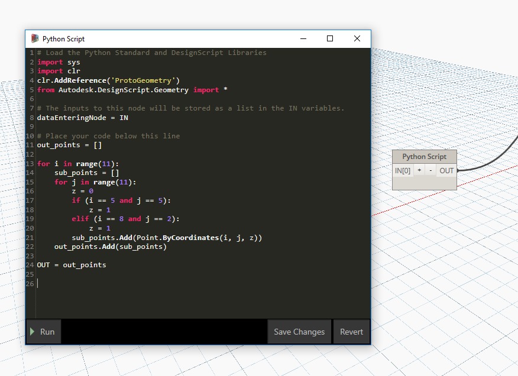

# Generatory punktów w języku Python

Poniższe skrypty w języku Python generują szyki punktów dla kilku przykładów. Powinny zostać wklejone do węzła skryptu w języku Python w następujący sposób:



**punkty_w_języku_python_1**

```
out_points = []

for i in range(11):
sub_points = []
for j in range(11):
z = 0
if (i == 5 and j == 5):
z = 1
elif (i == 8 and j == 2):
z = 1
sub_points.Add(Point.ByCoordinates(i, j, z))
out_points.Add(sub_points)

OUT = out_points
```

**punkty_w_języku_python_2**

```
out_points = []

for i in range(11):
z = 0
if (i == 2):
z = 1
out_points.Add(Point.ByCoordinates(i, 0, z))

OUT = out_points
```

**punkty_w_języku_python_3**

```
out_points = []

for i in range(11):
z = 0
if (i == 7):
z = -1
out_points.Add(Point.ByCoordinates(i, 5, z))

OUT = out_points
```

**punkty_w_języku_python_4**

```
out_points = []

for i in range(11):
z = 0
if (i == 5):
z = 1
out_points.Add(Point.ByCoordinates(i, 10, z))

OUT = out_points
```

**punkty_w_języku_python_5**

```
out_points = []

for i in range(11):
sub_points = []
for j in range(11):
z = 0
if (i == 1 and j == 1):
z = 2
elif (i == 8 and j == 1):
z = 2
elif (i == 2 and j == 6):
z = 2
sub_points.Add(Point.ByCoordinates(i, j, z))
out_points.Add(sub_points)

OUT = out_points
```

