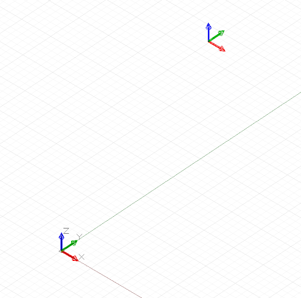

# Geometryczne obiekty elementarne

Dodatek Dynamo umożliwia tworzenie różnych złożonych form geometrycznych, ale geometryczne obiekty elementarne tworzą podstawę każdego projektu obliczeniowego: są wyrażone bezpośrednio w ostatecznej postaci projektowej lub służą jako rusztowanie, z których generowana jest bardziej złożona geometria.

Obiekt CoordinateSystem, choć nie jest właściwym fragmentem geometrii, jest ważnym narzędziem do tworzenia geometrii. Obiekt CoordinateSystem śledzi zarówno przekształcenia położenia i geometryczne, takie jak obrót, pion i skalowanie.

Utworzenie obiektu CoordinateSystem wyśrodkowanego w punkcie x = 0, y = 0 i z = 0 bez rotacji, skalowania ani przekształceń pionowych wymaga po prostu wywołania konstruktora tożsamości:


```js
// create a CoordinateSystem at x = 0, y = 0, z = 0,
// no rotations, scaling, or sheering transformations

cs = CoordinateSystem.Identity();
```

Obiekty CoordinateSystem z transformacjami geometrycznymi wykraczają poza zakres tego rozdziału, choć warto wspomnieć, że inny konstruktor umożliwia utworzenie układu współrzędnych w określonym punkcie: *CoordinateSystem.ByOriginVectors*:



```js
// create a CoordinateSystem at a specific location,
// no rotations, scaling, or sheering transformations
x_pos = 3.6;
y_pos = 9.4;
z_pos = 13.0;

origin = Point.ByCoordinates(x_pos, y_pos, z_pos);
identity = CoordinateSystem.Identity();

cs = CoordinateSystem.ByOriginVectors(origin,
    identity.XAxis, identity.YAxis, identity.ZAxis);
```

Najprostszym geometrycznym obiektem elementarnym jest punkt (Point), reprezentujący położenie zero-wymiarowe w przestrzeni trójwymiarowej. Jak wspomniano wcześniej, istnieje kilka sposobów utworzenia punktu w konkretnym układzie współrzędnych: *Point.ByCoordinates* tworzy punkt o określonych współrzędnych x, y i z; *Point.ByCartesianCoordinates* tworzy punkt z określonymi współrzędnymi x, y i z w określonym układzie współrzędnych; *Point.ByCylindricalCoordinates* tworzy punkt leżący na walcu o danych promieniu, kącie obrotu i wysokości; a *Point.BySphericalCoordinates* tworzy punkt leżący na sferze o danych promieniu i dwóch kątach obrotu.

W tym przykładzie przedstawiono punkty utworzone w różnych układach współrzędnych:


```js
// create a point with x, y, and z coordinates
x_pos = 1;
y_pos = 2;
z_pos = 3;

pCoord = Point.ByCoordinates(x_pos, y_pos, z_pos);

// create a point in a specific coordinate system
cs = CoordinateSystem.Identity();
pCoordSystem = Point.ByCartesianCoordinates(cs, x_pos,
    y_pos, z_pos);

// create a point on a cylinder with the following
// radius and height
radius = 5;
height = 15;
theta = 75.5;

pCyl = Point.ByCylindricalCoordinates(cs, radius, theta,
    height);

// create a point on a sphere with radius and two angles

phi = 120.3;

pSphere = Point.BySphericalCoordinates(cs, radius, 
    theta, phi);
```

Kolejnym obiektem elementarnym wyższego wymiaru w dodatku Dynamo jest segment linii reprezentujący nieskończoną liczbę punktów między dwoma punktami końcowymi. Linie można tworzyć przez jawne określenie dwóch punktów obwiedni za pomocą konstruktora *Line.ByStartPointEndPoint* lub przez określenie punktu początkowego, kierunku i długości w tym kierunku: *Line.ByStartPointDirectionLength*.


```js
p1 = Point.ByCoordinates(-2, -5, -10);
p2 = Point.ByCoordinates(6, 8, 10);

// a line segment between two points
l2pts = Line.ByStartPointEndPoint(p1, p2); 

// a line segment at p1 in direction 1, 1, 1 with 
// length 10
lDir = Line.ByStartPointDirectionLength(p1,
    Vector.ByCoordinates(1, 1, 1), 10);
```

Dodatek Dynamo zawiera obiekty reprezentujące najbardziej podstawowe typy geometrycznych obiektów elementarnych w trzech wymiarach: prostopadłościany, tworzone za pomocą *Cuboid.ByLengths*; stożki tworzone za pomocą *Cone.ByPointsRadius* i *Cone.ByPointsRadii*; walce tworzone za pomocą *Cylinder.ByRadiusHeight*; oraz sfery tworzone za pomocą *Sphere.ByCenterPointRadius*.


```js
// create a cuboid with specified lengths
cs = CoordinateSystem.Identity();

cub = Cuboid.ByLengths(cs, 5, 15, 2);

// create several cones
p1 = Point.ByCoordinates(0, 0, 10);
p2 = Point.ByCoordinates(0, 0, 20);
p3 = Point.ByCoordinates(0, 0, 30);

cone1 = Cone.ByPointsRadii(p1, p2, 10, 6);
cone2 = Cone.ByPointsRadii(p2, p3, 6, 0);

// make a cylinder
cylCS = cs.Translate(10, 0, 0);

cyl = Cylinder.ByRadiusHeight(cylCS, 3, 10);

// make a sphere
centerP = Point.ByCoordinates(-10, -10, 0);

sph = Sphere.ByCenterPointRadius(centerP, 5);
```

