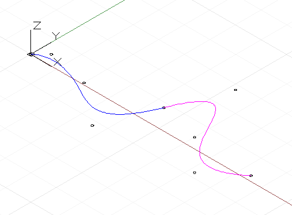

# Krzywe: interpolowane i punkty kontrolne

W dodatku Dynamo istnieją dwa podstawowe sposoby tworzenia krzywych o dowolnych kształtach: określanie kolekcji punktów i interpolowanie gładkiej krzywej między nimi za pomocą dodatku Dynamo oraz metoda niższego poziomu polegająca na określeniu bazowych punktów kontrolnych krzywej o określonym stopniu. Krzywe interpolowane są przydatne, gdy projektant dokładnie wie, jaką postać powinna przyjąć linia, lub gdy projekt ma specyficzne ograniczenia dotyczące tego, przez co krzywa może i nie może przechodzić. Krzywe określone za pomocą punktów kontrolnych są w istocie serią segmentów linii prostej, które algorytm wygładza do końcowej postaci krzywej. Określenie krzywej za pomocą punktów sterujących może być przydatne w przypadku badania postaci krzywych o różnych stopniach wygładzenia lub gdy wymagana jest gładka ciągłość między segmentami krzywej.

Aby utworzyć krzywą interpolowaną, wystarczy przekazać kolekcję punktów do metody *NurbsCurve.ByPoints*.


```js
num_pts = 6;

s = Math.Sin(0..360..#num_pts) * 4;

pts = Point.ByCoordinates(1..30..#num_pts, s, 0);

int_curve = NurbsCurve.ByPoints(pts);
```

Wygenerowana krzywa przecina każdy z punktów wejściowych, zaczynając i kończąc odpowiednio na pierwszym i ostatnim punkcie w kolekcji. Opcjonalny parametr okresowy pozwala utworzyć krzywą okresową, która jest zamknięta. Dodatek Dynamo automatycznie wypełni brakujący segment, dlatego powielony punkt końcowy (identyczny z punktem początkowym) nie jest potrzebny.


```js
pts = Point.ByCoordinates(Math.Cos(0..350..#10),
    Math.Sin(0..350..#10), 0);

// create an closed curve
crv = NurbsCurve.ByPoints(pts, true);

// the same curve, if left open:
crv2 = NurbsCurve.ByPoints(pts.Translate(5, 0, 0),
    false);
```

Krzywe NurbsCurve są generowane w ten sam sposób, przy czym punkty wejściowe reprezentują punkty końcowe segmentu linii prostej, a drugi parametr, nazywany stopniem, określa wielkość i typ wygładzania krzywej.* Krzywa stopnia 1. nie ma wygładzenia; to polilinia.


```js
num_pts = 6;

pts = Point.ByCoordinates(1..30..#num_pts,
    Math.Sin(0..360..#num_pts) * 4, 0);

// a B-Spline curve with degree 1 is a polyline
ctrl_curve = NurbsCurve.ByControlPoints(pts, 1);
```

Krzywa stopnia 2. zostaje wygładzona w taki sposób, że przecina i jest styczna do punktu środkowego segmentów polilinii:


```js
num_pts = 6;

pts = Point.ByCoordinates(1..30..#num_pts,
    Math.Sin(0..360..#num_pts) * 4, 0);

// a B-Spline curve with degree 2 is smooth
ctrl_curve = NurbsCurve.ByControlPoints(pts, 2);
```

Dodatek Dynamo obsługuje krzywe NURBS (niejednorodne wymierne B-splajn) do 20. stopnia, a poniższy skrypt ilustruje wpływ zwiększającego się poziomu wygładzania na kształt krzywej:


```js
num_pts = 6;

pts = Point.ByCoordinates(1..30..#num_pts,
    Math.Sin(0..360..#num_pts) * 4, 0);

def create_curve(pts : Point[], degree : int) 
{
	return = NurbsCurve.ByControlPoints(pts,
        degree);
}

ctrl_crvs = create_curve(pts, 1..11);
```

Należy zwrócić uwagę, że musi istnieć co najmniej jeden punkt kontrolny więcej niż wynosi stopień krzywej.

Inną zaletą tworzenia krzywych przez wierzchołki kontrolne jest możliwość utrzymania styczności między poszczególnymi segmentami krzywej. Odbywa się to przez wyodrębnienie kierunku między dwoma ostatnimi punktami kontrolnymi i kontynuowanie tego kierunku z dwoma pierwszymi punktami kontrolnymi kolejnej krzywej. W poniższym przykładzie tworzone są dwie oddzielne krzywe NURBS, które mimo to są gładkie jak jedna krzywa:



```js
pts_1 = {};

pts_1[0] = Point.ByCoordinates(0, 0, 0);
pts_1[1] = Point.ByCoordinates(1, 1, 0);
pts_1[2] = Point.ByCoordinates(5, 0.2, 0);
pts_1[3] = Point.ByCoordinates(9, -3, 0);
pts_1[4] = Point.ByCoordinates(11, 2, 0);

crv_1 = NurbsCurve.ByControlPoints(pts_1, 3);

pts_2 = {};

pts_2[0] = pts_1[4];
end_dir = pts_1[4].Subtract(pts_1[3].AsVector());

pts_2[1] = Point.ByCoordinates(pts_2[0].X + end_dir.X,
    pts_2[0].Y + end_dir.Y, pts_2[0].Z + end_dir.Z);

pts_2[2] = Point.ByCoordinates(15, 1, 0);
pts_2[3] = Point.ByCoordinates(18, -2, 0);
pts_2[4] = Point.ByCoordinates(21, 0.5, 0);

crv_2 = NurbsCurve.ByControlPoints(pts_2, 3);
```

* Jest to bardzo uproszczony opis geometrii krzywej NURBS. Aby uzyskać dokładniejsze i bardziej szczegółowe omówienie, skorzystaj z dokumentacji w odniesieniach: Pottmann i inni, 2007 r.

