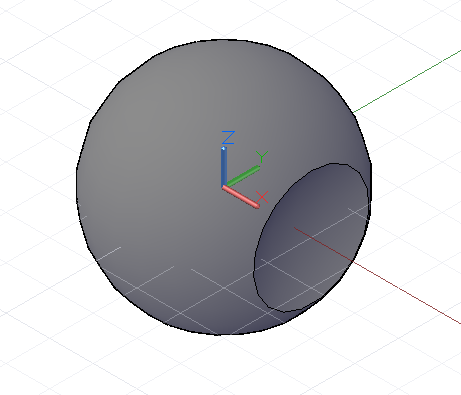

# Geometryczne wartości logiczne

Metody *Intersect*, *Trim* i *SelectTrim* są używane przede wszystkim na geometriach niższych wymiarów, takich jak punkty, krzywe i powierzchnie. Natomiast geometria brył ma dodatkowy zestaw metod do modyfikowania postaci po jej utworzeniu, zarówno przez odjęcie materiału w sposób podobny do zastosowania metody *Trim*, jak i przez połączenie elementów w celu utworzenia większej części.

Metoda *Union* pobiera dwa obiekty brył i tworzy pojedynczy obiekt bryły z przestrzeni objętej tymi dwoma obiektami. Przestrzeń wspólna między obiektami jest łączona w postać końcową. W tym przykładzie kula i prostopadłościan łączą się w pojedynczy kształt bryły złożonej z kuli i sześcianu:


```
s1 = Sphere.ByCenterPointRadius(
CoordinateSystem.Identity().Origin, 6);

s2 = Sphere.ByCenterPointRadius(
CoordinateSystem.Identity().Origin.Translate(4, 0,
0), 6);

combined = s1.Union(s2);
```

Metoda *Difference*, podobnie jak metoda *Trim*, odejmuje zawartość bryły wejściowej od bryły bazowej. W tym przykładzie tworzymy małe wcięcie w sferze:



```
s = Sphere.ByCenterPointRadius(
CoordinateSystem.Identity().Origin, 6);

tool = Sphere.ByCenterPointRadius(
CoordinateSystem.Identity().Origin.Translate(10, 0,
0), 6);

result = s.Difference(tool);
```

Metoda *Intersect* zwraca bryłę wspólną między dwiema bryłami wejściowymi. W poniższym przykładzie metodę *Difference* zmieniono na metodę *Intersect*, a wynikowa bryła to brakująca wcześniej wycięta pustka:


```
s = Sphere.ByCenterPointRadius(
CoordinateSystem.Identity().Origin, 6);

tool = Sphere.ByCenterPointRadius(
CoordinateSystem.Identity().Origin.Translate(10, 0,
0), 6);

result = s.Intersect(tool);
```

