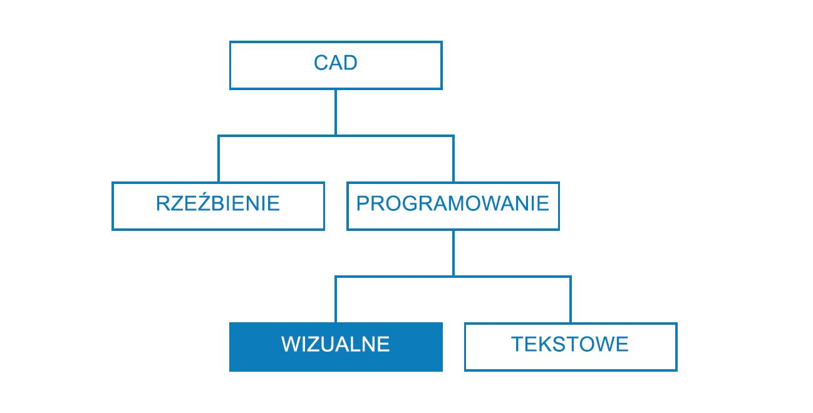
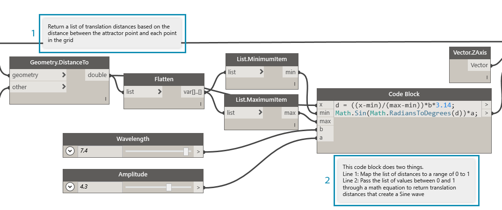
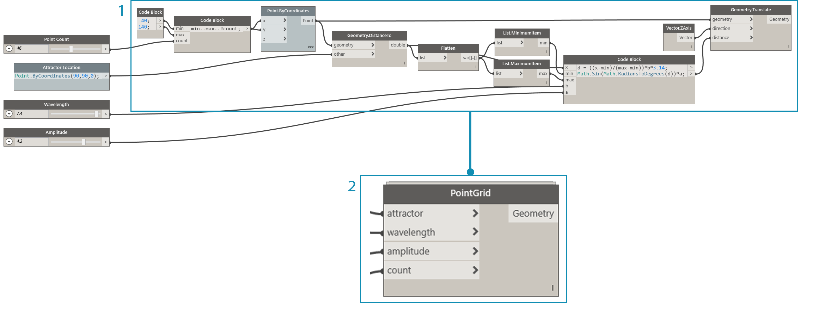
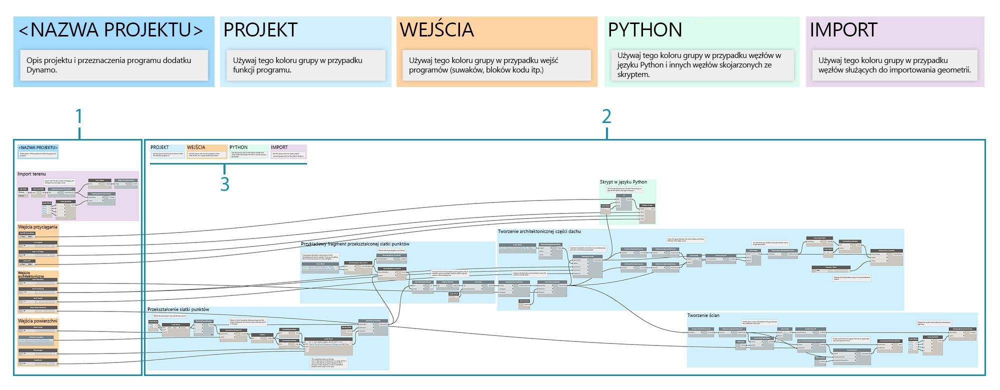

## Strategie dotyczące wykresów

Przed tym rozdziałem w tym elementarzu omówiono sposób korzystania z zaawansowanych funkcji skryptów wizualnych dostępnych w dodatku Dynamo. Zrozumienie tego systemu jest ważnym wstępem do pracy nad niezawodnymi programami wizualnymi. Kiedy programy wizualne są używane w środowisku produkcyjnym, udostępniane współpracownikom oraz badane w celu usunięcia błędów lub zbadania ich ograniczeń, powstają dodatkowe problemy wymagające rozwiązania. Jeśli opracowany program będzie używany przez inne osoby lub zamierzasz go otworzyć za kilka miesięcy, jego układ graficzny i logika muszą być od razu czytelne. Dodatek Dynamo zawiera szereg narzędzi ułatwiających obsługę złożonych programów. W tym rozdziale wyjaśniono, kiedy należy ich używać.

### Ograniczanie złożoności

Podczas pracy w programie Dynamo i testowania pomysłów wykres może szybko przybrać duży rozmiar. Choć uzyskanie działającego programu jest ważne, należy też pamiętać, że powinien on być możliwie prosty. Dzięki temu wykres będzie działać szybciej, w bardziej przewidywalny sposób, a przyszli użytkownicy łatwiej zrozumieją jego logikę. Poniżej opisano kilka metod poprawiania czytelności logiki wykresu.

#### Podział na moduły przy użyciu grup

* Grupy umożliwiają **tworzenie części o oddzielnych funkcjach** podczas pracy nad programem.
* Grupy umożliwiają **przenoszenie dużych części programów** z zachowaniem podziału na moduły i rozkładu.
* Można **zmienić kolor grupy, aby wyróżnić** grupy realizujące różne działania (obsługujące dane wejściowe lub funkcje).
* Grupy pozwalają rozpocząć **porządkowanie wykresu w celu usprawnienia pracy nad węzłami niestandardowymi**.

> Kolory w tym programie wskazują przeznaczenie poszczególnych grup. Ta strategia pozwala wprowadzić hierarchię opracowywanych standardów graficznych (szablonów).

> 1. Grupa funkcji (niebieskie)
2. Grupa danych wejściowych (pomarańczowe)
3. Grupa skryptów (zielone)
> Informacje o korzystaniu z grup można znaleźć w artykule [Zarządzanie programem](http://primer.dynamobim.org/en/03_Anatomy-of-a-Dynamo-Definition/3-4_best_practices.html).

#### Efektywne programowanie przy użyciu bloków kodu

* Czasami przy użyciu bloku kodu można **szybko wpisać numer lub metodę węzła, zamiast wyszukiwać tę informację ** (Point.ByCoordinates, Number, String, Formula).

* Bloki kodu są przydatne, **gdy trzeba zdefiniować funkcje niestandardowe w skrypcie DesignScript w celu ograniczenia liczby węzłów wykresu**.

> Bloki 1 i 2 realizują tę samą funkcję. Szybciej jest napisać kilka wierszy kodu niż wyszukiwać i dodawać poszczególne węzły. Blok kodu jest też krótszy.

> 1. Kod DesignScript w bloku kodu
2. Równoważny program w węzłach
> Informacje o korzystaniu z bloków kodu można znaleźć w artykule [Co to jest blok kodu](http://primer.dynamobim.org/en/07_Code-Block/7-1_what-is-a-code-block.html).

#### Kondensowanie przez konwersję węzłów na kod

* Aby **zmniejszyć złożoność wykresu, można przekonwertować węzły na kod**. Kolekcja prostych węzłów zostanie przekształcona w jeden blok kodu z odpowiadającym im kodem DesignScript.
* Konwersja węzłów na kod pozwala **skondensować kod z zachowaniem czytelności programu**.
* Poniżej wymieniono **zalety** konwersji węzłów na kod:
* Kod można łatwo skondensować w jeden komponent, który nadal jest dostępny do edycji.
* Pozwala uprościć znaczną część wykresu.
* Jest przydatna, gdy powstający miniprogram nie będzie często edytowany.
* Ułatwia integrowanie elementów innych bloków kodu, na przykład funkcji.

* Poniżej wymieniono **wady** konwersji węzłów na kod:
* Nazwy ogólne pogarszają czytelność wykresu.
* Utrudnia innym użytkownikom zrozumienie wykresu.
* Nie można łatwo przywrócić wersji wizualnej programu.

> 1. Istniejący program
2. Blok kodu utworzony przez konwersję węzłów na kod
> Informacje o konwersji węzłów na kod można znaleźć w artykule [Składnia języka DesignScript](http://primer.dynamobim.org/en/07_Code-Block/7-2_Design-Script-syntax.html).

#### Elastyczny dostęp do danych przy użyciu funkcji List@Level

* Funkcja List@Level umożliwia **ograniczenie złożoności wykresu przez zastąpienie węzłów List.Map i List.Combine**, które mogą zajmować dużo miejsca na obszarze projektowania.
* Funkcja List@Level oferuje **szybszą metodę tworzenia logiki węzłów niż węzły List.Map/List.Combine**. Umożliwia ona uzyskiwanie dostępu do danych na każdym poziomie listy wprost z poziomu portu wejściowego węzła.

> Można zweryfikować, ile wartości True z których list zwraca funkcja BoundingBox.Contains, aktywując funkcję List@Level dla wejścia „list” (lista) modułu CountTrue. Funkcja List@Level pozwala użytkownikowi określić, z jakiego poziomu danych wejściowych są pobierane dane. Korzystanie z funkcji List@Level jest elastyczne, efektywne i zalecane jako metoda skuteczniejsza niż stosowanie węzłów List.Map i List.Combine.

> 1. Liczenie wartości True na poziomie 2 listy
2. Liczenie wartości True na poziomie 3 listy
> Sposób korzystania z funkcji List@Level omówiono w artykule [Listy list](http://primer.dynamobim.org/en/06_Designing-with-Lists/6-3_lists-of-lists.html#list@level).

### Zachowywanie czytelności

Oprócz uproszczenia i poprawienia efektywności wykresu należy pamiętać o jego czytelności graficznej. Choć staramy się, aby wykres był intuicyjny w oparciu o grupy logiczne, relacje między węzłami mogą nie być oczywiste. Czasami dodanie prostej notatki w grupie lub zmiana nazwy suwaka pozwala wyeliminować nieporozumienia, jakie powstają podczas przeglądania wykresu. Poniżej omówiono kilka sposobów zachowywania spójności graficznej w obrębie wykresu i pomiędzy wykresami.

#### Ciągłość wizualna — wyrównywanie węzłów

* Aby ograniczyć nakłady pracy po zakończeniu tworzenia wykresu, warto zadbać o czytelność układu węzłów przez **ich częste wyrównywanie podczas tworzenia wykresu**.
* Jeśli inne osoby będą pracowały nad tym samym wykresem, należy **zagwarantować płynny przepływ połączeń między węzłami przed dostarczeniem wykresu**.
* Aby w prosty sposób wyrównać wykres, **można użyć funkcji Wyczyść układ węzłów, która robi to automatycznie** (choć mniej dokładnie niż człowiek).

> 1. Nieuporządkowany wykres
2. Wyrównany wykres
> Informacje o wyrównywaniu węzłów można znaleźć w artykule [Zarządzanie programem](http://primer.dynamobim.org/en/03_Anatomy-of-a-Dynamo-Definition/3-4_best_practices.html).

#### Opisowe etykiety — zmienianie nazw

* Zmieniając nazwy danych wejściowych, można poprawić czytelność wykresu, **szczególnie jeśli elementy połączone z wejściami znajdują się poza ekranem**.
* **Należy ostrożnie podchodzić do zmian nazw węzłów innych niż wejściowe.** Zamiast tego można utworzyć węzeł niestandardowy ze zbioru węzłów i zmienić jego nazwę. Pozwoli to wskazać, że ten węzeł zawiera coś innego.

> 1. Dane wejściowe modyfikacji powierzchni
2. Dane wejściowe parametrów architektonicznych
3. Dane wejściowe skryptu symulacji odwadniania
> Aby zmienić nazwę węzła, kliknij ją prawym przyciskiem myszy i wybierz opcję „Zmień nazwę węzła”.

#### Wyjaśnienia w notatkach

* Dodaj notatkę, jeśli **część wykresu wymaga wyjaśnienia prostym językiem**, a węzeł tego nie wyraża.
* Dodaj notatkę, jeśli **zbiór lub grupa węzłów zawiera wiele elementów lub osiąga taką złożoność, że utrudnia szybkie zrozumienie programu**.

> 1. Notatka opisująca część programu, która zwraca pierwotne odległości przekształcenia
2. Notatka opisująca kod odwzorowujący te wartości na falę sinusoidalną
> Informacje o sposobie dodawania notatek można znaleźć w artykule [Zarządzanie programem](http://primer.dynamobim.org/en/03_Anatomy-of-a-Dynamo-Definition/3-4_best_practices.html).

### Ciągłe sprawdzanie

Podczas tworzenia skryptu wizualnego ważne jest weryfikowanie, że zwracane dane są zgodne z oczekiwaniami. Nie każdy błąd lub problem powoduje natychmiastową awarię programu. Szczególnie wartości null i zerowe mogą generować błędy dopiero w innych, zależnych węzłach. Tę strategię omówiono również w kontekście skryptów tekstowych w artykule [Strategie dotyczące skryptów](http://primer.dynamobim.org/en/12_Best-Practice/13-2_Scripting-Strategies.html). Poniższa procedura pozwala zagwarantować, że zawsze powstają dane zgodne z oczekiwaniami.

#### Monitorowanie danych przy użyciu węzłów obserwacyjnych i podglądów

* Węzły obserwacyjne (Watch) i podglądy pozwalają podczas tworzenia programu **weryfikować, że ważne dane wyjściowe są zwracane zgodnie z oczekiwaniami**.

> Węzły Watch umożliwiają porównywanie:

> 1. pierwotnych odległości przekształcenia,
2. wartości przekazywanych przez równanie sinusoidy.
> Informacje o korzystaniu z mechanizmu obserwacji można znaleźć w [Bibliotece](http://primer.dynamobim.org/en/03_Anatomy-of-a-Dynamo-Definition/3-2_dynamo_libraries.html).

### Gwarantowanie możliwości wielokrotnego użycia

Jest bardzo prawdopodobne, że kiedyś inna osoba otworzy nasz program, nawet jeśli pracujemy niezależnie. Powinno wtedy być możliwe szybkie zrozumienie wymagań i wyników programu na podstawie jego wejść i wyjść. Jest to szczególnie istotne podczas programowania węzła niestandardowego, który zostanie udostępniony w społeczności Dynamo do użytku w cudzych programach. Te procedury pozwalają tworzyć niezawodne, gotowe do ponownego użycia programy i węzły.

#### Zarządzanie wejściem i wyjściem

* Aby zagwarantować czytelność i skalowalność programu, należy **używać jak najmniejszej liczby wejść i wyjść**.
* O ile to możliwe, należy **rozważyć strukturę logiczną i opracować ogólny algorytm algorytmu** przed dodaniem jakichkolwiek węzłów w obszarze projektowania. Podczas opracowywania ogólnego algorytmu należy sprawdzić, które wejścia i wyjścia będą stosowane w skryptach.

#### Osadzanie wartości wejściowych za pomocą ustawień wstępnych

* Jeśli **wykres powinien zawierać pewne opcje lub warunki**, szybki dostęp do nich zapewniają ustawienia wstępne.
* Ustawienia wstępne pozwalają też **ograniczyć złożoność wykresu przez buforowanie określonych wartości suwaków**, gdy czas działania wykresu jest długi.

> Informacje o korzystaniu z wykresów można znaleźć w artykule [Zarządzanie danymi przy użyciu ustawień wstępnych](http://primer.dynamobim.org/en/03_Anatomy-of-a-Dynamo-Definition/3-5_presets.html).

#### Umieszczanie programów w węzłach niestandardowych

* Użyj węzła niestandardowego, jeśli **program można umieścić w pojedynczym kontenerze**.
* Użyj węzła niestandardowego, jeśli **część wykresu będzie często używana ponownie** w innych programach.
* Użyj węzła niestandardowego, jeśli **pewne funkcje mają być udostępniane w społeczności Dynamo**.

> Umieszczenie całego programu przekształcającego punkty w węźle niestandardowym pozwala uzyskać niezawodny, unikalny i przenośny program, który jest o wiele łatwiejszy do zrozumienia. Odpowiednio nazwane porty wejściowe pomagają użytkownikom w zrozumieniu sposobu użycia węzła. Warto dodać opisy i podać wymagane typy poszczególnych wejść.

> 1. Istniejący program punktu przyciągania
2. Węzeł niestandardowy zawierający ten program — PointGrid
> Informacje o korzystaniu z węzłów niestandardowych można znaleźć w artykule [Wstęp do węzłów niestandardowych](http://primer.dynamobim.org/en/09_Custom-Nodes/9-1_Introduction.html).

#### Tworzenie szablonów

* Tworząc szablony, można **budować standardy graficzne obejmujące wszystkie wykresy. Spójność wizualna ułatwia współpracownikom zrozumienie wykresu**.
* W ramach szablonu można ustalić **standardowe kolory i rozmiary czcionek grup**, które ułatwiają klasyfikację typów procesów roboczych i działań na danych.
* Tworząc szablon, można nawet określić standardowe **etykiety, kolory lub różnice stylów między procesami roboczymi (dostępnymi dla użytkownika) a wewnętrznymi** na wykresie.

> 1. Interfejs programu (elementy dostępne dla użytkownika) — nazwa projektu, suwaki danych wejściowych i importowana geometria.
2. Elementy wewnętrzne programu.
3. Kategorie kolorów grup (projekt ogólny, dane wejściowe, skrypty Python, importowana geometria).

### Ćwiczenie — dach w architekturze

> Pobierz plik przykładowy do tego ćwiczenia (kliknij prawym przyciskiem myszy i wybierz opcję Zapisz element docelowy jako). Pełna lista plików przykładowych znajduje się w załączniku. [RoofDrainageSim.zip](datasets/13-2/RoofDrainageSim.zip)

Ustaliliśmy kilka wzorców postępowania, które teraz zastosujemy do utworzonego naprędce programu. Choć program poprawnie generuje dach, jego wykres jest równie złożony jak myśli autora. Nie jest w żaden sposób uporządkowany i nie zawiera opisu sposobu użycia. Stosując wzorce postępowania, uporządkujemy, opiszemy i przeanalizujemy ten program, tak aby inni użytkownicy wiedzieli, jak z niego korzystać.

> Program działa, ale jego wykres nie jest uporządkowany.

Zaczniemy od określenia, jakie są dane i jaką geometrię zwraca program.

> Zrozumienie najważniejszych zmian w danych jest kluczowe w celu ustalenia podziałów logicznych (podziału na moduły). Spróbuj zbadać resztę programu przy użyciu węzłów obserwacyjnych, aby ustalić podział na grupy przed kolejnym krokiem.

> 1. Ten blok kodu zawierający równanie matematyczne wygląda na istotny element programu. Węzeł Watch wskazuje, że zwraca on listę odległości przekształcenia.
2. Przeznaczenie tego obszaru nie jest oczywiste. Rozkład wartości True na poziomie listy L2 uzyskanym z funkcji BoundingBox.Contains oraz użycie funkcji List.FilterByBoolMask wskazują, że próbkujemy część siatki punktów.

Teraz wiemy, co robią podstawowe części programu. Umieścimy je w grupach.

> Grupy pomagają użytkownikom wizualnie odróżniać części programu.

> 1. Importowanie modelu 3D
2. Przekształcanie siatki punktów przy użyciu równania sinusoidy
3. Próbkowanie części siatki punktów
4. Tworzenie architektonicznej powierzchni dachu
5. Tworzenie szklanej ściany osłonowej

Po ustaleniu grup rozmieścimy węzły tak, aby wykres zawierał ciągły przepływ działań.

> Ciągłość wizualna ułatwia użytkownikowi zrozumienie przepływu programu i domniemanych relacji między węzłami.

Program będzie czytelniejszy, gdy dodamy kolejną warstwę ulepszeń graficznych. Dodaj notatki, aby opisać działanie danej części programu. Nadaj niestandardowe nazwy danym wejściowym. Przypisz kolory różnym typom grup.

> Te ulepszenia graficzne powiedzą użytkownikom więcej o działaniu programu. Różne kolory grup ułatwiają odróżnianie danych wejściowych od funkcji.

> 1. Notatki
2. Opisowe nazwy danych wejściowych

Zanim przystąpimy do kondensowania programu, musimy wybrać strategiczną lokalizację, w której zostanie wstawiony skrypt Python symulujący odwadnianie. Podłącz dane wyjściowe pierwszej skalowanej powierzchni dachu do odpowiedniego wejścia skryptu.

> Podjęliśmy decyzję, że skrypt zostanie zintegrowany z programem w tym miejscu, tak aby symulację odwadniania było można uruchamiać na oryginalnej, pojedynczej powierzchni dachu. Ta powierzchnia nie jest objęta podglądem, ale dzięki temu nie musimy wybierać górnej powierzchni z fazowanej polipowierzchni.

> 1. Geometria źródłowa danych wejściowych skryptu
2. Węzeł Python
3. Suwaki danych wejściowych
4. Przełącznik wł./wył.

Teraz mamy potrzebne informacje, więc możemy uprościć wykres.

> Skondensowanie kodu przy użyciu konwersji węzłów na kod i węzłów niestandardowych pozwoliło znacznie zmniejszyć rozmiar wykresu. Grupy generujące powierzchnię dachu i ściany zostały przekonwertowane na kod, ponieważ są specyficzne dla tego programu. Grupa przekształcenia punktów jest zawarta w węźle niestandardowym, gdyż może zostać użyta w innym programie. W pliku przykładowym utwórz własny węzeł niestandardowy z grupy przekształcenia punktów.

> 1. Węzeł niestandardowy, który będzie zawierał grupę „Przekształcenie siatki punktów”
2. Konwersja węzłów na kod w celu skondensowania grup „Tworzenie architektonicznej powierzchni dachu i ściany osłonowej”

W ostatnim kroku utwórz ustawienia wstępne przykładowych form dachu.

> Przede wszystkim od tych danych wejściowych zależy forma dachu. Dzięki nim użytkownicy rozumieją potencjał programu.

Nasz program z widokami przy dwóch ustawieniach wstępnych.

> Wzory odwodnienia dachu udostępniają użytkownikom widok analityczny poszczególnych ustawień wstępnych.

