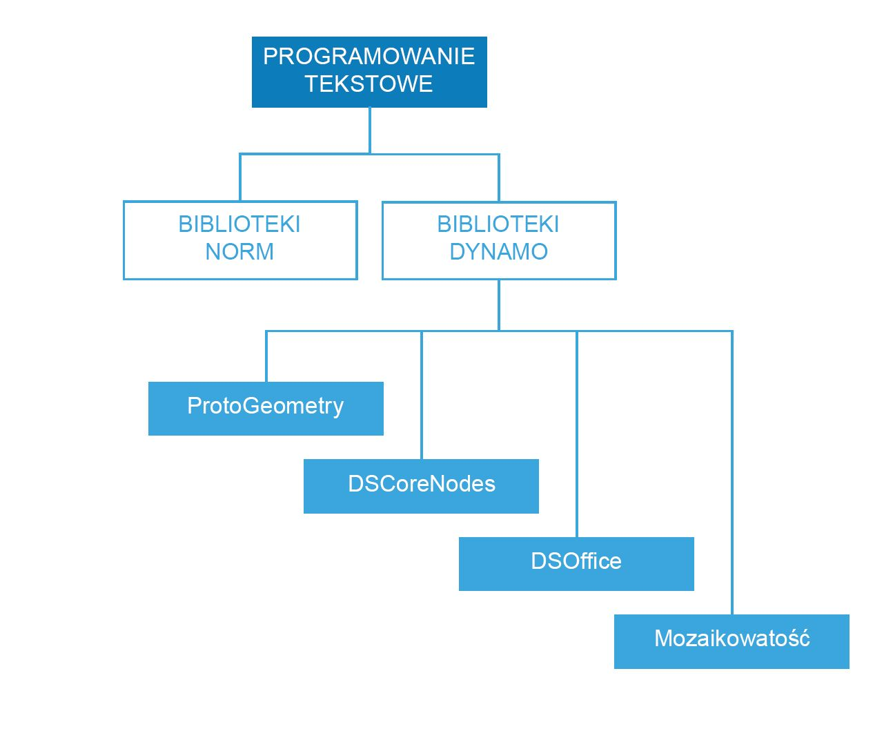

## Dokumentacja obsługi skryptów

Ta strona informacyjna stanowi rozszerzenie wzorców postępowania omówionych w strategiach dotyczących skryptów, zapewniając więcej szczegółów na temat bibliotek kodu, etykiet i stylów. Będziemy używać języka Python, aby zilustrować poniższe koncepcje, lecz te same zasady miałyby zastosowanie w języku Python i C# (Zerotouch), ale w innej składni.

### Których bibliotek należy użyć

Biblioteki standardowe są zewnętrzne wobec dodatku Dynamo i są obecne w językach programowania Python i C# (Zerotouch). Dodatek Dynamo zawiera również własny zestaw bibliotek bezpośrednio odpowiadających hierarchii węzłów, umożliwiając użytkownikowi tworzenie dowolnego kodu, który może zostać utworzony za pomocą węzłów i przewodów. Poniżej przedstawiono wskazówki na temat tego, do czego każda biblioteka Dynamo zapewnia dostęp i kiedy należy używać standardowej.



**Biblioteki standardowe i biblioteki Dynamo**

* Biblioteki standardowe z języka Python i języka C# mogą być używane do tworzenia zaawansowanych struktur danych i przepływów w środowisku dodatku Dynamo.
* Biblioteki Dynamo bezpośrednio odpowiadają hierarchii węzłów w celu tworzenia geometrii i innych obiektów Dynamo.

**Biblioteki Dynamo**

* ProtoGeometry
  * Funkcjonalność: łuk, ramka ograniczająca, okrąg, stożek, układ współrzędnych, prostopadłościan, krzywa, walec, krawędź, elipsa, łuk eliptyczny, powierzchnia, geometria, helisa, grupa indeksu, linia, siatka, krzywa nurbs, powierzchnia nurbs, płaszczyzna, punkt, wielobok, prostokąt, bryła, sfera, powierzchnia, topologia, T-splajn, UV, wektor, wierzchołek.
  * Sposób importowania: ```importowanie Autodesk.DesignScript.Geometry```
  * **Uwaga: podczas używania obiektu ProtoGeometry za pomocą języka Python lub C#** tworzone są obiekty niezarządzane, które wymagają ręcznego zarządzania pamięcią — więcej informacji znajduje się w poniższej sekcji: **Obiekty niezarządzane**.
* DSCoreNodes
  * Funkcjonalność: kolor, zakres kolorów 2D, data i godzina, przedział czasu, IO, formuła, logika, lista, matematyka, drzewo czwórkowe, ciąg, gwint.
  * Sposób importowania: ```importowanie DSCore```
* Mozaikowatość
  * Funkcjonalność: powłoka wypukła, Delaunay, Woronoj.
  * Sposób importowania: ```importowanie Tessellation```
* DSOffice
  * Funkcjonalność: Excel.
  * Sposób importowania: ```importowanie DSOffice```

### Uważne etykietowanie

Podczas tworzenia skryptów ciągle wykorzystujemy identyfikatory do oznaczania takich elementów, jak zmienne, typy, funkcje i inne elementy. Poprzez ten system symbolicznej notacji podczas tworzenia algorytmów można wygodnie korzystać z informacji poprzez etykiety — zwykle składające się z sekwencji znaków. Nazewnictwo odgrywa ważną rolę w pisaniu kodu, który jest czytelny i zrozumiały dla jego twórcy i dla innych. Poniżej przedstawiono kilka wskazówek, o których należy pamiętać podczas nazywania elementów w skrypcie:

**Używanie skrótów jest dozwolone, ale należy je objaśniać za pomocą komentarzy:**

```
### BAD
csfX = 1.6
csfY= 1.3
csfZ = 1.0
```

```
### GOOD
# column scale factor (csf)
csfX = 1.6
csfY= 1.3
csfZ = 1.0
```

**Unikaj nadmiarowego etykietowania:**

```
### BAD
import car
seat = car.CarSeat()
tire = car.CarTire()
```

```
### GOOD
import car
seat = car.Seat()
tire = car.Tire()
```

**W nazwach zmiennych używaj logiki dodatniej zamiast logiki ujemnej:**

```
### BAD
if 'mystring' not in text:
print 'not found'
else:
print 'found'
print 'processing'
```

```
### GOOD
if 'mystring' in text:
print 'found'
print 'processing'
else:
print 'not found'
```

**Preferuj „notację odwrotną”:**

```
### BAD
agents = …
active_agents = …
dead_agents ...
```

```
### GOOD
agents = …
agents_active = …
agents_dead = ...
```

> Jest sensowniejsza pod względem strukturalnym.

**Do skracania zbyt długich i często powtarzanych łańcuchów powinny być używane aliasy:**

```
### BAD
from RevitServices.Persistence import DocumentManager

DocumentManager = DM

doc = DM.Instance.CurrentDBDocument
uiapp = DM.Instance.CurrentUIApplication
```

```
### GOOD
from RevitServices.Persistence import DocumentManager as DM

doc = DM.Instance.CurrentDBDocument
uiapp = DM.Instance.CurrentUIApplication
```

> Stosowanie aliasów może szybko doprowadzić do bardzo mylących i niestandardowych programów.

**Używaj tylko niezbędnych słów:**

```
### BAD
rotateToCoord = rotateFromCoord.Rotate(solid.ContextCoordinateSystem.Origin,Vector.ByCoordinates(0,0,1),5)
```

```
### GOOD
toCoord = fromCoord.Rotate(solid.ContextCoordinateSystem.Origin,Vector.ByCoordinates(0,0,1),5)
```

> „Wszystko powinno zostać tak uproszczone, jak to tylko możliwe, ale nie bardziej”. — Albert Einstein

### Styl spójny

Ogólnie rzecz biorąc, istnieje więcej niż jeden sposób na zaprogramowanie praktycznie wszystkiego, a zatem „osobisty styl” tworzenia skryptów jest wynikiem niezliczonych małych decyzji podejmowanych (lub nie) w całym procesie. Jednocześnie czytelność i możliwości konserwacji kodu są bezpośrednio wynikiem jego wewnętrznej spójności, a także przestrzegania ogólnych konwencji stylistycznych. Według ogólnej zasady kod, który wygląda tak samo w dwóch miejscach, powinien także działać tak samo. Poniżej przedstawiono kilka wskazówek dotyczących pisania przejrzystego i spójnego kodu.

**Konwencje nazewnictwa:** (wybierz jedną z poniższych konwencji dla każdego typu elementu w kodzie i trzymaj się jej).

* Zmienne, funkcje, metody, pakiety, moduły:
`małe_litery_z_podkreśleniami`

* Klasy i wyjątki:
`WyrazyRozpoczynająceSięWielkimiLiterami`

* Metody chronione i funkcje wewnętrzne:
`_pojedyncze_wiodące_podkreślenie(self, ...)`

* Metody prywatne:
`__podwójne_wiodące_podkreślenie(self, ...)`

* Stałe:
`WIELKIE_LITERY_Z_PODKREŚLENIAMI`

> Wskazówka: unikaj zmiennych jednoliterowych (szczególnie l, O, I) z wyjątkiem w bardzo krótkich blokach, kiedy ich znaczenie jest wyraźnie widoczne z bezpośredniego kontekstu.

**Używaj pustych wierszy:**

* Otaczaj definicje funkcji i klas najwyższego poziomu dwoma pustymi wierszami.

  * Definicje metod wewnątrz klas są otoczone pojedynczym pustym wierszem.

  * Dodatkowe puste wiersze mogą być używane (sporadycznie) do oddzielenia grup powiązanych funkcji.

**Unikaj zbędnych odstępów:**

* Bezpośrednio wewnątrz nawiasów okrągłych, kwadratowych i klamrowych:

```
### BAD
function( apples[ 1 ], { oranges: 2 } )
```

```
### GOOD:
function(apples[1], {oranges: 2})
```

* Bezpośrednio przed przecinkiem, średnikiem lub dwukropkiem:

```
### BAD
if x == 2 : print x , y ; x , y = y , x
```

```
### GOOD
if x == 2: print x, y; x, y = y, x
```

* Bezpośrednio przed nawiasem otwierającym, który rozpoczyna listę argumentów wywołania funkcji:

```
### BAD
function (1)
```

```
### GOOD
function(1)
```

* Bezpośrednio przed nawiasem otwierającym, który rozpoczyna indeksowanie lub fragmentowanie:

```
### BAD
dict ['key'] = list [index]
```

```
### GOOD
dict['key'] = list[index]
```

* Zawsze otaczaj te operatory binarne pojedynczym odstępem po obu stronach:

```
assignment ( = )
augmented assignment ( += , -= etc.)
comparisons ( == , < , > , != , <> , <= , >= , in , not in , is , is not )
Booleans ( and , or , not )
```

**Przestrzegaj ograniczeń długości wiersza:**

* Nie twórz wierszy dłuższych niż około 79 znaków.

* Ograniczenie wymaganej szerokości okna edytora umożliwia otwarcie kilku plików jednocześnie obok siebie i dobrze sprawdza się podczas używania narzędzi weryfikacji kodu, które prezentują dwie wersje w sąsiednich kolumnach.

* Długie wiersze można dzielić na wiele wierszy, ujmując wyrażenia w nawiasy:

**Unikaj oczywistych i nadmiarowych komentarzy:**

* Czasami mniejsza liczba komentarzy zapewnia większą czytelność kodu. Zwłaszcza jeśli wymusza to używanie znaczących nazw symboli.

* Przyjęcie dobrych nawyków kodowania zmniejsza zależność od komentarzy:

```
### BAD
# get the country code
country_code = get_country_code(address)

# if country code is US
if (country_code == 'US'):
# display the form input for state
print form_input_state()
```

```
### GOOD
# display state selection for US users
country_code = get_country_code(address)
if (country_code == 'US'):
print form_input_state()
```

> Wskazówka: komentarze informują „dlaczego”, kod informuje „jak”.

**Sprawdź kod typu Open Source:**

* Projekty typu Open Source są wynikiem wspólnych wysiłków wielu programistów. W tych projektach trzeba utrzymywać wysoki poziom czytelności kodu, aby zespół mógł jak najsprawniej współpracować. Dlatego dobrze jest przeglądać kod źródłowy tych projektów, aby obserwować, co robią ci programiści.

* Popraw konwencje:

  * Analizuj, czy dana konwencja dobrze sprawdza się w odniesieniu do konkretnych potrzeb.

  * Czy nie pogarsza funkcjonalności/wydajności?

### Standardy języka C# (Zerotouch)

**Zapoznaj się z poniższymi stronami wiki, aby uzyskać wskazówki dotyczące pisania kodu C# dla narzędzia Zerotouch i rozwijania dodatku Dynamo:**

  * Na tej stronie wiki opisano niektóre ogólne standardy kodowania służące do dokumentowania i testowania kodu: [https://github.com/DynamoDS/Dynamo/wiki/Coding-Standards](https://github.com/DynamoDS/Dynamo/wiki/Coding-Standards)

  * Na tej stronie wiki opisano szczegółowo standardy nazewnictwa bibliotek, kategorii, nazw węzłów, nazw portów i skrótów: [https://github.com/DynamoDS/Dynamo/wiki/Naming-Standards](https://github.com/DynamoDS/Dynamo/wiki/Naming-Standards)

  **Obiekty niezarządzane:**

  W przypadku używania biblioteki geometrii dodatku Dynamo *(ProtoGeometry)* z języka Python lub geometrii C# utworzone obiekty nie będą zarządzane przez maszynę wirtualną, a pamięć wielu z tych obiektów będzie musiała zostać wyczyszczona ręcznie. Aby wyczyścić natywne lub niezarządzane obiekty, można użyć metody **Dispose** lub słowa kluczowego **using**. Na tej stronie wiki przedstawiono omówienie: [https://github.com/DynamoDS/Dynamo/wiki/Zero-Touch-Plugin-Development#dispose--using-statement](https://github.com/DynamoDS/Dynamo/wiki/Zero-Touch-Plugin-Development#dispose--using-statement).

  Wystarczy usunąć zasoby niezarządzane, które nie są zwracane w wykresie ani do których nie są zapisywane odwołania. W pozostałej części tej sekcji określamy te obiekty jako *geometrię pośrednią*. Przykład tej klasy obiektów można zobaczyć w poniższym przykładzie kodu. Ta funkcja **singleCube** w języku C# (Zerotouch) zwraca pojedynczy sześcian, ale podczas wykonywania generuje 10 000 dodatkowych sześcianów. Możemy udawać, że ta druga geometria została użyta jako pewnego rodzaju pośrednia geometria konstrukcji.

  **Ta funkcja Zerotouch najprawdopodobniej spowoduje awarię dodatku Dynamo.** Jest tak dlatego, że utworzyliśmy 10 000 brył, ale tylko jedną z nich zapisaliśmy i tę właśnie zwróciliśmy. Zamiast tego powinniśmy usunąć wszystkie sześciany pośrednie z wyjątkiem tego, który zwracamy. Nie chcemy usuwać tego, który zwracamy, ponieważ zostanie on propagowany do wykresu i będzie używany przez inne węzły.

```
public Cuboid singleCube(){

var output = Cuboid.ByLengths(1,1,1);

for(int i = 0; i<10000;i++){
output = Cuboid.ByLengths(1,1,1);
}
return output;
}
```

Kod stały może wyglądać następująco:

```
public Cuboid singleCube(){

var output = Cuboid.ByLengths(1,1,1);
var toDispose = new List<Geometry>();

for(int i = 0; i<10000;i++){
toDispose.Add(Cuboid.ByLengths(1,1,1));
}

foreach(IDisposable item in toDispose ){
item.Dispose();
}

return output;
}
```

Ogólnie rzecz biorąc, konieczność usuwania występuje tylko w przypadku takiej geometrii, jak ```powierzchnie```, ```krzywe``` i ```bryły```. Jednak najlepiej jest usuwać wszystkie typy geometrii (```wektory```, ```punkty``` i ```układy współrzędnych```).

