

# INDEKS WĘZŁÓW

##### Ten indeks zawiera dodatkowe informacje o wszystkich węzłach zawartych w tym elementarzu, a także o pozostałych składnikach, które mogą być przydatne. Podano w nim tylko część z około 500 węzłów dostępnych w programie Dynamo.

## Funkcje wbudowane

||||
| -- | -- | -- |
||**Count** Zwraca liczbę elementów z określonej listy.||
||**Flatten** Zwraca spłaszczoną listę 1D listy wielowymiarowej danych wejściowych.||
||**Map** Przypisuje wartość do zakresu danych wejściowych.||

## Core

#### Core.Color

||||
| -- | -- | -- |
||TWORZENIE||
||**Color.ByARGB** Tworzy kolor według składowych: alfa, czerwony, zielony i niebieski.||
||**Color Range** Pobiera kolor z gradientu między kolorem początkowym i końcowym.||
||DZIAŁANIA||
||**Color.Brightness** Pobiera wartość jasności tego koloru.||
||**Color.Components** Wyświetla listę składowych koloru w następującej kolejności: alfa, czerwony, zielony, niebieski.||
||**Color.Saturation** Pobiera wartość nasycenia tego koloru.|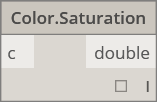|
||**Color.Hue** Pobiera wartość barwy tego koloru.||
||ZAPYTANIE||
||**Color.Alpha** Znajduje składową alfa koloru, od 0 do 255.||
||**Color.Blue** Znajduje niebieską składową koloru, od 0 do 255.||
||**Color.Green** Znajduje zieloną składową koloru, od 0 do 255.||
||**Color.Red** Znajduje czerwoną składową koloru, od 0 do 255.||

#### Core.Display

||||
| -- | -- | -- |
||TWORZENIE||
||**Display.ByGeometryColor** Wyświetla geometrię za pomocą koloru.||

#### Core.Input

||||
| -- | -- | -- |
||DZIAŁANIA||
||**Boolean** Wybór między true i false.||
||**Code Block** Umożliwia bezpośrednie utworzenie kodu DesignScript.|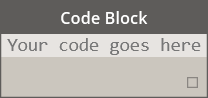|
||**Directory Path** Umożliwia wybranie katalogu w systemie, aby pobrać jego ścieżkę.||
||**File Path** Umożliwia wybranie pliku w systemie, aby pobrać jego nazwę.||
||**Integer Slider** Suwak, który generuje wartości całkowite.||
|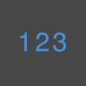|**Number**  Tworzy liczbę.||
||**Number Slider**  Suwak pozwalający uzyskać wartości liczbowe.||
||**String** Tworzy ciąg.|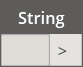|

#### Core.List

||||
| -- | -- | -- |
||TWORZENIE||
||**List.Create** Tworzy nową listę z określonych danych wejściowych.||
||**List.Combine** Stosuje kombinator do każdego elementu w dwóch sekwencjach.||
||**Number Range** Tworzy sekwencję liczb w określonym zakresie.||
||**Number Sequence** Tworzy sekwencję liczb.||
||DZIAŁANIA||
||**List.Chop** Dzieli listę na zestaw list, z których każdy zawiera zadaną liczbę elementów.||
||**List.Count** Pobiera liczbę elementów przechowywanych w danej liście.||
||**List.Flatten** Zrównuje zagnieżdżony wykaz list o określoną wartość.|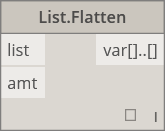|
||**List.FilterByBoolMask** Filtruje sekwencję, sprawdzając odpowiadające indeksy w osobnej liście wartości logicznych.||
||**List.GetItemAtIndex** Pobiera element z danej listy, który znajduje się w określonym indeksie.||
||**List.Map** Stosuje funkcję do wszystkich elementów listy, generując z wyników nową listę.||
||**List.Reverse** Tworzy nową listę zawierającą elementy z danej listy, ale w odwrotnej kolejności.||
|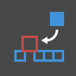|**List.ReplaceItemAtIndex** Zastępuje element z danej listy, który znajduje się w określonym indeksie.||
||**List.ShiftIndices** Przesuwa indeksy na liście w prawo o podaną wartość.||
||**List.TakeEveryNthItem** Pobiera elementy z danej listy w indeksach, które są wielokrotnością danej wartości, po uwzględnieniu podanego odsunięcia.||
||**List.Transpose** Zamienia wiersze z kolumnami na liście list. Jeśli niektóre wiersze są krótsze niż inne, w tablicy wynikowej są wstawiane wartości null jako elementy zastępcze, tak aby zawsze uzyskać prostokąt.|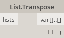|

#### Core.Logic

||||
| -- | -- | -- |
||DZIAŁANIA||
||**If** Instrukcja warunkowa. Sprawdza wartość logiczną danych wejściowych przekazanych do sprawdzenia. Jeśli dane wejściowe są prawdziwe, generuje wartość wyjściową true. W przeciwnym razie generuje wartość wyjściową false.||

#### Core.Math

||||
| -- | -- | -- |
||DZIAŁANIA||
||**Math.Cos** Oblicza cosinus kąta.||
||**Math.DegreesToRadians** Konwertuje wartość kąta w stopniach na wartość w radianach.||
|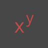|**Math.Pow** Podnosi liczbę do określonej potęgi.|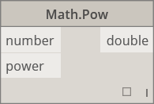|
||**Math.RadiansToDegrees** Konwertuje wartość kąta w radianach na wartość w stopniach.||
|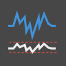|**Math.RemapRange** Dostosowuje zakres listy liczb, zachowując współczynnik rozkładu.||
||**Math.Sin** Oblicza sinus kąta.||

#### Core.Object

||||
| -- | -- | -- |
||DZIAŁANIA||
||**Object.IsNull** Określa, czy podany obiekt ma wartość null.||

#### Core.Scripting

||||
| -- | -- | -- |
||DZIAŁANIA||
||**Formula** Oblicza wartość wzoru matematycznego. Korzysta z funkcji NCalc. Zobacz [http://ncalc.codeplex.com](http://ncalc.codeplex.com).||

#### Core.String

||||
| -- | -- | -- |
||DZIAŁANIA||
||**String.Concat** Łączy wiele ciągów w jeden.|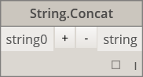|
||**String.Contains** Określa, czy dany ciąg zawiera dany podciąg.||
||**String.Join** Łączy wiele ciągów w jeden, wstawiając podany separator między poszczególnymi ciągami.||
||**String.Split** Dzieli pojedynczy ciąg na listę ciągów, z podziałami wyznaczanymi przez podane ciągi — separatory.||
|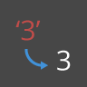|**String.ToNumber** Konwertuje ciąg na liczbę całkowitą lub zmiennoprzecinkową o podwójnej dokładności.|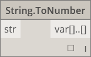|

#### Core.View

||||
| -- | -- | -- |
||DZIAŁANIA||
||**View.Watch** Wizualizuje dane wyjściowe węzła.||
||**View.Watch 3D** Wyświetla dynamiczny podgląd geometrii.||

## Geometry

#### Geometry.Circle

||||
| -- | -- | -- |
||TWORZENIE||
||**Circle.ByCenterPointRadius** Tworzy okrąg ze środkiem i promieniem wejściowym w płaszczyźnie globalnej XY, ze współrzędną globalną Z jako normalną.||
||**Circle.ByPlaneRadius** Tworzy okrąg ze środkiem w początku płaszczyzny wejściowej (głównym), leżący w płaszczyźnie wejściowej, o podanym promieniu.|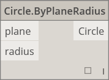|

#### Geometry.CoordinateSystem

||||
| -- | -- | -- |
||TWORZENIE||
||**CoordinateSystem.ByOrigin** Tworzy układ współrzędnych z początkiem w punkcie wejściowym, z osiami X i Y ustawionymi jako osie X i Y GUW.||
||**CoordinateSystem.ByCyclindricalCoordinates** Tworzy układ współrzędnych o określonych parametrach współrzędnych walcowych względem określonego układu współrzędnych.||

#### Geometry.Cuboid

||||
| -- | -- | -- |
||TWORZENIE||
||**Cuboid.ByLengths** (początek układu współrzędnych) Tworzy prostopadłościan wyśrodkowany w punkcie wejściowym, z określoną szerokością, długością i wysokością.||

#### Geometry.Curve

||||
| -- | -- | -- |
||DZIAŁANIA||
||**Curve.Extrude** (odległość) Wyciąga krzywą w kierunku wektora normalnego.||
||**Curve.PointAtParameter** Pobiera punkt na krzywej o określonym parametrze między StartParameter() a EndParameter().|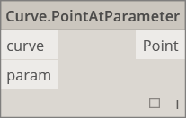|

#### Geometry.Geometry

||||
| -- | -- | -- |
||DZIAŁANIA||
||**Geometry.DistanceTo** Wyznacza odległość od tej geometrii do innej.||
||**Geometry.Explode** Rozdziela złożone (nierozdzielone) elementy na części składowe.||
||**Geometry.ImportFromSAT** Lista zaimportowanych geometrii.||
||**Geometry.Rotate** (basePlane) Obraca obiekt wokół początku układu współrzędnych i wektora normalnego o kąt określony w stopniach.||
||**Geometry.Translate** Przekształca geometrię dowolnego typu o podaną odległość w podanym kierunku.|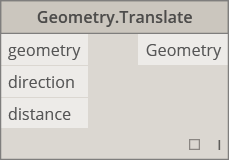|

#### Geometry.Line

||||
| -- | -- | -- |
||TWORZENIE||
||**Line.ByBestFitThroughPoints** Tworzy linię najdokładniej przybliżającą do wykresu punktowego punktów.||
||**Line.ByStartPointDirectionLength** Tworzy linię prostą, zaczynając od punktu początkowego i wydłużając w kierunku wektora o określoną długość.||
||**Line.ByStartPointEndPoint** Tworzy linię prostą między dwoma punktami wejściowymi.||
||**Line.ByTangency** Tworzy linię styczną do krzywej wejściowej, umieszczoną w punkcie parametru krzywej wejściowej.||
||ZAPYTANIE||
||**Line.Direction** Kierunek krzywej.||

#### Geometry.NurbsCurve

||||
| -- | -- | -- |
||Tworzenie||
||**NurbsCurve.ByControlPoints** Tworzy obiekt BSplineCurve przy użyciu jawnie podanych punktów sterujących.||
||**NurbsCurve.ByPoints** Tworzy obiekt BSplineCurve przez interpolację między punktami.|qcomm|

#### Geometry.NurbsSurface

||||
| -- | -- | -- |
||Tworzenie||
||**NurbsSurface.ByControlPoints** Tworzy powierzchnię NURBS przy użyciu jawnie podanych punktów sterujących oraz kątów U i V podanych w stopniach.||
||**NurbsSurface.ByPoints** Tworzy powierzchnię NURBS przy użyciu interpolacji podanych punktów oraz kątów U i V podanych w stopniach. Powierzchnia wynikowa przecina wszystkie te punkty.||

#### Geometry.Plane

||||
| -- | -- | -- |
||TWORZENIE||
||**Plane.ByOriginNormal** Tworzy płaszczyznę wyśrodkowaną w punkcie głównym i mającą wejściowy wektor normalny.||
||**Plane.XY** Tworzy płaszczyznę w globalnej płaszczyźnie XY.||

#### Geometry.Point

||||
| -- | -- | -- |
||TWORZENIE||
||**Point.ByCartesianCoordinates** Tworzy punkt w podanym układzie współrzędnych z trzema współrzędnymi kartezjańskimi.||
||**Point.ByCoordinates** (2D)  Tworzy punkt na płaszczyźnie XY zadanej przez dwie współrzędne kartezjańskie. Składnik Z wynozi 0.||
||**Point.ByCoordinates** (3D) Tworzy punkt na podstawie trzech współrzędnych kartezjańskich.||
||**Point.Origin** Pobiera punkt początku układu współrzędnych (0,0,0).||
||DZIAŁANIA||
||**Point.Add** Dodaje wektor do punktu. Działa podownie jak Translate (Vector).||
||ZAPYTANIE||
||**Point.X** Pobiera składową X punktu.|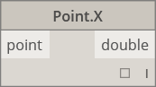|
||**Point.Y** Pobiera składową Y punktu.|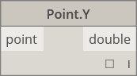|
||**Point.Z** Pobiera składową Z punktu.||

#### Geometry.Polycurve

||||
| -- | -- | -- |
||TWORZENIE||
||**Polycurve.ByPoints** Tworzy krzywą złożoną z sekwencji linii łączących punkty. Aby powstała krzywa zamknięta, ostatni punkt powinien być w tym samym miejscu co punkt początkowy.||

#### Geometry.Rectangle

||||
| -- | -- | -- |
||TWORZENIE||
||**Rectangle.ByWidthLength** (Plane) Tworzy prostokąt ze środkiem w głównym punkcie na płaszczyźnie wejściowej, o szerokości wejściowej (długość osi X) i długości (długość osi Y).||

#### Geometry.Sphere

||||
| -- | -- | -- |
||TWORZENIE||
||**Sphere.ByCenterPointRadius** Tworzy bryłę sferyczną ze środkiem w punkcie wejściowym, o podanym promieniu.||

#### Geometry.Surface

||||
| -- | -- | -- |
||TWORZENIE||
||**Surface.ByLoft** Tworzy powierzchnię przez wyciągnięcie między krzywymi wejściowymi przekroju poprzecznego.||
||**Surface.ByPatch** Tworzy powierzchnię przez wypełnienie wnętrza zamkniętej obwiedni określonej przez krzywe wejściowe.||
||DZIAŁANIA||
||**Surface.Offset** Odsuwa powierzchnię w kierunku normalnej powierzchni o określoną odległość.||
||**Surface.PointAtParameter** Zwraca punkt dla określonych parametrów U i V.||
||**Surface.Thicken** Pogrubia powierzchnię w celu utworzenia bryły, wyciągając w kierunku normalnych powierzchni po obu stronach powierzchni.||

#### Geometry.UV

||||
| -- | -- | -- |
||TWORZENIE||
||**UV.ByCoordinates** Tworzy UV z dwóch wartości podwojonych.||

#### Geometry.Vector

||||
| -- | -- | -- |
||TWORZENIE||
||**Vector.ByCoordinates** Tworzy wektor z trzech współrzędnych euklidesowych.||
||**Vector.XAxis** Pobiera kanoniczny wektor osi X (1,0,0).||
||**Vector.YAxis** Pobiera kanoniczny wektor osi Y (0,1,0).||
||**Vector.ZAxis** Pobiera kanoniczny wektor osi Z (0,0,1).||
||DZIAŁANIA||
||**Vector.Normalized** Pobiera znormalizowaną wersję wektora.||

## Operatory

||||
| -- | -- | -- |
||**+** Dodawanie||
||**-** Odejmowanie||
||***** Mnożenie||
||**/** Dzielenie||
||**%** Dzielenie modulo. Oblicza resztę z dzielenia pierwszej wartości wejściowej przez drugą.||
||**<** Mniejsze niż||
||**>**Większe niż||
||**==** Test równości między dwiema wartościami.||

