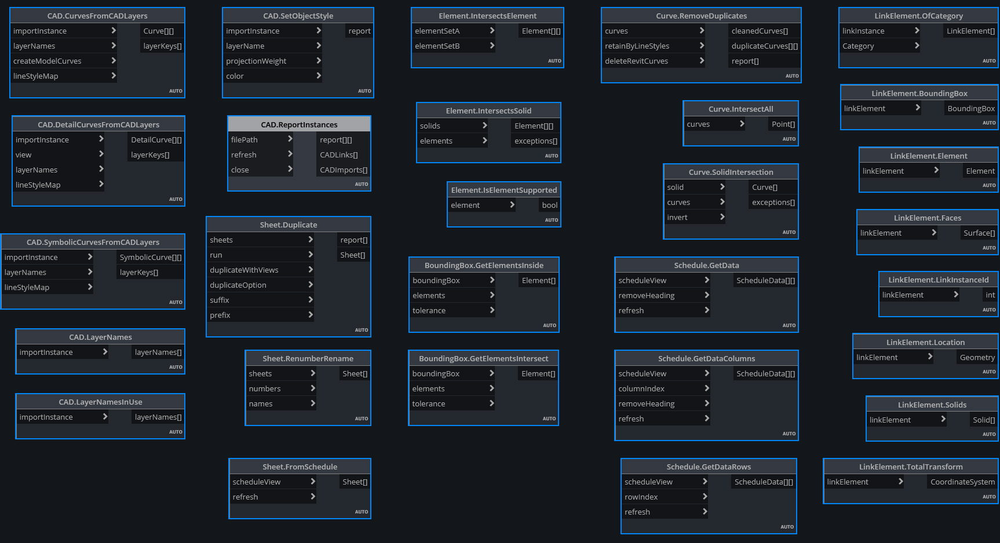
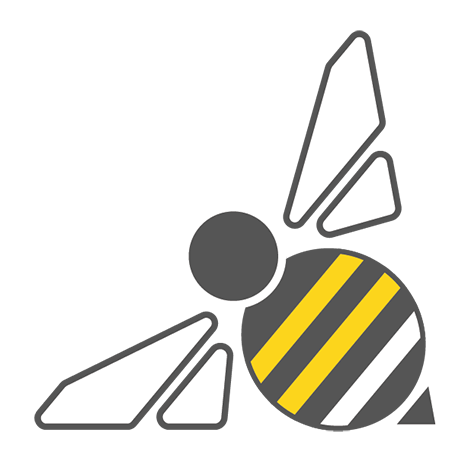
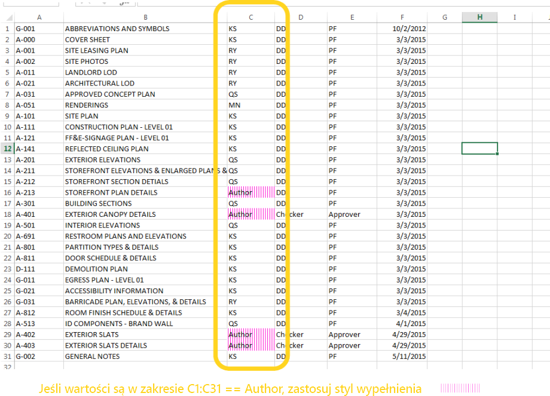
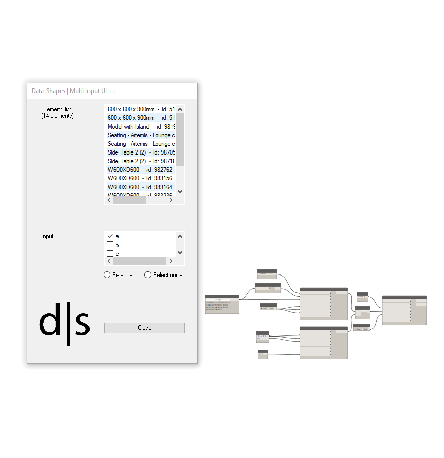
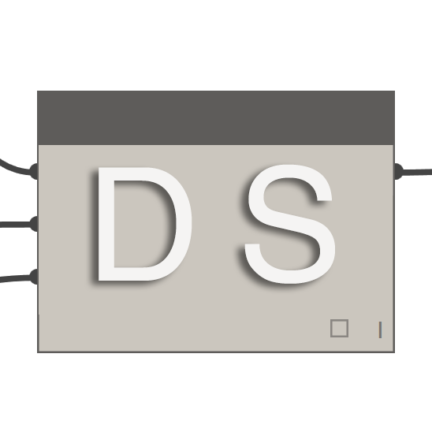
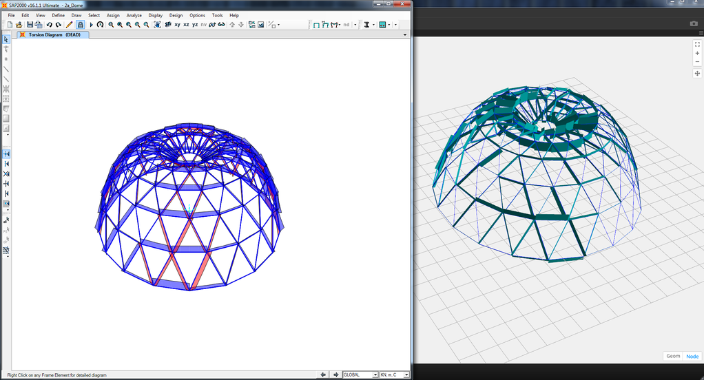
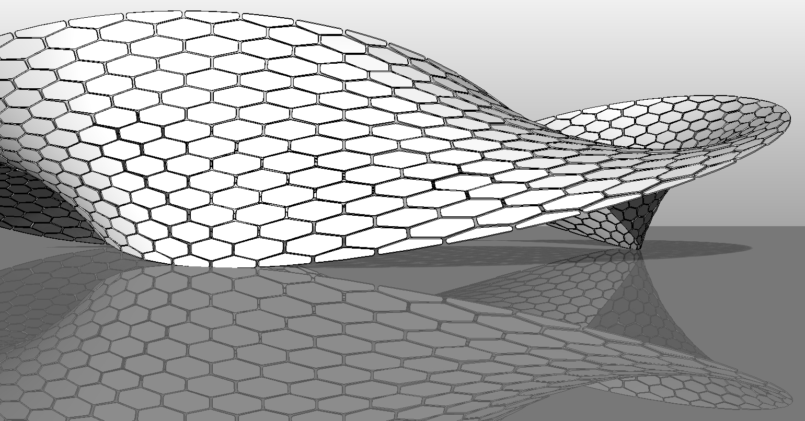
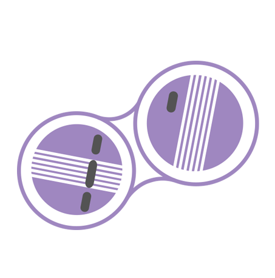
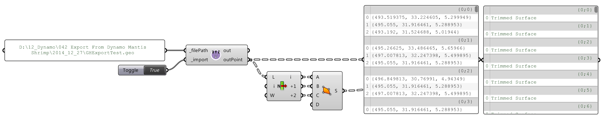
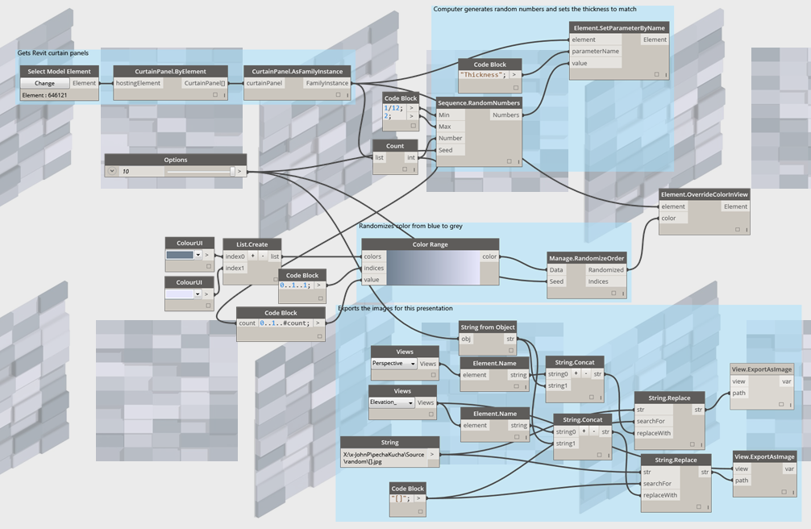

## Pakiety dodatku Dynamo

Oto lista niektórych pakietów popularnych w społeczności Dynamo. Zachęcamy programistów do poszerzania tej listy. Warto pamiętać, że program [Dynamo Primer](https://github.com/DynamoDS/DynamoPrimer) to rozwiązanie open source.

||ARCHI-LAB|[Odwiedź oficjalną witrynę archi-lab ](http://archi-lab.net/)|
| -- | -- | -- |
|archi-lab to kolekcja ponad 50 pakietów niestandardowych, które znacznie zwiększają możliwości dodatku Dynamo w zakresie interakcji z programem Revit. Węzły zawarte w pakiecie archi-lab są zróżnicowane: od podstawowych operacji na listach po zaawansowane struktury wizualizacji analiz dla programu Revit.||

||BIMORPH NODES|[Odwiedź witrynę słownika BimorphNodes](https://bimorph.com/bimorph-nodes/)|
| -- | -- | -- |
|BimorphNodes jest uniwersalnym zbiorem zaawansowanych węzłów narzędziowych. Godne uwagi składniki pakietu to m.in. ultrawydajne węzły wykrywania kolizji oraz przecinania się geometrii, węzły konwersji krzywych ImportInstance (CAD) i kolektory elementów połączonych, które eliminują ograniczenia w interfejsie API programu Revit. Aby dowiedzieć się więcej na temat pełnego zakresu dostępnych węzłów, odwiedź słownik BimorphNodes.||

||BUMBLEBEE FOR DYNAMO|[Odwiedź oficjalną witrynę BumbleBee](http://archi-lab.net/bumblebee-dynamo-and-excel-interop/)|
| -- | -- | -- |
|Bumblebee to wtyczka zapewniająca współdziałanie programu Excel i dodatku Dynamo, która znacznie zwiększa możliwości dodatku Dynamo w zakresie odczytywania i zapisywania plików programu Excel.||

||CLOCKWORK FOR DYNAMO|[Odwiedź witrynę Clockwork For Dynamo w serwisie GitHub](https://github.com/CAAD-RWTH/ClockworkForDynamo)|
| -- | -- | -- |
|Clockwork jest zbiorem węzłów niestandardowych dla środowiska programowania wizualnego dodatku Dynamo. Zawiera wiele węzłów związanych z programem Revit, ale również wiele węzłów do różnych innych celów, takich jak zarządzanie listami, operacje matematyczne, operacje na ciągach, przeliczanie jednostek, operacje geometryczne (dotyczące głównie ramek ograniczających, siatek, płaszczyzn, punktów, powierzchni, UV i wektorów) oraz panelowanie.||

||DATA|SHAPES|[Odwiedź witrynę Data|Shapes w serwisie GitHub](https://github.com/MostafaElAyoubi/Data-shapes)|
| -- | -- | -- |
|DataShapes jest pakietem, który ma na celu rozszerzenie funkcjonalności skryptów Dynamo dla użytkownika. Szczególnie skupiono się na zwiększeniu funkcjonalności Odtwarzacza Dynamo. Więcej informacji znajduje się na stronie https://data-shapes.net/. Chcesz tworzyć wspaniałe procesy robocze Odtwarzacza Dynamo? Użyj tego pakietu.||

||DYNAMO SAP|[Odwiedź projekt DynamoSAP w serwisie Core Studio](http://core.thorntontomasetti.com/dynamosap-is-now-open-source/)|
| -- | -- | -- |
|DynamoSAP to parametryczny interfejs dla SAP2000 oparty na dodatku Dynamo. Ten projekt umożliwia projektantom i inżynierom generatywne tworzenie i analizowanie systemów konstrukcyjnych w systemie SAP przy zastosowaniu dodatku Dynamo do sterowania modelem SAP. Projekt przewiduje kilka typowych procesów roboczych, które opisano w dołączonych plikach przykładowych, oraz zapewnia szeroki zakres możliwości automatyzacji typowych zadań w systemie SAP.||

||DYNAMO UNFOLD|[Odwiedź witrynę DynamoUnfold w serwisie GitHub](https://github.com/mjkkirschner/DynamoUnfold)|
| -- | -- | -- |
|Ta biblioteka rozszerza funkcjonalność dodatku Dynamo/programu Revit, umożliwiając użytkownikom rozwijanie geometrii powierzchni i polipowierzchni. Biblioteka umożliwia użytkownikom najpierw przekształcenie powierzchni w posegmentowaną topologię płaską, a następnie rozwinięcie ich w dodatku Dynamo za pomocą narzędzi protogeometrii. Ten pakiet zawiera także kilka węzłów eksperymentalnych oraz kilka podstawowych plików przykładowych.||

||DYNASTRATOR|[Pobierz pakiet Dynastrator w menadżerze pakietów](http://dynamopackages.com/)|
| -- | -- | -- |
|Importuj grafikę wektorową z programu Illustrator lub Internetu za pomocą formatu .svg. Ten składnik umożliwia importowanie ręcznie utworzonych rysunków do dodatku Dynamo na potrzeby operacji parametrycznych.||

||ENERGY ANALYSIS FOR DYNAMO|[Odwiedź witrynę projektu Energy Analysis for Dynamo w serwisie GitHub](https://github.com/tt-acm/EnergyAnalysisForDynamo)|
| -- | -- | -- |
|Pakiet Energy Analysis for Dynamo umożliwia parametryczne modelowanie zużycia energii i obsługę procesów roboczych analizy energetycznej całego budynku w dodatku Dynamo 0.8. Pakiet Energy Analysis for Dynamo umożliwia użytkownikowi skonfigurowanie modelu energetycznego z programu Autodesk Revit, przesłanie go do programu Green Building Studio na potrzeby analizy energetycznej DOE2 i przeanalizowanie zwróconych wyników. Twórcą pakietu jest CORE studio należące do Thornton Tomasetti.||

||FIREFLY FOR DYNAMO|[Pobierz pakiet Firefly w menadżerze pakietów Dynamo](http://dynamopackages.com/)|
| -- | -- | -- |
|Firefly to zbiór węzłów, które umożliwiają dodatkowi Dynamo komunikowanie się z urządzeniami wejściowymi/wyjściowymi, takimi jak mikrokontroler Arduino. Dzięki temu, że przepływ danych odbywa się „na żywo”, Firefly zapewnia wiele możliwości interaktywnego prototypowania pomiędzy światami cyfrowym a fizycznym poprzez kamery internetowe, telefony komórkowe, kontrolery gier, czujniki i nie tylko.||

||LUNCHBOX FOR DYNAMO|[Odwiedź witrynę Lunchbox for Dynamo w serwisie Proving Ground](http://provingground.io/tools/lunchbox/)|
| -- | -- | -- |
|LunchBox jest zbiorem węzłów geometrii i zarządzania danymi, które można wielokrotnie wykorzystywać. Narzędzia przetestowano za pomocą dodatku Dynamo 0.8.1 i programu Revit 2016. To narzędzie zawiera węzły do panelowania powierzchni, obsługi geometrii, zbierania danych programu Revit i nie tylko.||

||MANTIS SHRIMP|[Odwiedź oficjalną witrynę Mantis Shrimp](http://archi-lab.net/mantis-shrimp-getting-started/)|
| -- | -- | -- |
|Mantis Shrimp to projekt interoperacyjności, który umożliwia łatwe importowanie geometrii Grasshopper i/lub Rhino do programu Dynamo.||

||MESH TOOLKIT|[Odwiedź witrynę Dynamo Mesh Toolkit w serwisie GitHub](https://github.com/DynamoDS/Dynamo/wiki/Dynamo-Mesh-Toolkit)|
| -- | -- | -- |
|Zestaw Dynamo Mesh Toolkit zawiera wiele użytecznych narzędzi do pracy z geometrią siatki. Funkcje tego pakietu obejmują możliwość importowania siatek z zewnętrznych formatów plików, generowania siatek z już istniejących obiektów geometrii dodatku Dynamo oraz ręcznego tworzenia siatek na podstawie wierzchołków i informacji o połączeniach. Ponadto ten zestaw zawiera narzędzia do modyfikowania i naprawiania geometrii siatki.||

||OPTIMO|[Odwiedź witrynę Optimo w serwisie GitHub](https://github.com/BPOpt/Optimo/wiki/0_-Home)|
| -- | -- | -- |
|Pakiet Optimo pozwala użytkownikom dodatku Dynamo optymalizować samodzielnie zdefiniowane problemy projektowe za pomocą różnych algorytmów ewolucyjnych. Użytkownicy mogą zdefiniować cel związany z problemem lub zestaw celów, jak również określone funkcje dopasowania.||

||RHYNAMO|[Odwiedź witrynę Rhynamo w serwisie Bitbucket](https://bitbucket.org/caseinc/rhynamo)|
| -- | -- | -- |
|Biblioteka węzłów Rhynamo zapewnia użytkownikom możliwość odczytywania i zapisywania plików Rhino 3DM z poziomu dodatku Dynamo. Pakiet Rhynamo przekształca geometrię Rhino w możliwą do wykorzystania geometrię dodatku Dynamo za pomocą biblioteki McNeel OpenNURBS, umożliwiając obsługę nowych procesów roboczych uwzględniających płynną wymianę geometrii i danych między programami Rhino i Revit. Pakiet ten zawiera także węzły eksperymentalne umożliwiające dostęp „na żywo” do wiersza polecenia Rhino.||

||RHYTHM|[Odwiedź witrynę Rhythm w serwisie GitHub](https://github.com/sixtysecondrevit/RhythmForDynamo)|
| -- | -- | -- |
|Na pierwszy rzut oka pakiet Rhythm nie wydaje się być wyjątkowy. Nie obejmuje żadnego zaawansowanego kodu ani niczego takiego. Jednak pakiet Rhythm to narzędzie będące wynikiem praktycznego myślenia i staranności. Ten pakiet ułatwia użytkownikom zachowanie rytmu w programie Revit za pomocą dodatku Dynamo. Pakiet Rhythm składa się głównie z gotowych węzłów Dynamo używanych w inteligentny sposób w odniesieniu do środowiska programu Revit.||

