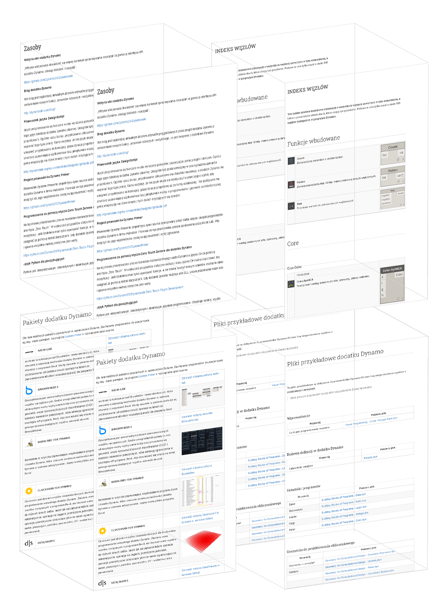

# Załącznik A: Zasoby

W tej sekcji można znaleźć dodatkowe zasoby do doskonalenia umiejętności związanych z dodatkiem Dynamo. W tym przewodniku udostępniliśmy również indeks ważnych węzłów, kolekcję użytecznych pakietów i repozytorium plików przykładowych. Zachęcamy do swobodnego rozbudowywania tej sekcji. Warto pamiętać, że przewodnik [Dynamo Primer](https://github.com/DynamoDS/DynamoPrimer) jest zasobem typu open source. 

