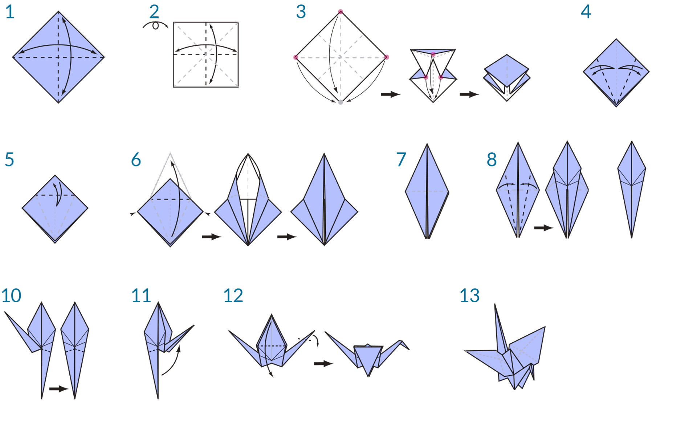
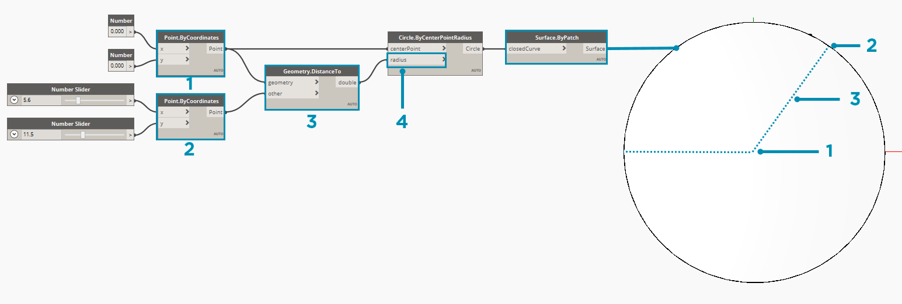

### O que é a programação visual?

A criação de projetos frequentemente envolve estabelecer relações visuais, sistémicas ou geométricas entre as partes de um projeto. Frequentemente, essas relações são desenvolvidas por fluxos de trabalho que nos levam do conceito ao resultado final por meio de regras. Talvez sem saber, estamos trabalhando algoritmicamente - definindo um conjunto passo a passo de ações que seguem uma lógica básica de entrada, processamento e saída. A programação nos permite continuar a trabalhar desta maneira, mas formalizando nossos algoritmos.

### Algoritmos em causa

Ao oferecer algumas oportunidades poderosas, o termo **Algoritmo** pode levar a alguns equívocos sobre o assunto. Os algoritmos podem gerar coisas inesperadas ou maravilhosas, mas eles não são mágicos. Na verdade, são bem simples. Vamos usar um exemplo prático como um origami em formato de pássaro. Começamos com um pedaço de papel quadrado (entrada), seguimos uma série de etapas de dobra (ações de processamento) e temos um resultado de um origami em formato de pássaro (saída).


Então onde está o algoritmo? Este é o conjunto abstrato de etapas, que podemos representar de duas maneiras: textualmente ou graficamente.

**Instruções textuais:**

1. Comece com um pedaço de papel quadrado, com o lado colorido voltado para cima. Dobre ao meio e abra. Em seguida, dobre ao meio da forma contrária.
2. Vire o papel para o lado branco. Dobre bem o papel ao meio, abra e depois dobre novamente na outra direção.
3. Utilizando as dobras criadas, traga os três cantos superiores do modelo para baixo até o canto inferior. Nivele o modelo.
4. Dobre as abas triangulares superiores para o centro e desdobre.
5. Dobre bem a parte superior do modelo para baixo e desdobre.
6. Abra a aba mais alta do modelo, trazendo-a para cima e pressionando as laterais do modelo para dentro ao mesmo tempo. Nivele, vincando bem.
7. Vire o modelo e repita os passos 4 a 6 no outro lado.
8. Dobre as abas superiores para o centro.
9. Repita o procedimento do outro lado.
10. Dobre as duas "pernas" do modelo para cima, vincando bem e, em seguida, desdobre.
11. Faça uma dobra reversa interior nas "pernas" ao longo dos vincos que acabou de fazer.
12. Faça uma dobra reversa interior em um lado para fazer a cabeça e, em seguida, dobre as asas para baixo.
13. Agora você tem um pássaro.

**Instruções gráficas:**



### Definição de programação

O uso de qualquer um desses conjuntos de instruções deve resultar em um pássaro e, se você seguiu o processo, aplicou um algoritmo. A única diferença é a maneira como lemos a formalização desse conjunto de instruções e isso nos leva à **Programação**. A programação, frequentemente abreviada de *Programação de computadores*, é o ato de formalizar o processamento de uma série de ações em um programa executável. Se transformarmos as instruções acima para criar um pássaro em um formato que nosso computador possa ler e executar, estamos programando.

A chave e o primeiro obstáculo que encontraremos na programação é que precisamos depender de alguma forma de abstração para nos comunicarmos efetivamente com o computador. Isso assume a forma de qualquer número de linguagens de programação, como JavaScript, Python ou C. Se pudermos escrever um conjunto repetitivo de instruções, como para o origami em formato de pássaro, precisamos apenas traduzi-lo para o computador. Estamos no caminho de fazer com que o computador seja capaz de fazer um pássaro ou até uma infinidade de pássaros diferentes, com pequenas variações. Este é o poder de programação: o computador executará repetidamente qualquer tarefa ou conjunto de tarefas que atribuímos a ele, sem demora e sem erro humano.

#### Definição de programação visual

> Faça o download do arquivo de exemplo que acompanha este exercício (clique com o botão direito do mouse e "Salvar link como..."): [Programação visual - Circle Through Point.dyn](datasets/1-1/Visual Programming - Circle Through Point.dyn). Uma lista completa de arquivos de exemplo pode ser encontrada no Apêndice.

Se você foi encarregado de escrever instruções para dobrar um origami em formato de pássaro, como você faria isso? Você criaria as instruções com gráficos, texto ou alguma combinação dos dois?

Se sua resposta continha gráficos, então a **Programação visual** é definitivamente a opção ideal para você. O processo é basicamente o mesmo para programação e programação visual. Elas utilizam a mesma estrutura de formalização; no entanto, definimos as instruções e as relações do programa por meio de uma interface gráfica (ou "visual") do usuário. Em vez de digitar texto vinculado pela sintaxe, nós conectamos os nós pré-empacotados. Aqui está uma comparação do mesmo algoritmo, "desenhar um círculo através de um ponto", programado com nós versus código:

**Programa visual:**


**Programa textual:**

```
myPoint = Point.ByCoordinates(0.0,0.0,0.0);
x = 5.6;
y = 11.5;
attractorPoint = Point.ByCoordinates(x,y,0.0);
dist = myPoint.DistanceTo(attractorPoint);
myCircle = Circle.ByCenterPointRadius(myPoint,dist);
```

Os resultados do nosso algoritmo:



A característica visual da programação diminui a barreira de iniciar as atividades e frequentemente é bem compreendida pelos designers. O Dynamo se encaixa no paradigma de programação visual, mas como veremos mais tarde, ainda podemos usar a programação textual no aplicativo.

