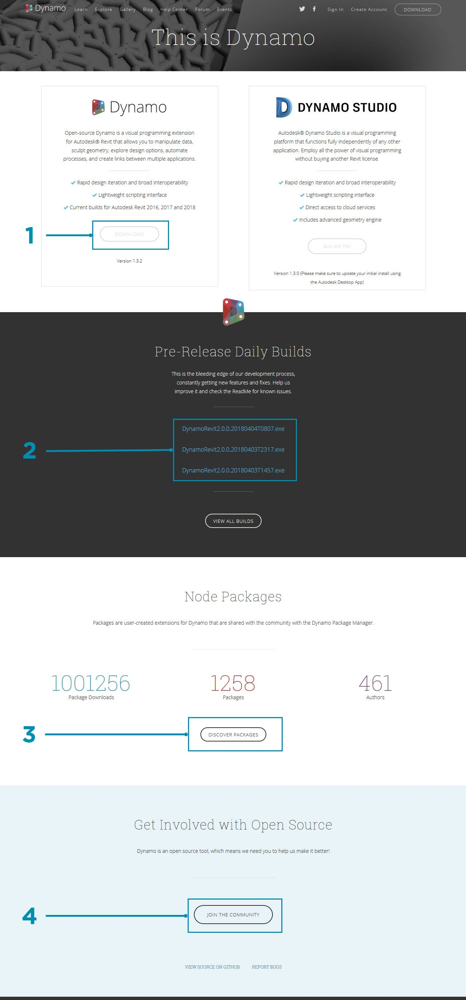
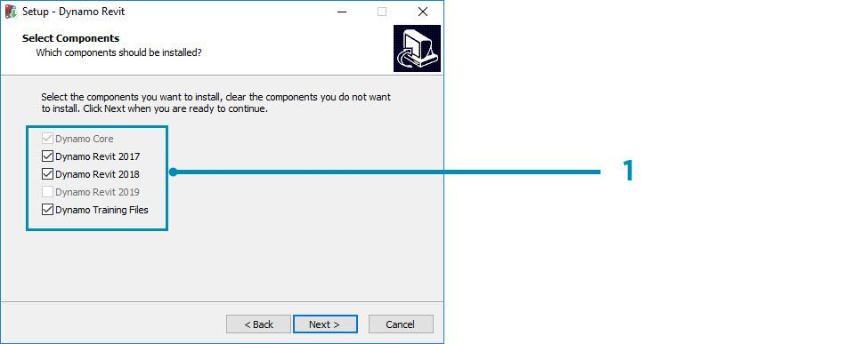
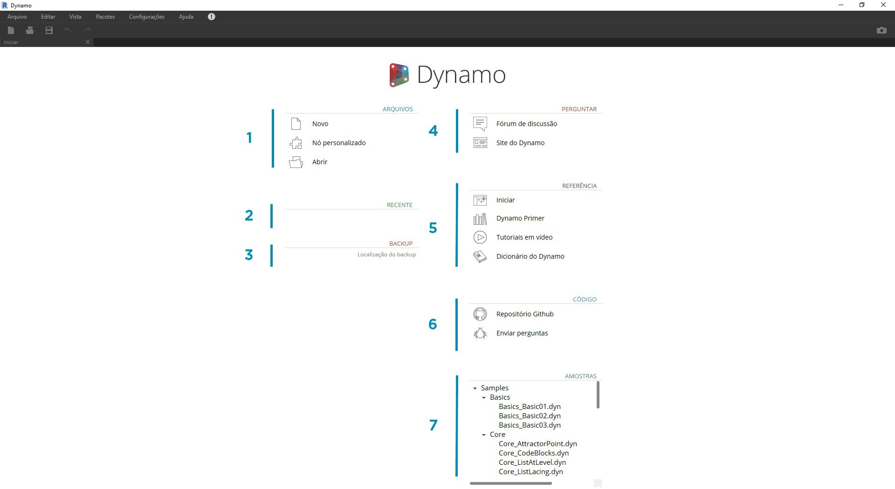
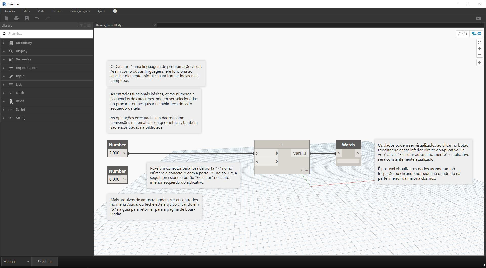

## Instalar e iniciar o Dynamo

O Dynamo é um projeto de desenvolvimento de código aberto ativo com instaladores para download, tanto para versões oficiais quanto para pré-lançamento, ou seja, para versões de “compilação diária”. Faça o download da versão oficial para começar ou contribua para o desenvolvimento do Dynamo por meio das compilações diárias ou do projeto GitHub.

### Fazer o download

Para fazer o download da versão oficial lançada do Dynamo, visite o [site do Dynamo](http://dynamobim.com/). Inicie o download imediatamente clicando na página inicial ou navegue para a página de download dedicada.

> 1. Assista a um vídeo sobre o Projeto computacional com o Dynamo para arquitetura
2. Ou navegue até a página de download

Aqui, você pode fazer o download das versões de desenvolvimento “avançadas” ou acessar o projeto [Dynamo Github](https://github.com/DynamoDS/Dynamo).

> 1. Fazer o download do instalador da versão oficial
2. Fazer o download dos instaladores das compilações diárias
3. Conferir os pacotes personalizados de uma comunidade de desenvolvedores
4. Participar do desenvolvimento do Dynamo no GitHub

### Instalação

Navegue até o diretório do instalador transferido por download e execute o arquivo executável. Durante o processo de instalação, a configuração permite personalizar os componentes que serão instalados.

> 1. Selecionar os componentes que deseja instalar

Aqui, precisamos decidir se queremos incluir os componentes que conectam o Dynamo a outros aplicativos instalados, como o Revit. Para obter mais informações sobre a plataforma do Dynamo, consulte o **Capítulo 1.2**.

### Iniciar

Para iniciar o Dynamo, navegue até \Arquivos de Programas\Dynamo\Dynamo Revit\x.y e, em seguida, selecione DynamoSandbox.exe. Isso abrirá a versão independente e apresentará a *página inicial* do Dynamo. Nesta página, veremos os menus e a barra de ferramentas padrão, bem como uma coleção de atalhos que nos permite acessar a funcionalidade do arquivo ou acessar recursos adicionais.

> 1. Arquivos – Inicie um novo arquivo ou abra um existente
2. Recentes – Navegue pelos arquivos recentes
3. Backup – Acesse seus backups
4. Perguntar – Obtenha acesso direto ao Fórum do usuário ou ao site do Dynamo
5. Referência – Saiba mais com recursos de aprendizagem adicionais
6. Código – Participe do projeto de desenvolvimento de código aberto
7. Amostras – Confira os exemplos que vêm com a instalação

Abra o primeiro arquivo de amostra para abrir seu primeiro espaço de trabalho e confirmar que o Dynamo está funcionando corretamente. Clique em Amostras > Conceitos básicos > **Basics_Basic01.dyn**.

> 1. Confirme se a barra de execução diz “Automático” ou clique em Executar
2. Siga as instruções e conecte o nó **Number** ao nó **+**
3. Confirme se este nó Watch mostra um resultado

Se este arquivo for carregado com êxito, você deverá ser capaz de executar o primeiro programa visual com o Dynamo.

