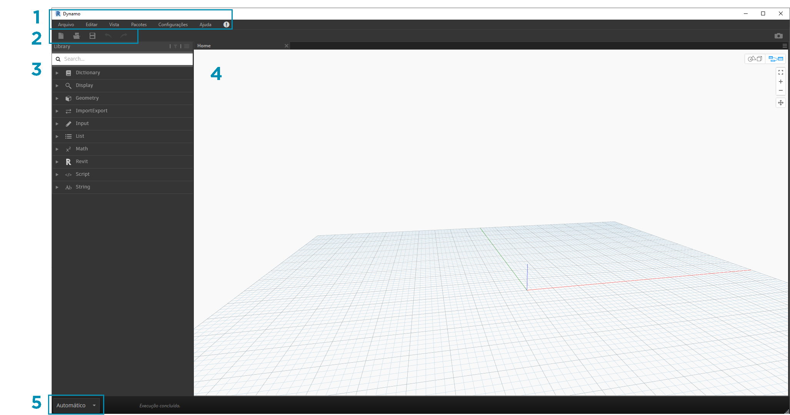
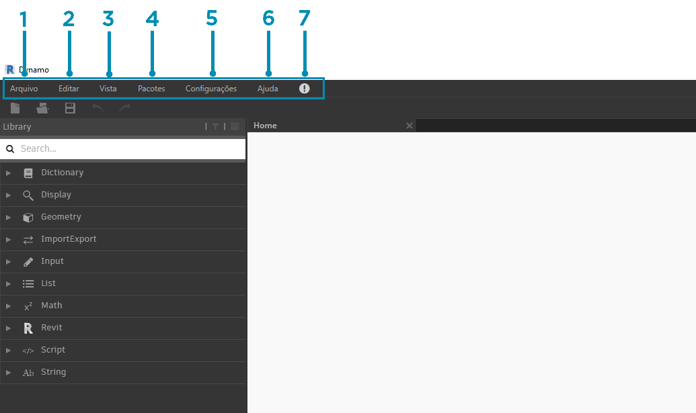
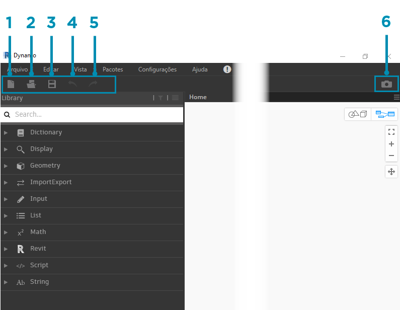
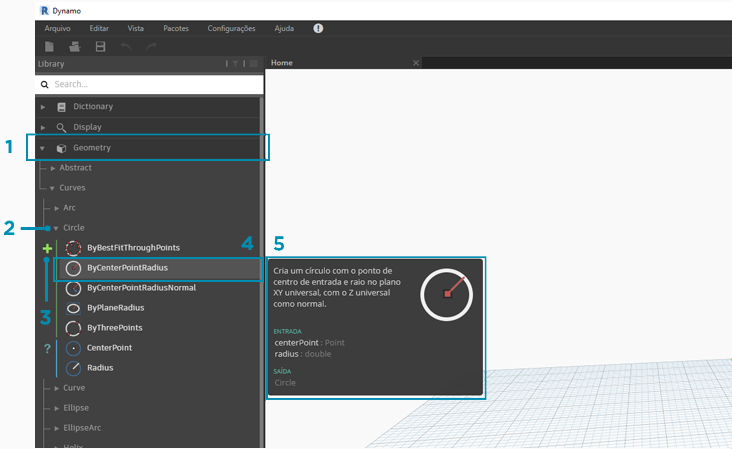
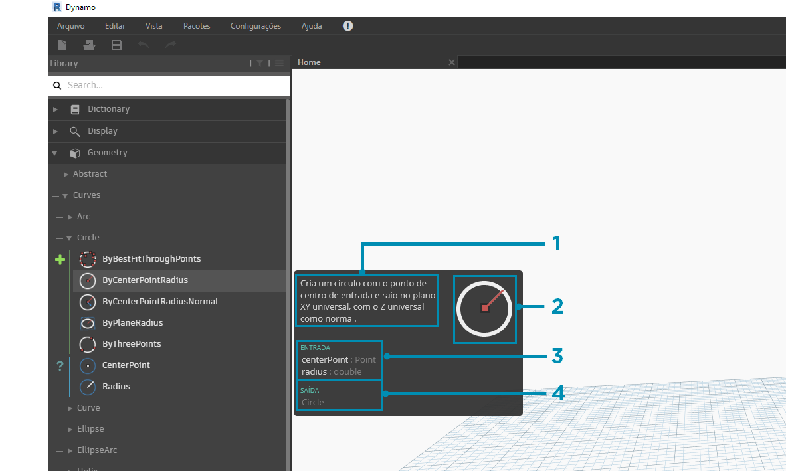
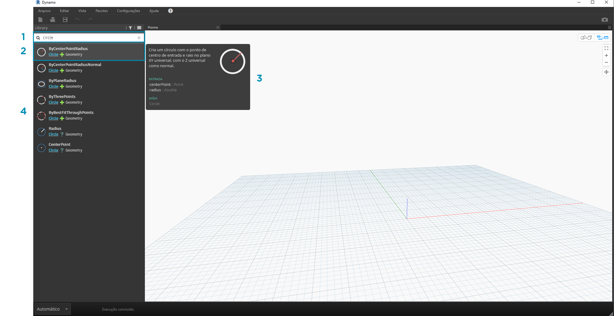
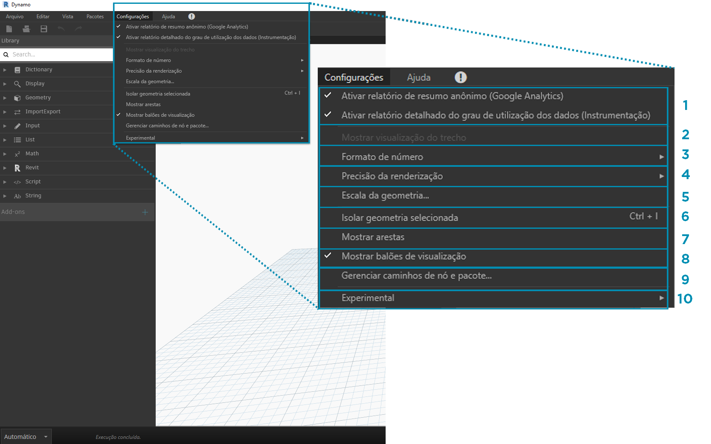
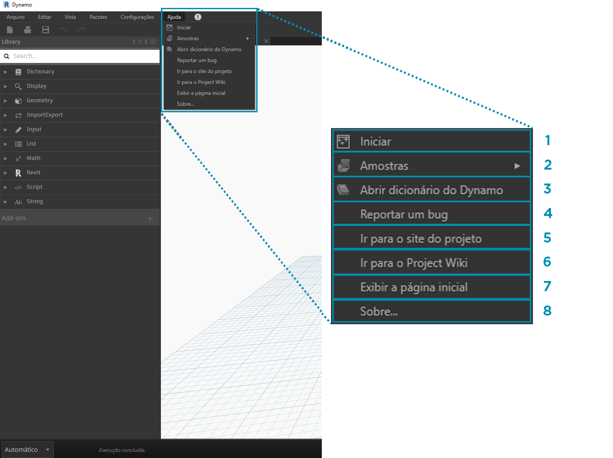

## A interface do usuário do Dynamo

A interface do usuário (IU) para o Dynamo é organizada em cinco regiões principais, sendo a maior delas a área de trabalho onde criamos nossos programas visuais.

> 1. Menus
2. Barra de ferramentas
3. Biblioteca
4. Área de trabalho
5. Barra de execução

Vamos nos aprofundar mais na interface de usuário e explorar a funcionalidade de cada região.

#### Menus

Os menus suspensos são um ótimo local para encontrar algumas das funções básicas do aplicativo Dynamo. Como a maioria dos softwares Windows, as ações relacionadas ao gerenciamento de arquivos e operações para seleção e edição de conteúdo são encontradas nos dois primeiros menus. Os menus restantes são mais específicos do Dynamo.

> 1. Arquivo
2. Editar
3. Vista
4. Pacotes
5. Configurações
6. Ajuda
7. Notificações

#### Barra de ferramentas

A barra de ferramentas do Dynamo contém uma série de botões para acesso rápido ao trabalho com arquivos, bem como os comandos Desfazer [Ctrl + Z] e Refazer [Ctrl + Y]. Na parte mais à direita há outro botão que exportará um instantâneo do espaço de trabalho, o que é extremamente útil para a documentação e o compartilhamento.

> 1. Novo - Cria um novo arquivo .dyn
2. Abrir - Abre um arquivo .dyn (espaço de trabalho) ou .dyf (nó personalizado) existente
3. Salvar/Salvar como - Salva seu arquivo .dyn ou .dyf ativo
4. Desfazer - Desfaz a última ação
5. Refazer - Refaz a próxima ação
6. Exportar espaço de trabalho como imagem - Exporta o espaço de trabalho visível como um arquivo PNG

#### Biblioteca

A biblioteca contém todos os nós carregados, incluindo os nós padrão que vêm com a instalação, bem como quaisquer nós ou pacotes personalizados carregados adicionalmente. Os nós na biblioteca são organizados hierarquicamente dentro de bibliotecas, categorias e, quando apropriado, subcategorias com base nos nós: **Criar** dados, executar uma **Ação** ou **Consultar** dados.

##### Procurando

Por padrão, a **Biblioteca** irá conter oito categorias de nós. **Core** e **Geometry** são ótimos menus para começar a explorar, pois contêm a maior quantidade de nós. Navegar por essas categorias é a maneira mais rápida de entender a hierarquia do que podemos adicionar ao nosso espaço de trabalho e a melhor maneira de descobrir novos nós que você não usou antes.

> Vamos nos concentrar agora na coleção padrão de nós, mas observe que estenderemos esta Biblioteca com nós personalizados, bibliotecas adicionais e o Gerenciador de pacotes posteriormente.

> 1. Dicionário
2. Exibição
3. Geometria
4. ImportExport
5. Entrada
6. List
7. Coincide
8. Revit
9. Script
10. Sequência
11. Complementos

Navegue na biblioteca clicando nos menus. Clique em Geometry > Curves > Circle. Observe a nova parte do menu que é revelada e especificamente as legendas **Create** e **Query**.

> 1. Biblioteca
2. Categoria
3. Subcategoria: Create/Actions/Query
4. Nó
5. Descrição e propriedades do nó: isso aparece ao passar o cursor sobre o ícone do nó.

No mesmo menu Circle, passe o mouse sobre **ByCenterPointRadius**. A janela exibe informações mais detalhadas sobre o nó, além de seu nome e ícone. Isso nos oferece uma maneira rápida de entender o que o nó faz, o que ele exigirá para as entradas e o que ele fornecerá como resultado.

> 1. Descrição: descrição de texto simples do nó
2. Ícone: versão maior do ícone no menu Biblioteca
3. Entrada(s): nome, tipo de dados e estrutura de dados
4. Saída(s): tipo de dados e estrutura

##### Pesquisa

Se você sabe com especificidade relativa que nó deseja adicionar ao seu espaço de trabalho, o campo **Pesquisar** é o seu melhor amigo. Quando você não estiver editando configurações ou especificando valores no espaço de trabalho, o cursor está sempre presente neste campo. Se você começar a digitar, a Biblioteca do Dynamo revelará uma correspondência de melhor resultado (com trilhas de navegação que podem ser encontradas nas categorias de nó) e uma lista de correspondências alternativas à pesquisa. Quando você pressiona Enter ou clica no item no navegador truncado, o nó realçado é adicionado ao centro do espaço de trabalho.

> 1. Campo de pesquisa
2. Melhor resultado/Selecionado
3. Alternar correspondências

### Configurações

De configurações geométricas até às do usuário, essas opções podem ser encontradas no menu **Configurações**. Aqui é possível escolher entre compartilhar ou não os seus dados de usuário para melhorar o Dynamo, bem como definir a precisão de ponto decimal do aplicativo e a qualidade de renderização da geometria.

> 1. Ativar relatórios: opções para compartilhar dados de usuário para aprimorar o Dynamo.
2. Mostrar visualização do trecho: visualiza o estado de execução do gráfico. Os nós programados para execução serão realçados em seu gráfico.
3. Opções de formato de número: altera as configurações do documento para decimais.
4. Precisão de renderização: aumenta ou diminui a qualidade de renderização do documento.
5. Escala de geometria: seleciona o intervalo de geometria em que você está trabalhando.
6. Isolar geometria selecionada: geometria de fundo isolada com base na seleção do nó.
7. Mostrar/ocultar arestas de geometria: alterna arestas de geometria 3D.
8. Mostrar/ocultar balões de visualização: alterna a visualização de balões de visualização abaixo dos nós.
9. Gerenciar caminhos de nó e pacote: gerencia caminhos de arquivo para que os nós e pacotes apareçam na biblioteca.
10. Ativação de recursos experimentais: usa os novos recursos beta no Dynamo.

### Ajuda

Se você tiver dúvidas, confira o menu **Ajuda**. Aqui você pode encontrar os arquivos de amostra que vêm com a instalação, bem como acessar um dos sites de referência do Dynamo por meio de seu navegador de internet. Se necessário, verifique a versão do Dynamo instalada e se ele está atualizado por meio da opção **Sobre**.

> 1. Introdução: uma breve introdução sobre a utilização do Dynamo.
2. Amostras: arquivos de exemplo de referência.
3. Abrir dicionário do Dynamo: recurso com a documentação sobre todos os nós.
4. Relatório de um bug: abre um problema no GitHub.
5. Ir para o site do projeto: visualiza o projeto do Dynamo no GitHub.
6. Ir para a Wiki do projeto: visite a wiki para saber como desenvolver usando a API do Dynamo, com suporte a bibliotecas e ferramentas.
7. Exibir a página inicial: retorna para a página inicial do Dynamo quando dentro de um documento.
8. Sobre: dados da versão do Dynamo.

