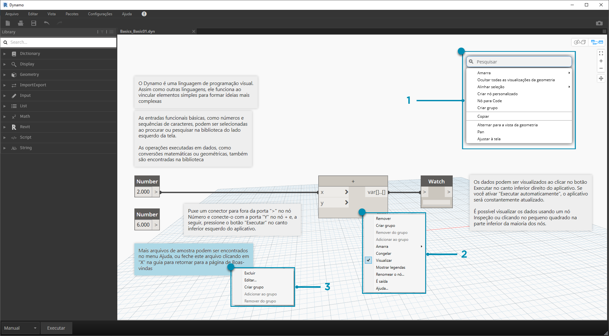
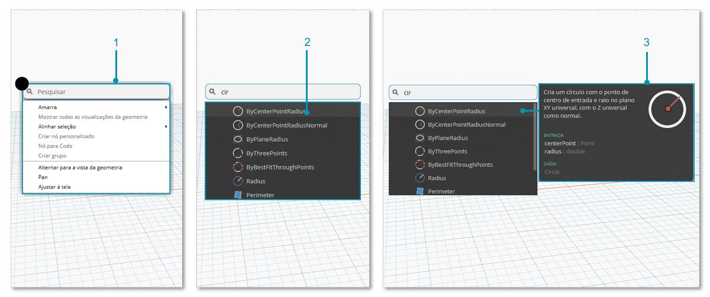

## O espaço de trabalho

O **Espaço de trabalho** do Dynamo é onde desenvolvemos os programas visuais, mas também é onde visualizamos qualquer geometria resultante. Se estamos trabalhando em um espaço de trabalho inicial ou em um nó personalizado, podemos navegar com o mouse ou com os botões na parte superior direita. Alternar entre os modos no canto inferior direito alterna a visualização que navegamos.

> Observação: os nós e geometria têm uma ordem de desenho para que você possa ter objetos renderizados um sobre o outro. Isso pode ser confuso ao adicionar vários nós em sequência, pois eles podem ser renderizados na mesma posição no espaço de trabalho.

> 1. Guias
2. Botões Zoom/Pan
3. Modo de visualização
4. Clicando duas vezes no espaço de trabalho

### Guias

A guia Espaço de trabalho ativo permite navegar e editar o programa. Quando você abre um novo arquivo, por padrão, está abrindo um novo espaço de trabalho **Inicial**. Você também pode abrir um novo espaço de trabalho de **Nó personalizado** no menu Arquivo ou pela opção *Novo nó por seleção* ao clicar com o botão direito do mouse quando Nós estiverem selecionados (mais informações sobre esta funcionalidade serão fornecidas mais adiante).

> Observação: você pode ter somente um espaço de trabalho inicial aberto de cada vez; no entanto, você pode ter vários espaços de trabalho de nó personalizados abertos em guias adicionais.

### Navegação de visualização 3D e navegação por gráfico

No Dynamo, o gráfico e os resultados 3D do gráfico (caso uma geometria esteja sendo criada) são renderizados no espaço de trabalho. Por padrão, o Gráfico é a visualização ativa, portanto, usar os botões de navegação ou o botão do meio do mouse para efetuar o pan e zoom nos moverá através do Gráfico. A alternância entre as visualizações ativas pode ser obtida de três maneiras:

> 1. Botões de alternância de visualização no espaço de trabalho
2. Clique com o botão direito do mouse no espaço de trabalho e selecione *Alternar para... vista*
3. Atalho de teclado (Ctrl + B)

O modo de navegação de visualização 3D também nos dá a capacidade de **Manipulação direta** de pontos, exemplificada em [Introdução](http://primer.dynamobim.org/02_Hello-Dynamo/2-6_the_quick_start_guide.html).

### Zoom para recentralizar

Podemos facilmente arrastar, ampliar e girar livremente em torno de modelos no modo de navegação de visualização 3D. No entanto, para efetuar o zoom especificamente em um objeto criado por um nó de geometria, é possível utilizar o ícone Zoom em tudo com um único nó selecionado.

> 1. Selecione o nó correspondente à geometria que irá centralizar a vista.
2. Alterne para a Navegação de visualização 3D.

> 1. Clique no ícone Zoom em tudo na parte superior direita.
2. A geometria selecionada será centralizada dentro da vista.

### Olá, Mouse!

Com base no modo de visualização que está ativo, os botões do mouse irão agir de forma diferente. Em geral, o clique com o botão esquerdo do mouse seleciona e especifica entradas, o clique com o botão direito do mouse fornece acesso às opções e o clique do meio do mouse permite navegar no espaço de trabalho. O clique com o botão direito do mouse nos apresentará com opções baseadas no contexto de onde estamos clicando.

> 1. Clique com o botão direito do mouse no espaço de trabalho.
2. Clique com o botão direito do mouse em um nó.
3. Clique com o botão direito do mouse em uma observação.

Aqui está uma tabela de interações do mouse por Visualização:

|**Ação do Mouse**|**Visualização de gráfico**|**Visualização em 3D**|
| -- | -- | -- |
|Clique com o botão esquerdo|Selecionar|N/D|
|Clique com o botão direito do mouse|Menu de contexto|Opções de zoom|
|Clique com o botão do meio|Pan|Pan|
|Role|Zoom ampliar/reduzir|Zoom ampliar/reduzir|
|Clique duplo|Criar Code Block|N/D|

### Pesquisa na tela

Usando a "Pesquisa na tela", você agilizará consideravelmente o fluxo de trabalho do Dynamo, fornecendo acesso a descrições de nós e dicas de ferramentas sem tirar você do seu lugar no gráfico! Basta clicar com o botão direito do mouse para acessar toda a funcionalidade útil da "Pesquisa de biblioteca" de onde você estiver trabalhando na tela.

> 1. Clique com o botão direito do mouse em qualquer lugar da tela para abrir o recurso de pesquisa. Enquanto a barra de pesquisa está vazia, o menu suspenso será exibido como um menu de visualização.
2. Quando você digita na barra de pesquisa, o menu suspenso será continuamente atualizado para mostrar os resultados de pesquisa mais relevantes.
3. Passe o mouse sobre os resultados da pesquisa para obter suas descrições e dicas de ferramentas correspondentes.

## Limpar layout do nó

Manter sua tela do Dynamo organizada se torna cada vez mais importante à medida que seus arquivos se tornam mais complexos. Embora tenhamos a ferramenta **Alinhar seleção** para trabalhar com pequenas quantidades de nós selecionados, o Dynamo também tem como recurso a ferramenta **Limpar layout do nó** para ajudar com a limpeza geral do arquivo.

#### Antes da limpeza do nó

> 1. Selecione os nós a serem organizados automaticamente ou deixe todos desmarcados para limpar todos os nós no arquivo.
2. O recurso de Limpar o layout do nó está localizado na guia Editar.
#### Após a limpeza do nó

3. Os nós serão automaticamente redistribuídos e alinhados, limpando quaisquer nós escalonados ou sobrepostos e alinhando-os com os nós vizinhos.

