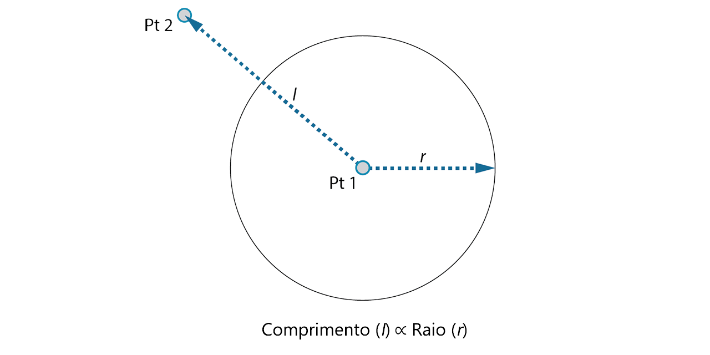
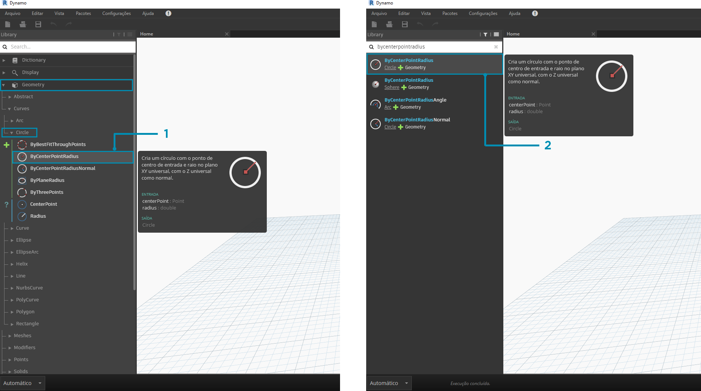
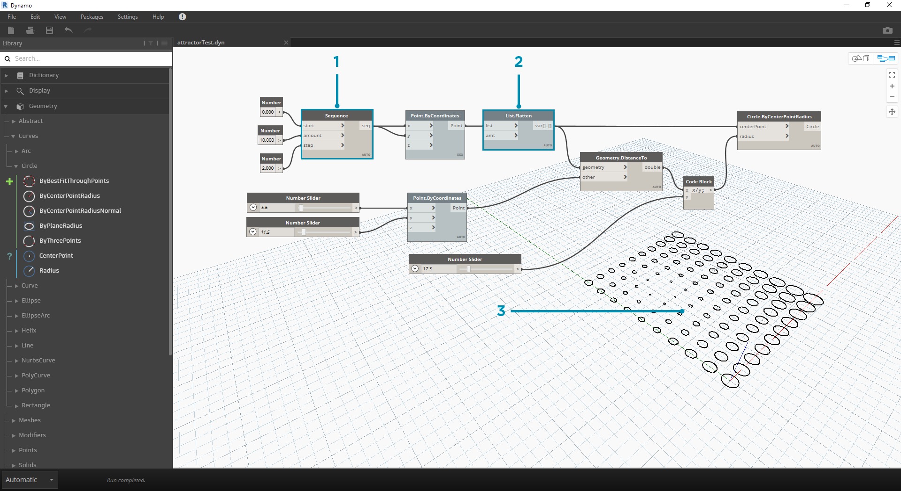

## INTRODUÇÃO

Agora que nos familiarizamos com o layout da interface e com a navegação no espaço de trabalho, a próxima etapa é compreender o fluxo de trabalho típico para desenvolver um gráfico no Dynamo. Vamos começar criando um círculo de tamanho dinâmico e, em seguida, criar uma matriz de círculos com raios variáveis.

### Definição de objetivos e relações

Antes de adicionar qualquer coisa ao espaço de trabalho do Dynamo, é fundamental que tenhamos um entendimento sólido do que estamos tentando obter e quais serão as relações significativas. Lembre-se de que a qualquer momento que estamos conectando dois nós, estamos criando um vínculo explícito entre eles: podemos alterar o fluxo de dados posteriormente, mas, depois de conectado, nos comprometemos com essa relação. Neste exercício, queremos criar um círculo (*Objetivo*) onde a entrada de raio é definida por uma distância a um ponto próximo (*Relação*).



> Um ponto que define uma relação com base na distância é normalmente denominado "Atrativo". Aqui, a distância para o nosso Ponto atrativo será usada para especificar o tamanho do círculo.

### Adicionar nós ao espaço de trabalho

Agora que temos nossos Objetivos e Relações desenhados, podemos começar a criar nosso gráfico. Precisamos dos nós que representarão a sequência de ações que o Dynamo executará. Como sabemos que estamos tentando criar um círculo, vamos começar localizando um nó que o faz. Usando o campo Pesquisar ou navegando pela biblioteca, vamos descobrir que há mais de uma forma de criar um círculo.



> 1. Navegue para Geometry > Curves > Circle > **Circle.ByPointRadius**
2. Pesquisar > "ByCenterPointRadius..."

Vamos adicionar o nó **Circle.ByPointRadius** ao espaço de trabalho clicando nele na biblioteca: isso deve adicionar o nó ao centro do espaço de trabalho.


> 1. O nó Circle.ByPointandRadius na biblioteca
2. Clicar no nó na biblioteca adiciona-o ao espaço de trabalho

Também precisamos dos nós **Point.ByCoordinates**, **Number Input**, e **Number Slider**.


> 1. Geometry > Points > Point > **Point.ByCoordinates**
2. Geometry > Geometry > **DistanceTo**
3. Input > Basic > **Number**
4. Input > Basic > **Number Slider**

### Conectando nós com fios

Agora que temos alguns nós, precisamos conectar as Portas dos Nós com Fios. Estas conexões definirão o fluxo de dados.


> 1. **Number** para **Point.ByCoordinates**
2. **Number Sliders** para **Point.ByCoordinates**
3. **Point.ByCoordinates** (2) para **DistanceTo**
4. **Point.ByCoordinates** e **DistanceTo** para **Circle.ByCenterPointRadius**

### Executar o programa

Com o fluxo do programa definido, tudo o que precisamos fazer é informar ao Dynamo para executá-lo. Quando o nosso programa for executado (automaticamente ou quando clicarmos em Executar no Modo manual), os dados passarão pelos fios e veremos os resultados na Visualização 3D.


> 1. (Clique em Executar): se a barra de execução estiver no Modo manual, é necessário clicar em Executar para executar o gráfico
2. Visualização do nó: passar o mouse sobre a caixa no canto inferior direito de um nó irá fornecer um pop-up dos resultados
3. Visualização 3D: se algum de nossos nós criar a geometria, veremos na Visualização 3D.
4. A geometria de saída no nó de criação.

### Adicionar detalhes

Se o nosso programa estiver funcionando, devemos ver um círculo na Visualização 3D que está passando pelo nosso Ponto atrativo. Isto é ótimo, mas podemos adicionar mais detalhes ou mais controles. Vamos ajustar a entrada para o Nó do círculo para que possamos calibrar a influência no raio. Adicione outro **Number Slider** ao espaço de trabalho e, a seguir, clique duas vezes em uma área em branco do espaço de trabalho para adicionar um nó de **Code Block**. Edite o campo no Code Block, especificando ```X/Y```.


> 1. **Code Block**
2. **DistanceTo** e **Number Slider** para **Code Block**
3. **Code Block** para **Circle.ByCenterPointRadius**

### Adicionar complexidade

Iniciar a complexidade simples e de construção é uma forma eficaz de desenvolver nosso programa de forma incremental. Uma vez que ele esteja trabalhando para um círculo, vamos aplicar a potência do programa a mais de um círculo. Em vez de um ponto central, se utilizarmos um eixo de pontos e acomodarmos a alteração na estrutura de dados resultante, nosso programa agora criará muitos círculos, cada um com um valor de raio exclusivo definido pela distância calibrada para o Ponto atrativo.



> 1. Adicione um nó de **Number Sequence** e substitua as entradas de **Point.ByCoordinates**: clique com o botão direito em Point.ByCoordinates e selecione Amarra > Referência cruzada
2. Adicione um nó de **Mesclagem** após Point.ByCoordinates. Para aplainar uma lista completamente, deixe a entrada ```QTD``` no padrão de ```-1```
3. A visualização 3D será atualizada com um eixo de círculos

### Ajuste com manipulação direta

Às vezes, a manipulação numérica não é a abordagem correta. Agora é possível mover e puxar manualmente a geometria de ponto ao navegar na visualização 3D em segundo plano. Também podemos controlar outra geometria que foi construída por um ponto. Por exemplo, **Sphere.ByCenterPointRadius** é capaz de realizar a Manipulação direta também. Podemos controlar a posição de um ponto a partir de uma série de valores X, Y e Z com **Point.ByCoordinates**. No entanto, com a abordagem de Manipulação direta, é possível atualizar os valores dos controles deslizantes movendo manualmente o ponto no modo **Navegação de visualização 3D**. Isso oferece uma abordagem mais intuitiva para controlar um conjunto de valores discretos que identificam a localização de um ponto.


> 1. Para utilizar a **Manipulação direta**, selecione o painel do ponto a ser movido: as setas irão aparecer sobre o ponto selecionado.
2. Alterne para o modo **Navegação de visualização 3D**.


> 1. Passe o mouse sobre o ponto e os eixos X, Y e Z aparecerão.
2. Clique e arraste a seta colorida para mover o eixo correspondente, e os valores do **Number Slider** serão atualizados ao vivo com o ponto movido manualmente.


> 1. Observe que, antes da **Manipulação direta**, somente um controle deslizante foi conectado no componente **Point.ByCoordinates**. Quando movemos manualmente o ponto na direção X, o Dynamo gerará automaticamente um novo **Number Slider** para a entrada X.

