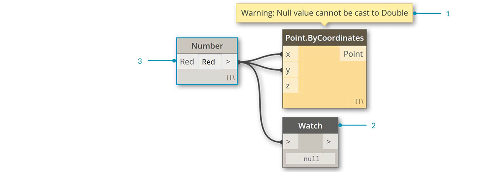

## Nós

No Dynamo, os **Nós** são os objetos que você conecta para formar um programa visual. Cada **Nó** executa uma operação: às vezes pode ser tão simples quanto armazenar um número ou pode ser uma ação mais complexa, como criar ou consultar geometria.

### Anatomia de um nó

A maioria dos nós no Dynamo são compostos de cinco partes. Embora existam exceções, como os nós Input, a anatomia de cada nó pode ser descrita da seguinte maneira: 

> 1. Nome – O nome do nó com uma convenção de nomenclatura Category.Name
2. Principal – O corpo principal do nó: clicar com o botão direito do mouse aqui apresenta opções no nível de todo o nó
3. Portas (entrada e saída) – Os destinatários dos fios que fornecem os dados de entrada para o nó, assim como os resultados da ação do nó
4. Ícone de amarra – Indica a opção de amarra especificada para as entradas de lista coincidentes (mais informações adiante)
5. Valor padrão – Clique com o botão direito do mouse em uma porta de entrada: alguns nós têm valores padrão que podem ser usados ou não.

### Portas

As entradas e saídas nos nós são chamadas de portas e agem como receptores para os fios. Os dados entram o nó através das portas à esquerda e saem do nó após ele ter executado sua operação à direita. As portas esperam receber dados de um determinado tipo. Por exemplo, conectar um número como *2.75* às portas em um nó Point By Coordinates resultará na criação com êxito de um ponto; no entanto, se fornecermos *“Red”* à mesma porta, resultará em um erro.

> Dica: Passe o mouse sobre uma porta para ver uma dica de ferramenta contendo o tipo de dados esperado.

> 1. Legenda da porta
2. Dica de ferramenta
3. Tipo de dados
4. Valor padrão

### Estados

O Dynamo fornece uma indicação do estado da execução do programa visual ao renderizar os nós com diferentes esquemas de cores com base no status de cada nó. Além disso, passar o mouse ou clicar com o botão direito do mouse sobre o nome ou as portas apresenta informações e opções adicionais.

> 1. Ativo – Os nós com um plano de fundo do nome cinza escuro estão bem conectados e têm todas as suas entradas conectadas com êxito
2. Inativo – Os nós cinzas estão inativos e precisam ser conectados com fios para fazer parte do fluxo do programa no espaço de trabalho ativo
3. Estado de erro – Vermelho indica que o nó está em um estado de erro
4. Congelar – Um nó transparente tem a função Congelar ativada, suspendendo a execução do nó
5. Selecionado – Os nós atualmente selecionados têm um realce azul-claro em sua borda
6. Aviso – Os nós amarelos estão em um estado de aviso, o que significa que podem ter tipos de dados incorretos
7. Visualização do plano de fundo – Cinza escuro indica que a visualização da geometria está desativada

Se o programa visual tiver avisos ou erros, o Dynamo fornecerá informações adicionais sobre o problema. Qualquer nó exibido em amarelo também terá uma dica acima do nome. Passe o mouse sobre a dica para expandi-la.

> Dica: Com esta informação de dica de ferramenta disponível, examine os nós a montante para ver se o tipo de dados ou a estrutura de dados requerido está com erro.

> 1. Dica de ferramenta de aviso – “Nulo” ou nenhum dado não pode ser entendido como um Duplo, ou seja, um número
2. Use o nó Watch para examinar os dados de entrada
3. A montante do nó Number está indicando “Red”, não um número

