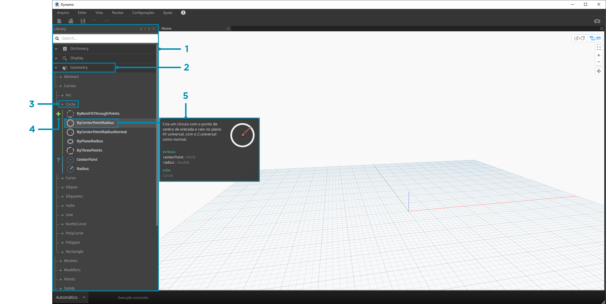
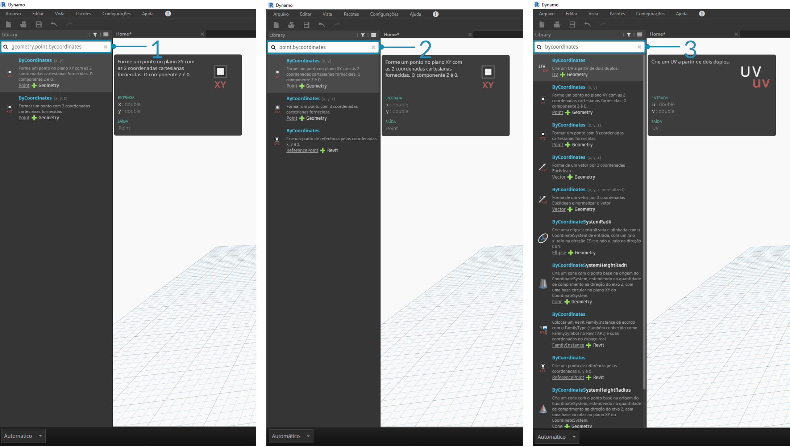

## Biblioteca do Dynamo

A **Biblioteca do Dynamo** contém os nós que adicionamos ao espaço de trabalho para definir programas visuais para execução. Na biblioteca, é possível pesquisar ou procurar nós. Os nós contidos aqui: os nós básicos instalados, os nós personalizados que definimos e os nós do Gerenciador de pacotes adicionados ao Dynamo são organizados hierarquicamente por categoria. Vamos analisar esta organização e explorar os principais nós que usaremos com frequência.

### Biblioteca de bibliotecas

A **Biblioteca** do Dynamo com a qual fazemos interface no aplicativo é, na verdade, uma coleção de bibliotecas funcionais, cada uma contendo nós agrupados por categoria. Embora isso pareça ser obtuso em princípio, é uma estrutura flexível para organizar os nós que vêm com a instalação padrão do Dynamo, e é ainda melhor quando começamos a estender esta funcionalidade-base com nós personalizados e pacotes adicionais.

#### O esquema organizacional

A seção **Biblioteca** da interface do usuário do Dynamo é composta por bibliotecas hierarquicamente organizadas. Quando vamos detalhar a biblioteca, buscamos sequencialmente uma biblioteca, as categorias da biblioteca e as subcategorias da categoria para localizar o nó.



> 1. A biblioteca: a região da interface do Dynamo
2. Uma biblioteca: uma coleção de categorias relacionadas, como **Geometry**
3. Uma categoria: uma coleção de nós relacionados, como tudo relacionado aos **Circles**
4. Uma subcategoria: divisão dos nós dentro da categoria, normalmente por **Create**, **Action** ou **Query**
5. Um nó: os objetos que são adicionados ao espaço de trabalho para executar uma ação

#### Convenções de nomenclatura

A hierarquia de cada biblioteca é refletida no Nome dos nós adicionados ao Espaço de trabalho, que também podemos usar no Campo de pesquisa ou com Blocos de código (que usam a *linguagem textual do Dynamo*). Além de usar palavras-chave para tentar localizar nós, podemos digitar a hierarquia separada por um ponto.

Ao inserir diferentes partes do local do nó na hierarquia de bibliotecas no formato ```library.category.nodeName```, os resultados são diferentes:



> 1. ```library.category.nodeName```
2. ```category.nodeName```
3. ```nodeName``` ou ```palavra-chave```

Normalmente, o nome do nó no espaço de trabalho será renderizado no formato ```category.nodeName```, com algumas exceções notáveis, especialmente nas categorias de entrada e vista. Tenha atenção aos nós de nome semelhante e observe a diferença de categoria:


> 1. Os nós da maioria das bibliotecas incluirão o formato da categoria
2. ```Point.ByCoordinates``` e ```UV.ByCoordinates``` têm o mesmo nome, mas vêm de diferentes categorias
3. Exceções notáveis incluem funções incorporadas, Core.Input, Core.View e Operators

### Nós utilizados com frequência

Com centenas de nós incluídos na instalação básica do Dynamo, quais são essenciais para o desenvolvimento de nossos programas visuais? Vamos nos concentrar naqueles que nos permitem definir os parâmetros do programa (**Entrada**), ver os resultados de uma ação do nó de (**Inspeção**) e definir entradas ou funcionalidades por meio de um atalho (**Code Block**).

#### Entrada

Os nós de entrada são os principais meios para o usuário do nosso Programa visual, seja você mesmo ou outra pessoa, fazer a interface com os parâmetros mais importantes. Aqui estão os nós disponíveis na Categoria de entrada da Biblioteca principal:


> 1. Booleano
2. Number
3. Sequência
4. Número do controle deslizante
5. Controle deslizante de números inteiros
6. Caminho do diretório
7. Caminho do arquivo

#### Assistir

Os nós de inspeção de variáveis são essenciais para gerenciar os dados que fluem através do seu Programa visual. Embora seja possível visualizar o resultado de um nó através da visualização de dados do nó, é possível mantê-lo revelado em um nó de **Inspeção** ou ver os resultados da geometria através de um nó **Watch3D**. Ambas são encontradas na categoria da vista na biblioteca principal.

> Dica: às vezes, a visualização 3D pode causar distrações quando o Programa visual contém muitos nós. Considere desmarcar a opção Exibir visualização de plano de fundo no menu Configurações e usar um nó Watch3D para visualizar a geometria.


> 1. Inspeção: observe que, quando você seleciona um item no nó de Inspeção, ele é marcado nas Visualizações do Watch3D e 3D
2. Watch3D: seleciona a alça inferior direita para redimensionar e navegar com o mouse da mesma forma que faria na Visualização 3D

#### Code Block

Os nós **Code Block** podem ser utilizados para definir um Code Block com linhas separadas por ponto e vírgula. Isso pode ser tão simples quanto ```X/Y```. Também é possível usar os Code Blocks como um atalho para definir uma entrada de número ou chamar outra funcionalidade do nó. A sintaxe para fazer isso segue a Convenção de nomenclatura do idioma textual do Dynamo, DesignScript e está descrita na Seção 7.2. Vamos tentar criar um círculo com este atalho:


> 1. Clique duas vezes para criar um nó de **Code Block**
2. Digite ```Circle.ByCenterPointRadius(x,y);```
3. Clicar no espaço de trabalho para limpar a seleção deve adicionar entradas ```x``` e ```y``` automaticamente
4. Crie um nó **Point.ByCoordinates** e um **Number Slider** e, a seguir, conecte-os às entradas do Code Block
5. O resultado da execução do Programa visual deve ser um círculo na Visualização 3D

