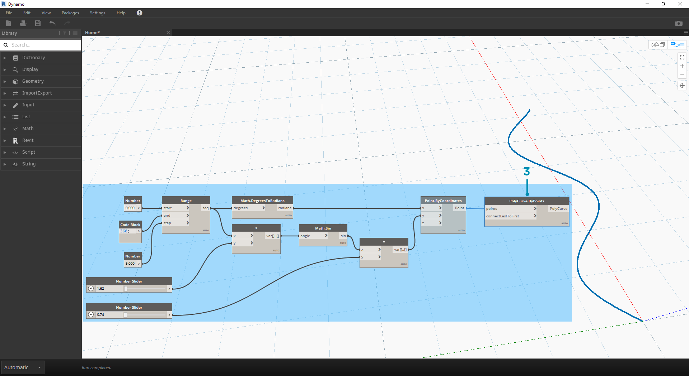
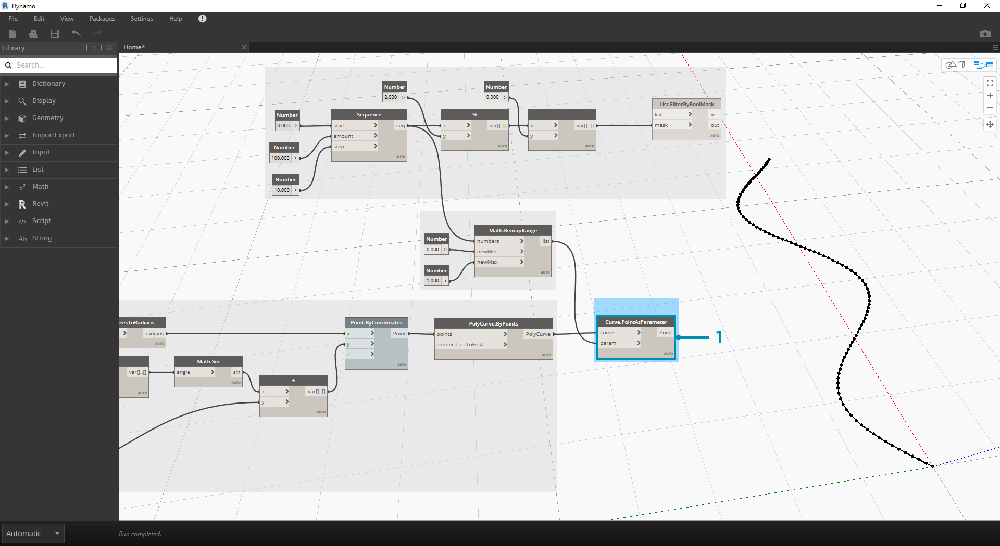

## Logic

A **Lógica**, ou mais especificamente a **Lógica condicional**, permite especificar uma ação ou conjunto de ações com base em um teste. Após avaliar o teste, teremos um valor booleano que representa ```True``` ou ```False``` que podemos usar para controlar o fluxo do programa.

### Booleanos

As variáveis numéricas podem armazenar um intervalo completo de números diferentes. As variáveis booleanas somente podem armazenar dois valores referidos como True ou False, Yes ou No, 1 ou 0. Raramente usamos operações booleanas para realizar cálculos devido ao seu intervalo limitado.

### Declarações condicionais

A declaração “If” é um conceito chave na programação: “Se *isso* for verdadeiro, *aquilo* acontecerá; caso contrário, *outra coisa* acontecerá. A ação resultante da declaração é controlada por um valor booleano. Há várias maneiras de definir uma declaração “If” no Dynamo:

|Ícone|Nome|Sintaxe|Entradas|Saídas|
| -- | -- | -- | -- | -- |
||If|If|teste, true, false|resultado|
||Fórmula|IF(x,y,z)|x, y, z|resultado|
||Bloco de código|(x?y:z)|x, y, z|resultado|

Vamos examinar um breve exemplo de cada um desses três nós em ação usando a declaração “If” condicional:


> Nessa imagem, *boolean* está definido como *true*, o que significa que o resultado é uma sequência de caracteres com a inscrição: *“this is the result if true” (esse será o resultado se true).* Os três nós que criam a declaração *If* estão funcionando de forma idêntica aqui.


> Novamente, os nós estão funcionando de forma idêntica. Se *boolean* for alterado para *false*, nosso resultado será o número *Pi*, conforme definido na declaração *If* original.

### Filtrar uma lista

> Faça o download do arquivo de exemplo que acompanha este exercício (clique com o botão direito do mouse e selecione “Salvar link como...”): [Building Blocks of Programs - Logic.dyn](datasets/4-3/Building Blocks of Programs - Logic.dyn). É possível encontrar uma lista completa de arquivos de exemplo no Apêndice.

Vamos usar a lógica para separar uma lista de números em uma lista de números pares e uma lista de números ímpares.


> 1. **Number Range** (Intervalo de números) – adicione um intervalo de números à tela.
2. **Numbers** (Números) – adicione três nós number à tela. O valor para cada nó number deve ser: *0,0* para *start*, *10,0* para *end* e *1,0* para *step*.
3. **Output** (Saída) – nossa saída é uma lista de 11 números que varia entre 0 e 10.
4. **Modulo (%) –** *Number Range* em *x* e *2,0* em *y*. Isso calcula o resto de cada número na lista dividida por 2. A saída dessa lista fornece uma lista de valores alternados entre 0 e 1.
5. **Equality Test (==)** (Teste de igualdade) – adicione um teste de igualdade à tela. Conecte a saída *modulo* à entrada *x* e *0,0* à entrada *y*.
6. **Watch** (Inspeção) – a saída do teste de igualdade é uma lista de valores que alternam entre true e false. Esses são os valores usados para separar os itens na lista. *0* (ou *true*) representa números pares e (*1* ou *false*) representa números ímpares.
7. **List.FilterByBoolMask** – esse nó filtrará os valores em duas listas diferentes com base no booleano de entrada. Conecte o *number range* original à entrada *list* e a saída *equality test* à entrada *mask*. A saída *in* representa valores true enquanto a saída *out* representa valores false.
8. **Watch** (Inspeção) – como resultado, agora temos uma lista de números pares e uma lista de números ímpares. Usamos operadores lógicos para separar as listas em padrões.

### Da lógica à geometria

Desenvolvendo a lógica estabelecida no primeiro exercício, vamos aplicar essa configuração a uma operação de modelagem.

 Vamos passar do exercício anterior com os mesmos nós. As únicas exceções (além de alterar o formato) são:

> 1. Os valores de entrada foram alterados.
2. Desconectamos a entrada da lista in em *List.FilterByBoolMask*. Colocaremos esses nós de lado por enquanto, mas eles serão úteis depois no exercício.



> Vamos começar conectando os nós, como mostrado na imagem acima. Esse grupo de nós representa uma equação paramétrica para definir uma curva de linha. Algumas observações:

> 1. O **primeiro controle deslizante** deve ter um mín. de 1, um máx. de 4 e uma etapa de 0,01.
2. O **segundo controle deslizante** deve ter um mín. de 0, um máx. de 1 e uma etapa de 0,01.
3. **PolyCurve.ByPoints** – se o diagrama de nós acima for copiado, o resultado será uma curva senoidal na viewport de Visualização do Dynamo.

O método para as entradas: use os nós de número nas propriedades mais estáticas e os controles deslizantes de número nas mais flexíveis. Queremos manter o intervalo de números original que estávamos definindo no início desta etapa. No entanto, a curva seno criada aqui deve ter alguma flexibilidade. É possível mover esses controles deslizantes para observar a curva atualizar sua frequência e amplitude.


> Vamos pular um pouco a definição e examinar o resultado final para que possamos fazer referência ao ponto em que estamos chegando. As duas primeiras etapas são feitas separadamente. Agora queremos conectar as duas. Usaremos o senoide base para controlar a localização dos componentes do compactador e usaremos a lógica true/false para alternar entre caixas pequenas e caixas maiores.


> 1. **Math.RemapRange** – usando a sequência de números criada na etapa 01, vamos criar uma nova série de números remapeando o intervalo. Os números originais da etapa 01 variam entre 0 e 100. Esses números variam entre 0 e 1 nas entradas *newMin* e *newMax*, respectivamente.



> 1. **Curve.PointAtParameter** – conecte *Polycurve.ByPoints* (da etapa 2) a *curve* e *Math.RemapRange* a *param*. Essa etapa cria pontos ao longo da curva. Remapeamos os números de 0 a 1 pois a entrada *param* está procurando valores nesse intervalo. Um valor de *0* representa o ponto inicial e um valor de *1* representa os pontos finais. Todos os números entre esses valores avaliam dentro do intervalo *[0,1]*.


> 1. **List.FilterByBoolMask** – Conecte *Curve.PointAtParameter* da etapa anterior à entrada *list*.
2. **Watch** (Inspeção) – um nó de inspeção para *in* e um nó de inspeção para *out* mostra que temos duas listas que representam índices pares e ímpares. Esses pontos estão ordenados da mesma maneira na curva, que demonstramos na próxima etapa.


> 1. **Cuboid.ByLength** – recrie as conexões vistas na imagem acima para obter um compactador ao longo da curva do seno. Um cuboide é apenas uma caixa aqui, e estamos definindo seu tamanho com base no ponto da curva no centro da caixa. A lógica da divisão par/ímpar agora deve estar clara no modelo.


> 1. **Number Slider** (Controle deslizante de número) – voltando ao início da definição, podemos flexibilizar o controle deslizante de número e observar a atualização do compactador. A linha superior de imagens representa valores de intervalo do controle deslizante de número superior. Essa é a frequência da onda.
2. **Number Slider** (Controle deslizante de número) – a linha inferior de imagens representa um intervalo de valores do controle deslizante inferior. Essa é a amplitude da onda.

