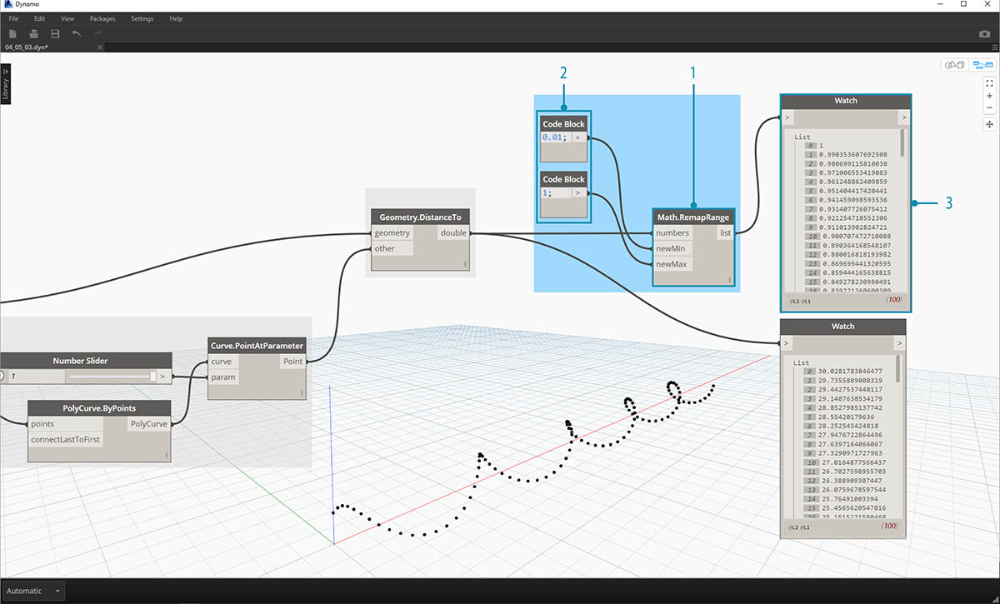
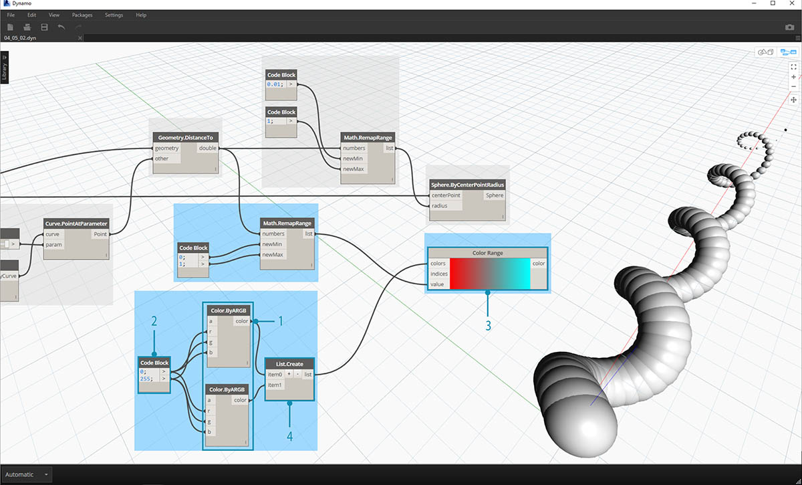
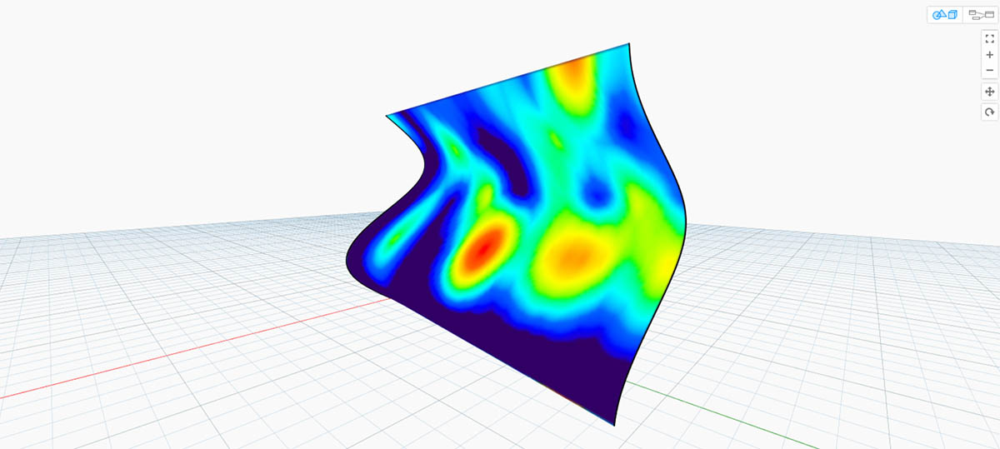
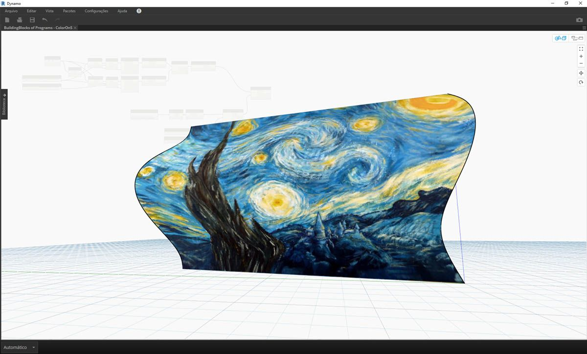

## Cor

A cor é um excelente tipo de dados para criar imagens atraentes, bem como para a diferença de renderização na saída do Programa visual. Ao trabalhar com dados abstratos e números variados, às vezes é difícil ver o que está mudando e até que ponto. Este é um ótimo aplicativo para cores.

### Criar cores

As cores no Dynamo são criadas usando entradas ARGB. Isso corresponde aos canais alfa, vermelho, verde e azul. O alfa representa a *transparência* da cor, enquanto os outros três canais são usados como cores primárias para gerar todo o espectro de cores em conjunto.

|Ícone|Nome|Sintaxe|Entradas|Saídas|
| -- | -- | -- | -- | -- |
||Cor ARGB|Color.ByARGB|A,R,G,B|cor|

### Consultar os valores de cor

As cores na tabela abaixo consultam as propriedades usadas para definir a cor: Alfa, Vermelho, Verde e Azul. Observe que o nó Color.Components nos fornece as quatro como resultados diferentes, o que torna este nó preferível para consultar as propriedades de uma cor.

|Ícone|Nome|Sintaxe|Entradas|Saídas|
| -- | -- | -- | -- | -- |
||Alfa|Color.Alpha|cor|A|
||Vermelho|Color.Red|cor|R|
||Verde|Color.Green|cor|G|
||Azul|Color.Blue|cor|B|
||Componentes|Color.Components|cor|A,R,G,B|

As cores na tabela abaixo correspondem ao **espaço de cores HSB**. Dividir a cor em matiz, saturação e brilho é sem dúvida mais intuitivo para a maneira como interpretamos as cores: que cor deve ser? Quão colorido deve ser? E quão clara ou escura deve ser a cor? Este é o detalhamento de matiz, saturação e brilho, respectivamente.

|Ícone|Nome da consulta|Sintaxe|Entradas|Saídas|
| -- | -- | -- | -- | -- |
||Matiz|Color.Hue|cor|Matiz|
||Saturação|Color.Saturation|cor|Saturação|
||Brilho|Color.Brightness|cor|Brilho|

### Faixa de cores

A faixa de cores é similar ao nó **Remapear faixa** da seção 4.2: remapeia uma lista de números em outro domínio. Mas, em vez de mapear para um domínio de *números*, ele mapeia para um *gradiente de cores* com base nos números de entrada que variam de 0 a 1.

O nó atual funciona bem, mas pode ser um pouco estranho fazer com que tudo funcione da primeira vez. A melhor forma de se familiarizar com o gradiente de cores é testar o resultado de forma interativa. Vamos fazer um exercício rápido para rever como configurar um gradiente com cores de saída correspondentes aos números.

> 1. **Definir três cores: **usando um nó de bloco de código, defina *vermelho, verde* e *azul* inserindo as combinações apropriadas de *0* e *255*.
2. **Criar lista:** mescla as três cores em uma lista.
3. **Definir índices: ** cria uma lista para definir as posições da alça de cada cor (desde 0 até 1). Observe o valor de 0,75 para verde. Isso coloca a cor verde a 3/4 do caminho através do gradiente horizontal no controle deslizante do intervalo de cores.
4. **Bloco de código: ** insira valores (entre 0 e 1) para converter em cores.

### Visualização da cor

O nó **Display.ByGeometry** nos fornece a capacidade de colorir a geometria na viewport do Dynamo. Isso é útil para separar diferentes tipos de geometria, demonstrando um conceito paramétrico ou definindo uma legenda de análise para simulação. As entradas são simples: geometria e cor. Para criar um gradiente como a imagem acima, a entrada de cor é conectada ao nó **intervalo de cores**.

### Exercício de cor

> Faça o download do arquivo de exemplo que acompanha este exercício (clique com o botão direito do mouse e selecione “Salvar link como...”): [Building Blocks of Programs - Color.dyn](datasets/4-5/Building Blocks of Programs - Color.dyn). É possível encontrar uma lista completa de arquivos de exemplo no Apêndice.

Este exercício foca no controle de cores parametricamente em paralelo com a geometria. A geometria é uma hélice básica, que definimos abaixo usando o **Bloco de código** (3.2.3). Essa é uma maneira rápida e fácil de criar uma função paramétrica; e, como nosso foco está na cor (e não na geometria), usamos o bloco de código para criar a hélice de maneira eficiente sem sobrecarregar a tela. Usaremos o bloco de código com mais frequência à medida que o primer se mover para um material mais avançado.

> 1. **Bloco de código:** define os dois blocos de código com as fórmulas acima. Esse é um método paramétrico rápido para criar uma espiral.
2. **Point.ByCoordinates:** conecta as três saídas do bloco de código às coordenadas do nó.

Agora, vemos uma matriz de pontos criando uma hélice. O próximo passo é criar uma curva através dos pontos de forma que possamos visualizar a hélice.

> 1. **PolyCurve.ByPoints:** conecta a saída *Point.ByCoordinates* à entrada *pontos* do nó. Obtemos uma curva helicoidal.
2. **Curve.PointAtParameter:** conecta a saída *PolyCurve.ByPoints* à entrada *curva*. O propósito desta etapa é criar um ponto paramétrico atrativo que desliza ao longo da curva. Como a curva está avaliando um ponto no parâmetro, precisaremos inserir um valor de *parâmetro* entre 0 e 1.
3. **Controle deslizante de número:** após adicionar à tela, altere o valor *mín.* para *0,0*, o valor *máx.* para *1,0* e o valor de *etapa* para *0,01*. Conecte a saída do controle deslizante à entrada *parâmetro* para *Curve.PointAtParameter*. Agora, vemos um ponto ao longo do comprimento da hélice, representado por uma porcentagem do controle deslizante (0 no ponto inicial, 1 no ponto final).

Com o ponto de referência criado, agora comparamos a distância do ponto de referência com os pontos originais que definem a hélice. Esse valor de distância determinará a geometria e a cor.

> 1. **Geometry.DistanceTo:** conecta a saída *Curve.PointAtParameter* à *entrada*. Conecte *Point.ByCoordinates* à entrada da *geometria.
2. **Inspeção:** o resultado mostra uma lista de distâncias entre cada ponto helicoidal e o ponto de referência ao longo da curva.

A próxima etapa é determinar os parâmetros com a lista de distâncias entre os pontos helicoidais e o ponto de referência. Usamos esses valores de distância para definir os raios de uma série de esferas ao longo da curva. Para manter as esferas em um tamanho adequado, precisamos *remapear* os valores da distância.

> 1. **Math.RemapRange:** conecta *Geometry.DistanceTo* à entrada dos números.
2. **Bloco de código:** conecta um bloco de código com um valor de *0,01* à entrada *newMin* e um bloco de código com um valor de *1* à entrada *newMax*.
3. **Inspeção:** conecta a saída *Math.RemapRange* a um nó e a saída *Geometry.DistanceTo* a outro nó. Compare os resultados.

Esse passo remapeou a lista de distância para um intervalo menor. Podemos editar os valores *newMin* e *newMax* conforme necessário. Os valores serão remapeados e terão a mesma *relação de distribuição* no domínio.

> 1. **Sphere.ByCenterPointRadius:** conecta a saída *Math.RemapRange* à entrada *raio* e a saída original *Point.ByCoordinates* à entrada *centerPoint*.

> 1. **Controle deslizante de número:** altere o valor do controle deslizante de número e observe o tamanho das esferas atualizadas. Agora, temos um modelo paramétrico.

O tamanho das esferas demonstra a matriz paramétrica definida por um ponto de referência ao longo da curva. Vamos usar o mesmo conceito para o raio da esfera para determinar sua cor.

> 1. **Faixa de cores:** adiciona a parte superior da tela. Ao passar o cursor sobre a entrada *valor*, notamos que os números solicitados estão entre 0 e 1. Precisamos remapear os números na saída *Geometry.DistanceTo* para que sejam compatíveis com este domínio.
2. **Sphere.ByCenterPointRadius:** para agora, vamos desativar a visualização neste nó (*clique com o botão direito do mouse > Visualização*).

> 1. **Math.RemapRange:** esse processo deverá ser familiar. Conecte a saída *Geometry.DistanceTo* à entrada de números.
2. **Bloco de código:** semelhante a uma etapa anterior, crie um valor de *0* para a entrada *newMin* e um valor de *1* para a entrada *newMax*. Neste caso, observe que podemos definir duas saídas de um bloco de código.
3. **Faixa de cores:** conecte a saída *Math.RemapRange* à entrada *valor*.

> 1. **Color.ByARGB:** esse é o processo para criar duas cores. Embora esse processo possa parecer estranho, é o mesmo que as cores RGB em outro software, estamos apenas usando a programação visual para fazê-lo.
2. **Bloco de código:** crie dois valores de *0* e *255*. Conecte as duas saídas às duas entradas *Color.ByARGB* de acordo com a imagem acima (ou crie as duas cores favoritas).
3. **Faixa de cores:** a entrada *cores* solicita uma lista de cores. É necessário criar esta lista com base nas duas cores criadas na etapa anterior.
4. **List.Create:** mescla as duas cores em uma lista. Conecte a saída à entrada *cores* para a *Faixa de cores*.

> 1. **Display.ByGeometryColor:** conecta *Sphere.ByCenterPointRadius* à entrada *geometria* e a *Faixa de cores* à entrada *cor*. Agora temos um gradiente suave no domínio da curva.

> Se alterarmos o valor do *controle deslizante de número* anterior na definição, as cores e os tamanhos serão atualizados. As cores e o tamanho do raio estão diretamente relacionados neste caso: agora temos uma ligação visual entre dois parâmetros.

### Cor em superfícies

O nó **Display.BySurfaceColors** nos fornece a habilidade para mapear dados através de uma superfície usando a cor. Essa funcionalidade apresenta algumas possibilidades interessantes para visualizar os dados obtidos por meio de análise discreta, como solar, energia e proximidade. A aplicação de cor a uma superfície no Dynamo é semelhante à aplicação de uma textura a um material em outros ambientes CAD. Vamos demonstrar como usar essa ferramenta no breve exercício abaixo.

### Exercício de cor em superfícies

> Faça o download do arquivo de exemplo que acompanha este exercício (clique com o botão direito do mouse e selecione “Salvar link como...”): [Building Blocks of Programs - ColorOnSurface.zip](datasets/4-5/BuildingBlocks of Programs - ColorOnSurface.zip). É possível encontrar uma lista completa de arquivos de exemplo no Apêndice.

> Primeiro, é preciso criar (ou referenciar) uma superfície para usar como uma entrada para o nó **Display.BySurfaceColors**. Neste exemplo, estamos fazendo a transição entre uma curva seno e cosseno.

> 1. Esse **Grupo** de nós está criando pontos ao longo do eixo Z e, em seguida, deslocando-os com base nas funções de seno e cosseno. As duas listas de pontos são, em seguida, usadas para gerar curvas NURBS.
2. **Surface.ByLoft**: gera uma superfície interpolada entre a lista de curvas NURBS.

> 1. **Caminho do arquivo**: selecione um arquivo de imagem para amostra dos dados de pixel a jusante
2. Use **File.FromPath** para converter o caminho do arquivo em um arquivo e, em seguida, passe para **Image.ReadFromFile** para gerar uma imagem de amostra
3. **Image.Pixels**: insira uma imagem e forneça um valor de amostra para usar ao longo das dimensões x e y da imagem
4. **Controle deslizante**: fornece os valores de amostra para **Image.Pixels**
5. **Display.BySurfaceColors**: mapeia a matriz de valores de cores através da superfície ao longo de X e Y, respectivamente

> Visualização aproximada da superfície de saída com resolução de 400x300 amostras

