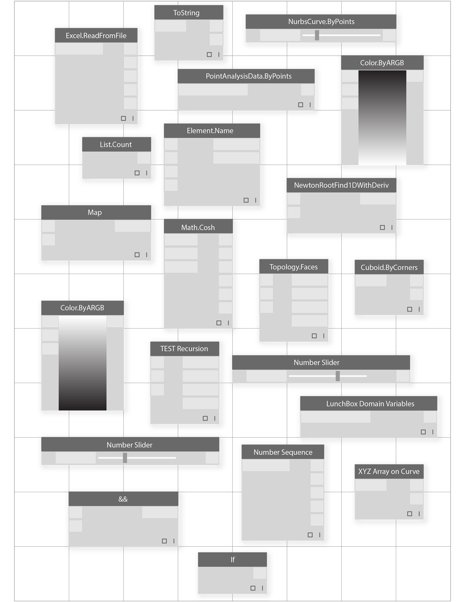

# OS BLOCOS DE CONSTRUÇÃO DE PROGRAMAS

Quando estivermos prontos para nos aprofundar no desenvolvimento de programas visuais, precisaremos de uma compreensão mais profunda dos blocos de construção que usaremos. Este capítulo apresentará os conceitos fundamentais em torno dos dados: o que percorre os fios do nosso programa Dynamo.

