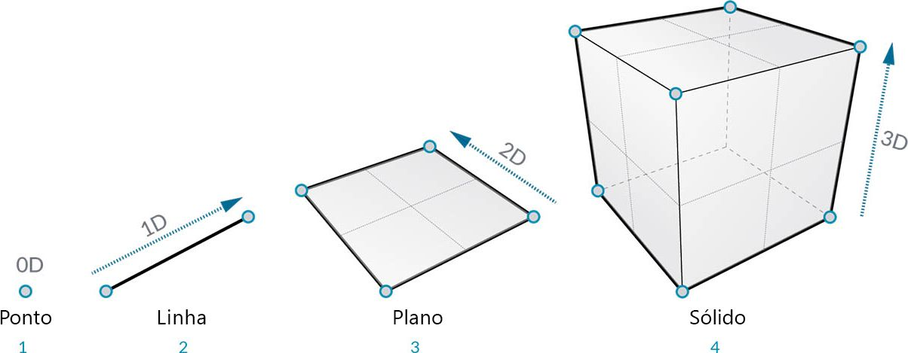
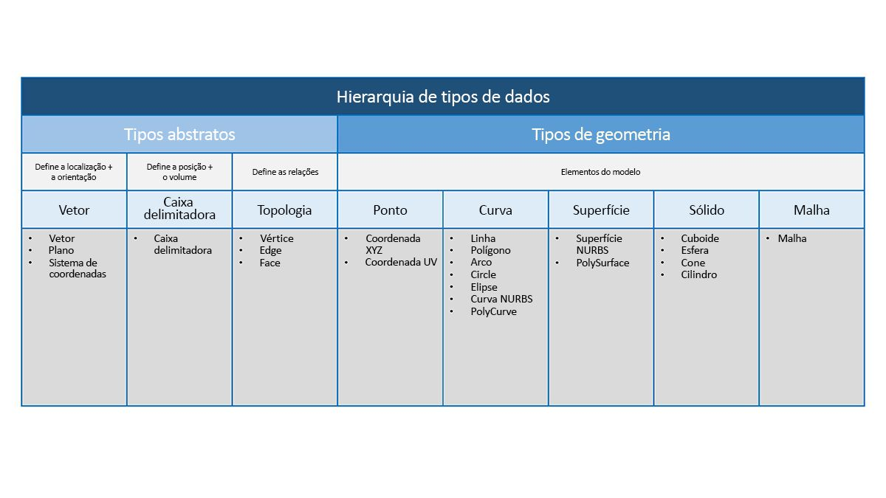

## Visão geral da geometria

**Geometria** é o idioma da área de design. Quando uma linguagem de programação ou ambiente tem um kernel de geometria em seu núcleo, podemos desbloquear as possibilidades de projetar modelos precisos e robustos, automatizando rotinas de projeto e gerando iterações de projeto com algoritmos.

### Conceitos básicos

A geometria, tradicionalmente definida, é o estudo de forma, tamanho, posição relativa das imagens e as propriedades de espaço. Este campo tem uma história rica que remonta a milhares de anos. Com o advento e a popularização do computador, ganhamos uma poderosa ferramenta na definição, na exploração e na geração de geometria. Agora é muito fácil calcular o resultado de interações geométricas complexas, o fato de que estamos fazendo isso é quase transparente.

> Se você está curioso para ver como a geometria complexa e diversa pode aproveitar a potência do seu computador, faça uma pesquisa rápida pelo Stanford Bunny, um modelo tradicional usado para testar algoritmos.

Compreender a geometria no contexto de algoritmos, computação e complexidade pode parecer desafiador; no entanto, há alguns princípios-chave e relativamente simples que podemos estabelecer como fundamentos para começar a construção em aplicações mais avançadas:

1. A geometria é de **Dados**: para o computador e o Dynamo, um Bunny não tão diferente de um número.
2. A geometria depende de **Abstração**: fundamentalmente, os elementos geométricos são descritos por números, relações e fórmulas em um determinado sistema de coordenadas espaciais
3. A geometria possui uma **Hierarquia**: os pontos são reunidos para criar linhas, linhas se unem para criar superfícies, e assim por diante
4. A geometria descreve simultaneamente **a parte e o todo**: quando uma curva é exibida, ela tem a forma e todos os pontos possíveis ao longo dela

Na prática, esses princípios significam que precisamos estar cientes do que estamos trabalhando (que tipo de geometria, como ela foi criada, etc.) para que possamos compor, decompor e recompor de forma fluida diferentes geometrias à medida que desenvolvemos modelos mais complexos.

### Etapas a seguir na Hierarquia

Vamos separar um momento para analisar a relação entre as descrições de geometria abstrata e hierárquica. Como esses dois conceitos estão relacionados, mas nem sempre são óbvios no início, podemos chegar rapidamente a um bloco de estradas conceitual quando começamos a desenvolver fluxos de trabalho ou modelos mais profundos. Para começar, vamos usar a cotagem como um descritor fácil do "material" que modelamos. O número de cotas necessárias para descrever uma forma nos dá uma ideia sobre como a geometria é organizada hierarquicamente.

> 1. Um **Ponto** (definido por coordenadas) não possui dimensões: apenas números descrevem cada coordenada
2. Uma **Linha** (definida por dois pontos) agora tem *uma* cota: é possível "navegar" na linha para frente (direção positiva) ou para trás (direção negativa)
3. Um **Plano** (definido por duas linhas) tem *duas* dimensões: andar mais à esquerda ou mais à direita agora é possível
4. Uma **Caixa** (definida por dois planos) tem *três* dimensões: podemos definir uma posição com relação acima ou abaixo

A cotagem é uma forma conveniente de começar a classificar a geometria, mas não é necessariamente a melhor. Afinal, não modelamos apenas com pontos, linhas, planos e caixas: e se eu quiser algo curvado? Além disso, há toda uma outra categoria de tipos de geometria que são completamente abstratos. eles definem propriedades como orientação, volume ou relações entre as partes. Não podemos pegar um vetor, então como definimos em relação ao que vemos no espaço? Uma categorização mais detalhada da hierarquia geométrica deve acomodar a diferença entre Tipos abstratos ou "Auxiliares", cada um dos quais podemos agrupar pelo que eles ajudam a fazer e tipos que ajudam a descrever a forma dos elementos do modelo.

### Geometria no Dynamo Studio

O que isso significa para usar o Dynamo? A compreensão dos tipos de geometria e como eles estão relacionados nos permitirão navegar na coleção de **Nós de geometria** disponíveis na biblioteca. Os nós de geometria são organizados em ordem alfabética em oposição à hierarquia: aqui eles são exibidos de forma similar ao layout na interface do Dynamo.

Além disso, criar modelos no Dynamo e conectar a visualização do que vemos na visualização em segundo plano para o fluxo de dados em nosso gráfico deve se tornar mais intuitivo com o passar do tempo.

> 1. Observe o sistema de coordenadas assumido renderizado pela grade e pelos eixos coloridos
2. Os nós selecionados irão renderizar a geometria correspondente (se o nó criar geometria) no plano de fundo, a cor de realce
> Faça o download do arquivo de exemplo que acompanha esta imagem (clique com o botão direito do mouse e "Salvar link como..."): [Geometry for Computational Design - Geometry Overview.dyn](datasets/5-1/Geometry for Computational Design - Geometry Overview.dyn). Uma lista completa de arquivos de exemplo pode ser encontrada no Apêndice.

### Ir além com a geometria

A criação de modelos no Dynamo não se limita ao que podemos gerar com Nós. Aqui estão algumas maneiras importantes de levar o processo para o próximo nível com a Geometria:

1. O Dynamo permite importar arquivos: tente usar um CSV para nuvens de pontos ou SAT para trazer superfícies
2. Ao trabalhar com o Revit, podemos referenciar os elementos do Revit para usar no Dynamo
3. O Dynamo Package Manager oferece funcionalidade adicional para tipos e operações estendidos de geometria: verifique o pacote [Kit de ferramentas de malha](https://github.com/DynamoDS/Dynamo/wiki/Dynamo-Mesh-Toolkit)

