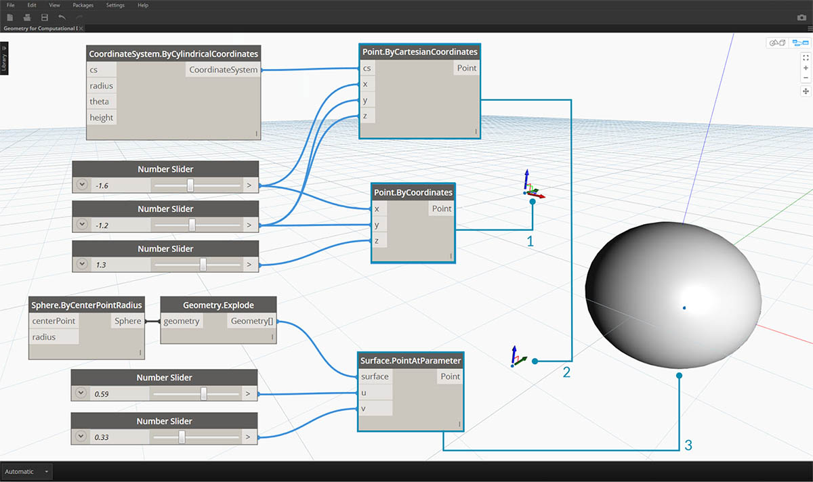

## Pontos

Se a geometria é o idioma de um modelo, então os pontos são o alfabeto. Os pontos são a fundação na qual todas as outras geometrias são criadas: precisamos de ao menos dois pontos para criar uma curva, precisamos de ao menos três pontos para criar um polígono ou uma face de malha, e assim por diante. Definir a posição, a ordem e a relação entre os pontos (tente uma função de seno) nos permite definir uma geometria de ordem superior como as coisas que reconhecemos como círculos ou curvas.


> 1. Um Círculo utilizando as funções ```x=r*cos(t)``` e ```y=r*sin(t)```
2. Uma Curva seno usando as funções ```x=(t)``` e ```y=r*sin(t)```

### O que é um ponto?

Um ponto é definido por nada mais que um ou mais valores chamados coordenadas. Quantos valores de coordenadas precisamos para definir o ponto dependem do sistema de coordenadas ou do contexto em que ele reside. O tipo mais comum de Ponto no Dynamo existe em nosso Sistema de coordenadas universais tridimensional e tem três coordenadas [X,Y,Z].


### Ponto como Coordenadas

Os pontos também podem existir em um sistema de coordenadas bidimensional. A convenção tem uma notação de letra diferente dependendo do tipo de espaço com que estamos trabalhando: podemos usar [X,Y] em um plano ou [U,V] se estivermos em uma superfície.


> 1. Um ponto no sistema de coordenadas "Euclidean": [X,Y,Z]
2. Um ponto em um sistema de coordenadas de parâmetro de curva: [t]
3. Um ponto em um sistema de coordenadas de parâmetro de superfície: [U,V]

Embora pareça ser contraintuitivo, os parâmetros para curvas e superfícies são contínuos e estendem-se além da aresta da geometria dada. Como as formas que definem o Espaço de parâmetro residem em um Sistema de coordenadas universais tridimensional, sempre podemos converter uma coordenada paramétrica em uma coordenada "Universal". O ponto [0.2, 0.5] na superfície, por exemplo, é o mesmo que o ponto [1.8, 2.0, 4.1] nas coordenadas universais.



> 1. Ponto em coordenadas XYZ universais assumidas
2. Ponto relativo a um determinado sistema de coordenadas (cilíndrico)
3. Ponto como coordenada UV em uma superfície
> Faça o download do arquivo de exemplo que acompanha esta imagem (clique com o botão direito do mouse e "Salvar link como..."): [Geometry for Computational Design - Points.dyn](datasets/5-3/Geometry for Computational Design - Points.dyn). Uma lista completa de arquivos de exemplo pode ser encontrada no Apêndice.

