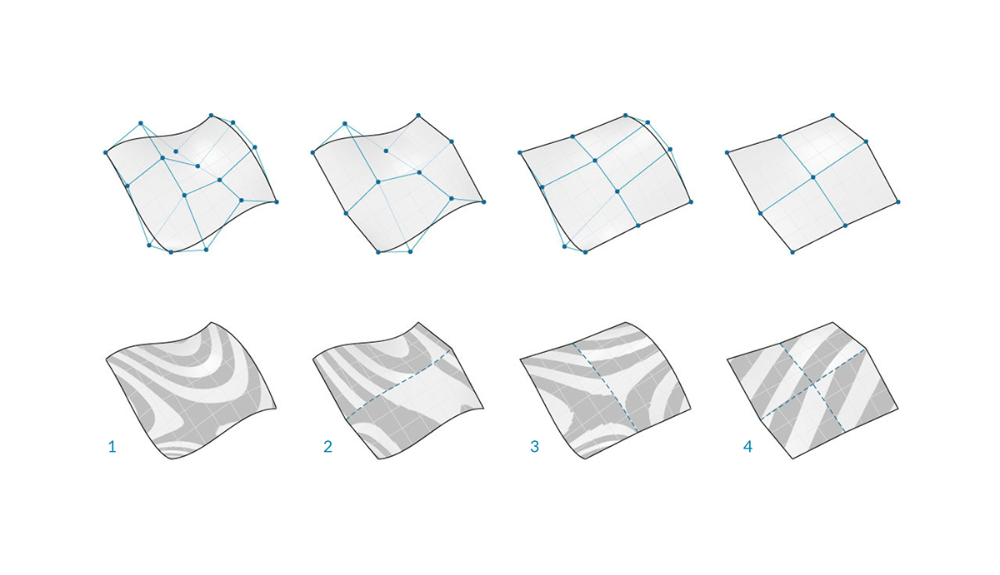
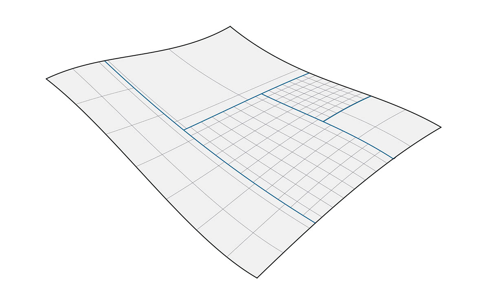
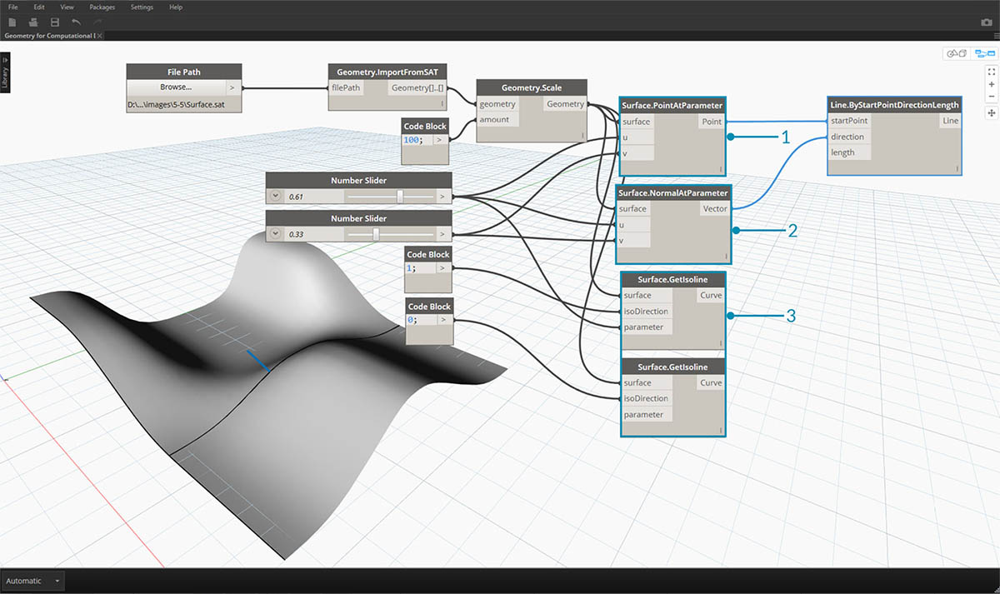

## Superfícies

À medida que passamos do uso de curvas para o uso de superfícies em um modelo, podemos agora começar a representar objetos que vemos no nosso mundo tridimensional. Enquanto as curvas nem sempre são planas, ou seja, elas são tridimensionais, o espaço que elas definem é sempre vinculado a uma dimensão. As superfícies nos dão outra dimensão e um conjunto de propriedades adicionais que podemos usar em outras operações de modelagem.

### O que é uma superfície?

Uma superfície é uma forma matemática definida por uma função e dois parâmetros. Em vez de ```t``` para curvas, usamos ```U``` e ```V``` para descrever o espaço de parâmetro correspondente. Isso significa que temos mais dados geométricos para desenhar ao trabalhar com este tipo de geometria. Por exemplo, as curvas apresentam vetores tangentes e planos normais (que podem ser rotacionados ou girados ao longo do comprimento da curva), enquanto superfícies apresentam vetores normais e planos tangentes que serão consistentes na sua orientação.


> 1. Superfície
2. Isocurva U
3. Isocurva V
4. Coordenada UV
5. Plano perpendicular
6. Vetor normal

**Domínio de superfície**: um domínio de superfície é definido como o intervalo de parâmetros (U,V) que são avaliados em um ponto tridimensional naquela superfície. O domínio em cada cota (U ou V) normalmente é descrito como dois números (U mín para U máx) e (V mín para V máx).


Embora a forma da superfície não pareça “retangular” e localmente possa ter um conjunto de isocurves mais rígido ou mais solto, o “espaço” definido por seu domínio é sempre bidimensional. No Dynamo, as superfícies sempre são consideradas como tendo um domínio definido por um mínimo de 0,0 e um máximo de 1,0 nas direções U e V. As superfícies planas ou aparadas podem apresentar diferentes domínios.

**Isocurve** (ou curva isoparamétrica): uma curva definida por um valor U ou V constante na superfície e um domínio de valores para a outra direção U ou V correspondente.

**Coordenada UV**: o ponto no espaço de parâmetro UV definido por U, V e, às vezes, W.


**Plano perpendicular**: um plano que é perpendicular às Isocurves U e V em uma determinada coordenada UV.

**Vetor normal**: um vetor que define a direção “para cima” em relação ao plano perpendicular.

### Superfícies NURBS

As **superfícies NURBS** são muito similares às curvas NURBS. É possível considerar as superfícies NURBS como uma grade de curvas NURBS que estão em duas direções. A forma de uma superfície NURBS é definida por um número de pontos de controle e o grau da superfície nas direções U e V. Os mesmos algoritmos são usados para calcular a forma, as normais, as tangentes, as curvaturas e outras propriedades por meio de pontos de controle, espessuras e graus.


No caso de superfícies NURBS, há duas direções implícitas pela geometria, porque as superfícies NURBS são, independentemente da forma que vemos, grades retangulares de pontos de controle. E, embora essas direções sejam muitas vezes arbitrárias em relação ao sistema de coordenadas universal, nós as usaremos com frequência para analisar nossos modelos ou gerar outra geometria com base na superfície.



> 1. Grau (U,V) = (3,3)
2. Grau (U,V) = (3,1)
3. Grau (U,V) = (1,2)
4. Grau (U,V) = (1,1)

### Polysurfaces

As **Polysurfaces** são compostas de superfícies que são unidas através de uma aresta. As Polysurfaces oferecem mais de uma definição UV bidimensional, pois agora podemos percorrer as formas conectadas por meio de sua topologia.

> Embora “Topologia” geralmente descreva um conceito sobre como as peças são conectadas e/ou relacionadas, a topologia no Dynamo também é um tipo de geometria. Especificamente, é uma categoria principal para Superfícies, Polysurfaces e Sólidos.



Às vezes chamada de patches, a junção de superfícies dessa maneira nos permite criar formas mais complexas, além de definir detalhes na junção. Convenientemente, podemos aplicar uma operação de arredondamento ou chanfro às arestas de uma PolySurface.

Vamos importar e avaliar uma superfície em um parâmetro no Dynamo para ver que tipo de informações podemos extrair.



> 1. *Surface.PointAtParameter* retorna o ponto em uma determinada coordenada UV
2. *Surface.NormalAtParameter* retorna o vetor normal em uma dada coordenada UV
3. *Surface.GetIsoline* retorna a curva isoparamétrica em uma coordenada U ou V: observe a entrada isoDirection.
> Faça o download dos arquivos de exemplo que acompanham esta imagem (clique com o botão direito do mouse e escolha “Salvar link como...”). É possível encontrar uma lista completa de arquivos de exemplo no Apêndice.

> 1. [Geometry for Computational Design - Surfaces.dyn](datasets/5-5/Geometry for Computational Design - Surfaces.dyn)
2. [Surface.sat](datasets/5-5/Surface.sat)

