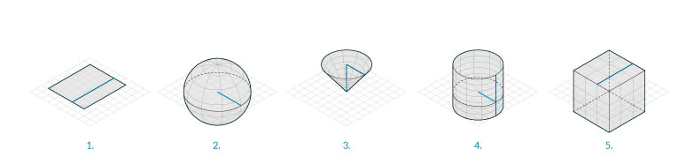
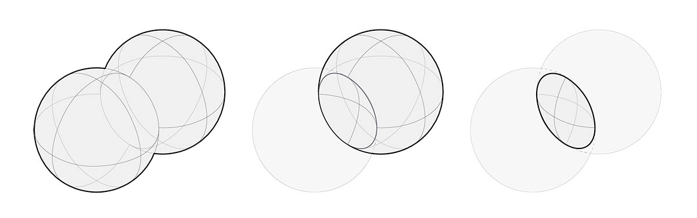
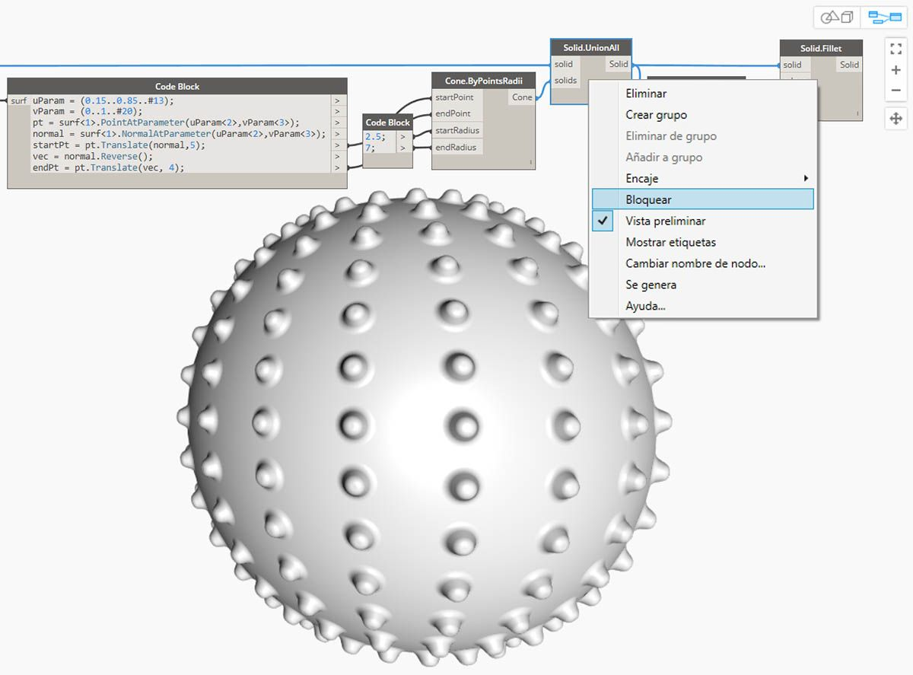
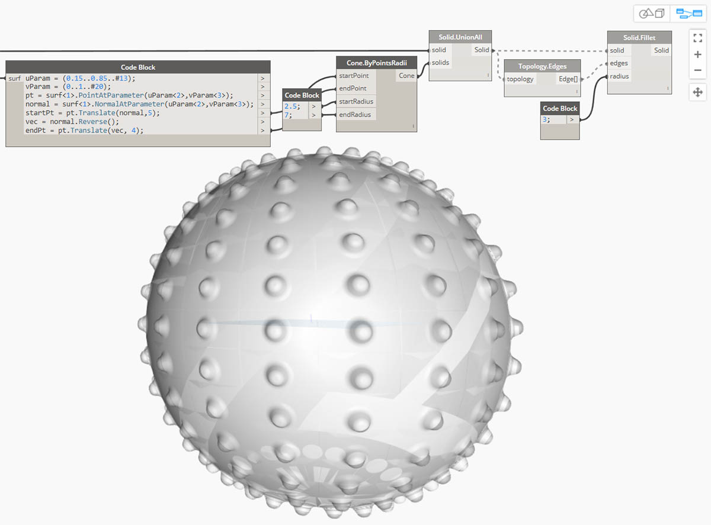
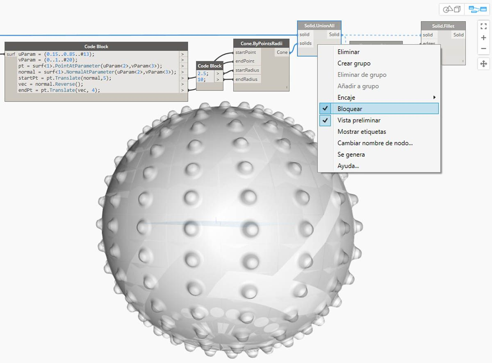

## Sólidos

Se quisermos construir modelos mais complexos que não possam ser criados com base em uma única superfície ou se desejarmos definir um volume explícito, agora precisaremos nos aventurar no realismo dos sólidos (e das Polysurfaces). Até mesmo um cubo simples é complexo o suficiente para precisar de seis superfícies, uma por face. Os sólidos dão acesso a dois conceitos-chave que as superfícies não têm: uma descrição topológica mais refinada (faces, arestas, vértices) e operações booleanas.

### O que é um sólido?

Os sólidos consistem em uma ou mais superfícies que contêm volume por meio de um limite fechado que define a “entrada” ou a “saída”. Independentemente de quantas superfícies existem, elas devem formar um volume “hermético” para serem consideradas como um sólido. Os sólidos podem ser criados unindo superfícies ou Polysurfaces ou usando operações como elevação, varredura e revolução. As primitivas Esfera, Cubo, Cone e Cilindro também são sólidos. Um cubo com ao menos uma face removida conta como uma PolySurface, que tem algumas propriedades similares, mas não é um sólido.

> 1. Um plano é composto de uma única superfície e não é um sólido.
2. Uma esfera é composta de uma superfície, mas *é* um sólido.
3. Um cone é composto por duas superfícies unidas para criar um sólido.
4. Um cilindro é composto por três superfícies unidas para criar um sólido.
5. Um cubo é composto de seis superfícies unidas para criar um sólido.

### Topologia

Os sólidos são compostos de três tipos de elementos: vértices, arestas e faces. As faces são as superfícies que compõem o sólido. As arestas são as curvas que definem a conexão entre as faces adjacentes e os vértices são os pontos inicial e final dessas curvas. É possível consultar esses elementos usando os nós Topology.

> 1. Faces
2. Arestas
3. Vértices

### Operações

É possível modificar os sólidos arredondando ou chanfrando suas bordas para eliminar os cantos e os ângulos agudos. A operação de chanfro cria uma superfície regular entre duas faces, enquanto o arredondamento é mesclado entre as faces para manter a tangência. 

> 1. Cubo Sólido
2. Cubo chanfrado
3. Cubo arredondado

### Operações booleanas

As operações booleanas de sólidos são métodos para combinar dois ou mais sólidos. Uma única operação booleana significa realizar quatro operações:

1. **fazer interseção** de dois ou mais objetos.
2. **Dividir** os objetos nas interseções.
3. **Excluir** as partes indesejadas da geometria.
4. **Unir** tudo de volta.

Isso torna os booleanos de sólidos num poderoso processo de economia de tempo. Existem três operações booleanas de sólidos que distinguem quais partes da geometria são mantidas. 

> 1. **União:** remove as partes sobrepostas dos sólidos e una-as em um único sólido.
2. **Diferença:** subtrai um sólido de outro. O sólido a ser subtraído é chamado de ferramenta. Observe que é possível alternar qual sólido é a ferramenta para manter o volume inverso.
3. **Interseção:** mantém somente o volume de interseção dos dois sólidos.

Além dessas três operações, o Dynamo tem os nós **Solid.DifferenceAll** e **Solid.UnionAll** para executar operações de diferença e união com vários sólidos. 

> 1. **UnionAll:** operação da união com esfera e cones virados para fora
2. **DifferenceAll:** operação de diferença com esfera e cones virados para dentro

Vamos usar algumas operações booleanas para criar uma bola espetada.

> 1. **Sphere.ByCenterPointRadius**: crie o sólido base.
2. **Topology.Faces**, **Face.SurfaceGeometry**: consulte as faces do sólido e converta-as em geometria de superfície. Neste caso, a esfera tem apenas uma face.
3. **Cone.ByPointsRadii**: construa cones usando pontos na superfície.
4. **Solid.UnionAll**: una os cones e a esfera.
5. **Topology.Edges**: consulte as arestas do novo sólido
6. **Solid.Fillet**: arredonde as arestas da esfera espetada
> Faça o download dos arquivos de exemplo que acompanham esta imagem (clique com o botão direito do mouse e escolha “Salvar link como...”). É possível encontrar uma lista completa de arquivos de exemplo no Apêndice. [Geometry for Computational Design - Solids.dyn](datasets/5-6/Geometry for Computational Design - Solids.dyn)

### Congelar

As operações booleanas são complexas e seu cálculo pode ser lento. Use a funcionalidade Congelar para suspender a execução dos nós selecionados e dos nós a jusante afetados.

> Use o menu de contexto do botão direito do mouse para congelar a operação União de sólidos

> O nó selecionado e todos os nós a jusante serão visualizados em um modo duplicado cinza claro, e os fios afetados serão exibidos como linhas tracejadas. A visualização da geometria afetada também será duplicada. Agora é possível alterar os valores anteriores sem calcular a união booleana.

> Para descongelar os nós, clique com o botão direito do mouse e desmarque Congelar.

> Todos os nós afetados e as visualizações de geometria associadas serão atualizados e revertidos para o modo de visualização padrão.

