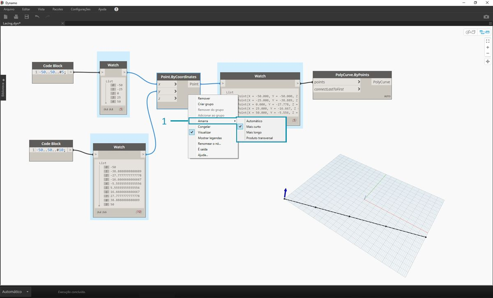
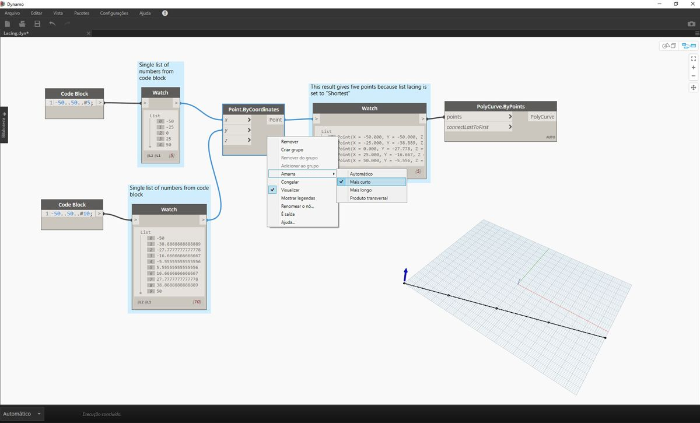
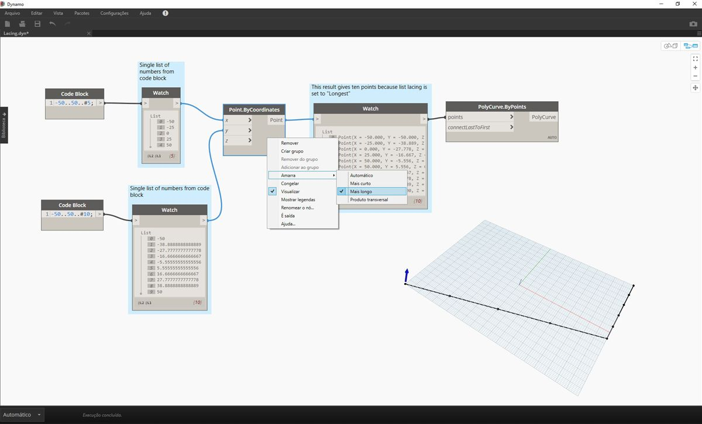
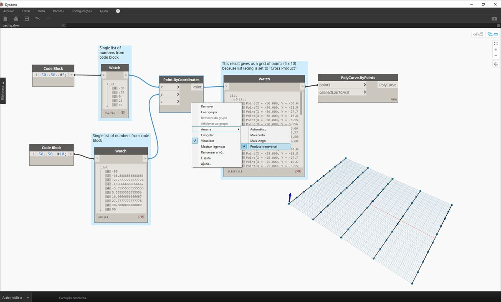

## O que é uma lista?

Uma lista é uma coleção de elementos ou de itens. Por exemplo, uma penca de bananas. Cada banana é um item na lista (ou penca). É mais fácil pegar uma penca de bananas em vez de cada banana individualmente, e o mesmo vale para agrupar elementos por relações paramétricas em uma estrutura de dados.

> Foto de [Augustus Binu](https://commons.wikimedia.org/wiki/File:Bananas_white_background_DS.jpg?fastcci_from=11404890&c1=11404890&d1=15&s=200&a=list).

Quando fazemos compras, colocamos todos os itens comprados em uma sacola. Essa sacola também é uma lista. Se estivermos fazendo pão de banana, precisaremos de três pencas de bananas (estamos fazendo *muito* de pão de banana). O saco representa uma lista de pencas de bananas e cada penca representa uma lista de bananas. O saco é uma lista de listas (bidimensionais) e a banana é uma lista (unidimensional).

No Dynamo, os dados da lista são ordenados e o primeiro item em cada lista tem um índice “0”. Abaixo, vamos discutir como as listas são definidas no Dynamo e como várias listas se relacionam entre si.

## Índices com base em zero

Uma coisa que pode parecer estranha no início é que o primeiro índice de uma lista é sempre 0; não 1. Portanto, quando falamos sobre o primeiro item de uma lista, na verdade, queremos dizer o item que corresponde ao índice 0.

Por exemplo, se você contasse o número de dedos que temos na mão direita, as chances são de que você teria contado de 1 a 5. No entanto, se você colocar seus dedos em uma lista, o Dynamo teria dado índices de 0 a 4. Embora isso possa parecer um pouco estranho para programadores iniciantes, o índice com base em zero é uma prática padrão na maioria dos sistemas de cálculo.

Observe que ainda temos cinco itens na lista; é apenas que a lista está usando um sistema de contagem baseado em zero. E os itens que estão sendo armazenados na lista não precisam ser apenas números. Eles podem ser qualquer tipo de dados que o Dynamo suporta, como pontos, curvas, superfícies, famílias etc.

Muitas vezes, a maneira mais fácil de analisar o tipo de dados armazenados em uma lista é conectar um nó de inspeção à saída de outro nó. Por padrão, o nó de inspeção exibe automaticamente todos os índices no lado esquerdo da lista e exibe os itens de dados na direita.

Esses índices são um elemento crucial ao trabalhar com listas.

### Entradas e saídas

Nas listas, as entradas e as saídas variam de acordo com o nó do Dynamo que está sendo usado. Como exemplo, vamos usar uma lista de cinco pontos e conectar essa saída a dois nós diferentes do Dynamo: *PolyCurve.ByPoints* e *Circle.ByCenterPointRadius*:

> 1. A entrada *pontos* para *PolyCurve.ByPoints* está procurando *“Point[]”*. Isso representa uma lista de pontos.
2. A saída para *PolyCurve.ByPoints* é uma policurva única criada com base em uma lista de cinco pontos.
3. A entrada *centerPoint* para *Circle.ByCenterPointRadius* solicita *“Ponto”*.
4. A saída para *Circle.ByCenterPointRadius* é uma lista de cinco círculos, cujos centros correspondem à lista original de pontos.

Os dados de entrada para *PolyCurve.ByPoints* e *Circle.ByCenterPointRadius* são os mesmos. No entanto, o nó Polycurve nos fornece uma policurva enquanto o nó Círculo nos fornece cinco círculos com centros em cada ponto. Isso faz sentido intuitivamente: a policurva é desenhada como uma curva conectando os cinco, enquanto os círculos criam um círculo diferente em cada ponto. O que está acontecendo com os dados?

Passando o mouse sobre a entrada *pontos* para *Polycurve.ByPoints*, vemos que a entrada está procurando *“Point[]”*. Observe os colchetes no final. Isso representa uma lista de pontos e, para criar uma policurva, a entrada precisa ser uma lista para cada policurva. Esse nó, portanto, condensará cada lista em uma policurva.

Por outro lado, a entrada *centerPoint* para *Circle.ByCenterPointRadius* solicita *“Ponto”*. Esse nó procura um ponto, como um item, para definir o ponto central do círculo. É por isso que obtemos cinco círculos com base nos dados de entrada. Reconhecer essa diferença com as entradas no Dynamo ajuda a compreender melhor como os nós funcionam ao gerenciar os dados.

### Amarra

A correspondência de dados é um problema sem uma solução fácil. Isso ocorre quando um nó tem acesso a entradas de tamanhos diferentes. Alterar o algoritmo de correspondência de dados pode levar a resultados muito diferentes.

Imagine um nó que cria segmentos de linha entre pontos (Line.ByStartPointEndPoint). Ele terá dois parâmetros de entrada que fornecem as coordenadas do ponto:

Como você pode ver, há diferentes maneiras de desenhar linhas entre estes conjuntos de pontos. É possível encontrar as opções de amarra clicando com o botão direito do mouse no centro de um nó e selecionando o menu “Amarra”.

### Arquivo base

> Faça o download do arquivo de exemplo que acompanha este exercício (clique com o botão direito do mouse e selecione “Salvar link como...”): [Lacing.dyn](datasets/6-1/Lacing.dyn). É possível encontrar uma lista completa de arquivos de exemplo no Apêndice.

Para demonstrar as operações de amarra abaixo, vamos usar esse arquivo base para definir a lista mais curta, a lista mais longa e o produto transversal.

> 1. Vamos alterar a amarra em *Point.ByCoordinates*, mas não alteraremos mais nada no gráfico acima.

#### Lista mais curta

A maneira mais simples é conectar as entradas individualmente até que um dos fluxos se esgote. Isso é denominado algoritmo “Lista mais curta”. Este é o comportamento padrão dos nós do Dynamo:

> Ao alterar a amarra para *lista mais curta*, obtemos uma linha diagonal básica composta de cinco pontos. Cinco pontos são o comprimento da lista menor, portanto, a amarra da lista mais curta é interrompida após atingir o final de uma lista.

#### Lista mais longa

O algoritmo “Lista mais longa” continua conectando entradas, reutilizando elementos, até que todos os fluxos se esgotem:

> Ao alterar a amarra para *lista mais longa*, obtemos uma linha diagonal que se estende verticalmente. Pelo mesmo método que o diagrama conceitual, o último item na lista de cinco itens será repetido para alcançar o comprimento da lista mais longa.

#### Produto transversal

Por fim, o método “Produto transversal” torna todas as conexões possíveis:

> Ao alterar a amarra para *Produto transversal*, temos todas as combinações entre cada lista, dando-nos uma grade de pontos 5x10. Essa é uma estrutura de dados equivalente ao produto transversal, como mostrado no diagrama do conceito acima, exceto que nossos dados agora são uma lista de listas. Ao conectar uma policurva, podemos ver que cada lista é definida pelo seu valor X, dando-nos uma linha de linhas verticais.

