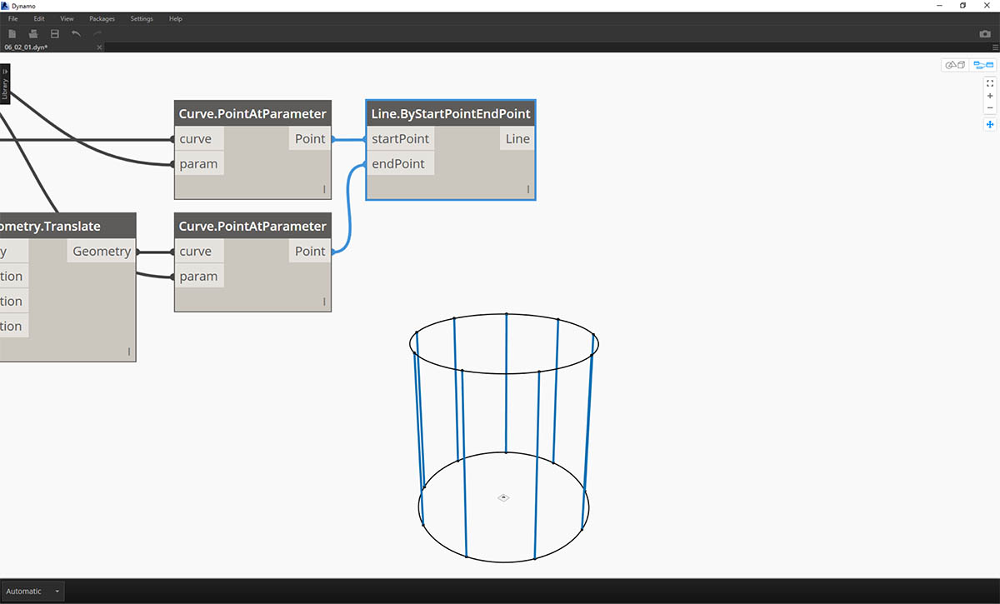
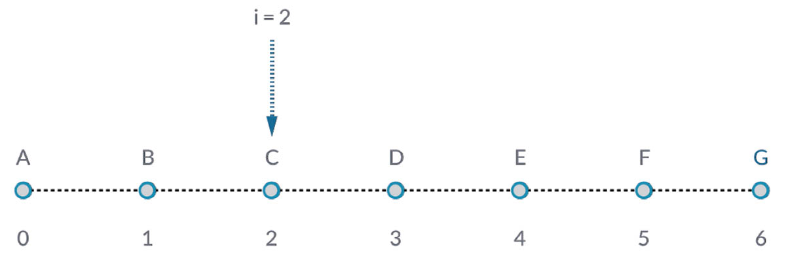
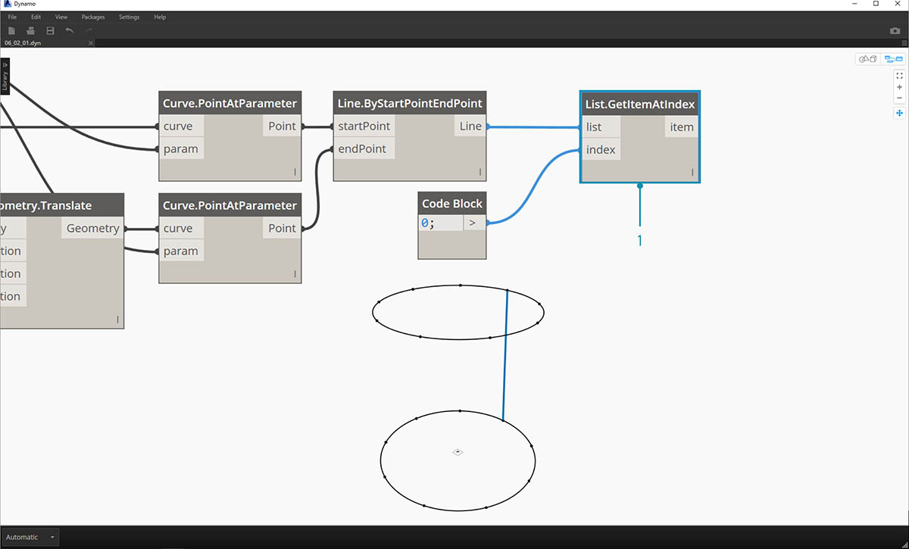
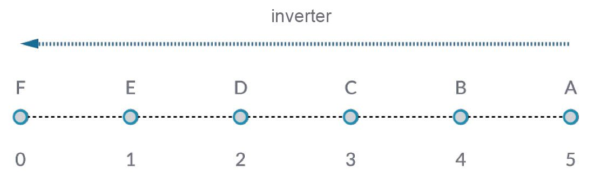
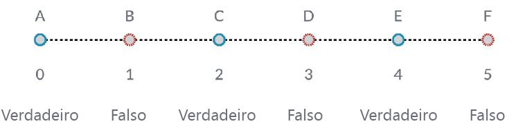

## Trabalhar com listas

Agora que estabelecemos o que é uma lista, vamos falar sobre as operações que podemos realizar nela. Imagine uma lista como um baralho de cartas. O baralho é a lista e cada carta representa um item.


> Foto de [Christian Gidlöf](https://commons.wikimedia.org/wiki/File:Playing_cards_modified.jpg)

Quais **consultas** podemos fazer na lista? Isso acessa as propriedades existentes.

* Número de cartas no baralho? 52.
* Número de naipes? 4.
* Material? Papel.
* Comprimento? 3,5 pol. ou 89 mm.
* Largura? 2,5 pol. ou 64 mm.

Quais **ações** podemos executar na lista? Isso altera a lista com base em uma operação fornecida.

* Podemos embaralhar as cartas.
* Podemos classificar as cartas por valor.
* Podemos classificar as cartas por naipe.
* Podemos dividir o baralho.
* Podemos dividir o baralho, distribuindo cada uma das mãos da rodada.
* É possível selecionar uma carta específica no baralho.

Todas as operações listadas acima têm nós análogos do Dynamo para trabalhar com listas de dados genéricos. As lições abaixo demonstrarão algumas das operações fundamentais que podemos executar nas listas.

## Operações de lista

A imagem abaixo é o gráfico base que usaremos para demonstrar as operações básicas de lista. Vamos explorar como gerenciar os dados em uma lista e demonstrar os resultados visuais.

#### Exercício – Operações de lista

> Faça o download do arquivo de exemplo que acompanha este exercício (clique com o botão direito do mouse e selecione “Salvar link como...”): [List-Operations.dyn](datasets/6-2/List-Operations.dyn). É possível encontrar uma lista completa de arquivos de exemplo no Apêndice.


> 1. Comece com um *code block* com um valor de ```500;```
2. Conecte-se à entrada *x* de um nó *Point.ByCoordinates*.
3. Conecte o nó da etapa anterior à entrada de origem de um nó *Plane.ByOriginNormal*.
4. Usando um nó *Circle.ByPlaneRadius*, conecte o nó da etapa anterior à entrada do plano.
5. Usando *code block*, designe um valor de ```50;``` para *radius*. Esse é o primeiro círculo que criaremos.
6. Com um nó *Geometry.Translate*, movimente o círculo 100 unidades para cima na direção Z.
7. Com um nó *code block*, defina um intervalo de dez números entre 0 e 1 com esta linha de código: ```0..1..#10;```
8. Conecte o bloco de código da etapa anterior à entrada *param* dos dois nós *Curve.PointAtParameter*. Conecte *Circle.ByPlaneRadius* à entrada de curva do nó superior e *Geometry.Translate* à entrada de curva do nó abaixo dele.
9. Usando um *Line.ByStartPointEndPoint*, conecte os dois nós *Curve.PointAtParameter*.



> 1. Um nó *Watch3D* mostra os resultados de *Line.ByStartPointEndPoint*. Estamos desenhando linhas entre dois círculos para representar operações básicas de lista e usaremos esse gráfico base do Dynamo para navegar pelas ações de lista abaixo.

### List.Count


> O nó *List.Count* é simples: conta o número de valores em uma lista e retorna esse número. Esse nó ganha mais nuances à medida que trabalhamos com listas de listas, mas vamos demonstrar isso nas seções a seguir.

#### Exercício – List.Count

> Faça o download do arquivo de exemplo que acompanha este exercício (clique com o botão direito do mouse e selecione “Salvar link como...”): [List-Count.dyn](datasets/6-2/List-Count.dyn). É possível encontrar uma lista completa de arquivos de exemplo no Apêndice.


> 1. O nó *List.Count* retorna o número de linhas no nó *Line.ByStartPointEndPoint*. O valor é 10 neste caso, que concorda com o número de pontos criados no nó original do *bloco de código*.

### List.GetItemAtIndex



> *List.GetItemAtIndex* é uma forma fundamental de consultar um item na lista. Na imagem acima, estamos usando um índice de *“2”* para consultar o ponto rotulado *“C”*.

#### Exercício – List.GetItemAtIndex

> Faça o download do arquivo de exemplo que acompanha este exercício (clique com o botão direito do mouse e selecione “Salvar link como...”): [List-GetItemAtIndex.dyn](datasets/6-2/List-GetItemAtIndex.dyn). É possível encontrar uma lista completa de arquivos de exemplo no Apêndice.



> 1. Usando o nó *List.GetItemAtIndex*, estamos selecionando o índice *“0”* ou o primeiro item na lista de linhas.
2. O nó *Watch3D* revela que selecionamos uma linha. Observação: Para obter a imagem acima, assegure-se de desativar a visualização de *Line.ByStartPointEndPoint*.

### List.Reverse



> *List.Reverse* reverte a ordem de todos os itens em uma lista.

#### Exercício – List.Reverse

> Faça o download do arquivo de exemplo que acompanha este exercício (clique com o botão direito do mouse e selecione “Salvar link como...”): [List-Reverse.dyn](datasets/6-2/List-Reverse.dyn). É possível encontrar uma lista completa de arquivos de exemplo no Apêndice.


> 1. Para visualizar corretamente a lista invertida de linhas, crie mais linhas alterando o bloco de código para ```0..1..#100;```
2. Insira um nó *List.Reverse* entre *Curve.PointAtParameter* e *Line.ByStartPointEndPoint* para uma das listas de pontos.
3. Os nós *Watch3D* mostram dois resultados diferentes. O primeiro mostra o resultado sem uma lista invertida. As linhas se conectam verticalmente aos pontos adjacentes. A lista invertida, no entanto, conectará todos os pontos à ordem oposta na outra lista.

### List.ShiftIndices


> *List.ShiftIndices* é uma boa ferramenta para criar padrões de torções ou helicoidal ou qualquer outra manipulação de dados semelhante. Esse nó altera os itens em uma lista por um determinado número de índices.

#### Exercício – List.ShiftIndices

> Faça o download do arquivo de exemplo que acompanha este exercício (clique com o botão direito do mouse e selecione “Salvar link como...”): [List-ShiftIndices.dyn](datasets/6-2/List-ShiftIndices.dyn). É possível encontrar uma lista completa de arquivos de exemplo no Apêndice.


> 1. No mesmo processo que a lista inversa, insira um *List.ShiftIndices* no *Curve.PointAtParameter* e *Line.ByStartPointEndPoint*.
2. Usando um *code block*, foi designado o valor de *“1”* para mudar a lista um índice.
3. Observe que a alteração é sutil, mas todas as linhas no nó inferior *Watch3D* mudaram um índice ao se conectar ao outro conjunto de pontos.


> 1. Ao alterar *code block* para um valor maior, *“30”*, por exemplo, percebemos uma diferença significativa nas linhas diagonais. A mudança está funcionando como a íris da câmera nesse caso, criando uma torção na forma cilíndrica original.

### List.FilterByBooleanMask



> *List.FilterByBooleanMask* removerá determinados itens com base em uma lista de booleanos ou valores “true” ou “false”.

#### Exercício – List.FilterByBooleanMask

> Faça o download do arquivo de exemplo que acompanha este exercício (clique com o botão direito do mouse e selecione “Salvar link como...”): [List-FilterByBooleanMask.dyn](datasets/6-2/List-FilterByBooleanMask.dyn). É possível encontrar uma lista completa de arquivos de exemplo no Apêndice.


> Para criar uma lista de valores “true” ou “false”, é necessário um pouco mais de trabalho...

> 1. Usando um *code block*, defina uma expressão com a sintaxe: ```0..List.Count(list);```. Conecte o nó *Curve.PointAtParameter* à entrada *list*. Vamos navegar por essa configuração mais no capítulo do bloco de código, mas a linha de código nesse caso está nos dando uma lista que representa cada índice do nó *Curve.PointAtParameter*.
2. Usando um nó *“%”* (modulus), conecte a saída *code block* à entrada *x* e um valor de *4* à entrada *y*. Isso nos fornecerá o resto ao dividir a lista de índices por 4. O módulo é um nó muito útil para a criação do padrão. Todos os valores serão lidos como os possíveis restos de 4: 0, 1, 2, 3.
3. No nó *modulus*, sabemos que um valor de 0 significa que o índice é divisível por 4 (0,4,8 etc...). Ao usar um nó *“==”*, podemos testar a divisibilidade com um valor de *“0”*.
4. O nó *Watch* revela apenas isso: temos um padrão true/false com a indicação: *true, false, false, false...*.
5. Usando esse padrão true/false, conecte-se à entrada de máscara dos dois nós *List.FilterByBooleanMask*.
6. Conecte o nó *Curve.PointAtParameter* a cada entrada da lista do *List.FilterByBooleanMask*.
7. A saída *Filter.ByBooleanMask* é *“in”* e *“out”*. *“in”* representa valores que tinham um valor de máscara *“true”*, enquanto *“out”* representa valores que tinham um valor *“false”*. Conectando as saídas *“in”* às entradas *startPoint* e *endPoint* de um nó *Line.ByStartPointEndPoint*, criamos uma lista de linhas filtrada.
8. O nó *Watch3D* revela que temos menos linhas que pontos. Selecionamos somente 25% dos nós filtrando somente os valores true.

