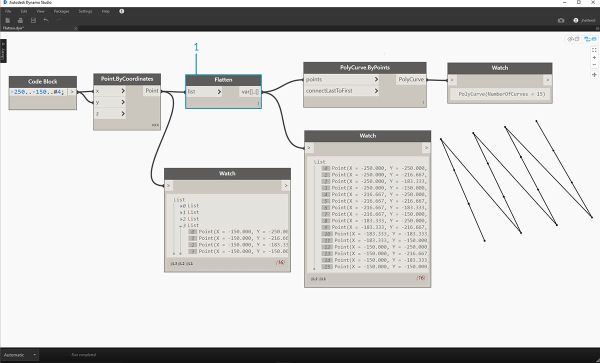
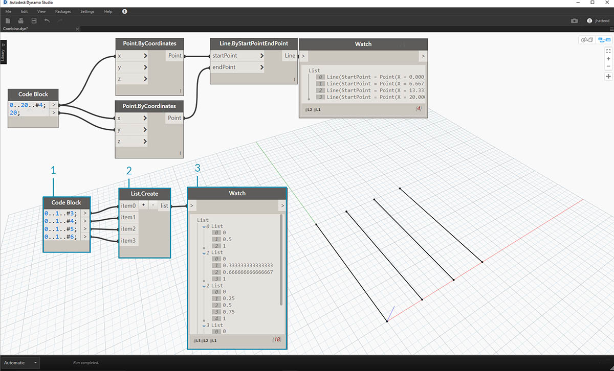
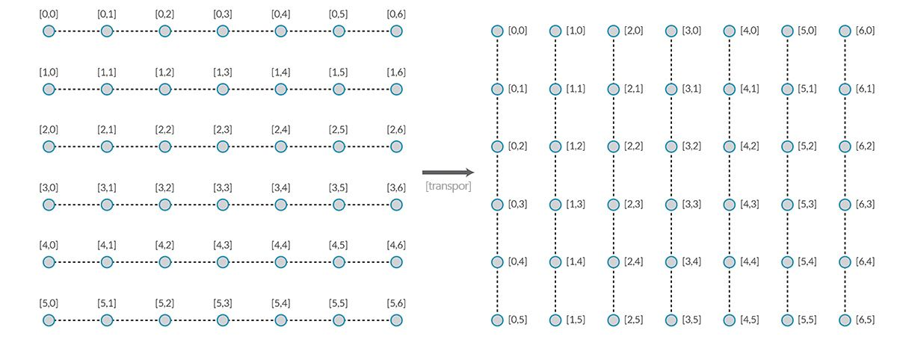
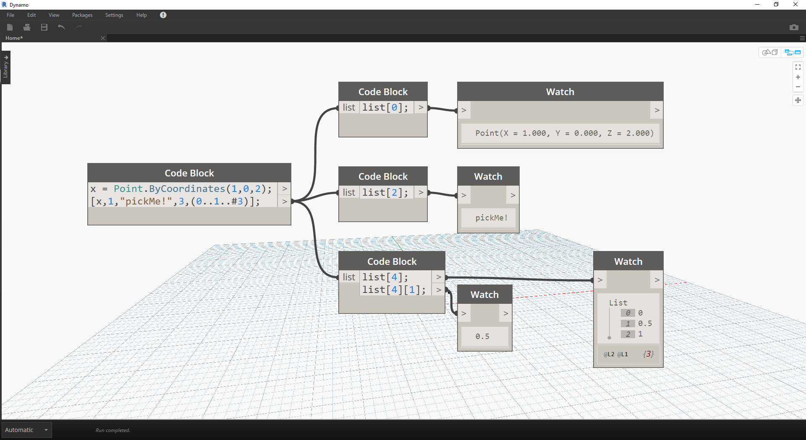

## Listas de listas

Vamos adicionar mais um nível à hierarquia. Se pegarmos o maço de cartas do exemplo original e criarmos uma caixa que contém vários maços, a caixa agora representará uma lista de maços e cada maço representará uma lista de cartas. Esta é uma lista de listas. Para a analogia nesta seção, a caixa vermelha abaixo contém uma lista de rolos de moeda e cada rolo contém uma lista de moedas de um centavo.


> Foto de [Dori](https://commons.wikimedia.org/wiki/File:Stack_of_coins_0214.jpg).

Que **consultas** podemos fazer na lista de listas? Isso acessa as propriedades existentes.

* Quantidade de tipos de moeda? 2.
* Valores de tipos de moeda? $ 0,01 e $ 0,25.
* Material de moedas de vinte e cinco centavos? 75% de cobre e 25% de níquel.
* Material de moedas de um centavo? 97,5% de zinco e 2,5% de cobre.

Que **ações** podemos executar na lista de listas? Isso altera a lista de listas com base em uma operação fornecida.

* Selecione uma pilha específica de moedas de vinte e cinco centavos ou de um centavo.
* Selecione uma moeda específica de vinte e cinco centavos ou um centavo.
* Reorganize as pilhas de moedas de vinte e cinco centavos e de um centavo.
* Misture as pilhas.

Novamente, o Dynamo tem um nó analógico para cada uma das operações acima. Como estamos trabalhando com dados abstratos e não com objetos físicos, precisamos de um conjunto de regras para controlar como movemos para cima e para baixo na hierarquia de dados.

Ao lidar com listas de listas, os dados são complexos e dispostos em camadas, mas isso proporciona a oportunidade de executar algumas operações paramétricas incríveis. Vamos separar os conceitos básicos e discutir mais algumas operações nas lições abaixo.

## Hierarquia de cima para baixo

O conceito fundamental a ser aprendido nesta seção: **o Dynamo trata as listas intrinsecamente como objetos**. Essa hierarquia de cima para baixo é desenvolvida considerando a programação orientada a objetos. Em vez de selecionar subelementos com um comando como List.GetItemAtIndex, o Dynamo seleciona o índice da lista principal na estrutura de dados. E esse item pode ser outra lista. Vamos explicar em detalhes com uma imagem de exemplo:

#### Exercício – Hierarquia de cima para baixo

> Faça o download do arquivo de exemplo que acompanha este exercício (clique com o botão direito do mouse e selecione “Salvar link como...”): [Top-Down-Hierarchy.dyn](datasets/6-3/Top-Down-Hierarchy.dyn). É possível encontrar uma lista completa de arquivos de exemplo no Apêndice.


> 1. Com o *bloco de código*, definimos dois intervalos:``` 0..2; 0..3; ```
> 2. Esses intervalos são conectados a um nó *Point.ByCoordinates* com amarra definida como *“Produto transversal”*. Isso cria uma grade de pontos e também retorna uma lista de listas como uma saída.
> 3. Observe que o nó de *Inspeção* fornece três listas com quatro itens cada.
> 4. Ao usar *List.GetItemAtIndex*, com um índice de 0, o Dynamo seleciona a primeira lista e todo o seu conteúdo. Outros programas podem selecionar o primeiro item de cada lista na estrutura de dados, mas o Dynamo emprega uma hierarquia de cima para baixo ao lidar com os dados.

### Mesclar e List.Flatten

Mesclar remove todos os níveis de dados de uma estrutura de dados. Isso é útil quando as hierarquias de dados não são necessárias para sua operação, mas pode ser arriscado porque remove as informações. O exemplo abaixo mostra o resultado da mesclagem de uma lista de dados.

#### Exercício – Mesclar

> Faça o download do arquivo de exemplo que acompanha este exercício (clique com o botão direito do mouse e selecione “Salvar link como...”): [Flatten.dyn](datasets/6-3/Flatten.dyn). É possível encontrar uma lista completa de arquivos de exemplo no Apêndice.


> 1. Insira uma linha de código para definir um intervalo em *bloco de código*:``` -250..-150..#4; ```
2. Conectando o *bloco de código* à entrada *x* e *y* de um nó *Point.ByCoordinates*, definimos a amarra como *“Produto transversal”* para obter uma grade de pontos.
3. O nó de *Inspeção* mostra que temos uma lista de listas.
4. Um nó *PolyCurve.ByPoints* fará referência a cada lista e criará uma PolyCurve respectiva. Observe na visualização do Dynamo que temos quatro PolyCurves que representam cada linha na grade.



> 1. Ao inserir uma *mesclagem* antes do nó PolyCurve, criamos uma única lista para todos os pontos. O nó PolyCurve faz referência a uma lista para criar uma curva e, como todos os pontos estão em uma lista, obtemos uma PolyCurve em zigue-zague que segue em toda a lista de pontos.

Há também opções para mesclar níveis isolados de dados. Usando o nó List.Flatten, é possível definir um número definido de níveis de dados para mesclar do topo da hierarquia. Essa será uma ferramenta realmente útil se você estiver lidando com estruturas de dados complexas, que não são necessariamente relevantes para o fluxo de trabalho. Outra opção é usar o nó de mesclagem como uma função em List.Map. Discutiremos [List.Map](#listmap-and-listcombine) mais abaixo.

### Cortar

Ao fazer a modelagem paramétrica, há também ocasiões em que você desejará adicionar mais estrutura de dados a uma lista existente. Há muitos nós disponíveis para isso também, e o corte é a versão mais básica. Com o corte, é possível particionar uma lista em sublistas com um número definido de itens.

#### Exercício – List.Chop

> Faça o download do arquivo de exemplo que acompanha este exercício (clique com o botão direito do mouse e selecione “Salvar link como...”): [Chop.dyn](datasets/6-3/Chop.dyn). É possível encontrar uma lista completa de arquivos de exemplo no Apêndice.


> *List.Chop _com um _subLength* de 2 cria 4 listas com 2 itens cada.

O comando de corte divide as listas com base em um determinado comprimento de lista. De certa forma, o corte é o oposto da mesclagem: em vez de remover a estrutura de dados, ele adiciona novos níveis a ela. Essa é uma ferramenta útil para operações geométricas como o exemplo abaixo.


### List.Map e List.Combine

List.Map/Combine aplica uma função definida a uma lista de entrada, mas uma etapa abaixo na hierarquia. As combinações são o mesmo que os mapas, exceto que as combinações podem ter várias entradas correspondentes à entrada de uma determinada função.

#### Exercício – List.Map

*Observação: Este exercício foi criado com uma versão anterior do Dynamo. A maior parte da funcionalidade List.Map foi resolvida com a adição do recurso List@Level. Para obter mais informações, consulte [List@Level](#listlevel) abaixo.*

> Faça o download do arquivo de exemplo que acompanha este exercício (clique com o botão direito do mouse e selecione “Salvar link como...”): [Map.dyn](datasets/6-3/Map.dyn). É possível encontrar uma lista completa de arquivos de exemplo no Apêndice.

Como uma rápida introdução, vamos revisar o nó List.Count de uma seção anterior.


> O nó *List.Count* conta todos os itens em uma lista. Usaremos isso para demonstrar como *List.Map* funciona.


> 1. Insira duas linhas de código no *bloco de código*:

```
-50..50..#Nx;
-50..50..#Ny;
```

Após digitar esse código, o bloco de código criará duas entradas para Nx e Ny.

2. Com dois *controles deslizantes de valores inteiros*, defina os valores *Nx* e *Ny* conectando-os ao *bloco de código*.
3. Conecte cada linha do bloco de código às respectivas entradas *X* e *Y* de um nó *Point.ByCoordinates*. Clique com o botão direito do mouse no nó, selecione “Amarra” e selecione *“Produto transversal”*. Isso cria uma grade de pontos. Como definimos o intervalo de -50 a 50, estamos expandindo a grade padrão do Dynamo.
4. Um nó de *Inspeção* revela os pontos criados. Observe a estrutura de dados. Criamos uma lista de listas. Cada lista representa uma linha de pontos da grade.


> 1. Anexe um nó *List.Count* à saída do nó de inspeção da etapa anterior.
2. Conecte um nó de *Inspeção* à saída List.Count.

Observe que o nó List.Count fornece um valor igual a 5. Isso é igual à variável “Nx”, conforme definido no bloco de código. Por que isso ocorre?

* Primeiro, o nó Point.ByCoordinates usa a entrada “x” como entrada principal para criar listas. Quando Nx é 5 e Ny é 3, obtemos uma lista de 5 listas, cada uma com 3 itens.
* Como o Dynamo trata as listas intrinsecamente como objetos, um nó List.Count é aplicado à lista principal na hierarquia. O resultado é um valor igual a 5 ou o número de listas na lista principal.


> 1. Usando um nó *List.Map*, descemos um degrau na hierarquia e executamos uma *“função”* neste nível.
> 2. Observe que o nó *List.Count* não tem nenhuma entrada. Ele está sendo usado como uma função para que o nó *List.Count* seja aplicado a cada lista individual um degrau abaixo na hierarquia. A entrada em branco de *List.Count* corresponde à entrada de lista de *List.Map*.
> 3. Os resultados de *List.Count* agora fornecem uma lista de 5 itens, cada um com valor de 3. Isso representa o tamanho de cada sublista.

#### Exercício – List.Combine

*Observação: Este exercício foi criado com uma versão anterior do Dynamo. A maior parte da funcionalidade List.Combine foi resolvida com a adição do recurso List@Level. Para obter mais informações, consulte *[*List@Level*](#listlevel)* abaixo.*

> Faça o download do arquivo de exemplo que acompanha este exercício (clique com o botão direito do mouse e selecione “Salvar link como...”): [Combine.dyn](datasets/6-3/Combine.dyn). É possível encontrar uma lista completa de arquivos de exemplo no Apêndice.

Neste exercício, usaremos uma lógica semelhante a List.Map, mas com vários elementos. Neste caso, desejamos dividir uma lista de curvas por um número único de pontos.


> 1. Usando o *bloco de código*, defina um intervalo usando a sintaxe: ```..20..#4; ```e um valor de```20; ``` abaixo dessa linha.
2. Conecte o *bloco de código* a dois nós *Point.ByCoordinates*.
3. Crie um *Line.ByStartPointEndPoint* com base nos nós *Point.ByCoordinates*.
4. O nó de *Inspeção* mostra quatro linhas.



> 1. Abaixo do gráfico para a criação de linha, queremos usar o bloco de código para criar quatro intervalos diferentes para dividir as linhas de forma única. Isso é feito com as seguintes linhas de código:
```
0..1..#3;
0..1..#4;
0..1..#5;
0..1..#6;
```

2. Com um nó *List.Create*, mesclamos as quatro linhas do *bloco de código* em uma lista.
3. O nó de *Inspeção* exibe uma lista de listas.


> 1. *Curve.PointAtParameter* não funcionará conectando as linhas diretamente nos valores de *parâmetro*. Precisamos descer um nível na hierarquia. Para isso, usaremos *List.Combine*.


> Ao usar *List.Combine*, é possível dividir com êxito cada linha pelos intervalos fornecidos. Isso é um pouco complicado, então vamos fornecer detalhes aprofundados.

> 1. Primeiro, adicione um nó *Curve.PointAtParameter* à tela. Essa será a *“função” _ou o *“combinador”* que aplicamos ao nó List.Combine*. Daremos mais informações sobre isso em um instante.
2. Adicione um nó *List.Combine* à tela. Pressione *“+”* ou *“-”* para adicionar ou subtrair entradas. Neste caso, usaremos as duas entradas padrão no nó.
3. Desejamos conectar o nó *Curve.PointAtParameter* na entrada *“comb”* de *List.Combine*. E mais um nó importante: certifique-se de clicar com o botão direito do mouse na entrada *“param” de Curve.PointAtParameter* e desmarque *“usar valor padrão”*. Os valores padrão nas entradas do Dynamo precisam ser removidos ao executar um nó como uma função. Em outras palavras, devemos considerar que os valores padrão têm nós adicionais ligados a eles. Por isso, é necessário remover os valores padrão neste caso.
4. Sabemos que temos duas entradas, as linhas e os parâmetros para criar pontos. Mas como os conectamos às entradas *List.Combine* e em que ordem?
5. As entradas vazias de *Curve.PointAtParameter*, de cima para baixo, precisam ser preenchidas no combinador na mesma ordem. Assim, as linhas são conectadas à *list1* de *List.Combine*.
6. Da mesma forma, os valores de parâmetro são conectados à entrada *list2* de *List.Combine*.
7. O nó de *Inspeção* e a visualização do Dynamo nos mostram que temos quatro linhas, cada uma dividida com base nos intervalos do *bloco de código*.

### List@Level

Com preferência em relação ao List.Map, o recurso List@Level permite selecionar diretamente com qual nível de lista você deseja trabalhar diretamente na porta de entrada do nó. Esse recurso pode ser aplicado a qualquer entrada de nó e permitirá que você acesse os níveis de suas listas com mais rapidez e facilidade do que outros métodos. Basta informar ao nó qual nível da lista você deseja usar como entrada e deixar que o nó faça o restante.

#### Exercício de List@Level

Neste exercício, usaremos o recurso List@Level para isolar um nível de dados específico.

> Faça o download do arquivo de exemplo que acompanha este exercício (clique com o botão direito do mouse e selecione “Salvar link como...”): [List@Level](datasets/6-3/Listatlevel.dyn). É possível encontrar uma lista completa de arquivos de exemplo no Apêndice.


> 1. Começaremos com uma grade de pontos 3D simples.
2. Como a grade é construída com um intervalo para X, Y e Z, sabemos que os dados estão estruturados com três níveis: uma lista X, uma lista Y e uma lista Z.
3. Esses níveis existem em diferentes **Níveis**. Os níveis são indicados na parte inferior da bolha de visualização. As colunas de níveis da lista correspondem aos dados da lista acima para ajudar a identificar em qual nível se deve trabalhar.
4. Os níveis da lista são organizados em ordem inversa para que os dados de menor nível estejam sempre em “L1”. Isso ajudará a garantir que seus gráficos funcionarão conforme planejado, mesmo que algo seja alterado a montante.


> 1. Para usar a função List@Level, clique em “>”. Neste menu, você verá duas caixas de seleção.
2. **Usar níveis** – Ativa a funcionalidade List@Level. Após clicar nessa opção, você poderá clicar e selecionar os níveis da lista de entrada que deseja que o nó use. Com esse menu, você pode experimentar rapidamente diferentes opções de nível clicando para cima ou para baixo.
3. **Manter a estrutura da lista** – se estiver ativada, você terá a opção de manter a estrutura do nível de entrada. Às vezes, você pode ter organizado intencionalmente seus dados em sublistas. Ao marcar essa opção, é possível manter a organização da lista intacta e não perder nenhuma informação.

Com a nossa grade 3D simples, podemos acessar e visualizar a estrutura de lista alternando entre os níveis de lista. Cada combinação de nível de lista e índice retornará um conjunto diferente de pontos de nosso conjunto 3D original.


> 1. “@L2” em DesignScript nos permite selecionar somente a lista no Nível 2.
2. A lista no Nível 2 com o índice 0 inclui somente o primeiro conjunto de pontos Y, retornando somente a grade XZ.
3. Se alterarmos o filtro Nível para “L1”, poderemos ver tudo no primeiro nível da lista. A lista no Nível 1 com índice 0 inclui todos os nossos pontos 3D em uma lista plana.
4. Se tentarmos fazer o mesmo para “L3”, veremos somente os pontos do terceiro nível da lista. A lista no Nível 3 com índice 0 inclui somente o primeiro conjunto de pontos Z, retornando somente uma grade XY.
5. Se tentarmos o mesmo para “L4”, veremos somente os pontos do terceiro nível da lista. A lista no Nível 4 com índice 0 inclui somente o primeiro conjunto de pontos X, retornando somente uma grade YZ.

Embora este exemplo específico também possa ser criado com List.Map, o recurso List@Level simplifica muito a interação, facilitando o acesso aos dados do nó. Veja abaixo uma comparação entre os métodos List.Map e List@Level:


> 1. Embora ambos os métodos nos ofereçam acesso aos mesmos pontos, o método List@Level nos permite alternar facilmente entre as camadas de dados em um único nó.
2. Para acessar uma grade de pontos com List.Map, precisamos de um nó List.GetItemAtIndex junto com List.Map. Para cada nível de lista que descermos, precisaremos usar um nó List.Map adicional. Dependendo da complexidade das listas, isso pode requerer que você adicione uma quantidade significativa de nós List.Map ao gráfico para acessar o nível de informações correto.
3. Neste exemplo, um nó List.GetItemAtIndex com um nó List.Map retorna o mesmo conjunto de pontos com a mesma estrutura de lista que o List.GetItemAtIndex com “@L3” selecionado.

### Transpor

Transpor é uma função fundamental ao lidar com listas de listas. Assim como nos programas de planilha, uma transposição inverte as colunas e linhas de uma estrutura de dados. Vamos demonstrar isso com uma matriz básica abaixo e, na seção a seguir, vamos demonstrar como uma transposição pode ser usada para criar relações geométricas.



#### Exercício – List.Transpose

> Faça o download do arquivo de exemplo que acompanha este exercício (clique com o botão direito do mouse e selecione “Salvar link como...”): [Transpose.dyn](datasets/6-3/Transpose.dyn). É possível encontrar uma lista completa de arquivos de exemplo no Apêndice.


> Vamos excluir os nós *List.Count* do exercício anterior e usar alguma geometria para ver como os dados se estruturaram.

> 1. Conecte um *PolyCurve.ByPoints* à saída do nó de inspeção de *Point.ByCoordinates*.
2. A saída mostra 5 PolyCurves e podemos ver as curvas na visualização do Dynamo. O nó do Dynamo está procurando uma lista de pontos (ou uma lista de listas de pontos neste caso) e criando uma única PolyCurve com base neles. Essencialmente, cada lista foi convertida em uma curva na estrutura de dados.


> 1. Se desejarmos isolar uma linha de curvas, usaremos o nó *List.GetItemAtIndex*.
2. Usando um valor de *bloco de código* de 2, consulte o terceiro elemento na lista principal.
3. O *PolyCurve.ByPoints* nos fornece uma curva, já que somente uma lista está conectada ao nó.


> 1. Um nó *List.Transpose* alternará todos os itens com todas as listas em uma lista de listas. Isso parece complicado, mas é a mesma lógica que Transpor no Microsoft Excel: alternar colunas com linhas em uma estrutura de dados.
2. Observe o resultado abstrato: a transposição alterou a estrutura da lista de 5 listas com 3 itens cada uma para 3 listas com 5 itens cada uma.
3. Observe o resultado geométrico: usando *PolyCurve.ByPoints*, obtemos 3 PolyCurves na direção perpendicular às curvas originais.

### Criação do bloco de código

A abreviação do bloco de código usa “[]” para definir uma lista. Essa é uma maneira muito mais rápida e fluida de criar uma lista do que o nó List.Create. O bloco de código é discutido em mais detalhes no Capítulo 7. Consulte a imagem abaixo para observar como uma lista com várias expressões pode ser definida com o bloco de código.


### Consulta do bloco de código

A abreviação do bloco de código usa “[]” como uma forma rápida e fácil de selecionar itens específicos que você deseja de uma estrutura de dados complexa. Os blocos de código são discutidos em mais detalhes no Capítulo 7. Consulte a imagem abaixo para observar como uma lista com vários tipos de dados pode ser consultada com o bloco de código.



### Exercício – Consultar e inserir dados

> Faça o download do arquivo de exemplo que acompanha este exercício (clique com o botão direito do mouse e selecione “Salvar link como...”): [ReplaceItems.dyn](datasets/6-3/ReplaceItems.dyn). É possível encontrar uma lista completa de arquivos de exemplo no Apêndice.

Este exercício usa uma lógica estabelecida no exercício anterior para editar uma superfície. Nosso objetivo aqui é intuitivo, mas a navegação na estrutura de dados estará mais envolvida. Desejamos articular uma superfície movendo um ponto de controle.


> 1. Comece com a cadeia de caracteres dos nós acima. Estamos criando uma superfície básica que abrange a grade padrão do Dynamo.
2. Usando *bloco de código*, insira essas duas linhas de código e conecte-se às entradas *u* e *v* de *Surface.PointAtParameter*, respectivamente:
```
-50..50..#3;
-50..50..#5;
```

3. Certifique-se de configurar a Amarra de *Surface.PointAtParameter* como *“Produto transversal”*.
4. O nó de *Inspeção* mostra que temos uma lista de 3 listas, cada uma com 5 itens.


> Nesta etapa, queremos consultar o ponto central na grade que criamos. Para fazer isso, vamos selecionar o ponto médio na lista do meio. Faz sentido, certo?

> 1. Para confirmar que esse é o ponto correto, também podemos clicar nos itens do nó de inspeção para confirmar que estamos selecionando o item correto.
2. Usando o *bloco de código*, vamos escrever uma linha básica de código para consultar uma lista de listas:<br xmlns="http://www.w3.org/1999/xhtml"/>```pontos[1][2];```
3. Usando *Geometry.Translate*, moveremos o ponto selecionado para cima na direção *Z* por *20* unidades.


> 1. Vamos também selecionar a linha média de pontos com um nó *List.GetItemAtIndex*. Observação: De forma similar a uma etapa anterior, também é possível consultar a lista com o *bloco de código*, usando uma linha de ```pontos[1];```


> Até agora, consultamos com êxito o ponto central e o movemos para cima. Agora, queremos inserir esse ponto movido de volta para a estrutura de dados original.

> 1. Primeiro, queremos substituir o item da lista que isolamos em uma etapa anterior.
2. Usando *List.ReplaceItemAtIndex*, vamos substituir o item do meio e o índice de *“2”* pelo item de substituição conectado ao ponto movido (*Geometry.Translate*).
3. A saída mostra que inserimos o ponto movido no item do meio da lista.


> Agora que modificamos a lista, precisamos inseri-la de volta na estrutura de dados original: a lista de listas.

> 1. Seguindo a mesma lógica, use *List.ReplaceItemAtIndex* para substituir a lista do centro pela nossa lista modificada.
2. Observe que os *blocos de código* que definem o índice para estes dois nós são 1 e 2, que coincidem com a consulta original do *bloco de código* (*pontos[1][2]*).
3. Ao selecionar a lista no *índice 1*, vemos a estrutura de dados realçada na visualização do Dynamo. Mesclamos com êxito o ponto movido para a estrutura de dados original.


> Existem várias maneiras de criar uma superfície com base nesse conjunto de pontos. Neste caso, vamos criar uma superfície por meio da elevação de curvas.

> 1. Crie um nó *NurbsCurve.ByPoints* e conecte a nova estrutura de dados para criar três curvas NURBS.


> 1. Conecte uma *Surface.ByLoft* à saída de *NurbsCurve.ByPoints*. Agora, temos uma superfície modificada. É possível alterar o valor *Z* original da geometria. Converta e observe a atualização da geometria.

