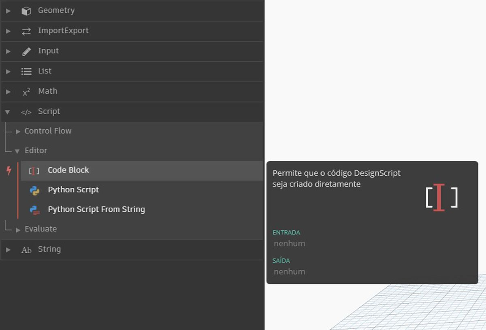

## O que é um bloco de código?

Os blocos de código são uma janela localizada no DesignScript, a linguagem de programação principal do Dynamo. Desenvolvido do zero para suportar fluxos de trabalho de projeto exploratório, o DesignScript é uma linguagem legível e concisa que oferece comentários imediatos a pequenos bits de código e também é dimensionado para interações grandes e complexas. O DesignScript também forma a espinha dorsal do mecanismo que motiva a maioria dos aspectos do Dynamo “essenciais”. Como quase todas as funções encontradas nos nós e nas interações do Dynamo têm uma relação individual com a linguagem de scripts, há oportunidades únicas para alternar entre as interações baseadas em nós e os scripts de uma forma fluida.  Para iniciantes, os nós podem ser convertidos automaticamente em sintaxe de texto para ajudar a aprender o DesignScript ou simplesmente para reduzir o tamanho de seções maiores de gráficos. Isso é
feito usando um processo denominado “Nó para código”, que é descrito em mais detalhes na [seção Sintaxe do DesignScript](7-2_Design-Script-syntax.md). Os usuários mais experientes podem usar os blocos de código para criar mashups personalizados de relacionamentos existentes de funcionalidade e usuários, usando muitos paradigmas de codificação padrão. Entre o usuário iniciante e o avançado, há um grande número de atalhos e fragmentos de código que aceleram seus projetos. Embora o termo “bloco de código” possa ser um pouco intimidador para não programadores, é fácil de usar e robusto. Um iniciante pode usar o bloco de código de forma eficiente com a codificação mínima, e um usuário avançado pode definir definições de script para serem chamadas em outro lugar em uma definição do Dynamo.

### Bloco de código: uma breve visão geral

Em resumo, os blocos de código são uma interface de scripts de texto em um ambiente de scripts visuais. Eles podem ser usados como números, sequências de caracteres, fórmulas e outros tipos de dados. O bloco de código é projetado para o Dynamo, portanto, é possível definir variáveis arbitrárias no bloco de código, e essas variáveis são automaticamente adicionadas às entradas do nó:

Com os blocos de código, um usuário tem a flexibilidade de decidir como especificar as entradas. Veja a seguir várias maneiras de criar um ponto básico com coordenadas *(10, 5, 0)*: 

À medida que você aprende mais sobre as funções disponíveis na biblioteca, lembre-se que digitar “Point.ByCoordinates” é mais rápido do que pesquisar na biblioteca e localizar o nó apropriado. Quando você digita *“Point.”* por exemplo, o Dynamo exibirá uma lista de possíveis funções para aplicar a um ponto. Isso torna o script mais intuitivo e ajudará a aprender como aplicar funções no Dynamo.

### Criar nós de bloco de código

O bloco de código pode ser encontrado em *Core > Input>Actions>Code Block*. Mas, ainda mais rápido, basta clicar duas vezes na tela e o bloco de código aparece. Esse nó é usado com tanta frequência que recebe privilégios completos de clique duplo.

### Números, sequências e fórmulas

Os blocos de código também são flexíveis em relação aos tipos de dados. O usuário pode definir rapidamente os números, as sequências e as fórmulas, e o bloco de código fornecerá o resultado desejado.

Na imagem abaixo, é possível ver que a forma de fazer as coisas “à maneira antiga” é um pouco demorada: o usuário procura o nó desejado na interface, adiciona o nó à tela e insere os dados. Com o bloco de código, o usuário pode clicar duas vezes na tela para abrir o nó e digitar o tipo de dados correto com sintaxe básica. 

> Os nós *number*, *string* e *formula* são três exemplos de nós do Dynamo que são comprovadamente obsoletos em comparação ao *code block*.

