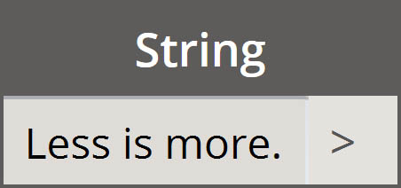
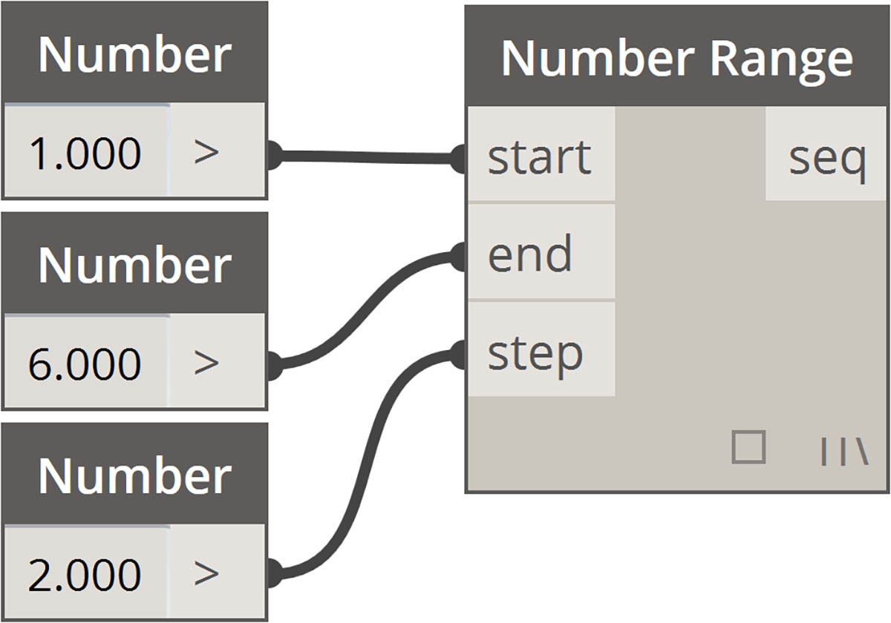
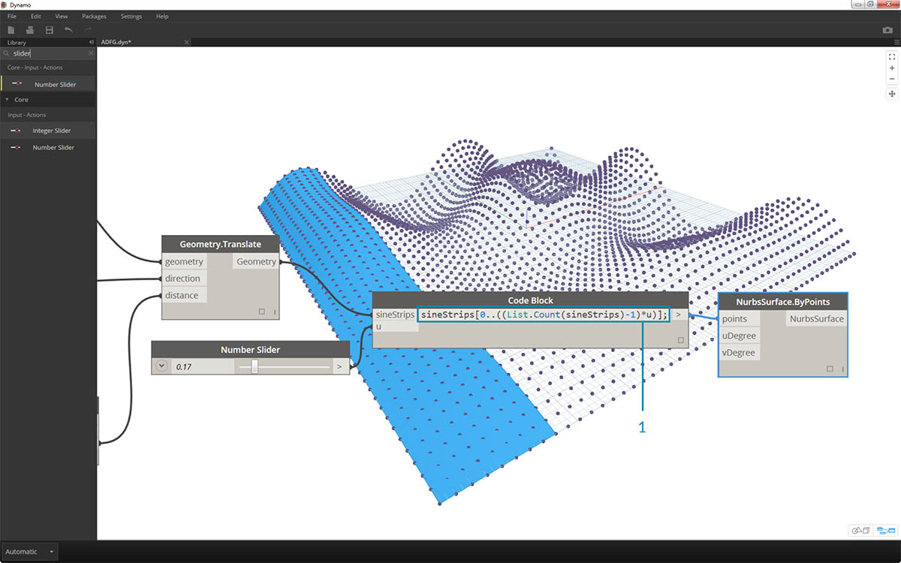

<style>
table{box-shadow: 2px 2px 2px #BBBBBB;max-width:75%;display:block;margin-left: auto;   margin-right: auto }
img{display:block;margin-left: auto;   margin-right: auto }
</style>

## Abreviação

Existem alguns métodos de abreviação básicos no bloco de código que, em termos simples, tornam o gerenciamento de dados *muito* mais fácil. Vamos explicar os conceitos básicos abaixo e discutir como essa abreviação pode ser usado para criar e consultar dados.

<table>
    <tr>
    <td width="50%"><b>Tipo de dados</b></td>
    <td width="25%"><b>Dynamo padrão</b> </td>
    <td width="25%"><b>Equivalente ao bloco de código</b></td>
  </tr>
  <tr>
    <td> Números</td>
    <td></img> </td>
    <td></img></td>
  </tr>
  <tr>
    <td>Sequências</td>
    <td></img> </td>
    <td></img></td>
  </tr>
  <tr>
    <td>Sequências</td>
    <td></img> </td>
    <td></img></td>
  </tr>
  <tr>
    <td>Faixas</td>
    <td></img> </td>
    <td></img></td>
  </tr>
  <tr>
    <td>Obter item no índice</td>
    <td></img> </td>
    <td></img></td>
  </tr>
  <tr>
    <td>Criar lista</td>
    <td></img> </td>
    <td></img></td>
  </tr>
  <tr>
    <td>Concatenar sequências de caracteres</td>
    <td></img> </td>
    <td></img></td>
  </tr>
  <tr>
    <td>Declarações condicionais</td>
    <td></img> </td>
    <td></img></td>
  </tr>
</table>

### Sintaxe adicional

|Nó(s)|Equivalente ao bloco de código|Nota|
| -- | -- | -- |
|Qualquer operador (+, &&, >=, Not etc.)|+, &&, >=, !, etc.|Observe que “Not” se torna “!” mas o nó é denominado “Not” para distinguir de “Factorial”.|
|Booleano true|true;|Repare nas minúsculas|
|Booleano false|false;|Repare nas minúsculas|

### Faixas

É possível reduzir o método para definir intervalos e sequências para a abreviação básica. Use a imagem abaixo como um guia para a sintaxe “...” para definir uma lista de dados numéricos com o bloco de código. Após obter o travamento dessa notação, a criação de dados numéricos é um processo realmente eficiente: 

> 1. Neste exemplo, um intervalo de números é substituído pela sintaxe básica do bloco de código definindo ```beginning..end..step-size;```. Representados numericamente, temos: ```0..10..1;```
2. Observe que a sintaxe ```0..10..1;``` é equivalente a ```0..10;```. Um step-size de 1 é o valor padrão para a notação abreviada. Assim, ```0..10;``` fornecerá uma sequência de 0 a 10 com um step-size de 1.
3. O exemplo de *number sequence* é semelhante, exceto que usamos um *“#”* para declarar que desejamos 15 valores na lista em vez de uma lista que vai até 15. Neste caso, estamos definindo: ```beginning..#ofSteps..step-size:```. A sintaxe real da sequência é ```0..#15..2```
4. Usando o *“#”* da etapa anterior, agora o colocamos na parte *“step-size”* da sintaxe. Agora, temos um *number range* que se estendem de *“beginning”* até *“end”*, e a notação *“step-size”* distribui uniformemente um número de valores entre os dois: ```beginning..end..#ofSteps```

### Intervalos avançados

A criação de intervalos avançados nos permite trabalhar com uma lista de listas de forma simples. Nos exemplos abaixo, vamos isolar uma variável da notação principal do intervalo e criar outro intervalo dessa lista. 

> 1. Ao criar intervalos aninhados, compare a notação com *“#”* versus a notação sem. A mesma lógica se aplica a intervalos básicos, exceto que fica um pouco mais complexo.
2. Podemos definir um subintervalo em qualquer lugar dentro do intervalo principal e observar que também podemos ter dois subintervalos.
3. Ao controlar o valor *“end”* em um intervalo, criamos mais intervalos de comprimentos diferentes.


> Como um exercício lógico, compare as duas abreviações acima e tente analisar como as *subfaixas* e a notação *“#”* controlam a saída resultante.

### Criar listas e obter itens de uma lista

Além de criar listas com abreviações, podemos criar listas imediatamente. Essas listas podem conter um amplo intervalo de tipos de elementos e também podem ser consultadas (lembre-se, as próprias listas são objetos). Para resumir, com o bloco de código você faz listas chaves e consulta itens de uma lista com colchetes:


> 1. Crie listas rapidamente com sequências de caracteres e consulte-as usando o índice do item.
2. Crie listas com variáveis e consulte usando a notação de abreviação de intervalo.

O gerenciamento com listas aninhadas é um processo semelhante. Esteja ciente da ordem da lista e chame de volta usando vários conjuntos de colchetes:


> 1. Defina uma lista de listas.
2. Consulte uma lista com uma notação de colchete único.
3. Consulte um item com notação de colchete duplo.

### Exercício

> Faça o download do arquivo de exemplo que acompanha este exercício (clique com o botão direito do mouse e "Salvar link como..."). É possível encontrar uma lista completa de arquivos de exemplo no Apêndice. [Obsolete-Nodes_Sine-Surface.dyn](datasets/7-3/Obsolete-Nodes_Sine-Surface.dyn)

Neste exercício, flexibilizaremos nossas novas habilidades de abreviação para criar uma superfície de casca de ovo moderna definida por intervalos e fórmulas. Durante este exercício, observe como usamos o bloco de código e os nós do Dynamo existentes em conjunto: usamos o bloco de código para o levantamento de dados pesados enquanto os nós do Dynamo são visualmente dispostos para a legibilidade da definição.


> Comece criando uma superfície conectando os nós acima. Em vez de usar um nó de número para definir a largura e o comprimento, clique duas vezes na tela e digite ```100;``` em um bloco de código.


> 1. Defina um intervalo entre 0 e 1 com 50 divisões digitando ```0..1..#50``` em um bloco de código.
2. Conecte o intervalo a *Surface.PointAtParameter*, que usa os valores *u* e *v* entre 0 e 1 na superfície. Lembre-se de alterar a *Amarra* para *Produto cartesiano* clicando com o botão direito no nó *Surface.PointAtParameter*.


> Nesta etapa, empregamos nossa primeira função para mover a grade de pontos para cima no Z. Essa grade controlará uma superfície gerada com base na função subjacente.

> 1. Adicione os nós visuais à tela, conforme mostrado na imagem acima.
2. Em vez de usar um nó de fórmula, usamos um bloco de código com a linha: ```(0..Math.Sin(x*360)..#50)*5;```. Para analisar isso rapidamente, estamos definindo um intervalo com uma fórmula dentro dele. Essa fórmula é a função Seno. A função seno recebe entradas de grau no Dynamo, portanto, para obter uma onda senoidal completa, multiplicamos nossos valores de *x* (essa é a entrada de intervalo de 0 a 1) por *360*. Em seguida, queremos o mesmo número de divisões que os pontos de grade de controle para cada linha, portanto, definimos cinquenta subdivisões com *#50*. Finalmente, o multiplicador de 5 simplesmente aumenta a amplitude da conversão para que possamos ver o efeito na Visualização do Dynamo.


> 1. Apesar de o bloco de código anterior funcionar bem, ele não era completamente paramétrico. Queremos controlar dinamicamente seus parâmetros, portanto, vamos substituir a linha da etapa anterior por ```(0..Math.Sin(x*360*cycles)..#List.Count(x))*amp;```. Isso nos oferece a capacidade de definir esses valores com base nas entradas.


> 1. Alterando os controles deslizantes (de 0 a 10), obtemos resultados interessantes.


> 1. Ao efetuar uma transposição no intervalo de números, invertemos a direção da onda da cortina: ```transposeList = List.Transpose(sineList);```


> 1. Obtemos uma superfície de casca de ovo distorcida quando adicionamos sineList e tranposeList: ```eggShellList = sineList+tranposeList;```


> 1. Alterar os controles deslizantes novamente nos permite organizar esse algoritmo.


> 1. Por último, vamos consultar partes isoladas dos dados com o bloco de código. Para regenerar a superfície com um intervalo específico de pontos, adicione o bloco de código acima entre o nó *Geometry.Translate* e o *NurbsSurface.ByPoints*. Isso tem a linha de texto: ```sineStrips[0..15..1];```. Isso selecionará as primeiras 16 linhas de pontos (de 50). Recriando a superfície, podemos ver que geramos uma parte isolada da grade de pontos.



> 1. Na etapa final, para tornar esse bloco de código mais paramétrico, controlaremos a consulta usando um controle deslizante que varia entre 0 e 1. Fazemos isso com esta linha de código: ```sineStrips[0..((List.Count(sineStrips)-1)*u)];```. Isso pode parecer confuso, mas a linha de código nos fornece uma forma rápida de dimensionar o comprimento da lista em um multiplicador entre 0 e 1.


> 1. Um valor de *0,53* no controle deslizante cria uma superfície logo após o ponto central da grade.


> 1. E, conforme esperado, uma barra deslizante de *1* cria uma superfície com base na grade completa de pontos.


> Analisando o gráfico visual resultante, podemos realçar os blocos de código e ver cada uma de suas funções.

> 1. O primeiro bloco de código substitui o nó *Number*.
2. O segundo bloco de código substitui o nó *Number Range*.
3. O terceiro bloco de código substitui o nó *Formula* (assim como *List.Transpose*, *List.Count* e *Number Range*).
4. O quarto bloco de código consulta uma lista de listas, substituindo o nó *List.GetItemAtIndex*.

