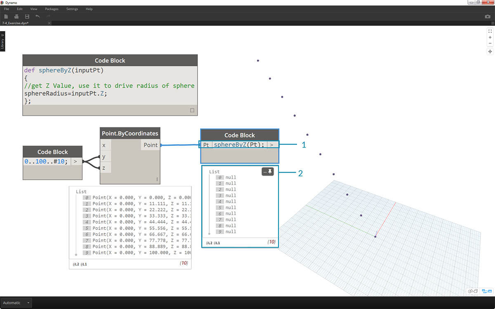

## Funções de Code Block

As funções podem ser criadas em um Code Block e chamadas em outro lugar da definição do Dynamo. Isto cria outra camada de controle em um arquivo paramétrico e pode ser visualizado como uma versão com base em texto de um nó personalizado. Neste caso, o Code Block "principal" é facilmente acessível e pode ser localizado em qualquer lugar do gráfico. Não é necessário fio!

### Principal

A primeira linha tem a palavra-chave "def", depois o nome da função e, a seguir, os nomes das entradas entre parênteses. Os contraventamentos definem o corpo da função. Retorne um valor com "return =". Os Code Blocks que definem uma função não possuem portas de entrada ou saída porque eles são chamados a partir de outros Code Blocks. 

```
/*This is a multi-line comment,
which continues for
multiple lines*/
def FunctionName(in1,in2)
{
//This is a comment
sum = in1+in2;
return sum;
};
```

### Filhos

Chame a função com outro Code Block no mesmo arquivo fornecendo o mesmo nome e o mesmo número de argumentos. Funciona da mesma forma que os nós imediatos da sua biblioteca.


```
FunctionName(in1,in2);
```

### Exercício

> Faça o download do arquivo de exemplo que acompanha este exercício (clique com o botão direito do mouse e "Salvar link como..."). Uma lista completa de arquivos de exemplo pode ser encontrada no Apêndice. [Functions_SphereByZ.dyn](datasets/7-4/Functions_SphereByZ.dyn)

Neste exercício, vamos criar uma definição genérica que irá criar esferas a partir de uma lista de entrada de pontos. O raio dessas esferas é conduzido pela propriedade Z de cada ponto.


> Vamos começar com um intervalo de números de dez valores que vão de 0 a 100. Conecte-os em um nó *Point.ByCoordinates* para criar uma linha diagonal.


> 1. Crie um *Code Block* e insira nossa definição utilizando a linha de código:
```
def sphereByZ(inputPt){
};
```

O *inputPt* é o nome que proporcionamos para representar os pontos que irão guiar a função. A partir de agora, a função não está fazendo nada, mas vamos criar esta função nas etapas a seguir.


> 1. Adicionando à função *Code Block*, colocamos um comentário e uma variável *sphereRadius* que consulta a posição *Z* de cada ponto. Lembre-se, *inputPt.Z* não precisa de parênteses como um método. Esta é uma *query* das propriedades de um elemento existente, portanto, nenhuma entrada é necessária:
```
def sphereByZ(inputPt,radiusRatio)
{
//get Z Value, use it to drive radius of sphere
sphereRadius=inputPt.Z;
};
```


> 1. Agora, vamos recordar a função que criamos em outro *Code Block*. Se clicarmos duas vezes na tela para criar um novo *Code Block* e digitar *sphereB*, notamos que o Dynamo sugere a função *sphereByZ* que foi definida. Sua função foi adicionada à biblioteca intellisense! Muito legal.



> 1. Agora, chamamos a função e criamos uma variável chamada *Pt* para conectar os pontos criados nas etapas anteriores:
```
sphereByZ(Pt)
```

2. Observe que, a partir da saída, temos todos os valores nulos. Por que é isso está acontecendo? Quando definimos a função, estamos calculando a variável *sphereRadius*, mas não definimos o que a função deve *retornar* como uma *saída*. Podemos corrigir isso na próxima etapa.


> 1. Uma etapa importante: é necessário definir a saída da função adicionando a linha ```return = sphereRadius;``` para a função *sphereByZ*.
2. Agora, vemos que a saída do *Code Block* nos fornece as coordenadas Z de cada ponto.


> Agora, vamos criar esferas reais editando a função *Principal*.

> 1. Primeiro definimos uma esfera com a linha de código: ```sphere=Sphere.ByCenterPointRadius(inputPt,sphereRadius);```
2. A seguir, alteramos o valor de retorno para ser a *esfera* em vez de *sphereRadius*: ```return = sphere;```. Isso nos dá algumas esferas gigantes em nossa visualização do Dynamo!


> 1. Para moderar o tamanho dessas esferas, vamos atualizar o valor de *sphereRadius* adicionando um divisor: ```sphereRadius = inputPt.Z/20;```. Agora, podemos ver as esferas separadas e começar a perceber a relação entre o raio e o valor Z.


> 1. No nó *Point.ByCoordinates*, alterando a lacuna de *Lista mais curta* para *Produto cartesiano*, criamos uma grade de pontos. A função *sphereByZ* ainda está em pleno efeito, de modo que todos os pontos criam esferas com raios com base em valores Z.


> 1. E apenas para efeitos de teste, nós conectamos a lista original de números à entrada X para *Point.ByCoordinates*. Agora temos um cubo de esferas.
2. Observação: se isso levar muito tempo para ser calculado no seu computador, tente alterar *#10* para algo como *#5*.


> 1. Lembre-se, a função *sphereByZ* que foi criada é uma função genérica, para que possamos recuperar a hélice de uma lição anterior e aplicar a função a ela.


> Uma etapa final: vamos conduzir a relação do raio com um parâmetro definido pelo usuário. Para fazer isso, é necessário criar uma nova entrada para a função e também substituir o divisor *20* por um parâmetro.

> 1. Atualize a definição *sphereByZ* para:
```
def sphereByZ(inputPt,radiusRatio)
{
//get Z Value, use it to drive radius of sphere
sphereRadius=inputPt.Z/radiusRatio;
//Define Sphere Geometry
sphere=Sphere.ByCenterPointRadius(inputPt,sphereRadius);
//Define output for function
return sphere;
};
```

2. Atualize os Code Blocks secundários adicionando uma variável de *relação* à entrada: ```sphereByZ (relação);``` conecte um controle deslizante para a entrada do Code Block recém criado e varie o tamanho dos raios com base na relação de raio.

