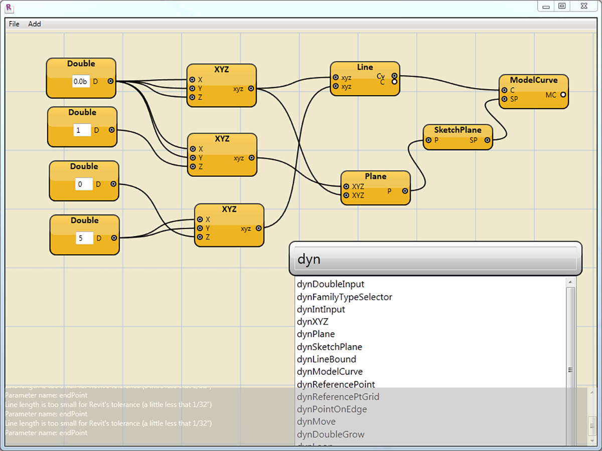
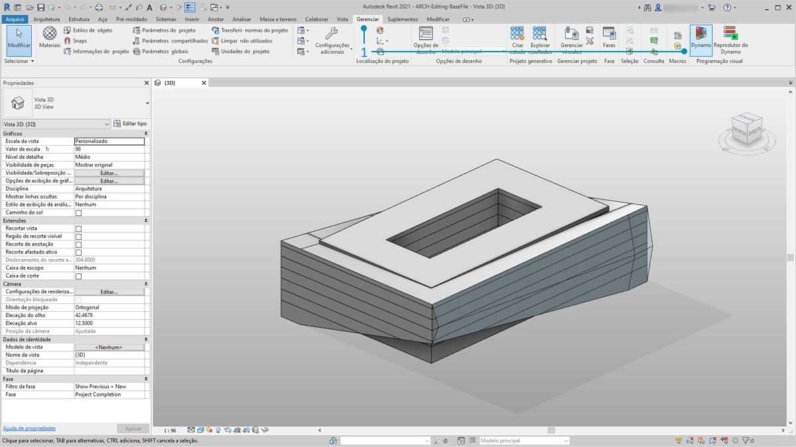
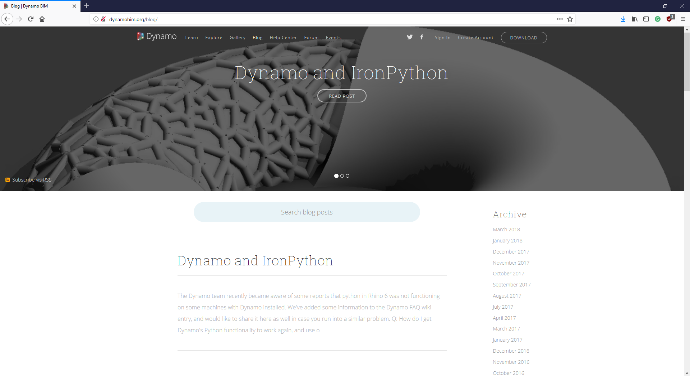

## A conexão do Revit

O Dynamo for Revit estende a modelagem das informações de construção com o ambiente de dados e de lógica de um editor de algoritmo gráfico. Sua flexibilidade, juntamente com um banco de dados robusto do Revit, oferece uma nova perspectiva para o BIM.

Este capítulo é voltado para os fluxos de trabalho do Dynamo para o BIM. As seções são baseadas principalmente em exercícios, uma vez que saltar direto para um projeto é a melhor maneira de se familiarizar com um editor de algoritmos gráficos para BIM. Mas primeiro, vamos falar sobre o começo do programa.

####

#### Compatibilidade com a versão do Revit

À medida que o Revit e o Dynamo continuam a evoluir, você poderá notar que a versão do Revit com a qual você está trabalhando não é compatível com a versão do Dynamo for Revit instalada em seu computador. Abaixo estão descritas quais versões do Dynamo for Revit são compatíveis com o Revit.

|Versão do Revit|Primeira versão estável do Dynamo|Última versão suportada do Dynamo for Revit|
| -- | -- | -- |
|2013|[0.6.1](http://dyn-builds-data.s3-us-west-2.amazonaws.com/DynamoInstall0.6.1.exe)|[0.6.3](http://dyn-builds-data.s3-us-west-2.amazonaws.com/DynamoInstall0.6.3.exe)|
|2014|[0.6.1](http://dyn-builds-data.s3-us-west-2.amazonaws.com/DynamoInstall0.6.1.exe)|[0.8.2](http://dyn-builds-data.s3-us-west-2.amazonaws.com/DynamoInstall0.8.2.exe)|
|2015|[0.7.1](http://dyn-builds-data.s3-us-west-2.amazonaws.com/DynamoInstall0.7.1.exe)|[1.2.1](http://dyn-builds-data.s3-us-west-2.amazonaws.com/DynamoInstall1.2.1.exe)|
|2016|[0.7.2](http://dyn-builds-data.s3-us-west-2.amazonaws.com/DynamoInstall0.7.2.exe)|[1.3.2](http://dyn-builds-data.s3-us-west-2.amazonaws.com/DynamoInstall1.3.2.exe)|
|2017|[0.9.0](http://dyn-builds-data.s3-us-west-2.amazonaws.com/DynamoInstall0.9.0.exe)|[1.3.4](http://dyn-builds-data.s3-us-west-2.amazonaws.com/DynamoInstall1.3.4.exe)/[2.0.3](https://dyn-builds-data.s3-us-west-2.amazonaws.com/DynamoInstall2.0.3.exe)|
|2018|[1.3.0](http://dyn-builds-data.s3-us-west-2.amazonaws.com/DynamoInstall1.3.0.exe)|[1.3.4](http://dyn-builds-data.s3-us-west-2.amazonaws.com/DynamoInstall1.3.4.exe)/[2.0.3](https://dyn-builds-data.s3-us-west-2.amazonaws.com/DynamoInstall2.0.3.exe)|
|2019|[1.3.3](http://dyn-builds-data.s3-us-west-2.amazonaws.com/DynamoInstall1.3.3.exe)|[1.3.4](http://dyn-builds-data.s3-us-west-2.amazonaws.com/DynamoInstall1.3.4.exe)/[2.0.3](https://dyn-builds-data.s3-us-west-2.amazonaws.com/DynamoInstall2.0.3.exe)|
|2020|2.1.0 – O Revit 2020 agora inclui o Dynamo e recebe atualizações como faz o Revit.)|N/D|

####

#### Histórico do Dynamo

> Com uma equipe dedicada de desenvolvedores e uma comunidade entusiasmada, o projeto percorreu um longo caminho desde seu humilde começo.

O Dynamo foi originalmente criado para simplificar os fluxos de trabalho AEC no Revit. Embora o Revit crie um banco de dados robusto para cada projeto, pode ser difícil para um usuário intermediário acessar essas informações fora das restrições da interface. O Revit hospeda uma API (Interface de Programação de Aplicativo) abrangente, permitindo que desenvolvedores de terceiros criem ferramentas personalizadas. Os programadores têm usado essa API há anos, mas o script baseado em texto não está acessível a todos. O Dynamo busca democratizar os dados do Revit através de um editor de algoritmo gráfico acessível.

Usando os principais nós do Dynamo juntamente com os nós personalizados do Revit, um usuário pode expandir substancialmente os fluxos de trabalho paramétricos para interoperabilidade, documentação, análise e geração. Com o Dynamo, os fluxos de trabalho tediosos podem ser automatizados enquanto as explorações de projeto podem ser melhoradas.

### Executar o Dynamo no Revit

> 1. Em um projeto do Revit ou em um editor de família, navegue para Complementos e clique em *Dynamo*. Observação: O Dynamo será executado somente no arquivo no qual foi aberto.

> 1. Ao abrir o Dynamo no Revit, há uma nova categoria chamada *“Revit”*. Essa é uma adição abrangente à interface de usuário que oferece nós especificamente voltados para os fluxos de trabalho do Revit.*

**Observação: Usando a família de nós específica do Revit, o gráfico do Dynamo só funcionará quando for aberto no Dynamo for Revit. Se um gráfico do Dynamo for Revit for aberto no Dynamo Sandbox, por exemplo, os nós do Revit estarão ausentes.*

### Congelar nós

Como o Revit é uma plataforma que fornece um gerenciamento robusto de projetos, as operações paramétricas no Dynamo podem ser complexas e seu cálculo pode ser lento. Se o Dynamo estiver demorando muito para calcular os nós, recomenda-se usar a funcionalidade do nó “congelar“ para pausar a execução das operações do Revit enquanto você desenvolve o gráfico. Para obter mais informações sobre o congelamento de nós, consulte a seção “Congelar” no [capítulo de sólidos](../05_Geometry-for-Computational-Design/5-6_solids.md#freezing).

### Comunidade

Desde que o Dynamo foi originalmente criado para o AEC, sua grande e crescente comunidade é um grande recurso para aprender e entrar em contato com especialistas no setor. A comunidade do Dynamo é formada por arquitetos, engenheiros, programadores e designers, apaixonados por compartilhar e criar.

O Dynamo é um projeto de código aberto que está em constante evolução e muitos desenvolvimentos são relacionados ao Revit. Se você não estiver familiarizado com esta área, entre no fórum de discussão e comece a [publicar perguntas](http://dynamobim.org/forums/forum/dyn/). Se você for um programador e quiser participar do desenvolvimento do Dynamo, confira a [página github](https://github.com/DynamoDS/Dynamo). Além disso, o [gerenciador de pacotes do Dynamo](http://dynamopackages.com/) é um ótimo recurso para as bibliotecas de terceiros. Muitos desses pacotes são feitos com o AEC em mente, e vamos analisar os pacotes de terceiros para obter uma panorâmica neste capítulo.

> O Dynamo também mantém um [blog](http://dynamobim.com/blog/) ativo. Leia os artigos recentes para saber mais sobre os últimos acontecimentos.

