## Seleção

O Revit é um ambiente com abundância de dados. Isso nos dá uma gama de capacidades de seleção que se expande muito além de “apontar e clicar”. Podemos consultar o banco de dados do Revit e vincular dinamicamente os elementos do Revit à geometria do Dynamo durante a execução de operações paramétricas.


> A biblioteca do Revit na interface do usuário oferece uma categoria “Seleção” que permite várias maneiras de selecionar a geometria.

Para selecionar os elementos do Revit corretamente, é importante ter um entendimento completo da hierarquia de elementos do Revit. Deseja selecionar todas as paredes em um projeto? Selecione por categoria. Deseja selecionar todas as cadeiras Eames em seu lobby moderno de meados do século? Selecione por família. Antes de passar para um exercício, vamos fazer uma rápida revisão da hierarquia do Revit.

#### Hierarquia do Revit

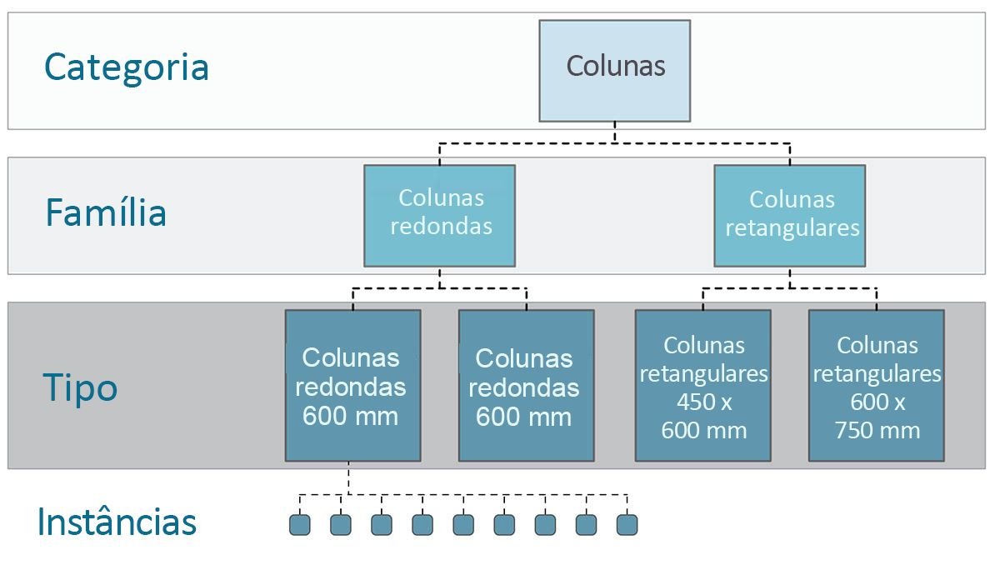

Lembra-se da taxonomia da biologia? Reino, Filo, Classe, Ordem, Família, Gênero, Espécie? Os elementos do Revit são categorizados de forma similar. Em um nível básico, é possível dividir a hierarquia do Revit em Categorias, Famílias, Tipos* e Instâncias. Uma instância é um elemento de modelo individual (com uma ID exclusiva), enquanto uma categoria define um grupo genérico (como “paredes” ou “pisos”). Com o banco de dados do Revit organizado dessa forma, é possível selecionar um elemento e escolher todos os elementos similares com base em um nível especificado na hierarquia.

**Observação – Os tipos no Revit são definidos de forma diferente dos tipos na programação. No Revit, um tipo se refere a uma ramificação da hierarquia, em vez de um “tipo de dados”.*

#### Navegação no banco de dados com os nós do Dynamo

As três imagens abaixo mostram as categorias principais para a seleção de elementos do Revit no Dynamo. Estas são ótimas ferramentas para usar em combinação, e exploraremos algumas delas nos exercícios seguintes.


> *Ponto e clique* é a forma mais fácil de selecionar diretamente um elemento do Revit. É possível selecionar um elemento de modelo completo ou partes de sua topologia (como uma face ou uma aresta). Isso permanece vinculado dinamicamente ao objeto do Revit. Portanto, quando o arquivo do Revit atualizar sua localização ou parâmetros, o elemento do Dynamo referenciado será atualizado no gráfico.

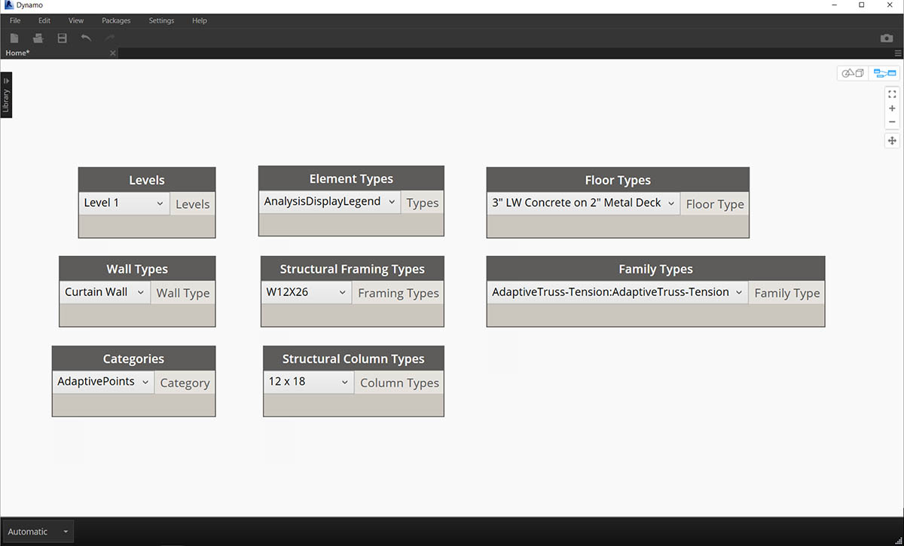

> Os *menus suspensos* criam uma lista de todos os elementos acessíveis em um projeto do Revit. É possível usar essa opção para referenciar elementos do Revit que não são necessariamente visíveis em uma vista. Essa é uma ótima ferramenta para consultar elementos existentes ou criar novos em um projeto do Revit ou em um editor de família.


> Também é possível selecionar o elemento do Revit por camadas específicas na *hierarquia do Revit*. Essa é uma opção poderosa para personalizar grandes matrizes de dados na preparação da documentação ou da instanciação generativa e personalização.

Com as três imagens acima em mente, vamos nos aprofundar em um exercício que seleciona elementos de um projeto básico do Revit na preparação para os aplicativos paramétricos que iremos criar nas seções restantes deste capítulo.

### Exercício

> Faça o download dos arquivos de exemplo que acompanham este exercício (clique com o botão direito do mouse e selecione “Salvar link como...”). É possível encontrar uma lista completa de arquivos de exemplo no Apêndice.

> 1. [Selecting.dyn](datasets/8-2/Selecting.dyn)
2. [ARCH-Selecing-BaseFile.rvt](datasets/8-2/ARCH-Selecting-BaseFile.rvt)

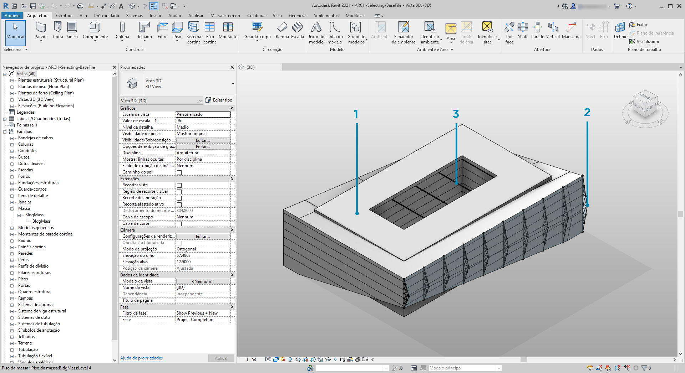

> Neste arquivo do Revit de exemplo, temos três tipos de elementos de uma construção simples. Usaremos isso como exemplo para selecionar elementos do Revit no contexto da hierarquia do Revit:

> 1. Massa de construção
2. Treliças (componentes adaptativos)
3. Vigas (Framing estrutural)

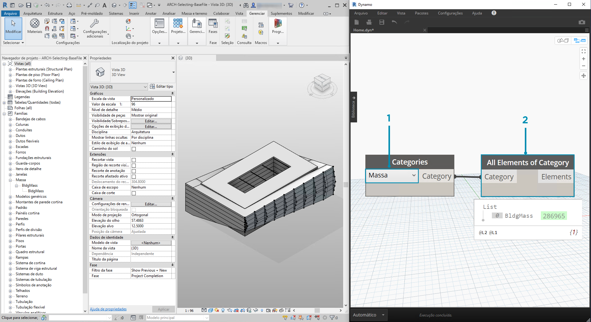

> Quais conclusões podemos tirar dos elementos atualmente na vista do projeto do Revit? E a que distância da hierarquia precisamos ir para selecionar os elementos apropriados? Isso, é claro, se tornará uma tarefa mais complexa ao trabalhar em um projeto grande. Há muitas opções disponíveis: é possível selecionar elementos por categorias, níveis, famílias, instâncias etc.

> 1. Como estamos trabalhando com uma configuração básica, vamos selecionar a massa da construção escolhendo *“Massa”* no nó suspenso Categorias. Isso pode ser encontrado na guia Seleção do Revit.
2. A saída da categoria Massa é apenas a própria categoria. Precisamos selecionar os elementos. Para fazer isso, usamos o nó *“Todos os elementos da categoria”*.

Neste ponto, observe que não vemos nenhuma geometria no Dynamo. Selecionamos um elemento do Revit, mas não convertemos o elemento na geometria do Dynamo. Essa é uma separação importante. Se você selecionasse um grande número de elementos, não seria uma boa ideia visualizá-los no Dynamo, pois isso deixaria o sistema inteiro lento. O Dynamo é uma ferramenta para gerenciar um projeto do Revit sem executar necessariamente operações de geometria, e vamos examinar isso na próxima seção deste capítulo.

Neste caso, estamos trabalhando com geometria simples, por isso queremos trazer a geometria para a visualização do Dynamo. “BldgMass” no nó de inspeção acima tem um número verde* ao lado. Isso representa a ID do elemento e nos informa que estamos lidando com um elemento do Revit, não com a geometria do Dynamo. A próxima etapa é converter esse elemento do Revit em geometria no Dynamo.

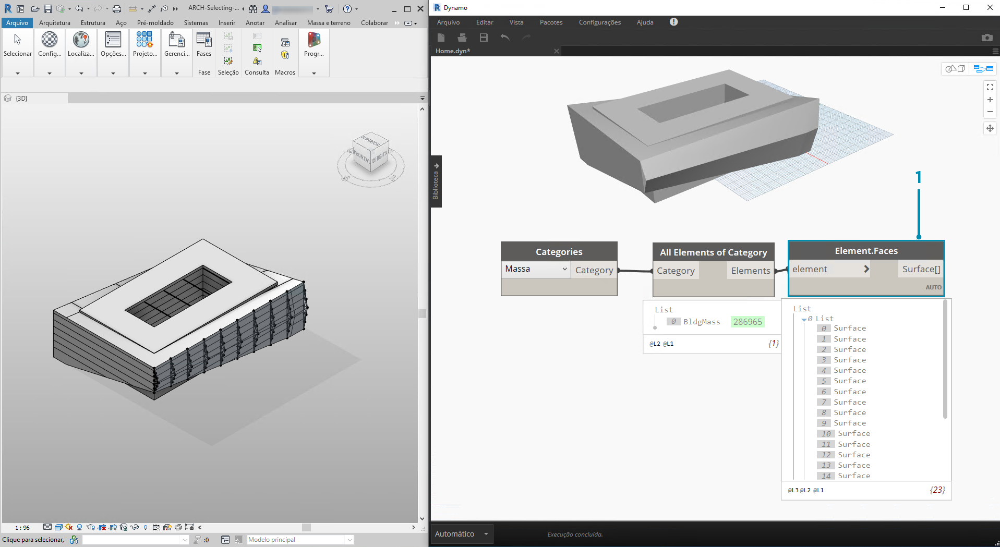

> 1. Usando o nó *Element. Faces*, obtemos uma lista de superfícies representando cada face da massa do Revit. Agora, podemos ver a geometria na viewport do Dynamo e começar a referenciar a face para operações paramétricas.

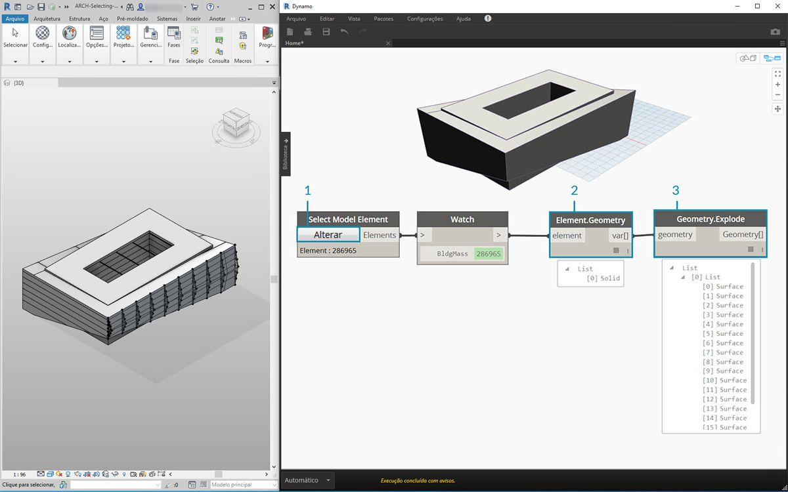

> Veja a seguir um método alternativo. Neste caso, estamos deixando de lado a seleção através da hierarquia do Revit *(“Todos os elementos de categoria”)* e optando por selecionar explicitamente a geometria no Revit.

> 1. Usando o nó *“Selecionar elemento do modelo”*, clique no botão *“selecionar” *(ou *“alterar”*). Na viewport do Revit, selecione o elemento desejado. Neste caso, estamos selecionando a massa da construção.
2. Em vez de *Element.Faces*, é possível selecionar a massa completa como uma geometria sólida usando *Element.Geometry*. Isso seleciona toda a geometria contida naquela massa.
3. Usando *Geometry.Explode*, podemos obter a lista de superfícies novamente. Esses dois nós funcionam da mesma forma que *Element.Faces*, mas oferecem opções alternativas para examinar a geometria de um elemento do Revit.

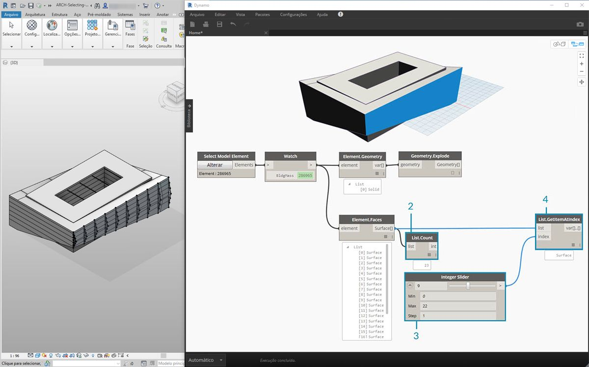

> 1. Usando algumas operações básicas de lista, podemos consultar uma face de interesse.
2. Primeiro, o nó *List.Count* revela que estamos trabalhando com 23 superfícies na massa.
3. Referenciando esse número, alteramos o Valor máximo de um *controle deslizante inteiro *para *“22”*.
4. Usando *List.GetItemAtIndex*, inserimos as listas e o *controle deslizante inteiro *para o *índice*. Deslizando com a seleção, paramos quando chegamos ao *índice 9* e isolamos a fachada principal que hospeda as treliças.

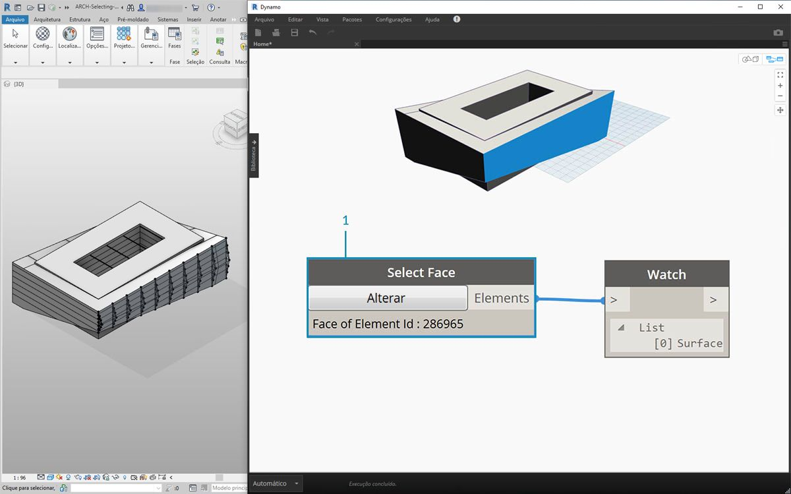

> 1. A etapa anterior era um pouco complicada. Podemos fazer isso muito mais rápido com o nó *“Selecionar face”*. Isso nos permite isolar uma face que não é um elemento em si no projeto do Revit. A mesma interação se aplica como *“Selecionar elemento do modelo”*, exceto que selecionamos a superfície em vez do elemento completo.


> Suponha que desejamos isolar as paredes da fachada principal do edifício. É possível usar o nó *“Selecionar faces”* para fazer isso. Clique no botão “Selecionar” e, em seguida, selecione as quatro fachadas principais no Revit.

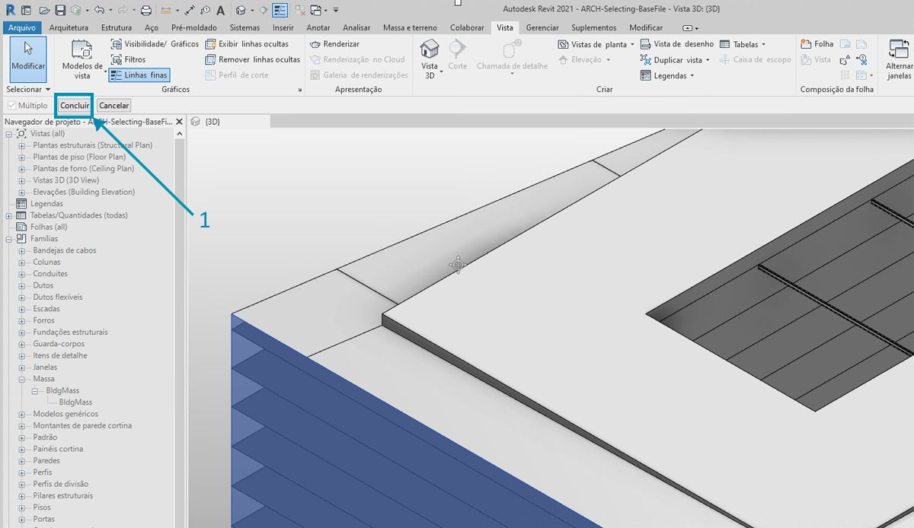

> 1. Após selecionar as quatro paredes, certifique-se de clicar no botão *“Concluir”* no Revit.

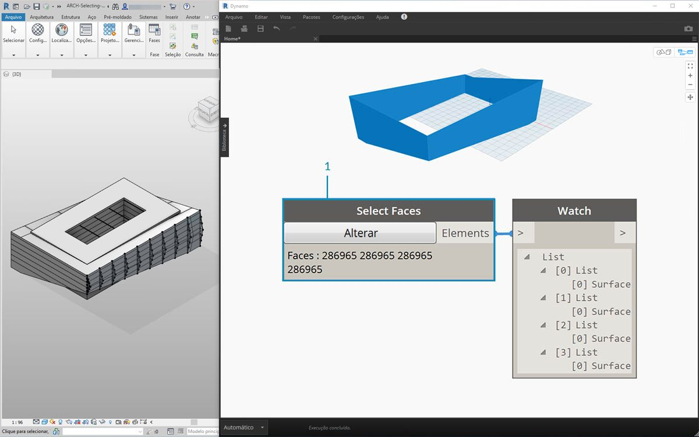

> 1. As faces são agora importadas para o Dynamo como superfícies.

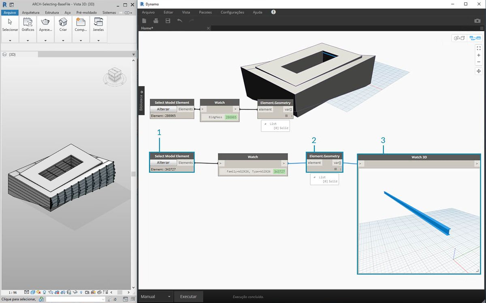

> 1. Agora, vamos analisar as vigas sobre o átrio. Usando o nó *“Selecionar o elemento do modelo”*, selecione uma das vigas.
2. Conecte o elemento de viga ao nó *Element.Geometry*. Agora, temos a viga na viewport do Dynamo.
3. É possível aumentar o zoom na geometria com um nó *Watch3D* (se você não visualizar a viga em Observar em 3D, clique com o botão direito do mouse e pressione “zoom para ajustar”).

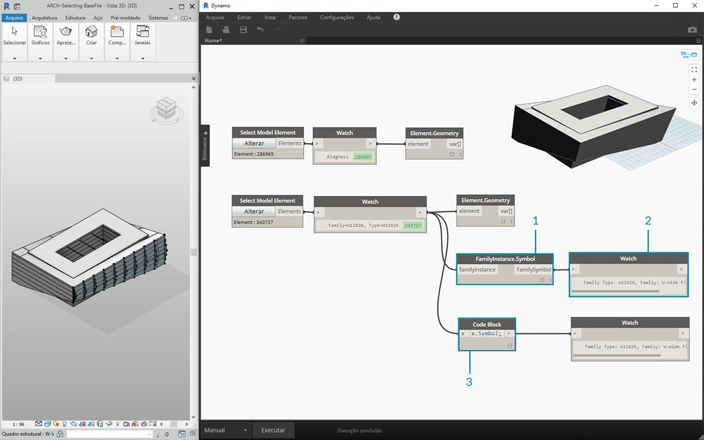

> Uma pergunta que pode surgir frequentemente nos fluxos de trabalho do Revit/Dynamo: como posso selecionar um elemento e obter todos os elementos similares? Como o elemento do Revit selecionado contém todas as suas informações hierárquicas, podemos consultar seu tipo de família e selecionar todos os elementos daquele tipo.

> 1. Conecte o elemento de viga a um nó *FamilyInstance.Symbol**.
2. O nó *Inspeção* revela que a saída é agora um símbolo de família em vez de um elemento do Revit.
3. *FamilyInstance.Symbol* é uma consulta simples, portanto, podemos fazer isso no bloco de código da mesma forma que facilmente com ```x.Symbol``` e obter os mesmos resultados.

**Observação: Um símbolo de família é a terminologia da API do Revit para o tipo de família. Como isso pode causar confusão, ele será atualizado nas próximas versões.*

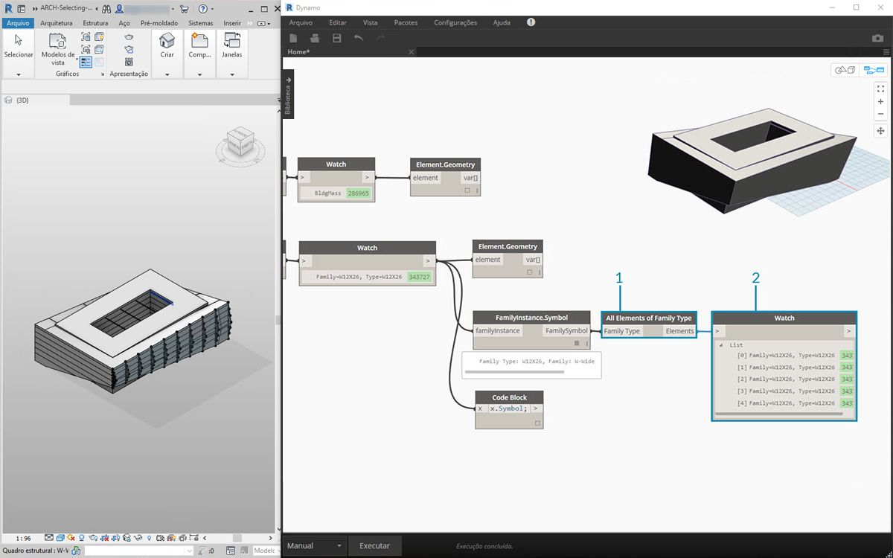

> 1. Para selecionar as vigas restantes, usaremos o nó *“Todos os elementos do tipo de família”*.
2. O nó de inspeção mostra que selecionamos cinco elementos do Revit.

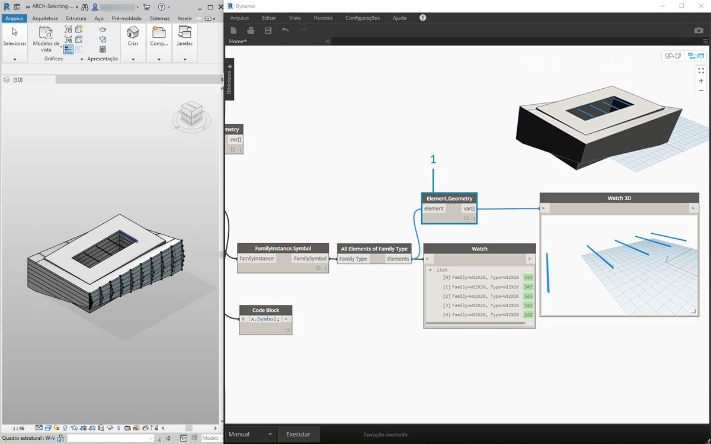

> 1. Também podemos converter todos esses cinco elementos na geometria do Dynamo.

E se tivéssemos 500 vigas? A conversão de todos esses elementos na geometria do Dynamo seria muito lenta. Se o Dynamo estiver demorando muito para calcular os nós, será recomendável usar a funcionalidade do nó “congelar” para pausar a execução das operações do Revit enquanto desenvolve o gráfico. Para obter mais informações sobre o congelamento de nós, consulte a seção “Congelar” no [capítulo de sólidos](../05_Geometry-for-Computational-Design/5-6_solids.md#freezing).

Em qualquer caso, se precisarmos importar 500 vigas, precisaremos de todas as superfícies para executar a operação paramétrica prevista? Ou podemos extrair informações básicas das vigas e executar tarefas gerativas com a geometria fundamental? Essa é uma pergunta que vamos ter em mente, à medida que avançamos neste capítulo. Por exemplo, vamos dar uma olhada no sistema de treliça:

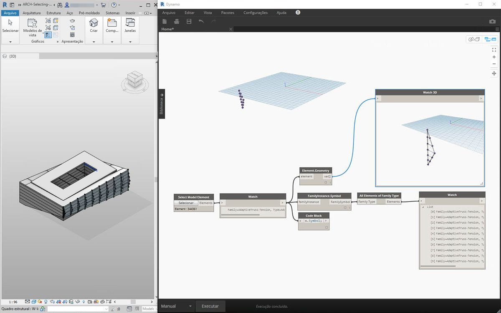

> Usando o mesmo gráfico de nós, selecione o elemento de treliça ao invés do elemento de viga. Antes de fazer isso, exclua Element.Geometry da etapa anterior.

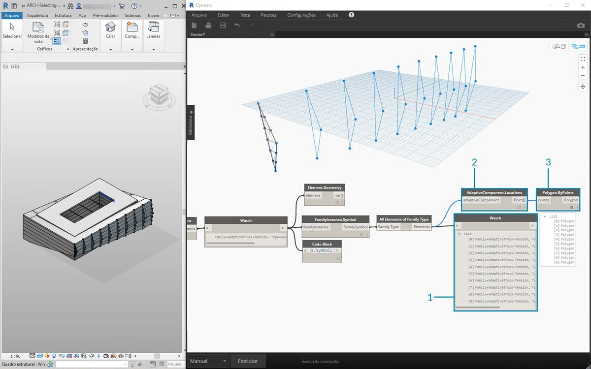

> 1. No nó *Inspeção*, podemos ver que temos uma lista de componentes adaptativos selecionados no Revit. Queremos extrair as informações básicas, por isso, começamos com os pontos adaptativos.
2. Conecte o nó *“Todos os elementos do tipo de família”* ao nó *“AdaptiveComponent.Location”*. Isso nos fornece uma lista de listas, cada uma com três pontos que representam as localizações dos pontos adaptativos.
3. Conectar um nó *“Polygon.ByPoints”* retorna uma policurva. Podemos ver isso na viewport do Dynamo. Com esse método, visualizamos a geometria de um elemento e abstraímos a geometria da matriz restante dos elementos (que pode ser maior em número do que este exemplo).

**Dica: Se você clicar no número verde de um elemento do Revit no Dynamo, a viewport do Revit irá efetuar o zoom para aquele elemento.*

